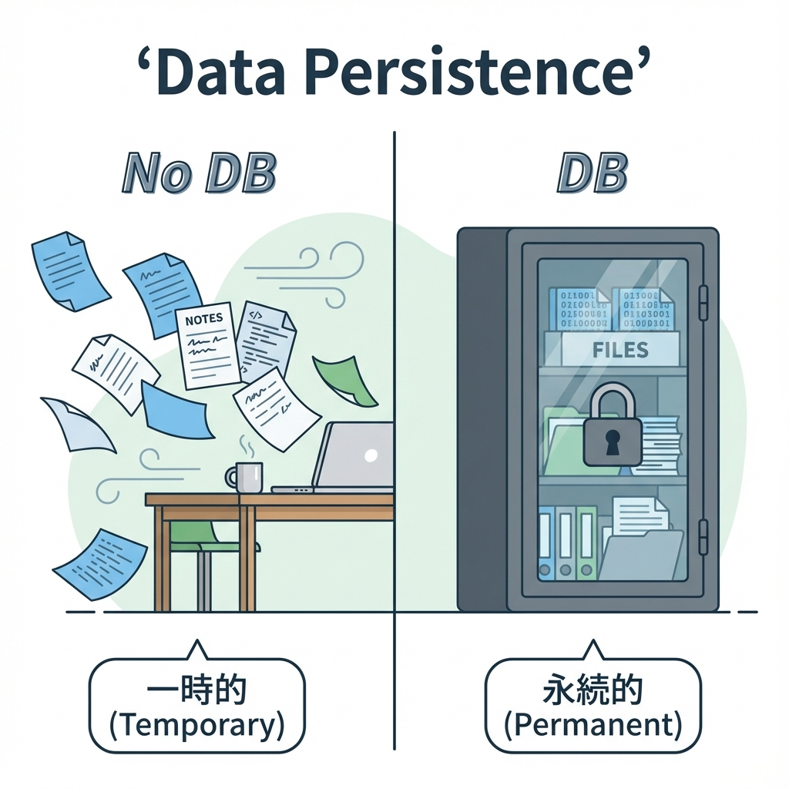
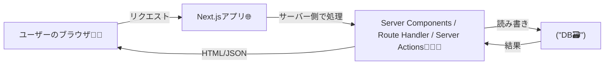

# 第161章：DBを使うと何が嬉しい？（永続化）🗃️

この章では、「DB（データベース）って、なんで必要なの？」を“超やさしく”つかみます🥰
結論から言うと… **アプリのデータを「消えないように保存できる」**のが最大のうれしさです🧸💾

---

## 1) まず「永続化」ってなに？🧠💡

**永続化（えいぞくか）**＝
アプリを閉じても、PC再起動しても、ページ更新しても、**データが残ること**だよ〜✨

* ❌ 永続化なし：ページ更新したらデータ消えた…😭
* ✅ 永続化あり：更新してもそのまま残る！やったー！🎉

---

## 2) 図解：DBがないとどうなる？🤔💭

世界（つらい）😵‍💫🌀

たとえばTODOアプリで、こういう「配列」に入れてたとするね👇

* `todos = ["レポート", "買い物"]`

これ、**開発中は動く**んだけど…

* 🔄 ページ更新 → **配列が初期化**されて消える😭
* 🚪 サーバー再起動 → 消える😭
* 👥 友だちがアクセス → その人のデータ？どこ？😳

つまり、**「アプリとして使える形」になりにくい**の🥺

---

## 3) DBがある世界（うれしい）🥳🗄️

DBがあると、TODOを **「ちゃんと保存」**できるようになるよ✨

* ✅ ページ更新しても残る🔁✨
* ✅ 何日後でも残る📅✨
* ✅ 複数ユーザーでも管理できる👥✨
* ✅ 検索・並び替え・絞り込みが得意🔎✨
* ✅ 「誰のTODO？」みたいな紐づけもできる🧷✨

---

## 4) Next.js アプリでの立ち位置（ざっくり）🧭

Next.jsは **サーバー側でDBにアクセスしやすい**のが強みだよ💪✨
（Server Components / Route Handlers / Server Actions あたりが活躍！）

### 図解：ブラウザからDBまでの流れ 🧑‍💻➡️🗃️

ポイントはここ👇

* DBは基本 **サーバー側から触る**（ブラウザから直接触らない）🛡️✨
* だから安全にしやすいよ〜🔐

---

## 5) 「DBが必要になる瞬間」あるある5選🧁✨

1. 🔄 **更新しても残したい**（TODO・メモ・日記）
2. 👥 **ユーザーごとにデータを分けたい**（ログイン後のマイページ）
3. 🔎 **検索したい**（記事検索、タグ絞り込み）
4. 📈 **データが増える**（100件→1万件…配列だとしんどい）
5. 🧩 **関係を持たせたい**（ユーザー → TODOがたくさん、みたいな）

---

## 6) ちょいイメージ：DBって「整理された箱」📦✨

* 配列：机の上にメモを並べる感じ🗒️🗒️🗒️（散らかりやすい）
* DB：**引き出し付きの整理棚**🗄️（探しやすい・増えても管理しやすい）

---

## 7) ミニ確認クイズ（3問）🎯✨

**Q1.** ページ更新で消えないようにするのが「永続化」
→ ✅ / ❌？

**Q2.** DBはブラウザから直接アクセスするのが基本
→ ✅ / ❌？

**Q3.** DBがあると、複数ユーザーのデータも扱いやすくなる
→ ✅ / ❌？

答えを見る👀✨

* A1：✅（消えないように保存できるのが永続化だよ〜）
* A2：❌（基本はサーバー側から！安全のため🛡️）
* A3：✅（ユーザーIDなどで分けられるよ👥）

---

## まとめ🌸✨

* DBの一番の価値は **永続化（データが消えない）** 🗃️💾
* そして **複数ユーザー・検索・関係づけ** ができるようになって、アプリが“ちゃんとアプリ”になる🎉
* 次の章から、**ORM**や**Prisma**で「安全にDBを使う道」に入っていくよ〜🧩✨
