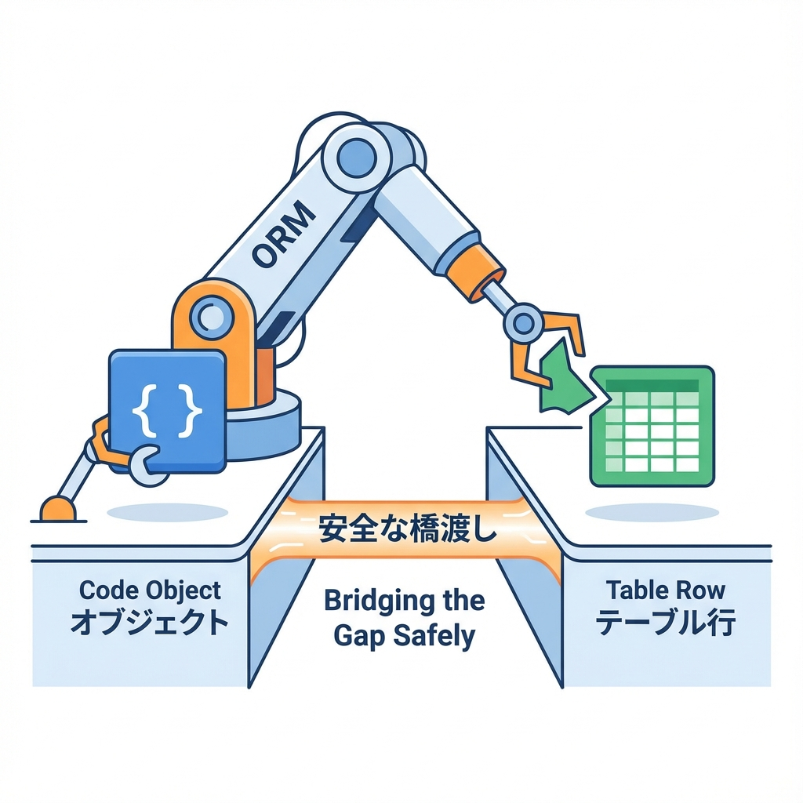
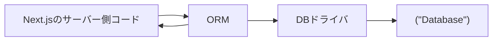
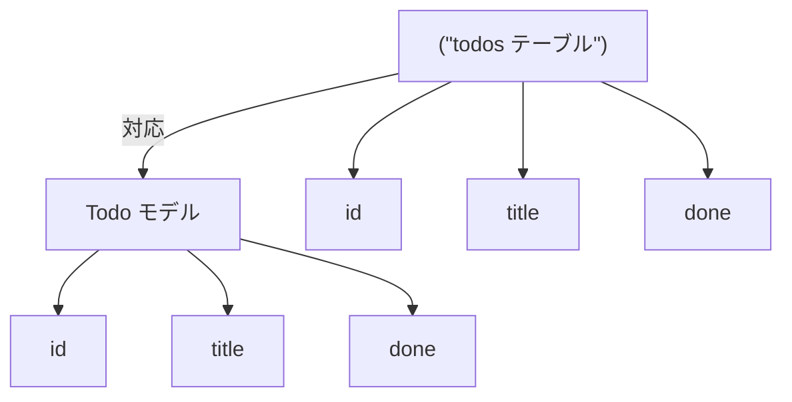

# 第162章：ORMってなに？（SQLを安全に扱う）🧩

今日は「## 2) ORM（オーアールエム）ってなに？ 🤖🌉

いう、DB操作をちょっと優しくしてくれる仕組みを知っていくよ〜😊✨
Next.jsでDBを触る前に、ここを押さえると安心度がグッと上がる👍💕

---

## この章のゴール🎯✨

* ORMが何者か、ひとことで説明できる😺
* 「SQL直書き」と「ORM」の違いがイメージできる🧠
* ORMが“安全”って言われる理由がわかる🔐

---

## ORMってなに？🧩（超ざっくり）

ORMは…

**「テーブルを“オブジェクトっぽく”扱って、DB操作をコードで安全に書けるようにする仕組み」**だよ✨

たとえば「Todoテーブル」を、コード側では `Todo` みたいな“型のあるもの”として扱える感じ😊📝

---

## なんでORMがうれしいの？😆✨

### ① SQLを“直書き地獄”から救う🛟

SQLを文字列でベタ書きすると、こんな困りごとが起きやすいよ〜💦

* タイポしても気づきにくい😵（実行して初めてエラーとか）
* カラム名変更に弱い🫠（あちこち壊れる）
* 文字列結合でクエリ作ると、危ない（後で説明するね）⚠️

ORMだと、**コード補完**や**型チェック**が効くことが多くて、ミスが減りやすい🙌✨

### ② 「SQLインジェクション」を防ぎやすい🛡️

SQLインジェクションっていうのは、ユーザー入力が悪用されて、**意図しないSQLを実行されちゃう**事故のこと😱💥
ORMは基本的に、値をうまく“安全に渡す”仕組み（パラメータ化）を持ってることが多いから、事故りにくい👍🔐

### ③ “モデル＝設計の中心”になって整理しやすい📘

ORMを使うと、DBの形（テーブル/カラム）を「モデル」として管理できて、

* 何を保存してるアプリなのか👀
* どんなデータがあるのか🧾
  が見通し良くなるよ〜✨

---

## 図でイメージしよ〜🖼️✨（ORMが間に入る）

ORMは「アプリ」と「DB」の間の通訳さんみたいな感じ😊📣



---

## 「テーブル」と「オブジェクト」の対応🧠🧩

たとえばDBに `todos` テーブルがあるとするね👇

* テーブル：`todos`
* カラム：`id`, `title`, `done`

ORMだと、これをコード側でだいたいこんな気持ちで扱うよ〜👇

* モデル：`Todo`
* フィールド：`id`, `title`, `done`



---

## SQL直書き vs ORM（雰囲気だけ比べる）👀✨

### ✅ SQLを直書き（イメージ）

```ts
const sql = `SELECT * FROM todos WHERE done = false ORDER BY id DESC`;
```

### ✅ ORMっぽい書き方（イメージ）

```ts
const todos = await db.todo.findMany({
  where: { done: false },
  orderBy: { id: "desc" },
});
```

ポイントはこれ👇😊

* ORMは **「文字列SQL」じゃなくて「構造（オブジェクト）」**で書けることが多い✨
* 構造で書く＝ミスりにくい＆安全にしやすい🙌

（※ここでは“イメージ”だから、実際の書き方はORMごとに少し変わるよ〜！）

---

## ORMでも「万能」じゃないよ⚖️🙂

ORMは超便利だけど、こういう場面は注意〜💡

* めちゃ複雑な集計（JOINモリモリ/ウィンドウ関数）📊
* 超高速が必要（クエリ最適化をガチる）🏎️
* ORMの書き方だと逆に読みにくい😵

こういう時は、ORMでも「生SQLを併用できる仕組み」があることが多いよ👌
つまり、**ORMかSQLかは“敵じゃなくて使い分け”**だね🤝✨

---

## Next.jsでの超重要ルール🔒（ここだけは覚えて🙏）

DB操作（ORM含む）は **サーバー側でやる** のが基本だよ〜！

* ✅ サーバー：DBに触ってOK🧊
* ❌ ブラウザ（クライアント）：DB直はダメ🙅‍♀️（秘密が漏れる！）

---

## ミニ練習（3分）📝✨

次の対応、口で言えるようになったら勝ち🥳

1. **テーブル**って何？
   → データをためる“箱”📦

2. **行（レコード）**って何？
   → 箱の中の1件ぶんのデータ🧾

3. ORMを使うと、行はコード側で何っぽくなる？
   → “オブジェクト”とか“型のあるデータ”っぽく扱える😊🧩

---

## まとめ🎀

* ORMは「DB操作をコードで安全＆管理しやすくする仕組み」🧩✨
* SQL直書きのミスや危険（特に注入系）を減らしやすい🛡️
* でも万能じゃないから、必要ならSQLと使い分ける⚖️
* Next.jsではDB操作はサーバー側でやろうね🔒😊

---

次に進むと、いよいよ「ORMの代表例（たとえばPrismaみたいなやつ）」の雰囲気がつかめて、DBが一気に現実味出てくるよ〜😆📘✨
