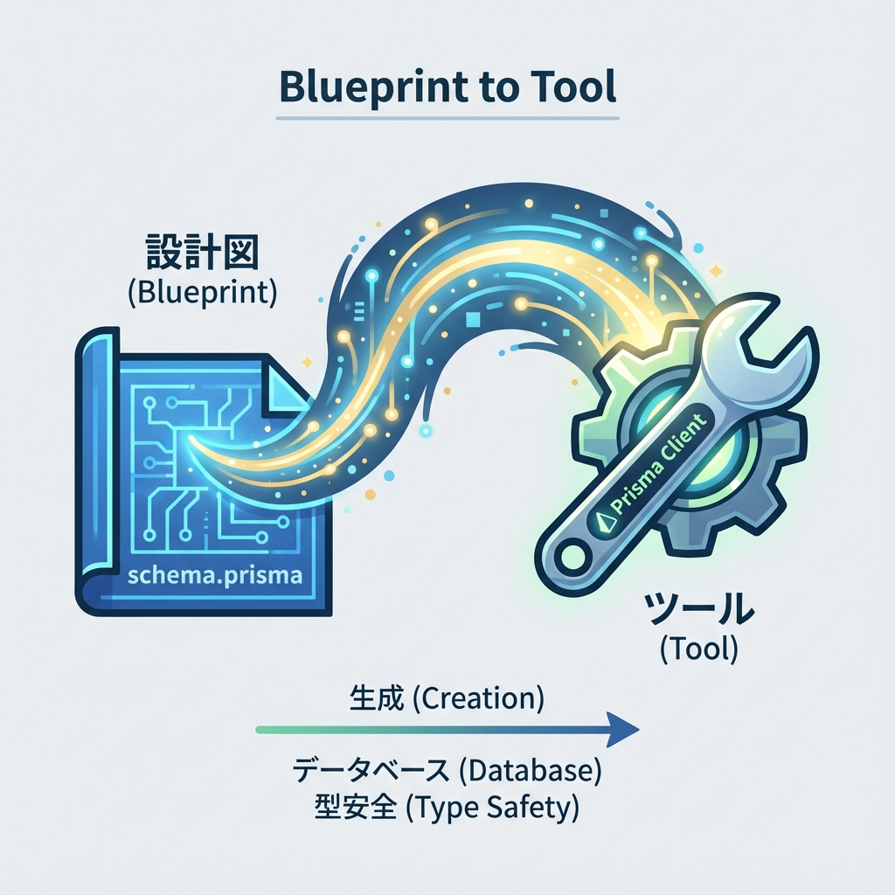
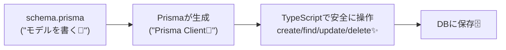
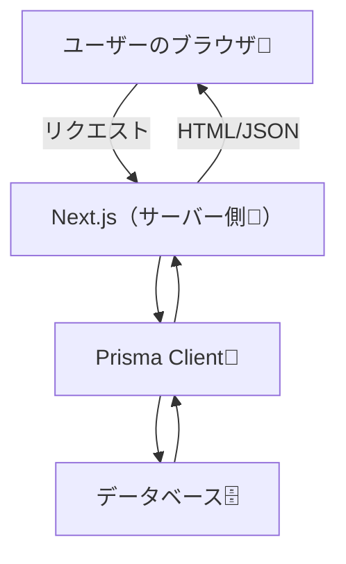

# 第163章：Prismaの超ざっくり（モデル＝型の源）📘

この章は「Prismaって結局なに？🤔」を**最短でイメージできる**ようにする回だよ〜！💨
細かい設定や設計は次の章以降でやるから、今日は**“全体の地図”**だけ持って帰ろうね🗺️🧸

---

## 2) Prismaの「3つの神器」を覚えよう 🗡️🛡️🪞



Prismaは、ざっくり言うと👇

* **DB（データベース）とTypeScriptの間をつなぐ通訳さん**🗣️🗄️
* **「このデータの形はこうだよ！」っていう設計図（schema.prisma）から、型安全なDB操作コードを自動生成**してくれる✨

つまり、Prismaがあると…

* SQLを毎回ガリガリ書かなくてもOKになりやすい🍀
* **型（TypeScript）が守ってくれる**から、ミスが減る🛡️
* 「id って number だっけ…？」みたいな事故が減る🚑💦

---

## 2) いちばん大事：**モデル（model）＝型の“元”**📘➡️🔧

Prismaの中心は **`schema.prisma`** に書く **model** だよ✍️✨
ここに「DBに保存するデータの形」を書くと、Prismaがそれを元に…

* DBのテーブルに対応する形を作って🗃️
* TypeScriptで使える型やメソッドを作ってくれる💎

イメージ図👇（これ超重要！）🌟



---

## 3) Prismaの登場人物（最低限これだけ！）👥✨

### ✅ ① schema.prisma（設計図）📘

* `model Todo { ... }` みたいに書く場所
* **「これが正解のデータ構造！」**っていう“源泉”⛲

### ✅ ② Prisma Client（操作する道具）🔧

* `prisma.todo.findMany()` みたいに書けるようになるやつ✨
* **型が効く**から、補完が気持ちいい🤤💕

### ✅ ③ Migrate（DBの変更履歴）🧾

* 「モデル変えたからDBも変更ね！」を安全に進める仕組み🚧
* 次の章で詳しくやるよ〜📌

### ✅ ④ Prisma Studio（DBを目で見る）👀

* DBの中身をブラウザで見れる管理画面みたいなやつ🪟✨
* “ちゃんと保存できた？”の確認に便利💯

---

## 4) “model”ってどんな感じ？超ミニ例🍬

`schema.prisma` にこんな感じで書くとするね👇

```ts
// これは「雰囲気」だけのミニ例だよ✨（次章で本気でやる！）
model Todo {
  id    Int     @id @default(autoincrement())
  title String
  done  Boolean @default(false)
}
```

するとPrisma Client側で（生成後に）だいたいこんな気持ちで使えるようになる👇

* `todo` という“テーブルっぽいもの”を操作できる✨
* `title` は文字だって型が知ってる💡
* `done` は true/false だって型が知ってる💡

---

## 5) Next.jsでの立ち位置（超ざっくり）🧊🌐

Prismaは基本 **サーバー側で使う**よ☝️
（ブラウザ＝クライアントにはDB直結はしない！危ない！🧨）



---

## 6) ここだけ覚えれば勝ち！本日のキーワード5️⃣💖

* **schema.prisma**：設計図📘
* **model**：DBのデータの形（＝型の元）🧱
* **Prisma Client**：操作する道具🔧
* **migrate**：DB変更の履歴管理🧾
* **studio**：中身を目で見る👀

---

## 7) ミニ課題（3分）⏱️✨：理解チェック✅

次の問いに答えられたら今日の勝ち〜！🎉🎉

1. Prismaで**型の元**になるのは何？📘
2. `model` を書く場所はどこ？📄
3. Prisma Clientって何をしてくれる道具？🔧
4. Prismaは基本どっち側（サーバー/クライアント）で使う？🧊🌐

---

## まとめ🎀

Prismaは **「モデル（設計図）を書けば、型安全にDBを触れるようにしてくれる」**仕組みだよ📘✨
そして何より大事なのは👇

**モデル（model）＝型の源**💎
ここを押さえたら、次の章（最小モデル設計🧱）がめちゃ楽になるよ〜！🫶🌸
