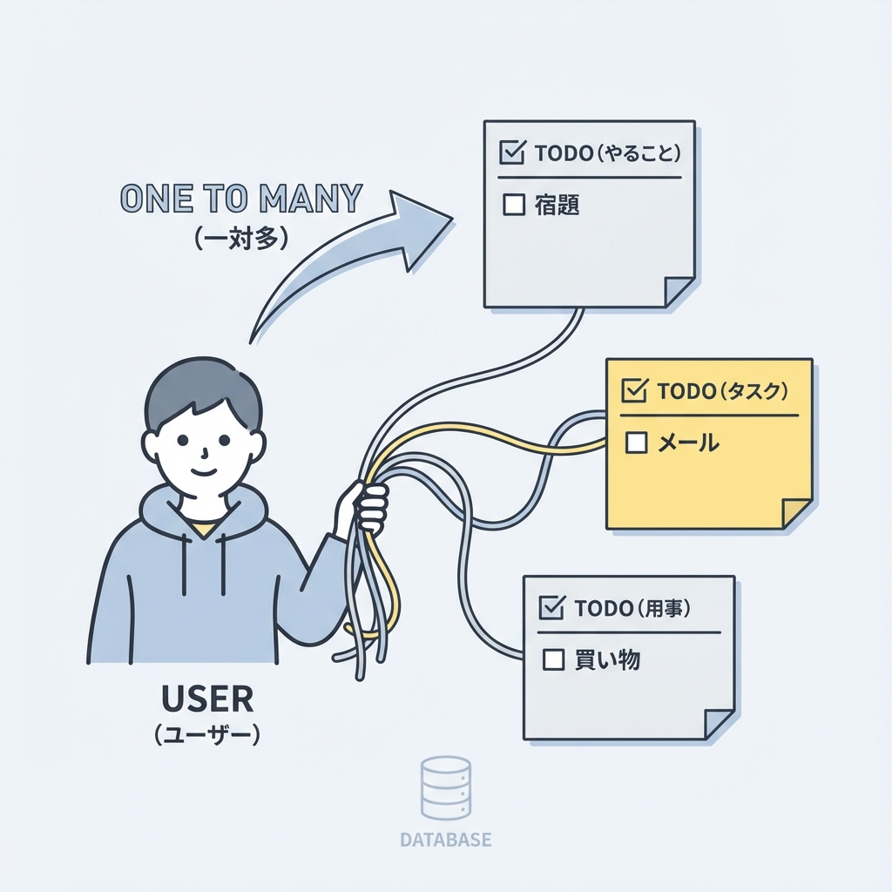
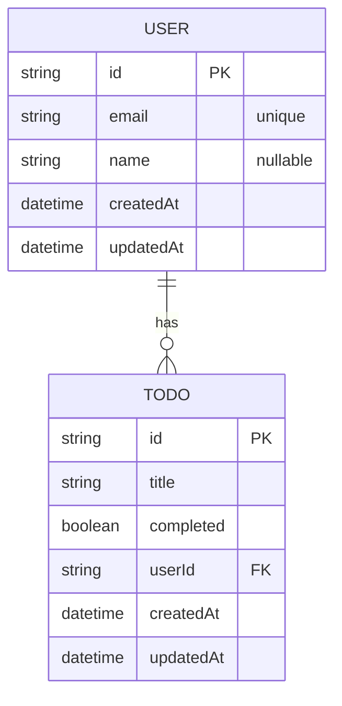

# 第164章：スキーマ設計：Todo/Userの最小モデル🧱

この章では、**「User（ユーザー）」と「Todo（やること）」を、DBに保存できる最小の形**に設計していくよ〜！😊📝
ポイントはたった2つ👇

* **User 1人が Todo をたくさん持つ（1対多）**👤➡️🗒️🗒️🗒️
* **“あとで困らない最小セット”**を最初から入れておく（特に日時！）⏰✨

---

## 1️⃣ まず「最小モデル」ってどんな感じ？🧠💡

### ✅ User（ユーザー）に必要なもの👤

最小ならこれだけでOK🙆‍♀️✨

* `id`：ユーザーを区別する番号（主キー）🆔
* `email`：ログインや識別に使える（ユニーク）📧
* `name`：表示名（なくてもOK）😊
* `createdAt / updatedAt`：作成日・更新日（地味に超重要）⏳✨

### ✅ Todo（やること）に必要なもの🗒️

* `id`：Todoの番号🆔
* `title`：やることの本文📌
* `completed`：終わった？✅
* `userId`：どのユーザーのTodo？（外部キー）🔗
* `createdAt / updatedAt`：いつ作って、いつ更新した？⏳✨

---

## 2️⃣ 関係（リレーション）を図で見る👀✨

## 図解：1対多（One-to-Many）のリレーション 🤝👨‍👩‍👧‍👦





* `USER ||--o{ TODO` は
  **「User 1人に対して Todo が複数」**って意味だよ〜😊🗂️

---

## 3️⃣ Prismaのスキーマに落とし込もう🧩✨

編集するのはここ👇
📁 `prisma/schema.prisma`

### ✅ 最小の User / Todo モデル（おすすめ形）💎

```prisma
model User {
  id        String   @id @default(cuid())
  email     String   @unique
  name      String?

  todos     Todo[]

  createdAt DateTime @default(now())
  updatedAt DateTime @updatedAt
}

model Todo {
  id        String   @id @default(cuid())
  title     String
  completed Boolean  @default(false)

  userId    String
  user      User     @relation(fields: [userId], references: [id], onDelete: Cascade)

  createdAt DateTime @default(now())
  updatedAt DateTime @updatedAt

  @@index([userId])
}
```

---

## 4️⃣ この設計の「いいところ」🌟（超大事ポイントだけ）

### 🆔 `id` は `cuid()` でOK！

* 文字列IDは扱いやすいし、フロント/サーバー間でも安全🥰
* とりあえず迷ったら `cuid()` で◎

### 📧 `email` に `@unique` をつける理由

* 同じメールのユーザーが2人いると、認証系で事故る😇💥
* だから**DB側で“重複禁止”**にするのが強い💪✨

### ⏳ `createdAt` / `updatedAt` は最初から入れる

* 「最近更新されたTodoだけ見たい」みたいな機能、絶対やりたくなる😆
* `@updatedAt` は**更新時に自動で書き換わる**から便利すぎるよ〜🪄✨

### 🔗 `userId` があるから「誰のTodoか」迷子にならない

* Todoだけ単体で置くと、**どのユーザーのTodoか分からない**問題が起きがち🥺
* `userId` があるとスパッと解決🎯✨

---

## 5️⃣ よくあるミス集（先に回避しよ〜）🧯💡

* `User` に `todos Todo[]` を書き忘れる
  → 後で「UserからTodoが辿れない😭」ってなる

* `Todo` に `userId` はあるのに `user User @relation(...)` がない
  → Prismaが「関係が中途半端だよ🥺」って怒る

* `updatedAt` を普通の DateTime にしてしまう
  → 自動更新されなくて「あれ…？」ってなる😇

---

## 6️⃣ ミニ演習（5分）✍️🌸

次の問いに答えてみて〜😊🧠

1. **「ユーザーが削除されたら、そのユーザーのTodoも消える」**のは、スキーマのどこで決まってる？🗑️
2. Todoに「期限」を足したい！どんなフィールドを追加する？（型も）⏰
3. 「ユーザーごとにTodoを一覧で取るのが速い」ようにしてる工夫はどれ？⚡

ヒント：`onDelete` / `DateTime?` / `@@index` あたりを見ると…？👀✨

---

## まとめ🎀

この章でやったのはこれだけだよ😊✨

* **User と Todo の最小モデルを決めた**👤🗒️
* **User 1人 → Todo たくさん**の関係を作った🔗
* **あとで困らない定番（timestamps / unique / index）**を最初から入れた⏳📧⚡

次はこのスキーマをDBに反映していく流れに進めるよ〜！🚀💕
