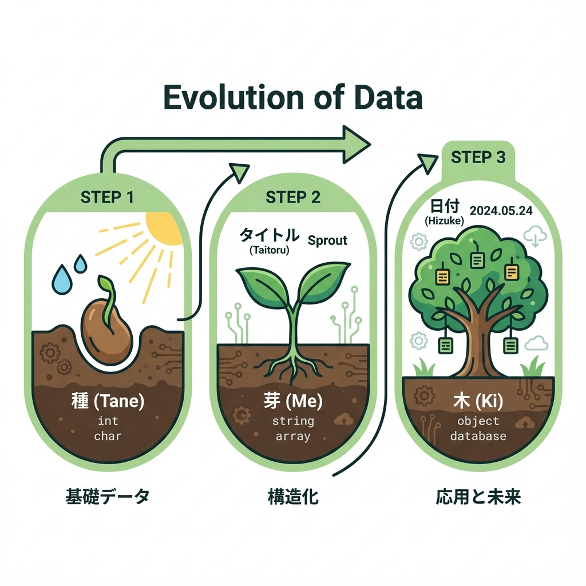
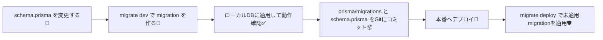

# 第165章：マイグレーションの考え方（履歴が命）🧾

## この章でわかること🎯

* マイグレーションが「DBの変更履歴」ってどういう意味か📚✨
* Prismaで“安全に”DBの形を育てていく基本の流れ🌱
* 開発と本番でコマンドが違う理由（ここ超大事！）🛡️🔥

---

## 1) マイグレーションってなに？🧾💡

マイグレーションはひとことで言うと…

**「データベースの設計図（テーブル構造）の変更を、順番つきで保存していく“履歴”」**だよ〜📜✨

たとえば、TODOアプリで…

* 最初：`title` だけあればOK 🙆‍♀️
* 後から：`dueDate`（期限）も欲しい！📅
* さらに：`done`（完了フラグ）も欲しい！✅

…って成長するよね🌱
この「成長の記録」をちゃんと残すのがマイグレーション！🧾✨

---

## 2) なんで「履歴が命」なの？🧠🔑

DBの変更って、**本番にデータが入ったあと**が怖いの…😱💦
「列を追加した」「型を変えた」「削除した」って、全部データに影響するからね。

だから履歴があると嬉しいことがいっぱい👇✨

* ✅ チームや別PCでも、同じ順番で同じDB構造にできる
* ✅ 本番でも「未適用の差分だけ」を安全に当てられる
* ✅ いつ・何を変えたか追える（事故った時に助かる）🧯

Prismaも本番では **`migrate deploy` で“履歴（migrations）を順番に適用”**するのが推奨だよ〜📦🚀 ([Prisma][1])

---

## 3) Prismaのマイグレーションは何が残るの？🗂️✨

Prismaでマイグレーションを作ると、ざっくりこういうのが増えるよ👇

* `prisma/schema.prisma`（設計図）📘
* `prisma/migrations/**/migration.sql`（変更手順のSQL）🧾
* そしてDB側には、マイグレーションの適用状況を記録する仕組みがある（履歴管理）🧠✨
  （Prismaは“適用済みかどうか”を見ながら進めてくれるイメージだよ〜）

---

## 4) コマンドの役割を整理しよっ🧰✨（ここが超重要🥹）

Prismaは環境で使い分けるのが基本！👇

### ✅ 開発中（ローカル）

* `npx prisma migrate dev`

  * **変更からマイグレーションを作って**
  * **ローカルDBに適用**してくれる✨
  * 状況によっては「DBリセットした方がいい？」って聞いてくることがある（履歴が合わない時など）🧨 ([Prisma][2])

### ✅ 本番・ステージング（運用環境）

* `npx prisma migrate deploy`

  * **`prisma/migrations` にある“未適用分だけ”を順番に適用**する💪
  * 本番では `migrate dev` じゃなくて `deploy` が推奨🛡️ ([Prisma][1])

### ⚠️ `db push` は？

* `npx prisma db push` は **“プロトタイピング向き”**（履歴を作らない/守りが弱い）タイプ
* 本番運用の基本は **マイグレーション運用（履歴あり）**だよ〜📌 ([Prisma][3])

---

## 5) いちばん標準の流れ（図で覚える）🧠➡️🚀





この「**作る→試す→コミット→本番で適用**」が王道だよ〜👑✨ ([GitHub][4])

---

## 6) ミニ実践：Todoに `dueDate` を追加する想定📅➕✨

ここでは「雰囲気」を掴むだけでOKだよ☺️🌸
（PowerShellでもOK！）

### 手順🌟

1. `prisma/schema.prisma` の `Todo` にフィールドを足す
   例：`dueDate DateTime?`

2. マイグレーション作成＆適用（ローカル）

```bash
npx prisma migrate dev --name add_todo_due_date
```

3. 生成物を確認👀✨

* `prisma/migrations/....../migration.sql` ができてるはず🧾
* 「どんなSQLが当たるのか」が見えるの、安心だよね〜🫶

4. アプリを動かして確認✅🎉
   （フォームや一覧表示は次の章でどんどん育てればOK！🌱）

---

## 7) よくある事故ポイント（先に回避しよ🥹🧯）

### ❌ マイグレーションファイルをあとから雑に書き換える

履歴の整合が壊れて、`migrate dev` が「リセットしよ？」って言いがち⚠️ ([Prisma][5])

### ❌ 本番で `migrate dev` を使う

本番は基本 `migrate deploy`！🛡️（運用のためのコマンド） ([GitHub][4])

### ❌ すでにテーブルがある本番DBに、いきなりdeployしたら怒られた

「DBが空じゃないよ！」みたいなエラーが出ることがある🥲
その場合は **baseline（既存DBを“初期状態として記録する”）**の考え方が必要になるよ〜📌 ([GitHub][4])

---

## まとめ🎀✨

* マイグレーション＝**DB変更の“履歴”**で、これがあると運用が安全🧾🛡️
* 開発は `migrate dev`、本番は `migrate deploy` が基本セット🚀 ([GitHub][4])
* `db push` はプロトタイピング向きで、運用では履歴を残す方が強い📌 ([Prisma][3])

次の章から、いよいよ「どこでDBにつなぐ？」みたいな実装の置き場所に入っていくよ〜🧊🔌✨

[1]: https://www.prisma.io/docs/orm/prisma-client/deployment/deploy-database-changes-with-prisma-migrate?utm_source=chatgpt.com "Deploying database changes with Prisma Migrate"
[2]: https://www.prisma.io/docs/orm/prisma-migrate/workflows/development-and-production?utm_source=chatgpt.com "Development and production | Prisma Documentation"
[3]: https://www.prisma.io/docs/orm/prisma-migrate/workflows/prototyping-your-schema?utm_source=chatgpt.com "Prototyping your schema | Prisma Documentation"
[4]: https://github.com/prisma/prisma/discussions/24571 "How should migration be done to Production? · prisma prisma · Discussion #24571 · GitHub"
[5]: https://www.prisma.io/docs/orm/prisma-migrate/understanding-prisma-migrate/migration-histories?utm_source=chatgpt.com "About migration histories | Prisma Documentation"
