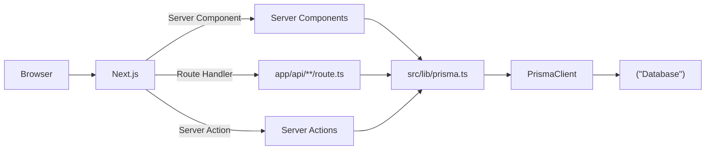

# 第166章：ServerでDBに接続する置き場所🧊

ここから先、**「DBに繋ぐコード、どこに置けばいいの？」問題**が出てくるよね🥺
結論はこれ👇

✅ **DB接続は “サーバー専用の共通モジュール” にまとめる**
✅ そのモジュールは **`app/` の外（例：`src/lib/` や `src/server/`）**に置くのが超おすすめ✨
✅ そして **Client Component からは絶対に触らせない**🙅‍♀️🔒

---

## 1) おすすめの置き場所📁✨

よくある安定パターンはこのへん👇

* `src/lib/prisma.ts`（定番！）
* `src/server/db.ts`（“server専用”が分かりやすい）

たとえばこんな構成👇

```
my-app/
  src/
    app/
      api/
        health/route.ts
      todos/page.tsx
    lib/
      prisma.ts   ← ★ここにDB接続（PrismaClient）
  prisma/
    schema.prisma
  .env
```

---

## 2) “サーバー専用”にするのが超大事🧊🚫🌐

DB接続には **DBのURLやパスワード**が関わるから、
間違ってもブラウザ側に混ざったらアウトだよ〜😱💥

そこで便利なのが👇

✅ `import "server-only"` を先頭に書く
→ これを入れると「それ、サーバーでしか使っちゃダメ！」を強めに守れるよ🛡️✨

---

## 2) Prisma Studio を起動してみよう 🚀✨


## 3) Prismaの接続ファイルを作ろう🧩✨（定番テンプレ）

`src/lib/prisma.ts` を作って、こう書くよ👇
（開発中のホットリロードで PrismaClient が増殖して事故るのを防ぐ形🧯）

```ts
// src/lib/prisma.ts
import "server-only";
import { PrismaClient } from "@prisma/client";

const globalForPrisma = globalThis as unknown as {
  prisma: PrismaClient | undefined;
};

export const prisma =
  globalForPrisma.prisma ??
  new PrismaClient({
    // 必要ならログをON（好みでOK）
    // log: ["query", "error", "warn"],
  });

if (process.env.NODE_ENV !== "production") {
  globalForPrisma.prisma = prisma;
}
```

📝ポイント💡

* `prisma` を **どこからでも import して使える**ようにする✨
* **作る場所は1箇所だけ**にする（接続が散らばると管理がつらい🥺）

---

## 4) どこから使うの？（正しい呼び出し場所）🧠✅

この `prisma` は **サーバー側の処理**から呼ぶよ👇

* Server Components（`app/**/page.tsx`：※`"use client"`無しのやつ）
* Route Handlers（`app/api/**/route.ts`）
* Server Actions（`"use server"` の関数）

例：Route Handler から使う👇（動作確認にちょうどいい✨）

```ts
// src/app/api/health/route.ts
import { prisma } from "@/lib/prisma";

export async function GET() {
  // 例：Todoがある前提（無ければ好きなモデルに変えてOK）
  const todoCount = await prisma.todo.count();

  return Response.json({ ok: true, todoCount });
}
```

ブラウザで👇にアクセスしてJSONが返ったら勝ち🎉
`http://localhost:3000/api/health`

---

## 5) 逆に “置いちゃダメ/やりがち” 🙅‍♀️💥

### ❌ Client Component（`"use client"`）でDB直import

* ブラウザに混ざる可能性があって危険🔒
* そもそもDBはブラウザから直接触れないよ〜😭

### ❌ 毎回 `new PrismaClient()` しちゃう

* 接続が増えて重くなる・詰まる原因になりがち🥶
* だから **共通ファイルで1回だけ作る**が基本！

---

## 図解：どこに置いて、どう流れる？📨➡️🧊➡️🗃️



---

## ミニまとめ🎀✨（この章のゴール）

✅ **DB接続は `src/lib/prisma.ts` みたいな“サーバー専用の共通ファイル”へ**🧊
✅ **`import "server-only"` で境界を固くする**🛡️
✅ **Server Components / Route Handlers / Server Actions から呼ぶ**📦
✅ **Client側からは触らない**🙅‍♀️✨

次の章（一覧取得＝Read📖）で、この `prisma` を使って実際にデータを表示していこうね〜！😆🫶✨
