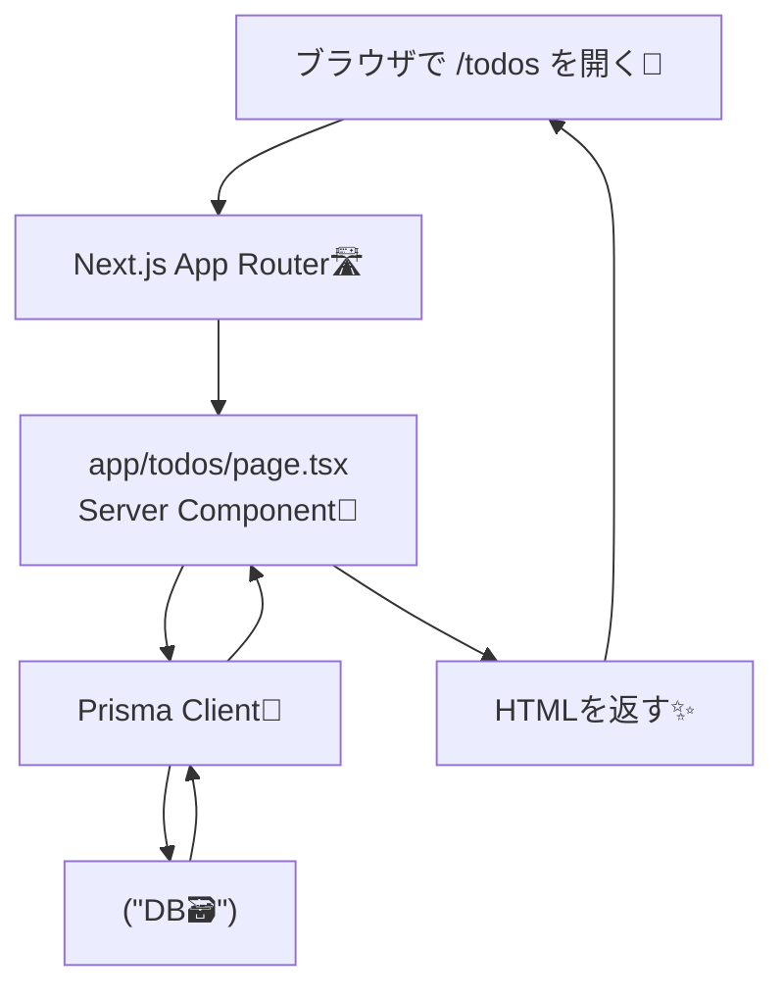

# 第167章：一覧取得（Read）📖

この章では **DBに入っているTodoを「一覧で表示」できるように**します😊📝
Next.js（App Router）では、**ページ（Server Component）でそのままDBを読める**のが超つよポイントです💪🧊

---

## この章のゴール🎯

* Prismaで **Todoの一覧をDBから取得（findMany）**できる📚✨
* `/todos` にアクセスしたら **Todo一覧が表示される**👀🌸
* 「PrismaClient多重生成」みたいな **ありがち事故を避ける**🧯💥

---

## 1) Prisma Client を安全に使う準備（devで必須）🧯🧊

開発中はホットリロードでサーバーが何度も起動して、**PrismaClientが増殖しがち**です😵‍💫
なので「1つだけ使い回す」形にします✅

### ✅ `lib/prisma.ts` を作成📁

（プロジェクト直下に `lib/` を作ってOKだよ！）

```ts
// lib/prisma.ts
import { PrismaClient } from "@prisma/client";

const globalForPrisma = globalThis as unknown as {
  prisma: PrismaClient | undefined;
};

export const prisma =
  globalForPrisma.prisma ??
  new PrismaClient({
    // log: ["query"], // 必要ならON（SQLが見える👀）
  });

if (process.env.NODE_ENV !== "production") {
  globalForPrisma.prisma = prisma;
}
```

💡 これで、開発中でもPrismaClientが増えにくくなります🙏✨

---

## 2) 動作確認用にデータを入れる（Prisma Studio）🧁✨

DBにレコードがないと一覧が空っぽなので、まずはテストデータを入れます😊

### ✅ Prisma Studio を起動🎛️

```bash
npx prisma studio
```

ブラウザが開くので、`Todo` テーブル（モデル）に適当に追加してみてね👇🌸

* title: 「レポート提出」📝
* done: false
* title: 「ゼミの資料作る」📚
* done: true などなど✨

---

## 3) `/todos` ページを作る（Server Componentで一覧取得）🧊📄

### ✅ `app/todos/page.tsx` を作成📁

```tsx
// app/todos/page.tsx
import { prisma } from "@/lib/prisma";

export const dynamic = "force-dynamic"; // 毎回DBの最新を見たいときに便利✨

export default async function TodosPage() {
  const todos = await prisma.todo.findMany({
    orderBy: { createdAt: "desc" },
    select: {
      id: true,
      title: true,
      done: true,
      createdAt: true,
    },
  });

  return (
    <main style={{ padding: 24 }}>
      <h1 style={{ fontSize: 24, fontWeight: 700 }}>Todo一覧📋✨</h1>

      {todos.length === 0 ? (
        <p style={{ marginTop: 12 }}>まだTodoがないよ〜🥺🫧</p>
      ) : (
        <ul style={{ marginTop: 16, display: "grid", gap: 10 }}>
          {todos.map((t) => (
            <li
              key={t.id}
              style={{
                border: "1px solid #ddd",
                borderRadius: 12,
                padding: 12,
              }}
            >
              <div style={{ display: "flex", gap: 10, alignItems: "center" }}>
                <span aria-label={t.done ? "完了" : "未完了"}>
                  {t.done ? "✅" : "⬜"}
                </span>
                <span style={{ fontWeight: 600 }}>{t.title}</span>
              </div>

              <small style={{ display: "block", marginTop: 6, opacity: 0.7 }}>
                作成: {t.createdAt.toLocaleString()}
              </small>
            </li>
          ))}
        </ul>
      )}
    </main>
  );
}
```

🎉 これで **DB → Prisma → ページ表示** がつながりました！最高〜〜〜！✨🥳

---

## 4) 動かして確認する🚀👀

```bash
npm run dev
```

ブラウザで👇にアクセスしてね🌈

* `http://localhost:3000/todos`

Prisma Studioで入れたTodoが一覧表示されたら成功🎉💖

---

## 図解：/todos を開いた時の流れ🧠➡️📦（Mermaid）




---

## よくあるハマりポイント🪤🧯

### ❓「PrismaClientが増えて怒られる」っぽい時😵‍💫

➡️ `lib/prisma.ts` の“使い回し”ができてるかチェック✅
（この章のやり方ならだいたい解決するよ〜！✨）

### ❓一覧が空っぽ🥺

➡️ Prisma Studioでデータ入ってるか確認👀🧁
➡️ `findMany()` の `where` を付けてないか確認🔍

### ❓`createdAt` が無いって言われる💥

➡️ Prismaのモデルに `createdAt DateTime @default(now())` がある前提だよ〜
（もし無いなら、今のモデルに合わせて `select` と表示を変えてOK😊）

---

## ミニ練習（できたら強い💪✨）🎮🌸

### ① 未完了だけ表示したい⬜

```ts
const todos = await prisma.todo.findMany({
  where: { done: false },
  orderBy: { createdAt: "desc" },
});
```

### ② 最大10件だけ表示したい🔟

```ts
const todos = await prisma.todo.findMany({
  take: 10,
  orderBy: { createdAt: "desc" },
});
```

### ③ タイトルに「レポート」を含むものだけ🔎

```ts
const todos = await prisma.todo.findMany({
  where: { title: { contains: "レポート" } },
  orderBy: { createdAt: "desc" },
});
```

---

## まとめ🎀✨

* 一覧取得は **`prisma.todo.findMany()`** が基本📖
* App Router のページ（Server Component）なら **その場でDB読める**🧊⚡
* 開発中は **PrismaClient使い回し**で安定させる🧯✅

必要なら、この章のコードを「ちょい可愛いUI」に整える版も作れるよ〜🥰🎨✨
