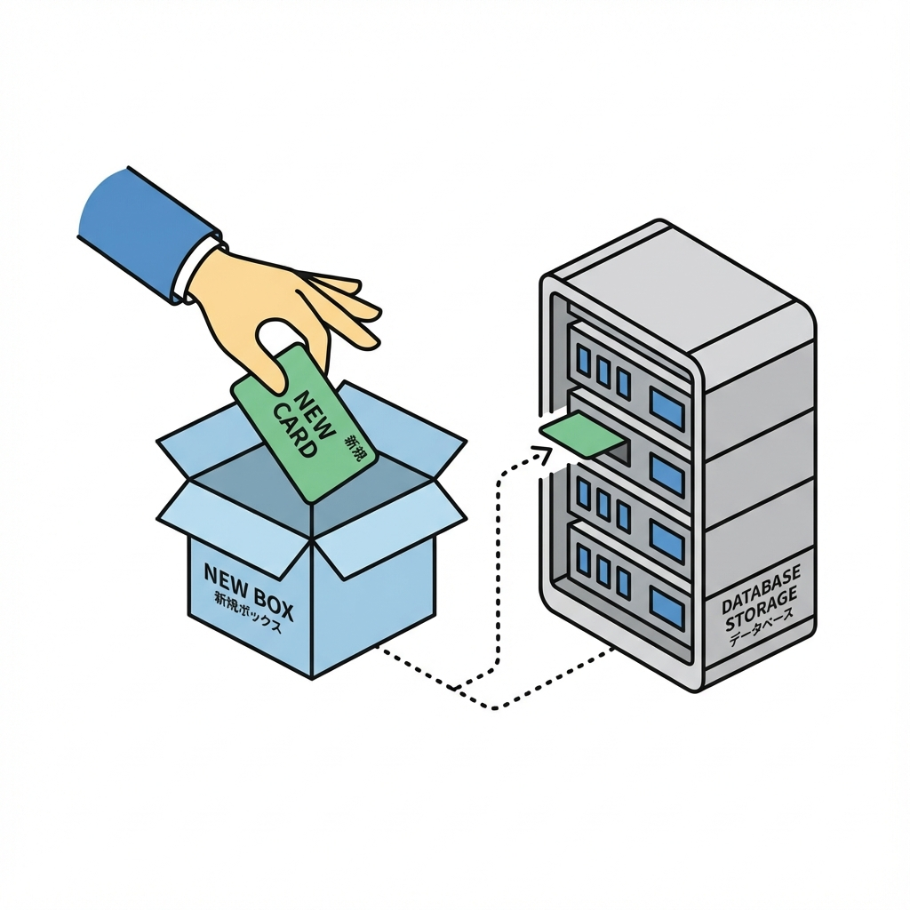
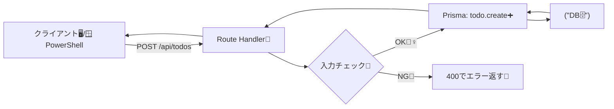

# 第168章：追加（Create）➕

この章では、**Todoを1件追加（Create）**できるようにするよ〜！🥳
UIはまだ“本格的に”つながなくてOK👌 まずは **サーバー側で追加できる土台**を作って、ちゃんとDBに入るのを確認しよっ💪💕

---

## できるようになること🎯

* Prismaで `todo.create()` を使って **DBに新規レコード追加**できる➕
* **Route Handler（/api）**を用意して、POSTで追加を試せる🚪📮
* Prisma Studioで **入ったか目視確認**できる👀✨

---

## まずは完成イメージ（ざっくり）🧠✨

* `POST /api/todos` に `{ title: "..." }` を送る
  → サーバーでチェック
  → PrismaでDBに保存
  → JSONで結果が返ってくる🎁

---

## 手順1：Todoを追加する関数を作る➕🧩

まずは「追加」専用の関数を作っちゃおう！
（**ポイント：DB操作はサーバー側だけ**でやるよ🧊）

### 1) Prisma Client が `lib/prisma.ts` にある前提🧠

もし同じものがすでにあるならスキップでOK👌
ない場合は、こんな感じ👇

```ts
// lib/prisma.ts
import { PrismaClient } from "@prisma/client";

const globalForPrisma = globalThis as unknown as { prisma?: PrismaClient };

export const prisma =
  globalForPrisma.prisma ??
  new PrismaClient({
    log: process.env.NODE_ENV === "development" ? ["error", "warn"] : ["error"],
  });

if (process.env.NODE_ENV !== "production") globalForPrisma.prisma = prisma;
```

### 2) 追加用関数 `createTodo()` を作る✍️✨

```ts
// lib/todos.ts
import { prisma } from "@/lib/prisma";

export async function createTodo(title: string) {
  const trimmed = title.trim();

  // ここは最低限のチェックでOKだよ🙆‍♀️
  if (!trimmed) {
    throw new Error("タイトルが空だよ🥲 何か入れてね！");
  }
  if (trimmed.length > 100) {
    throw new Error("タイトルが長すぎるよ🥺（100文字まで）");
  }

  // ✅ ここがCreate（追加）！
  // スキーマで必須な項目が他にもある場合は data に足してね🧩
  const todo = await prisma.todo.create({
    data: {
      title: trimmed,
      // 例：done: false, など（スキーマに合わせてね）
    },
    select: {
      id: true,
      title: true,
      createdAt: true,
    },
  });

  return todo;
}
```

---

## 手順2：Route Handler（POST /api/todos）を作る🚪📮

「POSTで追加」を試すために、APIを用意するよ〜！
`app/api/todos/route.ts` を作ってね🗂️✨

```ts
// app/api/todos/route.ts
import { NextResponse } from "next/server";
import { createTodo } from "@/lib/todos";

export async function POST(req: Request) {
  try {
    const body = (await req.json()) as { title?: unknown };
    const title = typeof body.title === "string" ? body.title : "";

    const todo = await createTodo(title);

    return NextResponse.json({ ok: true, todo }, { status: 201 });
  } catch (e) {
    const message = e instanceof Error ? e.message : "Unknown error 😵‍💫";
    return NextResponse.json({ ok: false, message }, { status: 400 });
  }
}
```

---

## 手順3：動作確認しよう✅（Windows / PowerShell）🪟✨

### 1) 開発サーバー起動🚀

```powershell
npm run dev
```

### 2) POSTしてTodoを追加してみる➕📮

**PowerShell** でこれ👇（改行はバッククォート ` だよ！）

```powershell
curl -X POST http://localhost:3000/api/todos `
  -H "Content-Type: application/json" `
  -d '{ "title": "レポート提出📚" }'
```

成功したら、こんなJSONが返ってくるはず😍（例）

* `ok: true`
* `todo: { id, title, createdAt }`

### 3) Prisma Studioで目視チェック👀✨

```powershell
npx prisma studio
```

ブラウザで開いたら `Todo` テーブルに追加されてるはず！🎉🎉🎉

---

## 図解：追加（Create）の流れ🧭✨（Mermaid）





---

## よくあるつまずきポイント🪤🥲（ここだけ見れば助かる）

* **`PrismaClientInitializationError`**
  → `.env.local` の `DATABASE_URL` が間違ってる/空のこと多いよ🔐
* **テーブルが無い（追加できない）**
  → マイグレーションが未適用かも：`npx prisma migrate dev`（必要なら）🧾
* **Client ComponentでPrismaを呼んじゃった😵‍💫**
  → Prismaはサーバーだけ！`lib/` や `route.ts` や server 側で使うよ🧊
* **必須カラムを忘れて追加できない**
  → Prismaのエラーに「必要だよ」って出るから、`data: { ... }` に足す🧩✨

---

## ミニ課題🎓✨（5〜10分でOK）

1. `title` が **スペースだけ**のときも弾く（今のでOKだけど、挙動確認してみよ）🧼
2. `select` をやめて `create()` の返り値をそのまま返してみる（何が返る？👀）
3. `status: 201` の意味を調べてみる🚦（「作ったよ！」の合図）

---

## まとめ🧁✨

* Createは **`prisma.todo.create({ data: ... })`** でOK➕
* まずは **Route HandlerでPOST** できる形にすると、UIが無くても確認できて安心😌💕
* 次は「更新・削除」に進むと、CRUDが気持ちよく揃ってくるよ〜！✏️🗑️✨
