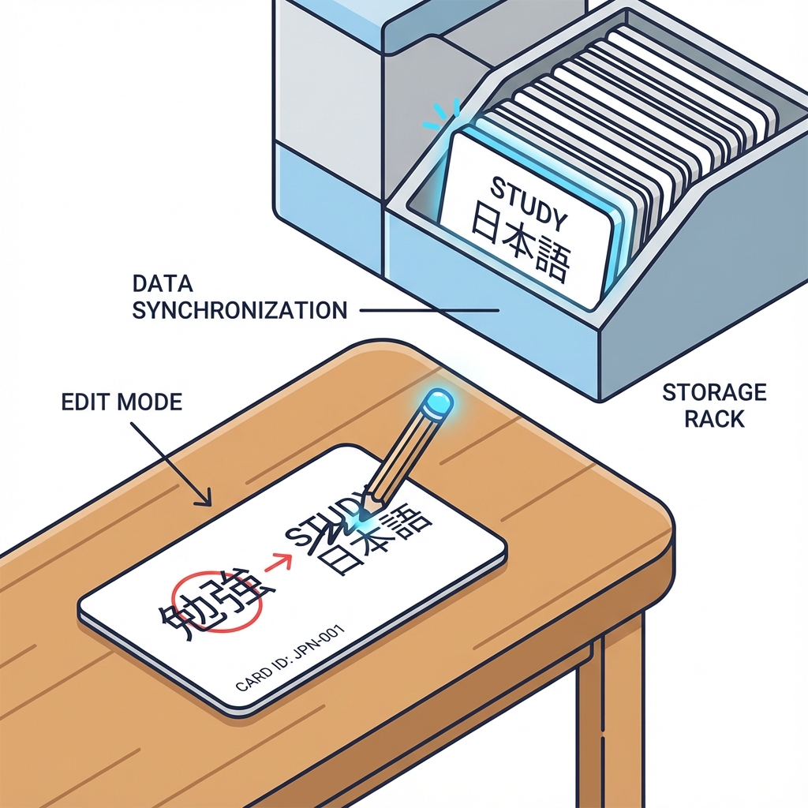
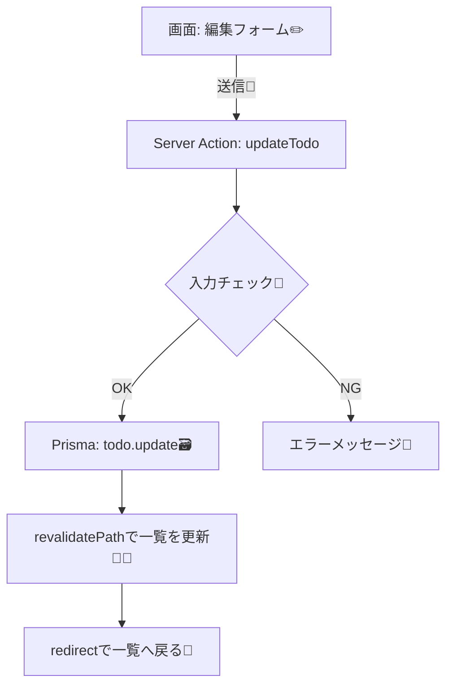

# 第169章：更新（Update）✏️

この章では、DBに入ってるデータを **「編集して上書きする」** 更新（Update）を、Prismaでできるようにします😊🛠️  
例として「TODOのタイトル変更」「完了フラグ切り替え」を作るよ〜✅🔁

---

## 🎯 この章のゴール
- Prismaで **1件更新** が書けるようになる✏️
- 「どのレコードを」「どんな内容に」更新するかを整理できる🧠✨
- Next.js（App Router）で **Server Actionsから更新** できるようになる📨➡️🗃️

---

## 🧠 Updateってなに？
すでにあるデータを「差し替える」操作だよ😊  
たとえば…

- TODOのタイトルを「レポート」→「レポート（提出用）」にする📘✍️
- 完了を `false` → `true` にする✅

---

## 🧩 Prismaの `update` の基本形
Prismaの1件更新は基本これ👇

````ts
const updated = await prisma.todo.update({
  where: { id: 1 },     // ✅どの1件？（ユニークな条件）
  data: { title: "新しいタイトル" }, // ✅何をどう変える？
});
`````

### ✅ 超だいじ：`where` は「ユニーク」である必要があるよ

* `id` とか `email` とか、**1件に決まる条件**を使うのが基本🙆‍♀️
* もし「条件に合うものを全部更新」したいなら `updateMany` になるよ（今回は1件更新に集中！）🎯

---

## 🗺️ 更新処理の流れ（図解）✨





---

## 🧱 例：Todoモデル（イメージ）

あなたのプロジェクトのモデルに合わせてOKだけど、例としてこんな感じだと話がスムーズだよ😊

```prisma
model Todo {
  id        Int      @id @default(autoincrement)
  title     String
  completed Boolean  @default(false)
  updatedAt DateTime @updatedAt
}
```

---

## ✅ 実装例：Server Actionsで「更新」する（タイトル＋完了）

ここからは「TODO編集画面」を想定して、**更新の核心部分**を作るよ〜✊✨
（フォルダ名は一例だから、あなたの構成に合わせてね😊）

---

### 1) Server Action（更新本体）を作る 🧑‍🍳🔥

`app/todos/actions.ts`

```ts
"use server";

import { redirect } from "next/navigation";
import { revalidatePath } from "next/cache";
import { Prisma } from "@prisma/client";
import { prisma } from "@/lib/prisma"; // 既に用意されてる想定（なければあなたの置き場所に合わせてね）

type ActionState =
  | { ok: true }
  | { ok: false; message: string };

export async function updateTodoAction(
  _prevState: ActionState,
  formData: FormData
): Promise<ActionState> {
  // ① 値を取り出す🧺
  const id = Number(formData.get("id"));
  const title = String(formData.get("title") ?? "").trim();
  const completed = formData.get("completed") === "on"; // checkboxはONの時だけ入るよ✅

  // ② 入力チェック🧪（最低限でOK）
  if (!Number.isFinite(id) || id <= 0) {
    return { ok: false, message: "IDが不正だよ🥲" };
  }
  if (title.length === 0) {
    return { ok: false, message: "タイトルは空にできないよ🥺" };
  }
  if (title.length > 100) {
    return { ok: false, message: "タイトル長すぎるかも！100文字以内にしてね📝" };
  }

  // ③ 更新（Update）✏️
  try {
    await prisma.todo.update({
      where: { id },
      data: {
        title,
        completed,
      },
    });
  } catch (err) {
    // Prismaの「見つからない」系（P2025）を丁寧に扱う✨
    if (err instanceof Prisma.PrismaClientKnownRequestError && err.code === "P2025") {
      return { ok: false, message: "そのTODOは見つからなかったよ👀💦（削除されたかも）" };
    }
    return { ok: false, message: "更新に失敗したよ🥲 もう一回やってみてね" };
  }

  // ④ 一覧などの表示を最新化🧊🔁
  revalidatePath("/todos");

  // ⑤ 成功したら戻す🚪
  redirect("/todos");
}
```

---

### 2) 編集フォーム（画面側）を作る ✏️🧸

`app/todos/[id]/EditForm.tsx`（フォームはクライアントでもOKだよ😊）

```tsx
"use client";

import { useActionState } from "react";
import { updateTodoAction } from "../actions";

type Props = {
  todo: {
    id: number;
    title: string;
    completed: boolean;
  };
};

type ActionState =
  | { ok: true }
  | { ok: false; message: string };

const initialState: ActionState = { ok: true };

export function EditForm({ todo }: Props) {
  const [state, formAction] = useActionState(updateTodoAction, initialState);

  return (
    <form action={formAction} style={{ display: "grid", gap: 12, maxWidth: 480 }}>
      <input type="hidden" name="id" value={todo.id} />

      <label style={{ display: "grid", gap: 6 }}>
        <span>タイトル✏️</span>
        <input name="title" defaultValue={todo.title} />
      </label>

      <label style={{ display: "flex", gap: 8, alignItems: "center" }}>
        <input type="checkbox" name="completed" defaultChecked={todo.completed} />
        <span>完了✅</span>
      </label>

      {!state.ok && (
        <p style={{ color: "crimson" }}>
          {state.message} 🧯
        </p>
      )}

      <button type="submit">更新する✏️✨</button>
    </form>
  );
}
```

---

### 3) 編集ページ（DBから1件読んでフォームに渡す）📖➡️✏️

`app/todos/[id]/page.tsx`

```tsx
import { notFound } from "next/navigation";
import { prisma } from "@/lib/prisma";
import { EditForm } from "./EditForm";

type Props = {
  params: Promise<{ id: string }>;
};

export default async function TodoEditPage({ params }: Props) {
  const { id: rawId } = await params;
  const id = Number(rawId);
  if (!Number.isFinite(id)) notFound();

  const todo = await prisma.todo.findUnique({
    where: { id },
  });

  if (!todo) notFound();

  return (
    <main style={{ padding: 24, display: "grid", gap: 16 }}>
      <h1>TODO編集✏️</h1>
      <EditForm todo={todo} />
    </main>
  );
}
```

---

## 🪤 よくあるハマりポイント（先に回避しよ🛟）

* **`where` がユニークじゃない**
  → 1件に絞れないと `update` はできないよ🥲（そのときは `updateMany`）
* **checkboxの値が思った通りにならない**
  → `formData.get("completed") === "on"` を使うと安定✅
* **「見つからない」時に落ちる**
  → `update` は対象がないと例外になるから、`P2025` をキャッチすると優しい🫶

---

## ✅ ミニ練習（5〜10分）🎓✨

1. タイトルを変えて「更新する✏️✨」を押す
2. 完了チェックをON/OFFして更新する✅🔁
3. URLに存在しないID（例：`/todos/999999`）を入れて、`notFound()` の動きを確認👀🚪

---

## 🎉 できたらあなたはもう…

DBの「更新（Update）」が書ける人です✏️🗃️✨
CRUDの中でも更新は実務でめっちゃ使うから、ここができると一気に強くなるよ〜💪😊

```
```
