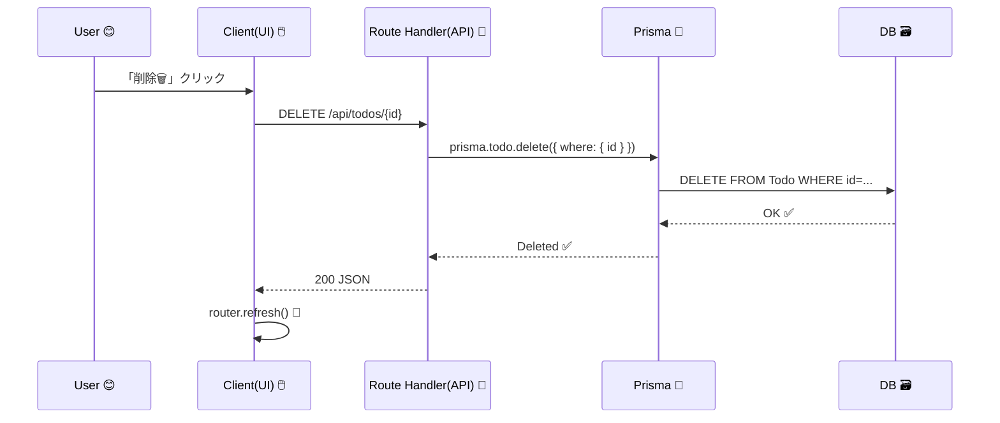

# 第170章：削除（Delete）🗑️✨

今回は **TODOを「削除」できるようにする**よ〜！
CRUDの最後のピース🧩で、ここができると一気に“アプリ感”が出る☺️💕

---

## この章のゴール🎯

* ✅ `/api/todos/:id` に **DELETE** を生やす
* ✅ 画面に「削除🗑️」ボタンをつけて、押したら消える
* ✅ 失敗した時のメッセージも丁寧にする🫶

---

## 全体の流れ（図解）🧠➡️🗑️➡️💾



---

## 1) DELETE API を作る🚪🗑️

`app/api/todos/[id]/route.ts` を作って（または更新して）、**DELETE** を追加するよ！

```ts
// app/api/todos/[id]/route.ts
import { NextResponse } from "next/server";
import { prisma } from "@/lib/prisma";
import { Prisma } from "@prisma/client";

type Ctx = { params: { id: string } };

export async function DELETE(_req: Request, { params }: Ctx) {
  const id = Number(params.id);

  if (!Number.isFinite(id)) {
    return NextResponse.json(
      { message: "id が不正だよ🥲" },
      { status: 400 }
    );
  }

  try {
    await prisma.todo.delete({
      where: { id },
    });

    return NextResponse.json({ ok: true });
  } catch (e: unknown) {
    // もう存在しないIDを消そうとした時など
    if (e instanceof Prisma.PrismaClientKnownRequestError && e.code === "P2025") {
      return NextResponse.json(
        { message: "そのTODOは見つからなかったよ…👀" },
        { status: 404 }
      );
    }

    return NextResponse.json(
      { message: "削除に失敗したよ…🥲" },
      { status: 500 }
    );
  }
}
```

### 💡ポイント

* `id` を `Number()` にして、変な値なら **400** にする（やさしい）🫶
* 消したいデータが無い時は **404** にする（丁寧）🧭

---

## 2) 画面に「削除ボタン」を付ける🖱️🗑️

削除はブラウザ操作なので、ボタン部分は **Client Component** にするよ〜🎮

### `components/DeleteTodoButton.tsx`

```tsx
"use client";

import { useRouter } from "next/navigation";
import { useTransition } from "react";

type Props = {
  id: number;
};

export function DeleteTodoButton({ id }: Props) {
  const router = useRouter();
  const [isPending, startTransition] = useTransition();

  const onDelete = () => {
    const ok = window.confirm("このTODOを削除する？🗑️（戻せないよ）");
    if (!ok) return;

    startTransition(async () => {
      const res = await fetch(`/api/todos/${id}`, {
        method: "DELETE",
      });

      if (!res.ok) {
        const data = await res.json().catch(() => null);
        alert(data?.message ?? "削除に失敗したよ…🥲");
        return;
      }

      // Server Component の一覧を最新にする✨
      router.refresh();
    });
  };

  return (
    <button
      onClick={onDelete}
      disabled={isPending}
      aria-disabled={isPending}
      style={{
        padding: "6px 10px",
        borderRadius: 8,
        border: "1px solid #ddd",
        cursor: isPending ? "not-allowed" : "pointer",
      }}
    >
      {isPending ? "削除中…⏳" : "削除🗑️"}
    </button>
  );
}
```

---

## 3) TODO一覧にボタンを置く📋✨

たとえば一覧を表示してるところで、こんな感じで差し込むよ〜！

```tsx
// 例：app/todos/page.tsx（など一覧ページ）
import { DeleteTodoButton } from "@/components/DeleteTodoButton";

type Todo = {
  id: number;
  title: string;
};

export default async function TodosPage() {
  const res = await fetch(`${process.env.NEXT_PUBLIC_BASE_URL ?? ""}/api/todos`, {
    cache: "no-store",
  });
  const todos: Todo[] = await res.json();

  return (
    <main style={{ padding: 16 }}>
      <h1>TODO一覧📋</h1>

      <ul style={{ display: "grid", gap: 10, padding: 0, listStyle: "none" }}>
        {todos.map((t) => (
          <li
            key={t.id}
            style={{
              display: "flex",
              alignItems: "center",
              justifyContent: "space-between",
              border: "1px solid #eee",
              borderRadius: 12,
              padding: 12,
            }}
          >
            <span>{t.title}</span>
            <DeleteTodoButton id={t.id} />
          </li>
        ))}
      </ul>
    </main>
  );
}
```

> `fetch` のURLはプロジェクト構成で変わることがあるよ！
> もし一覧取得を **ServerでPrisma直叩き**にしてるなら、そこはそのままでOK👌（ボタンだけクライアントで削除→`router.refresh()`で再表示）

---

## 4) 動作チェック✅🧪

1. `npm run dev` で起動🚀
2. TODO一覧で「削除🗑️」クリック
3. 確認ダイアログ → OK
4. 一覧から消えたら成功🎉

---

## よくあるつまずき🐣🪤

* **404になる**：`app/api/todos/[id]/route.ts` のパスが違うかも👀
* **消えたのに画面が更新されない**：`router.refresh()` を呼べてるか確認🔄
* **idが文字列のまま**：`Number(params.id)` を忘れてない？🔢

---

ここまでできたら、CRUDの「D」完成！🗑️✨
次は「追加/更新/削除」を **Server Actionsにまとめて**、体験をさらに良くしていけるよ〜！💖
