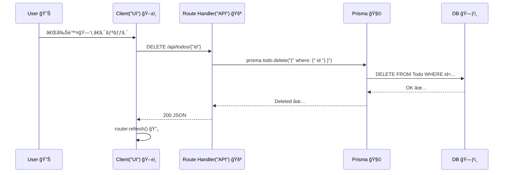

# 第170章：削除（Delete）🗑ï¸

今å›ã¯ **TODOを「削除ã€ã§ãるよã†ã«ã™ã‚‹**よ〜ï¼
CRUDã®æœ€å¾Œã®ãƒ”ース🧩ã§ã€ã“ã“ãŒã§ãã‚‹ã¨ä¸€æ°—ã«â€œã‚¢ãƒ—リ感â€ãŒå‡ºã‚‹â˜ºï¸ğŸ’•

---

## ã“ã®ç« ã®ã‚´ãƒ¼ãƒ«ğŸ¯

* ✅ `/api/todos/:id` ã« **DELETE** を生やã™
* ✅ ç”»é¢ã«ã€Œå‰Šé™¤ğŸ—‘ï¸ã€ãƒœã‚¿ãƒ³ã‚’ã¤ã‘ã¦ã€æŠ¼ã—ãŸã‚‰æ¶ˆãˆã‚‹
* ✅ 失敗ã—ãŸæ™‚ã®ãƒ¡ãƒƒã‚»ãƒ¼ã‚¸ã‚‚ä¸å¯§ã«ã™ã‚‹ğŸ«¶

---

## 全体ã®æµã‚Œï¼ˆå›³è§£ï¼‰ğŸ§ â¡ï¸ğŸ—‘ï¸â¡ï¸ğŸ’¾



```mermaid
sequenceDiagram
  participant U as User 😊
  participant C as Client("UI") 🖱ï¸
  participant A as Route Handler("API") 🚪
  participant P as Prisma 🧩
  participant D as DB 🗃ï¸

  U->>C: 「削除🗑ï¸ã€ã‚¯ãƒªãƒƒã‚¯
  C->>A: DELETE /api/todos/{"id"}
  A->>P: prisma.todo.delete("{#quot; where: {#quot; id #quot;} }")
  P->>D: DELETE FROM Todo WHERE id=...
  D-->>P: OK ✅
  P-->>A: Deleted ✅
  A-->>C: 200 JSON
  C->>C: router.refresh() 🔄
```

---

## 1) DELETE API を作る🚪🗑ï¸

`app/api/todos/[id]/route.ts` を作ã£ã¦ï¼ˆã¾ãŸã¯æ›´æ–°ã—ã¦ï¼‰ã€**DELETE** を追加ã™ã‚‹ã‚ˆï¼

```ts
// app/api/todos/[id]/route.ts
import { NextResponse } from "next/server";
import { prisma } from "@/lib/prisma";
import { Prisma } from "@prisma/client";

type Ctx = { params: Promise<{ id: string }> };

export async function DELETE(_req: Request, { params }: Ctx) {
  const { id: rawId } = await params;
  const id = Number(rawId);

  if (!Number.isFinite(id)) {
    return NextResponse.json(
      { message: "id ãŒä¸æ­£ã ã‚ˆğŸ¥²" },
      { status: 400 }
    );
  }

  try {
    await prisma.todo.delete({
      where: { id },
    });

    return NextResponse.json({ ok: true });
  } catch (e: unknown) {
    // ã‚‚ã†å­˜åœ¨ã—ãªã„IDを消ãã†ã¨ã—ãŸæ™‚ãªã©
    if (e instanceof Prisma.PrismaClientKnownRequestError && e.code === "P2025") {
      return NextResponse.json(
        { message: "ãã®TODOã¯è¦‹ã¤ã‹ã‚‰ãªã‹ã£ãŸã‚ˆâ€¦ğŸ‘€" },
        { status: 404 }
      );
    }

    return NextResponse.json(
      { message: "削除ã«å¤±æ•—ã—ãŸã‚ˆâ€¦ğŸ¥²" },
      { status: 500 }
    );
  }
}
```

### 💡ãƒã‚¤ãƒ³ãƒˆ

* `id` ã‚’ `Number()` ã«ã—ã¦ã€å¤‰ãªå€¤ãªã‚‰ **400** ã«ã™ã‚‹ï¼ˆã‚„ã•ã—ã„）🫶
* 消ã—ãŸã„データãŒç„¡ã„時㯠**404** ã«ã™ã‚‹ï¼ˆä¸å¯§ï¼‰ğŸ§­

---

## 2) ç”»é¢ã«ã€Œå‰Šé™¤ãƒœã‚¿ãƒ³ã€ã‚’付ã‘る🖱ï¸ğŸ—‘ï¸

削除ã¯ãƒ–ラウザæ“作ãªã®ã§ã€ãƒœã‚¿ãƒ³éƒ¨åˆ†ã¯ **Client Component** ã«ã™ã‚‹ã‚ˆã€œğŸ®

### `components/DeleteTodoButton.tsx`

```tsx
"use client";

import { useRouter } from "next/navigation";
import { useTransition } from "react";

type Props = {
  id: number;
};

export function DeleteTodoButton({ id }: Props) {
  const router = useRouter();
  const [isPending, startTransition] = useTransition();

  const onDelete = () => {
    const ok = window.confirm("ã“ã®TODOを削除ã™ã‚‹ï¼ŸğŸ—‘ï¸ï¼ˆæˆ»ã›ãªã„よ）");
    if (!ok) return;

    startTransition(async () => {
      const res = await fetch(`/api/todos/${id}`, {
        method: "DELETE",
      });

      if (!res.ok) {
        const data = await res.json().catch(() => null);
        alert(data?.message ?? "削除ã«å¤±æ•—ã—ãŸã‚ˆâ€¦ğŸ¥²");
        return;
      }

      // Server Component ã®ä¸€è¦§ã‚’最新ã«ã™ã‚‹âœ¨
      router.refresh();
    });
  };

  return (
    <button
      onClick={onDelete}
      disabled={isPending}
      aria-disabled={isPending}
      style={{
        padding: "6px 10px",
        borderRadius: 8,
        border: "1px solid #ddd",
        cursor: isPending ? "not-allowed" : "pointer",
      }}
    >
      {isPending ? "削除中…â³" : "削除🗑ï¸"}
    </button>
  );
}
```

---

## 3) TODO一覧ã«ãƒœã‚¿ãƒ³ã‚’ç½®ã📋✨

ãŸã¨ãˆã°ä¸€è¦§ã‚’表示ã—ã¦ã‚‹ã¨ã“ã‚ã§ã€ã“ã‚“ãªæ„Ÿã˜ã§å·®ã—込むよ〜ï¼

```tsx
// 例：app/todos/page.tsx（ãªã©ä¸€è¦§ãƒšãƒ¼ã‚¸ï¼‰
import { DeleteTodoButton } from "@/components/DeleteTodoButton";

type Todo = {
  id: number;
  title: string;
};

export default async function TodosPage() {
  const res = await fetch(`${process.env.NEXT_PUBLIC_BASE_URL ?? ""}/api/todos`, {
    cache: "no-store",
  });
  const todos: Todo[] = await res.json();

  return (
    <main style={{ padding: 16 }}>
      <h1>TODO一覧📋</h1>

      <ul style={{ display: "grid", gap: 10, padding: 0, listStyle: "none" }}>
        {todos.map((t) => (
          <li
            key={t.id}
            style={{
              display: "flex",
              alignItems: "center",
              justifyContent: "space-between",
              border: "1px solid #eee",
              borderRadius: 12,
              padding: 12,
            }}
          >
            <span>{t.title}</span>
            <DeleteTodoButton id={t.id} />
          </li>
        ))}
      </ul>
    </main>
  );
}
```

> `fetch` ã®URLã¯ãƒ—ロジェクト構æˆã§å¤‰ã‚ã‚‹ã“ã¨ãŒã‚るよï¼
> ã‚‚ã—一覧å–å¾—ã‚’ **Serverã§Prismaç›´å©ã**ã«ã—ã¦ã‚‹ãªã‚‰ã€ãã“ã¯ãã®ã¾ã¾ã§OK👌（ボタンã ã‘クライアントã§å‰Šé™¤â†’`router.refresh()`ã§å†è¡¨ç¤ºï¼‰

---

## 4) 動作ãƒã‚§ãƒƒã‚¯âœ…🧪

1. `npm run dev` ã§èµ·å‹•ğŸš€
2. TODO一覧ã§ã€Œå‰Šé™¤ğŸ—‘ï¸ã€ã‚¯ãƒªãƒƒã‚¯
3. 確èªãƒ€ã‚¤ã‚¢ãƒ­ã‚° → OK
4. 一覧ã‹ã‚‰æ¶ˆãˆãŸã‚‰æˆåŠŸğŸ‰

---

## よãã‚ã‚‹ã¤ã¾ãšãğŸ£ğŸª¤

* **404ã«ãªã‚‹**：`app/api/todos/[id]/route.ts` ã®ãƒ‘スãŒé•ã†ã‹ã‚‚👀
* **消ãˆãŸã®ã«ç”»é¢ãŒæ›´æ–°ã•ã‚Œãªã„**：`router.refresh()` を呼ã¹ã¦ã‚‹ã‹ç¢ºèªğŸ”„
* **idãŒæ–‡å­—列ã®ã¾ã¾**：`Number(params.id)` を忘れã¦ãªã„？🔢

---

ã“ã“ã¾ã§ã§ããŸã‚‰ã€CRUDã®ã€ŒDã€å®Œæˆï¼ğŸ—‘ï¸âœ¨
次ã¯ã€Œè¿½åŠ /æ›´æ–°/削除ã€ã‚’ **Server Actionsã«ã¾ã¨ã‚ã¦**ã€ä½“験をã•ã‚‰ã«è‰¯ãã—ã¦ã„ã‘るよ〜ï¼ğŸ’–
