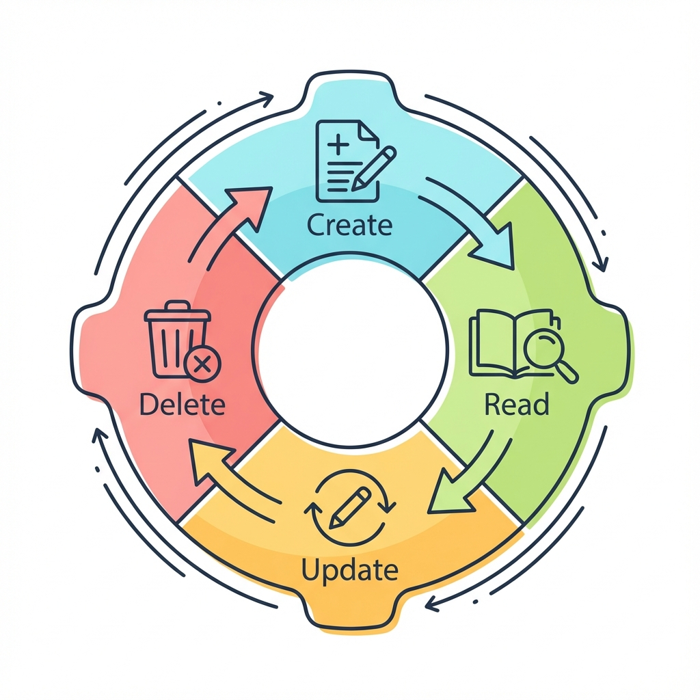
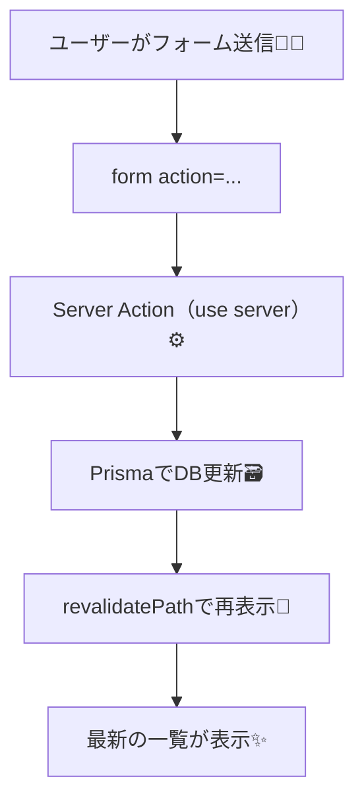
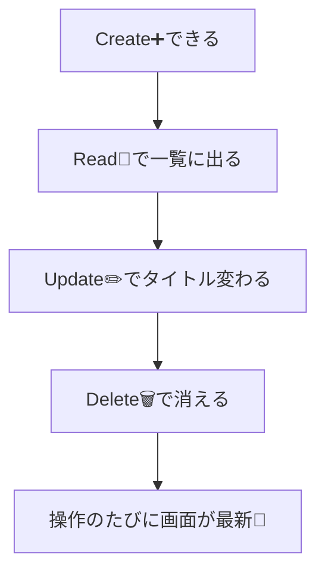

# 第171章：練習：Server ActionsでCRUDを完成させる🏁

この章では **TODOアプリのCRUD（作る・読む・直す・消す）** を、ぜんぶ **Server Actions** で完成させます🥳
「フォーム送信 → DB更新 → 画面が最新に」までを、気持ちよく一気に通します💨

---

## ゴール 🎯✨

* ✅ **Read**：DBのTODO一覧を表示する📖
* ✅ **Create**：フォームで追加できる➕
* ✅ **Update**：タイトルを編集して更新できる✏️
* ✅ **Delete**：削除できる🗑️
* ✅ 追加・更新・削除のたびに **画面が最新に** なる（`revalidatePath`）🔁

---

## 完成イメージ（流れ）🧠➡️🗃️➡️🖥️





---

## 使うファイル構成（この章で作る/触る）🗂️✨

* `app/todos/actions.ts` ← **Server Actionsをまとめる場所**💪
* `app/todos/page.tsx` ← **一覧表示＋フォームUI**🧁
* `app/todos/DeleteForm.tsx` ← **削除ボタン（確認ダイアログ用）**🗑️

（Prismaの接続 `lib/prisma.ts` や `schema.prisma` は、前の章でできてる前提だよ👌）

---

## 1) Server Actions を作る（CRUDぜんぶ）⚙️🧤

`app/todos/actions.ts` を作って、ここにCRUDを全部集約します✨

```ts
// app/todos/actions.ts
"use server";

import { revalidatePath } from "next/cache";
import { prisma } from "@/lib/prisma";

/** ちょっとした入力チェック用（空文字を弾く） */
function mustText(value: FormDataEntryValue | null, fieldName: string) {
  const text = String(value ?? "").trim();
  if (!text) throw new Error(`${fieldName} が空だよ🥺`);
  return text;
}

function mustId(value: FormDataEntryValue | null) {
  const id = String(value ?? "").trim();
  if (!id) throw new Error("id がないよ🥺");
  return id;
}

/** ✅ Create：TODO追加 */
export async function createTodo(formData: FormData) {
  const title = mustText(formData.get("title"), "title");

  await prisma.todo.create({
    data: { title },
  });

  // /todos ページを最新化🔁
  revalidatePath("/todos");
}

/** ✅ Update：タイトル更新 */
export async function updateTodo(formData: FormData) {
  const id = mustId(formData.get("id"));
  const title = mustText(formData.get("title"), "title");

  await prisma.todo.update({
    where: { id },
    data: { title },
  });

  revalidatePath("/todos");
}

/** ✅ Delete：削除 */
export async function deleteTodo(formData: FormData) {
  const id = mustId(formData.get("id"));

  await prisma.todo.delete({
    where: { id },
  });

  revalidatePath("/todos");
}

/** ✅（おまけ）完了/未完了 切り替え */
export async function toggleTodo(formData: FormData) {
  const id = mustId(formData.get("id"));

  const todo = await prisma.todo.findUnique({ where: { id } });
  if (!todo) throw new Error("そのTODO見つからないよ🥺");

  await prisma.todo.update({
    where: { id },
    data: { completed: !todo.completed },
  });

  revalidatePath("/todos");
}
```

ポイントだよ〜📌✨

* `actions.ts` の先頭に **`"use server"`** が必要💡（忘れると動かない🙅‍♀️）
* 変更後に `revalidatePath("/todos")` で **ページを最新化**🔁

---

## 2) 削除ボタン用の Client Component を作る🗑️✨

Server Component の中では `onClick` が使えないよ〜💡
確認ダイアログを出したい「削除ボタン」だけ別ファイル（Client Component）にするね！

```tsx
// app/todos/DeleteForm.tsx
"use client";

import { deleteTodo } from "./actions";

export function DeleteForm({ id }: { id: string }) {
  return (
    <form action={deleteTodo}>
      <input type="hidden" name="id" value={id} />
      <button
        type="submit"
        style={{ borderRadius: 10, padding: "8px 12px" }}
        onClick={(e) => {
          // Client Component だから onClick が動くよ🙆‍♀️✨
          if (!confirm("ほんとに削除する？🥺")) e.preventDefault();
        }}
      >
        削除🗑️
      </button>
    </form>
  );
}
```

---

## 3) ページ本体を作る（Server Component）📄✨

`app/todos/page.tsx` を作ります！
ここで `DeleteForm` を読み込んで使うよ😊

```tsx
// app/todos/page.tsx
import { prisma } from "@/lib/prisma";
import { createTodo, toggleTodo, updateTodo } from "./actions";
import { DeleteForm } from "./DeleteForm";

export const dynamic = "force-dynamic"; // 開発中は毎回最新で見たい時に安心🧡

export default async function TodosPage() {
  const todos = await prisma.todo.findMany({
    orderBy: { createdAt: "desc" },
  });

  return (
    <main style={{ maxWidth: 720, margin: "0 auto", padding: 16 }}>
      <h1 style={{ fontSize: 24, fontWeight: 700 }}>TODO（Server Actions CRUD）🧁✨</h1>

      {/* ✅ Create */}
      <section style={{ marginTop: 16, padding: 12, border: "1px solid #ddd", borderRadius: 12 }}>
        <h2 style={{ fontSize: 16, fontWeight: 700 }}>追加➕</h2>

        <form action={createTodo} style={{ display: "flex", gap: 8, marginTop: 8 }}>
          <input
            name="title"
            placeholder="例）レポート提出📄"
            style={{ flex: 1, padding: 10, borderRadius: 10, border: "1px solid #ccc" }}
          />
          <button type="submit" style={{ padding: "10px 14px", borderRadius: 10 }}>
            追加✨
          </button>
        </form>
      </section>

      {/* ✅ Read */}
      <section style={{ marginTop: 16 }}>
        <h2 style={{ fontSize: 16, fontWeight: 700 }}>一覧📋（{todos.length}件）</h2>

        {todos.length === 0 ? (
          <p style={{ marginTop: 8 }}>まだ何もないよ〜🌸 まずは1個追加してみよ😊</p>
        ) : (
          <ul style={{ listStyle: "none", padding: 0, marginTop: 8, display: "grid", gap: 10 }}>
            {todos.map((t) => (
              <li key={t.id} style={{ padding: 12, border: "1px solid #ddd", borderRadius: 12 }}>
                <div style={{ display: "flex", alignItems: "center", gap: 8 }}>
                  <span style={{ fontWeight: 700 }}>
                    {t.completed ? "✅" : "⬜"}{" "}
                    <span style={{ textDecoration: t.completed ? "line-through" : "none" }}>
                      {t.title}
                    </span>
                  </span>
                </div>

                <div style={{ display: "grid", gap: 8, marginTop: 10 }}>
                  {/* ✅ Toggle */}
                  <form action={toggleTodo} style={{ display: "flex", gap: 8 }}>
                    <input type="hidden" name="id" value={t.id} />
                    <button type="submit" style={{ borderRadius: 10, padding: "8px 12px" }}>
                      完了切替🔁
                    </button>
                  </form>

                  {/* ✅ Update */}
                  <form action={updateTodo} style={{ display: "flex", gap: 8 }}>
                    <input type="hidden" name="id" value={t.id} />
                    <input
                      name="title"
                      defaultValue={t.title}
                      style={{ flex: 1, padding: 10, borderRadius: 10, border: "1px solid #ccc" }}
                    />
                    <button type="submit" style={{ borderRadius: 10, padding: "8px 12px" }}>
                      更新✏️
                    </button>
                  </form>

                  {/* ✅ Delete（Client Componentを使うよ！） */}
                  <DeleteForm id={t.id} />
                </div>
              </li>
            ))}
          </ul>
        )}
      </section>
    </main>
  );
}
```

---

## 4) 動作チェック手順✅🪟

1. ターミナルで起動🚀

   ```bash
   npm run dev
   ```

2. ブラウザで `http://localhost:3000/todos` にアクセス🌐✨

3. 追加➕ → 更新✏️ → 完了切替🔁 → 削除🗑️ を全部試す

4. どれをやっても **一覧が最新に戻る** のを確認できたらクリア🎉

---

## CRUDが "ちゃんと完成した" 判定ポイント🎖️✨



---

## よくある詰まりポイント（ここだけ見れば復活できる）🧯✨

* ❌ `actions.ts` に **`"use server"`** がない
* ❌ `formData.get("id")` / `formData.get("title")` が `null`（`name` の付け忘れ）
* ❌ 更新/削除したのに画面が変わらない → `revalidatePath("/todos")` 忘れがち🔁
* ❌ Prismaの `id` が想定と違う（`String` じゃない等）→ スキーマ側を確認👀
* ❌ 削除ボタンで `onClick` がエラー → `DeleteForm.tsx` に `"use client"` を付けてる？🧐

---

ここまでできたら、もう **「Server ActionsでCRUDできる人」** です🎓✨
次の章（DBエラー時の見せ方）につながる、すごく良い土台になってるよ〜🫶😊
