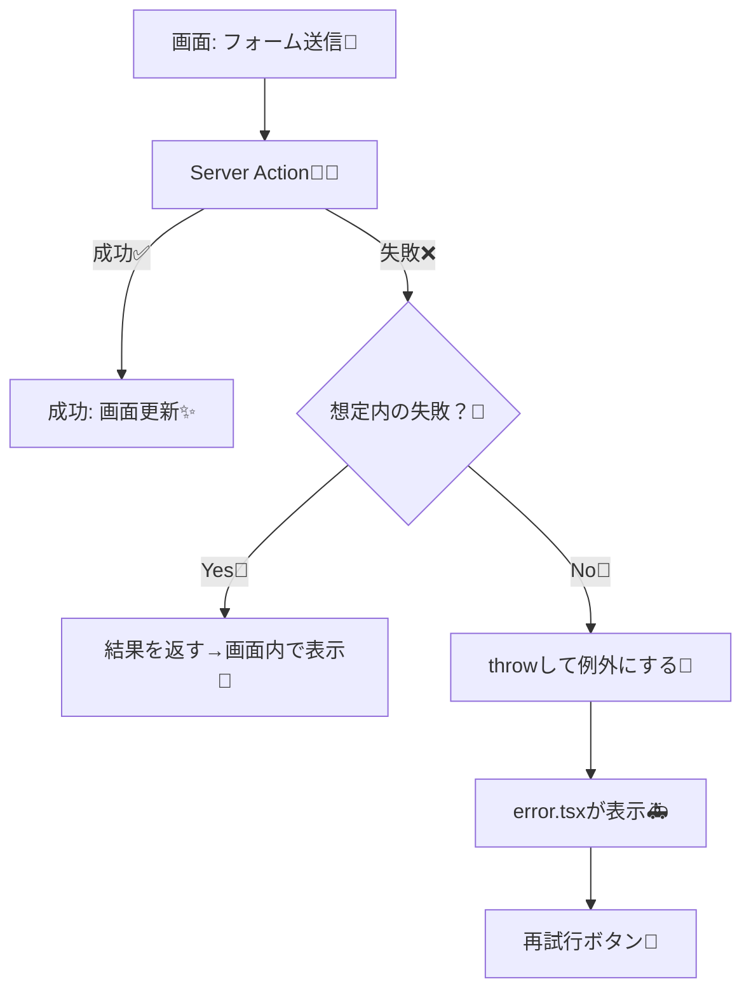

# 第172章：エラー設計：DB失敗時の見せ方🧯

DBって、たま〜に失敗します🥲（通信が不安定、制約に引っかかる、タイミング問題など）
だからこの章では「失敗してもアプリが“優しく”ふるまう」設計を作っていくよ〜☺️🌸

---

## 1) この章のゴール🎯✨

* DBエラーを **「想定内」** と **「想定外」** に分ける🧠
* ユーザーには **分かりやすい言葉** だけ見せる🫶
* 開発者は **ログで原因が追える** ようにする🔍📝
* 画面は **落ちずに**（または落ちても丁寧に）案内できるようにする🚪✨

---

## 2) まず結論：エラーは2種類に分けるのが最強💪🧊

* **想定内（ユーザー操作で起きがち）**
  例）同じメールで登録しちゃった、必須項目が空、対象データがもう消えてた
  → これは **画面内でメッセージ表示** が正解🙂💬

* **想定外（バグ/障害/環境問題っぽい）**
  例）DB接続が落ちた、コードの想定漏れ、予期しない例外
  → これは **error.tsx に任せて“ごめんね案内”** が正解🙇‍♀️🧯

---

## 3) 図解：エラーの流れ（おすすめ設計）🗺️✨




---

## 4) パターンA：想定内は「結果を返す」方式で優しく表示🫶💬

### ✅ ねらい

* 画面を落とさず
* その場で「どうすればいいか」を伝える🌸

### 4-1) 返す結果の型を決める📦✨

```ts
// app/_types/actionResult.ts
export type ActionResult =
  | { ok: true }
  | { ok: false; message: string; field?: string };
```

### 4-2) Prismaエラーを“人間の言葉”に変換する関数を作る🪄

```ts
// app/_lib/dbErrorToMessage.ts
export function dbErrorToMessage(err: unknown): { message: string; field?: string } {
  // Prismaのエラーは種類がいくつかあるけど、
  // ここでは「よくあるのだけ丁寧に」拾う方針にするよ🙂

  // 型が合わない環境もあるので、まずは安全に any で見る
  const e = err as any;

  // 例: Prismaのユニーク制約違反（同じ値を2回入れようとした）
  // code は P2002 のことが多い
  if (e?.code === "P2002") {
    const target = Array.isArray(e?.meta?.target) ? e.meta.target.join(",") : "";
    // target が "email" なら「そのメールは使われてます」みたいにできる✨
    if (target.includes("email")) {
      return { message: "そのメールアドレスはもう使われてるみたい🥲 別のメールで試してね📩", field: "email" };
    }
    return { message: "同じ内容がすでに登録されてるみたい🥲 内容を変えて試してね✨" };
  }

  // 例: データが見つからない（更新対象が消えてた等）
  // Prismaではケースによってコードが異なるので、雑にメッセージだけ用意
  if (String(e?.message ?? "").toLowerCase().includes("record") && String(e?.message ?? "").toLowerCase().includes("not found")) {
    return { message: "ごめんね🥲 そのデータが見つからなかったよ（更新の前に消えちゃったかも）" };
  }

  // それ以外は想定外寄り：ここでは“想定内メッセージ”としては扱わない
  // 呼び出し側で throw するかどうか決めよう🧯
  return { message: "DBの処理でうまくいかなかったみたい🥲 もう一回ためしてね🔁" };
}
```

### 4-3) Server Actionで「想定内だけ result を返す」🧑‍🍳✨

例：TODO追加（同じタイトルはNG、みたいな想定）✍️📋

```ts
// app/todos/actions.ts
"use server";

import { prisma } from "@/app/_lib/prisma";
import type { ActionResult } from "@/app/_types/actionResult";
import { dbErrorToMessage } from "@/app/_lib/dbErrorToMessage";

export async function addTodoAction(_prev: ActionResult, formData: FormData): Promise<ActionResult> {
  const title = String(formData.get("title") ?? "").trim();

  if (!title) {
    return { ok: false, message: "タイトルが空っぽだよ〜🥲 何か入れてね✍️", field: "title" };
  }

  try {
    await prisma.todo.create({
      data: { title },
    });

    return { ok: true };
  } catch (err) {
    // まずログは出す（開発者向け）📝
    console.error("[addTodoAction] DB error:", err);

    // 想定内っぽいものはメッセージで返す🙂
    const msg = dbErrorToMessage(err);

    // ただし「これ想定外っぽい…」と思ったら throw して error.tsx に任せてもOK🧯
    // 今回は“返す方式”に寄せたいので、ここは返しちゃう！
    return { ok: false, message: msg.message, field: msg.field };
  }
}
```

---

## 5) 画面側：エラー文を“その場で”見せる🫶💡

`useActionState` で結果を受け取って表示するよ〜🙂✨

```tsx
// app/todos/page.tsx
"use client";

import { useActionState } from "react";
import type { ActionResult } from "@/app/_types/actionResult";
import { addTodoAction } from "./actions";

const initialState: ActionResult = { ok: true };

export default function TodosPage() {
  const [state, action, isPending] = useActionState(addTodoAction, initialState);

  return (
    <main style={{ padding: 16 }}>
      <h1>TODO 追加📋✨</h1>

      <form action={action} style={{ display: "grid", gap: 8, maxWidth: 420 }}>
        <input
          name="title"
          placeholder="例：レポート出す📚"
          aria-invalid={state.ok ? undefined : true}
          style={{ padding: 10, borderRadius: 8, border: "1px solid #ccc" }}
        />

        <button disabled={isPending} style={{ padding: 10, borderRadius: 8 }}>
          {isPending ? "追加中…⏳" : "追加する➕"}
        </button>

        {!state.ok && (
          <p role="alert" style={{ margin: 0 }}>
            {state.message} 🧯
          </p>
        )}

        {state.ok && <p style={{ margin: 0 }}>うまくいったらここは静か☺️🌸</p>}
      </form>
    </main>
  );
}
```

ポイント🌟

* `role="alert"` を付けると、アクセシビリティ的にも親切になりやすいよ🧑‍🦽✨
* `isPending` で二重送信もしにくくなるよ🔁🚫

---

## 6) パターンB：想定外は throw → error.tsx で“ごめんね案内”🧯🚑

「これは利用者に説明しても直せない…🥲」ってときは、**画面を統一して**案内するのが◎

### 6-1) Server Actionで想定外は throw する例🔥

```ts
// app/todos/actions.ts（イメージ）
"use server";

import { prisma } from "@/app/_lib/prisma";
import type { ActionResult } from "@/app/_types/actionResult";

export async function dangerousAction(_prev: ActionResult, formData: FormData): Promise<ActionResult> {
  try {
    // なんか重要なDB処理…
    await prisma.todo.create({ data: { title: "x" } });
    return { ok: true };
  } catch (err) {
    console.error("[dangerousAction] DB error:", err);
    // 想定外は error.tsx へ
    throw new Error("DB処理に失敗しました");
  }
}
```

### 6-2) error.tsx（“その区間”の共通エラー画面）🧯✨

```tsx
// app/todos/error.tsx
"use client";

export default function ErrorPage({
  error,
  reset,
}: {
  error: Error & { digest?: string };
  reset: () => void;
}) {
  return (
    <main style={{ padding: 16 }}>
      <h2>ごめんね🥲 うまく表示できなかったよ</h2>
      <p>一時的な不具合かも…！下のボタンでもう一回ためしてみてね🔁✨</p>

      <button onClick={reset} style={{ padding: 10, borderRadius: 8 }}>
        再試行する🔁
      </button>

      <details style={{ marginTop: 16 }}>
        <summary>開発用メモ（本番では隠すのが安心）🛡️</summary>
        <pre style={{ whiteSpace: "pre-wrap" }}>{error.message}</pre>
      </details>
    </main>
  );
}
```

> 本番では `details` の“中身”は出しすぎ注意だよ⚠️（内部情報を見せない）🛡️

---

## 7) 「見せ方」テンプレ：こう言うと優しい🥹💗

* ❌「P2002 Unique constraint failed」←意味不明＆こわい😱

* ✅「そのメールはもう使われてるみたい🥲 別のメールで試してね📩」

* ❌「Internal Server Error」←冷たい🥶

* ✅「ごめんね🥲 うまくいかなかったよ。時間をおいてもう一回試してね🔁」

---

## 8) 仕上げチェックリスト✅🎀

* [ ] 想定内エラーは **結果を返して画面内表示** できてる？💬
* [ ] 想定外エラーは **throw → error.tsx** に流せてる？🧯
* [ ] **内部エラーの詳細をユーザーに出しすぎてない？**🛡️
* [ ] `console.error` などで **原因を追えるログ** がある？📝
* [ ] 送信中は `isPending` で **二重送信しにくい**？🔁🚫

---

ここまでできたら、DBが失敗しても「優しいアプリ」になっててめちゃ強いよ〜☺️💪🌸
