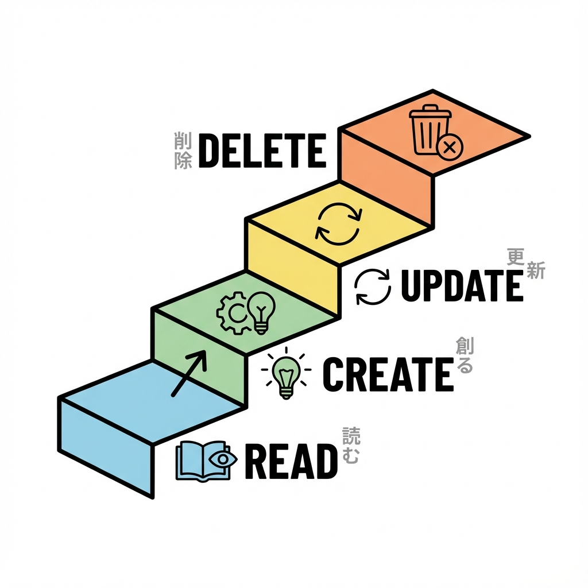
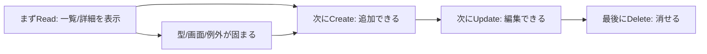
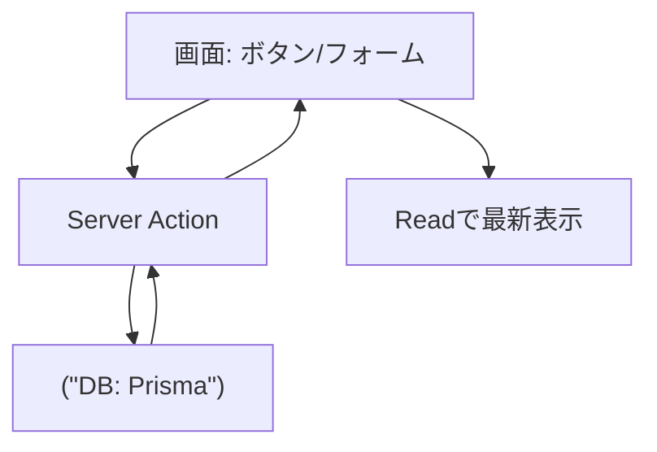

# 第173章：復習：CRUDは“順番”が大事（R→C→U→D）🧠

CRUDって「作る・読む・更新・削除」だけど、**作る順番**を間違えると一気に迷子になります😵‍💫
この章は「**R → C → U → D** の順に作ると、ほぼ詰まらないよ🙆‍♀️」っていう復習だよ〜！🌸

---

## なんで R（Read）から作るの？📖💡

**Read（読む）**ができると…

* どんなデータが必要か決まる（型が固まる）🧩
* 画面の完成形が見える（UIのゴールが見える）👀
* 次の Create/Update/Delete を足しても壊れにくい🏗️

逆に、いきなり Create から始めると…

* 「作ったけど表示できない…」で詰まる😭
* どの形で保存すべきか分からなくなる🌀
* 画面の設計がブレる🫠

---

## 図解：開発の“正しい順番”🗺️✨（R→C→U→D）

---

## まず「R」で固める3点セット📌👀

Read を作るときは、ここをセットで揃えるのがコツだよ🫶

### ① どのデータを読む？（例：Todo）

* `id`
* `title`
* `completed`
* `createdAt`（必要なら）

### ② どこで読む？（Server側で読む）

* DBアクセスは **Server側**に寄せる（基本）🧊

### ③ 読めなかったらどうする？（空/エラー）

* 0件のとき「まだ何もないよ〜」表示😊
* DBエラー時の表示（やさしい文言）🧯

---

## 次に「C」：追加は“Readが動いてから”➕✨

Create を足すときの合言葉はこれ👇
**「追加したら、一覧が更新される？」** 👀🔁

* 追加自体が成功しても、**画面が更新されない**と「できてない？」ってなる😢
* だから「追加後に一覧更新」までを1セットにするよ✅

---

## 次に「U」：更新は“対象の特定”が命✏️🧩

Update は、必ずここが必要👇

* **どのデータを更新するの？（id）** 🆔
* **どの項目を更新するの？（titleだけ？ completedだけ？）** 🎛️
* **失敗したら元に戻す？メッセージ出す？** 🧯

やりがち事故💥

* idを渡してなくて「全部更新」みたいなバグ（怖い）😱
* UIだけ変えてDBが変わってない（リロードで戻る）🫠

---

## 最後に「D」：削除は“ユーザー体験”が9割🗑️💭

Delete は実装自体は短いけど、体験が大事☺️

* 「本当に消す？」確認（誤爆防止）🧨➡️🛑
* 失敗したら「ごめんね、もう一回試してね」🫶
* 削除後に一覧から消える（更新）🔁

---

## 図解：CRUDのデータの流れ（超ざっくり）📦➡️🗃️➡️🖥️

---

## ありがちな“詰まりポイント”チェックリスト✅😵‍💫

* ✅ ReadがないのにCreateを作って「どこで確認？」になる
* ✅ Createしたのに一覧が更新されず「反映されない…」になる
* ✅ Updateで id を渡し忘れて「更新できない」
* ✅ Delete後に画面から消えず「消えたか分からない」
* ✅ エラー時の表示がなくて「無反応」に見える

このへん、R→C→U→D順で作ると自然に潰せるよ〜💪✨

---

## ミニ課題（復習）🎯🌸

TODOアプリを想定して、次の順番で「動く状態」を確認してね😊

1. **R**：一覧が表示される（0件でもOK）📖
2. **C**：追加できて、追加後に一覧に出る➕
3. **U**：`completed` を切り替えられて、リロードしても保持✏️
4. **D**：削除できて、一覧から消える🗑️

できたら勝ち〜！🎉✨

---

## まとめ🧠✨

* CRUDは **R→C→U→D** の順が最強📖➕✏️🗑️
* **Readで型・画面・例外**が固まるから、あとがラク😊
* Create/Update/Delete は「成功したら表示が更新される？」までセット🔁

次の章（ミニ課題）で、ここを“全部つながった状態”にして完成させようね〜！🌸🚀
