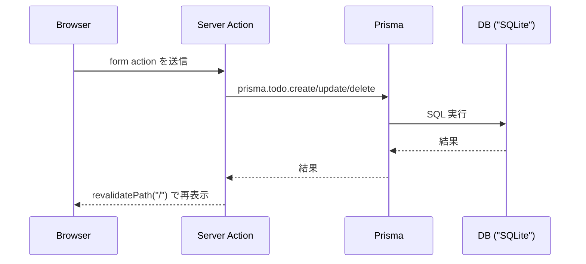
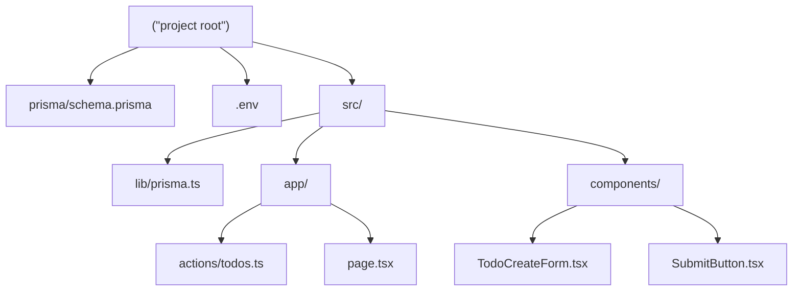
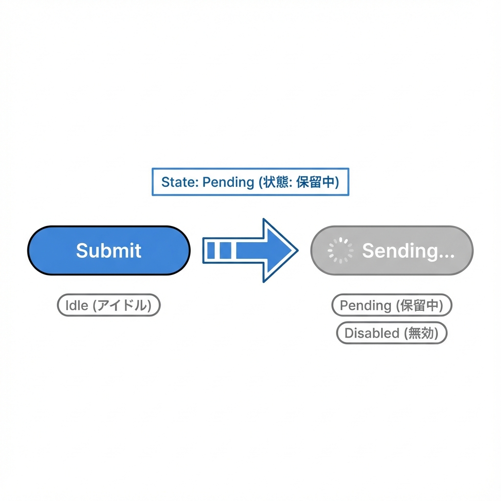

# 第174章：ミニ課題：DB付きTODO完成🎉

ここまで作ってきた「TODO」を **DB（Prisma）で永続化して、ちゃんと“完成”まで持っていく章**だよ〜！🫶✨
今日のゴールはこれ👇

* TODOを **DBに保存**できる📌
* **追加 / 更新 / 完了切り替え / 削除（CRUD）** が全部できる🔁
* 追加したらすぐ一覧が更新される（`revalidatePath`）🔄 ([Next.js][1])
* 送信中はボタンが「送信中…」になって安心（`useFormStatus`）⏳ ([React][2])
* エラーも優しく表示（`useActionState`）🧯 ([React][3])

---

## 完成イメージ（仕組みの流れ）🧠




Server Actionsでフォーム送信→サーバーでDB更新→`revalidatePath`で画面更新、が基本セットだよ✨ ([Next.js][4])

---

## まずは「完成形のファイル構成」📁



---

# 手順1：Prisma + SQLite を準備する🧰🗄️

まだ入れてない場合だけやってね👇（入ってたら次へGO！）

```powershell
npm i prisma @prisma/client
npx prisma init --datasource-provider sqlite
```

`.env` をこうする（SQLiteならこれでOK）👇

```env
DATABASE_URL="file:./dev.db"
```

---

# 手順2：`schema.prisma` を最小TODOモデルにする🧱

`prisma/schema.prisma`

```prisma
generator client {
  provider = "prisma-client-js"
}

datasource db {
  provider = "sqlite"
  url      = env("DATABASE_URL")
}

model Todo {
  id        String   @id @default(cuid())
  title     String
  done      Boolean  @default(false)
  createdAt DateTime @default(now())
  updatedAt DateTime @updatedAt
}
```

マイグレーション実行！🧾✨

```powershell
npx prisma migrate dev --name init
```

（DB中身を見たいときはこれ👇）

```powershell
npx prisma studio
```

PrismaをNext.jsで使う基本の流れは公式ガイドも参考になるよ🧠 ([Prisma][5])

---

# 手順3：PrismaClientを使い回す（開発中の多重接続対策）🧊

`src/lib/prisma.ts`

```ts
import { PrismaClient } from "@prisma/client";

const globalForPrisma = globalThis as unknown as {
  prisma?: PrismaClient;
};

export const prisma =
  globalForPrisma.prisma ??
  new PrismaClient({
    log: process.env.NODE_ENV === "development" ? ["error", "warn"] : ["error"],
  });

if (process.env.NODE_ENV !== "production") {
  globalForPrisma.prisma = prisma;
}
```

---

# 手順4：Server Actions（CRUD）を作る🚪✨

`src/app/actions/todos.ts`

```ts
"use server";

import { revalidatePath } from "next/cache";
import { prisma } from "@/lib/prisma";

export type ActionState = {
  ok: boolean;
  message?: string;
  error?: string;
};

export async function addTodo(
  _prevState: ActionState,
  formData: FormData
): Promise<ActionState> {
  const title = (formData.get("title") ?? "").toString().trim();

  if (!title) return { ok: false, error: "タイトルを入力してね🙏" };
  if (title.length > 50) return { ok: false, error: "50文字以内にしてね🙏" };

  await prisma.todo.create({ data: { title } });

  revalidatePath("/"); // 一覧を更新する🔄
  return { ok: true, message: "追加したよ🎉" };
}

export async function updateTodo(formData: FormData) {
  const id = (formData.get("id") ?? "").toString();
  const title = (formData.get("title") ?? "").toString().trim();

  if (!id) throw new Error("Missing id");
  if (!title) return;

  await prisma.todo.update({
    where: { id },
    data: { title },
  });

  revalidatePath("/");
}

export async function toggleTodo(formData: FormData) {
  const id = (formData.get("id") ?? "").toString();
  const nextDone = (formData.get("nextDone") ?? "false").toString() === "true";

  if (!id) throw new Error("Missing id");

  await prisma.todo.update({
    where: { id },
    data: { done: nextDone },
  });

  revalidatePath("/");
}

export async function deleteTodo(formData: FormData) {
  const id = (formData.get("id") ?? "").toString();
  if (!id) throw new Error("Missing id");

  await prisma.todo.delete({ where: { id } });

  revalidatePath("/");
}
```

`revalidatePath`は、更新後にページのキャッシュを無効化して再表示してくれるやつだよ🔁 ([Next.js][1])

---

# 手順5：送信中ボタン（`useFormStatus`）を作る⏳🧷




`src/components/SubmitButton.tsx`

```tsx
"use client";

import * as React from "react";
import { useFormStatus } from "react-dom";

export default function SubmitButton({
  children,
}: {
  children: React.ReactNode;
}) {
  const { pending } = useFormStatus();

  return (
    <button type="submit" disabled={pending}>
      {pending ? "送信中…⏳" : children}
    </button>
  );
}
```

`useFormStatus`は「いま送信中？」をフォーム内の部品で知れる便利フックだよ〜！ ([React][2])

---

# 手順6：追加フォーム（`useActionState`でエラー表示）🧯💕

`src/components/TodoCreateForm.tsx`

```tsx
"use client";

import { useActionState } from "react";
import SubmitButton from "@/components/SubmitButton";
import { addTodo, type ActionState } from "@/app/actions/todos";

const initialState: ActionState = { ok: true };

export default function TodoCreateForm() {
  const [state, formAction] = useActionState(addTodo, initialState);

  return (
    <div style={{ display: "grid", gap: 8 }}>
      <form action={formAction} style={{ display: "flex", gap: 8 }}>
        <input
          name="title"
          placeholder="やることを書く✍️"
          style={{ flex: 1, padding: 8 }}
        />
        <SubmitButton>追加➕</SubmitButton>
      </form>

      {state?.error && <p style={{ color: "crimson" }}>⚠️ {state.error}</p>}
      {state?.message && <p style={{ color: "green" }}>✅ {state.message}</p>}
    </div>
  );
}
```

`useActionState`はフォームの結果（成功/失敗）をいい感じに受け取ってUIに出せるよ🫶 ([React][3])

---

# 手順7：一覧ページを完成させる🏁✨

`src/app/page.tsx`

```tsx
import { prisma } from "@/lib/prisma";
import TodoCreateForm from "@/components/TodoCreateForm";
import SubmitButton from "@/components/SubmitButton";
import { deleteTodo, toggleTodo, updateTodo } from "@/app/actions/todos";

export default async function Page() {
  const todos = await prisma.todo.findMany({
    orderBy: { createdAt: "desc" },
  });

  const doneCount = todos.filter((t) => t.done).length;

  return (
    <main style={{ maxWidth: 760, margin: "40px auto", padding: 16 }}>
      <h1 style={{ fontSize: 28, marginBottom: 8 }}>DB付きTODO 🗃️✅</h1>
      <p style={{ marginTop: 0, opacity: 0.8 }}>
        合計 {todos.length} 件 / 完了 {doneCount} 件 🎯
      </p>

      <section style={{ marginTop: 16 }}>
        <TodoCreateForm />
      </section>

      <hr style={{ margin: "24px 0" }} />

      {todos.length === 0 ? (
        <p>まだTODOがないよ〜！まずは1個つくってみよ🫶✨</p>
      ) : (
        <ul style={{ listStyle: "none", padding: 0, display: "grid", gap: 12 }}>
          {todos.map((todo) => (
            <li
              key={todo.id}
              style={{
                border: "1px solid #ddd",
                borderRadius: 12,
                padding: 12,
                display: "grid",
                gap: 10,
              }}
            >
              <form action={updateTodo} style={{ display: "flex", gap: 8 }}>
                <input type="hidden" name="id" value={todo.id} />
                <input
                  name="title"
                  defaultValue={todo.title}
                  style={{
                    flex: 1,
                    padding: 8,
                    textDecoration: todo.done ? "line-through" : "none",
                    opacity: todo.done ? 0.6 : 1,
                  }}
                />
                <SubmitButton>保存💾</SubmitButton>
              </form>

              <div style={{ display: "flex", gap: 8, flexWrap: "wrap" }}>
                <form action={toggleTodo}>
                  <input type="hidden" name="id" value={todo.id} />
                  <input
                    type="hidden"
                    name="nextDone"
                    value={String(!todo.done)}
                  />
                  <button type="submit">
                    {todo.done ? "未完に戻す↩️" : "完了✅"}
                  </button>
                </form>

                <form action={deleteTodo}>
                  <input type="hidden" name="id" value={todo.id} />
                  <button type="submit">削除🗑️</button>
                </form>
              </div>
            </li>
          ))}
        </ul>
      )}
    </main>
  );
}
```

---

## 動作確認チェック✅✅✅

1. 起動

   ```powershell
   npm run dev
   ```

2. ブラウザで

   * 追加➕ → 一覧に出る
   * タイトル編集して保存💾 → 反映される
   * 完了✅ / 未完↩️ → 切り替わる
   * 削除🗑️ → 消える

全部できたら **DB付きTODO完成🎉**！

---

# よくある詰まりポイント集🧯🪤

* **`@prisma/client` が見つからない**
  → 生成が走ってないかも。これを実行👇

  ```powershell
  npx prisma generate
  ```

* **`.env` を変えたのに反映されない**
  → devサーバ再起動が早い！🔁（Ctrl+C → `npm run dev`）

* **追加したのに一覧が更新されない**
  → `revalidatePath("/")` が入ってるか確認！🔄 ([Next.js][1])

* **Server Actionsのフォーム周りが不安**
  → Next.jsのフォームガイドに “この形” が載ってるよ📚 ([Next.js][4])

---

# 仕上げのプチ課題（やると一気に“作品感”出る）🌸✨

* 🔥 削除前に「ほんとに消す？」確認を入れる（`confirm()`）
* 🧹 完了したTODOを「一括削除」ボタンで消す
* 🔍 「未完だけ表示」フィルタをつける
* ✨ `useOptimistic` で“先に増えたように見せる”体験（余裕あれば） ([React][6])

---

次の章（第175章）からは「ログイン（認証）」に入るよ🔐✨
このTODOが **“誰のTODOなの？”** って話になって、めちゃくちゃ面白くなるところ！😆

[1]: https://nextjs.org/docs/app/api-reference/functions/revalidatePath?utm_source=chatgpt.com "Functions: revalidatePath"
[2]: https://react.dev/reference/react-dom/hooks/useFormStatus?utm_source=chatgpt.com "useFormStatus"
[3]: https://react.dev/reference/react/useActionState?utm_source=chatgpt.com "useActionState"
[4]: https://nextjs.org/docs/app/guides/forms?utm_source=chatgpt.com "How to create forms with Server Actions"
[5]: https://www.prisma.io/docs/guides/nextjs?utm_source=chatgpt.com "How to use Prisma ORM and Prisma Postgres with Next.js"
[6]: https://react.dev/blog/2024/12/05/react-19?utm_source=chatgpt.com "React v19"
