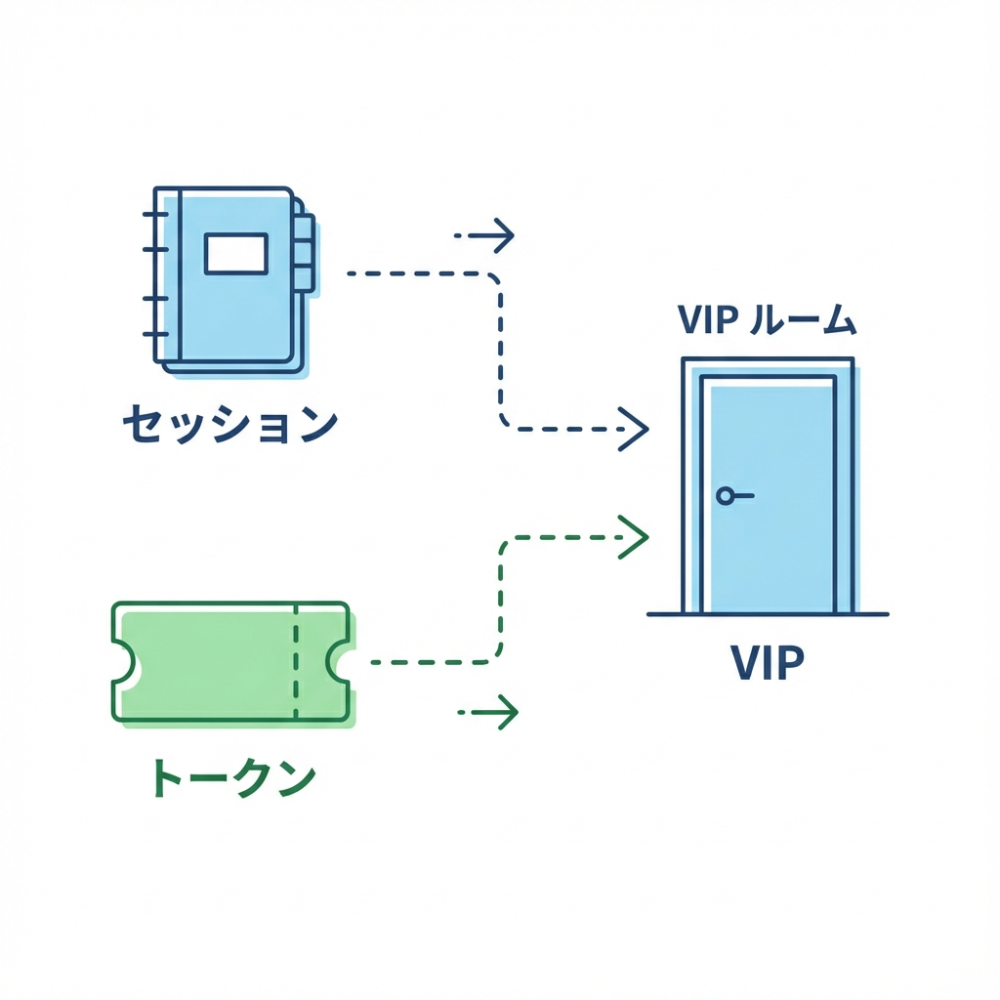
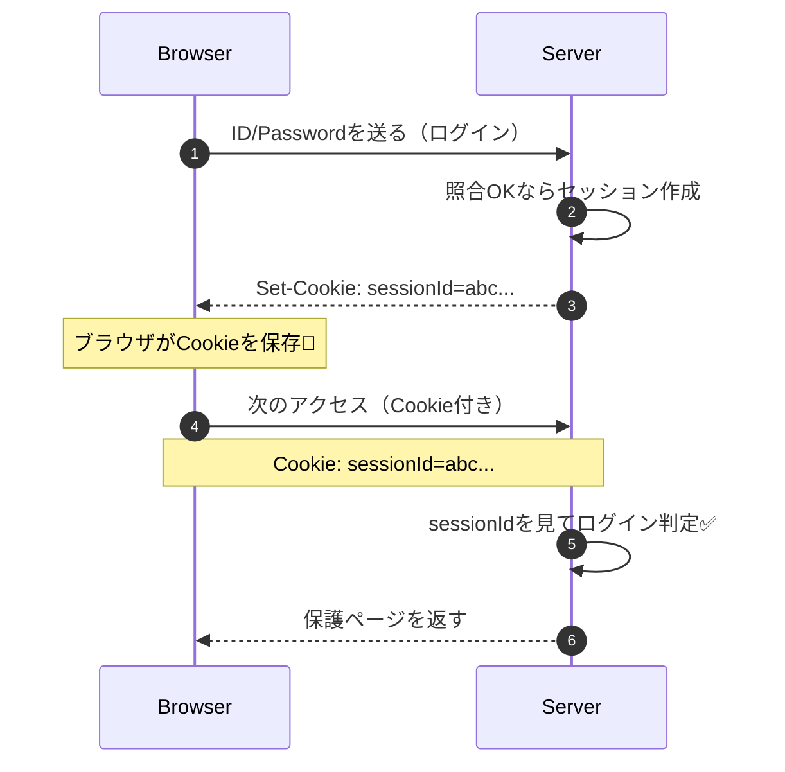
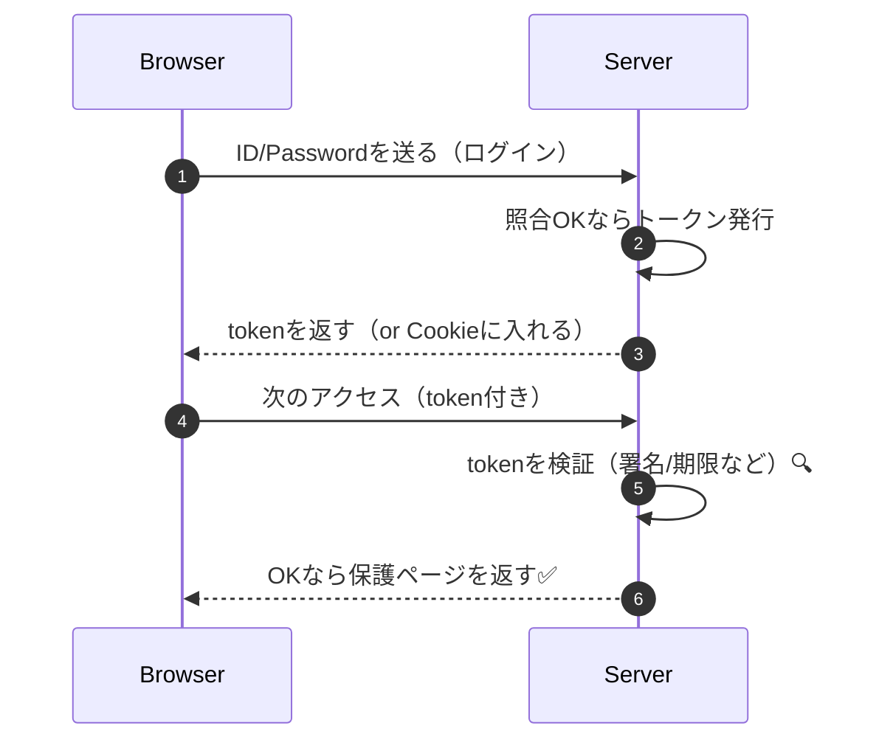
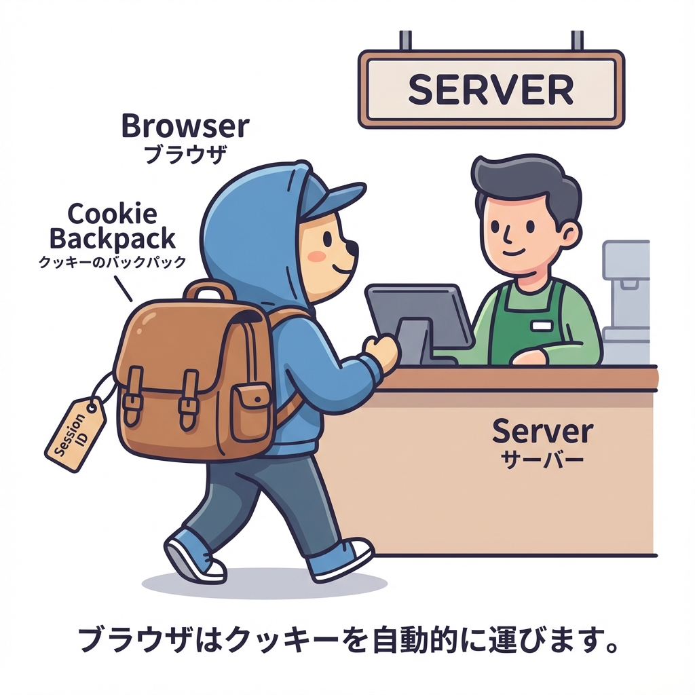

# 第175章：ログインって裏で何してる？（セッション/トークン）🧠

ログインって「IDとパスワードを入力して終わり」じゃなくて、裏では **“この人は本人だよ” を覚える仕組み**が動いてるよ〜！😊✨
この章は、認証の導入（Auth.jsなど）に入る前の **超重要な下地**です🧱🔐

---

## この章でわかること🎯

* ログインの正体は「本人確認」＋「本人だと覚える」こと🙆‍♀️
* “覚え方”には2大方式がある

  * **セッション方式**（サーバーが覚える）🧠🏢
  * **トークン方式**（クライアントが持つ）🎫📱
* Cookieって何？ログインとどう関係？🍪

---

## まず結論：ログインは「入館証を発行する」こと🎫✨

ログイン画面でパスワードを確認したら、次に必要なのはこれ👇

> **次のページに移動しても「この人ログイン済みだよ」って判定できること**

毎回パスワードを聞くのはダルいし危ないからね🥹💦
だから **“入館証”** を作って、それを次のリクエスト以降も見せてもらう仕組みになるよ〜！🎟️

---

## 2つの方式：セッション vs トークン🆚

### ✅ 方式①：セッション方式（サーバーが覚える）🧠🏢

* ログイン成功 → サーバーが「セッションID」を発行🪪
* ブラウザは **Cookie** にセッションIDを保存🍪
* 次のアクセスで Cookie を送る → サーバーが「ログイン済みだね！」って確認✅

**イメージ：会員カード番号だけ渡して、お店の台帳で本人確認する感じ📒✨**

---

### ✅ 方式②：トークン方式（クライアントが持つ）🎫📱

* ログイン成功 → サーバーが「トークン」を発行🎫
* ブラウザがトークンを保持（CookieやStorageなど）🧳
* 次のアクセスでトークンを送る → サーバーが検証してOKならログイン扱い✅

**イメージ：入館証そのものを持ち歩いて、提示して通る感じ🎟️🚪**

---

## 図解：セッション方式の流れ🍪🧠（超ざっくり）





---

## 図解：トークン方式の流れ🎫🔍（超ざっくり）



---

## Cookieってなに？ログインと何が関係？🍪




Cookieは、ざっくり言うと…

> **ブラウザが自動で“リクエストにくっつけて送ってくれるメモ”** 📝➡️📨

だからログインでよく使うのは「次も本人だってわかるメモ」を自動で送ってほしいからだよ😊🍪

### ログインCookieでよく見る属性（超大事）🔐

* **HttpOnly**：JavaScriptから読めない（XSS対策）🛡️
* **Secure**：HTTPSのときだけ送る🔒
* **SameSite**：他サイトから勝手に送られにくくする（CSRF対策に関係）🍪🚫

---

## どっちを使えばいいの？（最初の判断）🎛️

迷ったらまずこれでOK🙆‍♀️✨

* **Webアプリ（ブラウザ中心）**で、普通にログイン状態を扱いたい
  → **セッション or Cookieベース**が分かりやすい🍪🧠
* **モバイルアプリ / 外部API / 別ドメイン連携**が多い
  → **トークン**が便利な場面が増える🎫📱

※ Next.js の認証ライブラリ（Auth.js系）も、最終的にはこの2方式の考え方をうまく使ってるよ〜😊

---

## ミニ体験：セッション方式を“雰囲気で”作ってみる🧪🍪（学習用）

ここでは本物の認証ではなく、**仕組みだけ**を体験するよ！✨
（※ メモリに保存するから、サーバー再起動で消えるよ🥹 本番ではDB/Redisなどを使うよ）

### 作るもの🧰

* `POST /api/login`：セッションIDをCookieに入れる🍪
* `GET /api/me`：Cookieがあれば「ログイン中だよ」を返す😊

---

### 1) `app/api/login/route.ts` を作る📁

```ts
// app/api/login/route.ts
import { NextResponse } from "next/server";

const sessions = new Map<string, { name: string }>();

export async function POST(req: Request) {
  const body = await req.json().catch(() => null);

  // 学習用：ID/PWの代わりに name があればOKにする（雑でOK😂）
  const name = body?.name;
  if (!name || typeof name !== "string") {
    return NextResponse.json({ ok: false, message: "nameが必要だよ🙏" }, { status: 400 });
  }

  const sessionId = crypto.randomUUID();
  sessions.set(sessionId, { name });

  const res = NextResponse.json({ ok: true });

  // CookieにセッションIDを保存🍪
  res.cookies.set({
    name: "sessionId",
    value: sessionId,
    httpOnly: true,
    sameSite: "lax",
    path: "/",
  });

  return res;
}

// 重要：学習用に /api/me からも参照したいので export（本番は別管理が多い）
export { sessions };
```

---

### 2) `app/api/me/route.ts` を作る📁

```ts
// app/api/me/route.ts
import { cookies } from "next/headers";
import { NextResponse } from "next/server";
import { sessions } from "../login/route";

export async function GET() {
  const cookieStore = await cookies();
  const sessionId = cookieStore.get("sessionId")?.value;

  if (!sessionId) {
    return NextResponse.json({ ok: false, message: "未ログインだよ🙅‍♀️" }, { status: 401 });
  }

  const user = sessions.get(sessionId);
  if (!user) {
    return NextResponse.json({ ok: false, message: "セッション切れっぽい🥹" }, { status: 401 });
  }

  return NextResponse.json({ ok: true, user });
}
```

---

### 3) 試すページ（超ミニ）を作る📄✨

`app/auth-demo/page.tsx`

```tsx
// app/auth-demo/page.tsx
"use client";

import { useState } from "react";

export default function AuthDemoPage() {
  const [name, setName] = useState("Aki");
  const [msg, setMsg] = useState("");

  async function login() {
    setMsg("ログイン中…⏳");
    const res = await fetch("/api/login", {
      method: "POST",
      headers: { "Content-Type": "application/json" },
      body: JSON.stringify({ name }),
    });
    setMsg(res.ok ? "ログインOK🎉（CookieにsessionId入ったよ🍪）" : "ログイン失敗😭");
  }

  async function me() {
    setMsg("確認中…👀");
    const res = await fetch("/api/me");
    const data = await res.json().catch(() => ({}));
    setMsg(res.ok ? `ログイン中✅ こんにちは ${data.user?.name} さん😊` : `だめ🙅‍♀️ ${data.message ?? ""}`);
  }

  return (
    <main style={{ padding: 24 }}>
      <h1>ログイン裏側デモ🍪</h1>

      <div style={{ marginTop: 16 }}>
        <label>
          名前：
          <input
            value={name}
            onChange={(e) => setName(e.target.value)}
            style={{ marginLeft: 8, padding: 6 }}
          />
        </label>
      </div>

      <div style={{ marginTop: 12, display: "flex", gap: 8 }}>
        <button onClick={login} style={{ padding: "8px 12px" }}>
          ログインする🔑
        </button>
        <button onClick={me} style={{ padding: "8px 12px" }}>
          /api/me を叩く📨
        </button>
      </div>

      <p style={{ marginTop: 16 }}>{msg}</p>
    </main>
  );
}
```

---

### 4) 動かし方🚀

* `/auth-demo` を開く
* 「ログインする🔑」→ その後「/api/me を叩く📨」
* **Cookieが自動で送られる**から、ログイン中の表示になるよ😊🍪✨

---

## まとめ（ここ超大事！）📌

* ログインの本体は **「本人だと覚える仕組み」**🧠
* 覚え方は2つ

  * **セッション**：サーバーが覚える🧠
  * **トークン**：クライアントが持つ🎫
* Webだと **Cookie** がキーパーソン🍪🔑

---

## 小テスト（5秒でOK）⏱️💡

1. セッション方式では「誰が覚える」？🧠🏢
2. Cookieが便利なのは「何をしてくれる」から？🍪
3. HttpOnlyは「何から守る」ためが多い？🛡️

---

次の章（第176章）からは「じゃあNext.jsで認証って何を選ぶの？」って話に入っていけるよ〜！😊🔑✨
