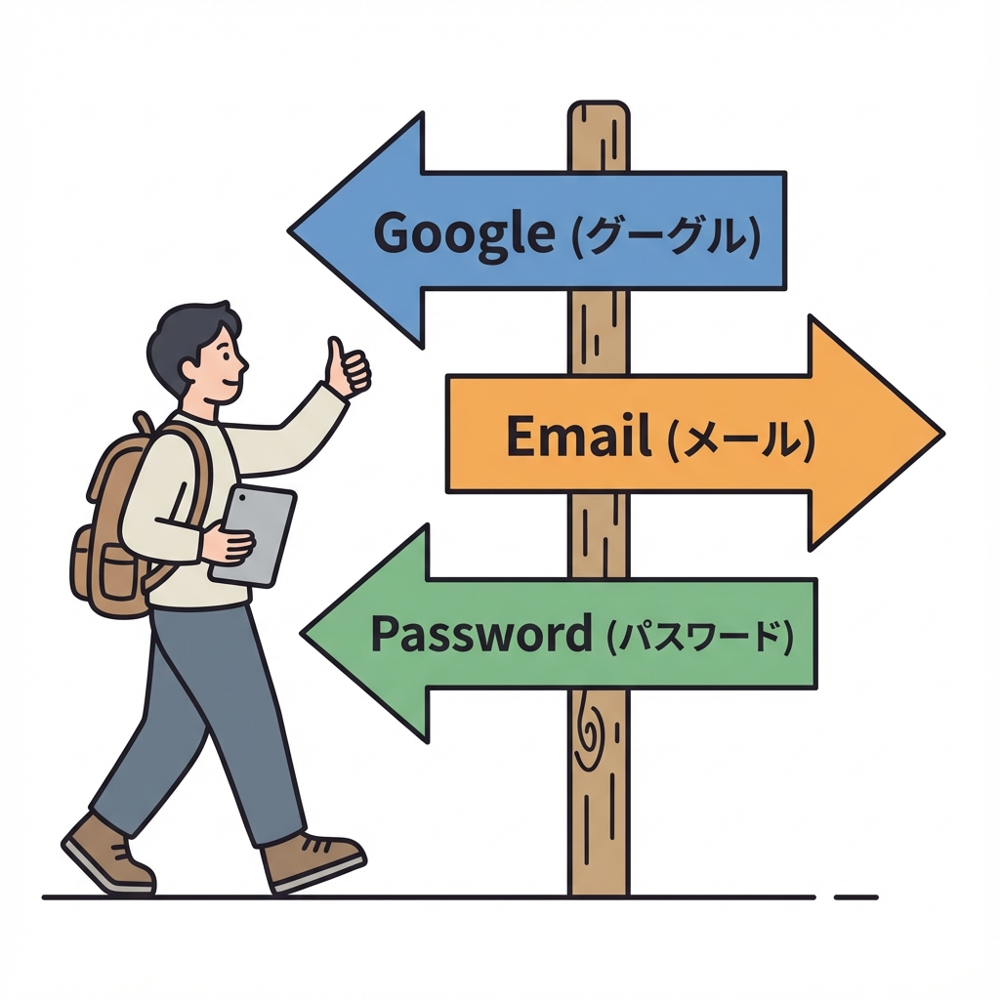
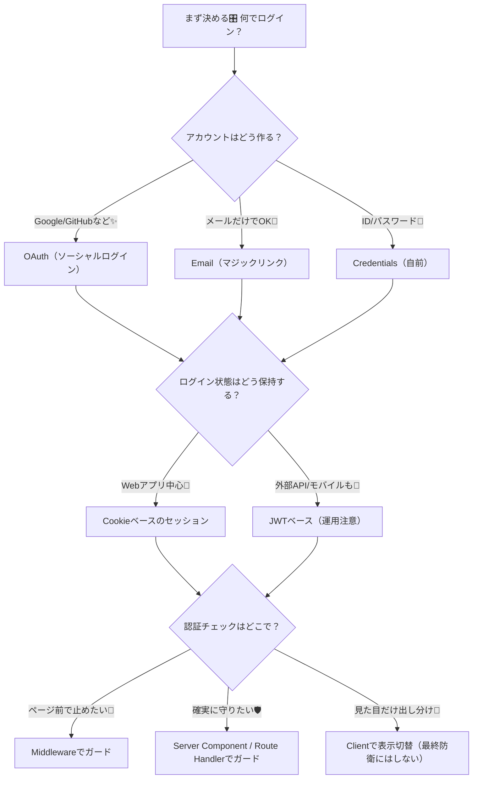
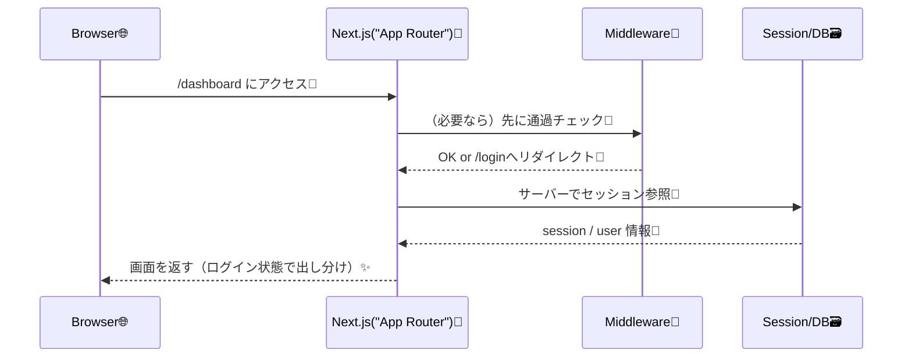

# 第176章：Next.jsの認証は“方式を選ぶ”から始まる🎛️

認証って、いきなりライブラリを入れる前に **「どの方式にする？」を決める** のが超大事だよ〜！🧠💡
先にここを決めると、後の実装がスルスル進む✨（逆に、ここがフワッとしてると迷子になりがち🥺）

---

## この章のゴール🏁✨

* 自分のアプリに合う「ログイン方式」を選べるようになる🎯
* 「セッション（ログイン状態）」の持ち方をイメージできる🍪🪪
* Next.js（App Router）で“どこで認証チェックするか”の全体像が分かる🗺️

---

## まずは認証を3つに分けて考えるよ🧩🧩🧩

Next.jsの公式ガイドでも、認証まわりは大きく **3つの概念** に分けて考えるのがコツって流れになってるよ📘✨。([Next.js][1])

1. **Authentication（本人確認）**：ログイン成功？失敗？👤
2. **Session Management（ログイン状態の保持）**：ログイン中をどう覚える？🍪
3. **Authorization（権限・保護）**：このページ入っていい人？🚪🛡️

この章はまず **①と②の「方式選び」** が主役だよ🎛️✨

---

## 方式選びで決めることは、だいたいこの2つ🎛️🔐

### A. 何でログインさせる？（ログイン手段）🧩

* **ソーシャルログイン（OAuth）**：Google / GitHub など✨
* **メール（マジックリンク）**：パスワードなしでメールからログイン📩
* **ID/パスワード（Credentials）**：王道だけど運用はちょい大変🔑

### B. ログイン状態（セッション）をどう持つ？🍪🪪

* **Cookieベースのセッション**（Webアプリと相性◎）🍪
* **JWTベース**（外部API/モバイル/別サービス連携が増えると出番）🪪

---

## 図解：認証方式の選び方フローチャート🎛️🗺️

---

## 代表的な「選択肢」4パターン（ざっくり）🎁✨

### ① Auth.js（NextAuth）系を使う（王道・Next.jsと相性◎）🧩✨

* 「プロバイダ（Google等）」と「セッション管理」をまとめて面倒みてくれる感じ🫶
* Next.jsの教材や公式Learnでも NextAuth.js を使う流れがあるよ📘✨。([Next.js][2])
* 最近のAuth.js（NextAuth v5系）だと、サーバー側で `auth()` みたいに呼べる設計が紹介されてるよ🧠🍪。([Auth.js][3])

こんな人におすすめ👇

* Webアプリ中心（まずは普通のログインを作りたい）😊
* App Routerで“サーバーで守る”設計に寄せたい🛡️

---

### ② 認証SaaS（Clerk/Auth0等）を使う（最速で完成）🚀✨

* UIや管理画面まで用意されてることが多い🪄
* とにかく早く「ログイン付きアプリ」を完成させたい時に強い💨
* ただし料金やロックイン、カスタム度も要チェック👛🔍

（例として、ClerkはApp Router向けの認証パターン解説も出してるよ📚）([Clerk][4])

---

### ③ BaaS（Firebase/Supabase等）の認証を使う（DBとセットで便利）🗃️✨

* 認証＋DB＋ストレージがセットで楽なことが多い🧰
* すでにそのBaaSを使う前提なら自然な選択👍

---

### ④ 自前実装（ユーザー/パスワード/ハッシュ/リセット等全部）🧱🫠

* 学びにはなるけど、**実運用だと地雷が多い**（パスワードリセット/二要素/攻撃対策…）💣
* “勉強として1回やる”ならOK、実案件は慎重に⚠️

---

## Cookieセッション vs JWT：超ざっくり比較🍪🪪

| 方式            | いいところ😊               | 気をつけどころ⚠️                                 | 向いてる      |
| ------------- | --------------------- | ----------------------------------------- | --------- |
| Cookieセッション🍪 | ブラウザと相性◎ / サーバーで守りやすい | Cookie設定（Secure/HttpOnly/SameSite）をちゃんとする | 普通のWebアプリ |
| JWT🪪         | 別サービス/モバイル連携しやすい      | 失効管理・漏えい時が大変になりがち                         | API連携多め   |

※JWTを使うとしても、**ブラウザで雑に保存（例：localStorage）**みたいなのは避けたい派が多いよ〜😵‍💫（攻撃面が増える）

---

## App Routerだと「サーバーで認証チェック」がやりやすい🛡️✨

App Routerはサーバーで動く部分が強いから、
「ページ表示する前にサーバーで session を見て判断」しやすいのが魅力💎

Auth.js（NextAuth v5系）だと、サーバー側で `auth()` でセッションを取る例が公式にあるよ🍪✨。([Auth.js][5])

---

## 図解：リクエスト時の“認証チェック位置”イメージ📨🛡️

---

## ミニ演習🎒✨：「あなたならどれを選ぶ？」（答え例つき）

### お題：学内サークルのイベント管理アプリ🎀

* メンバーだけがイベントを作れる📝
* 一般の人は閲覧だけ👀
* ログインはGoogleでOK（学校アカウント想定）🏫✨
* まずはWebだけで運用📱💻

✅おすすめの選び方（例）

* ログイン手段：**OAuth（Google）**✨
* セッション：**Cookieベース**🍪（Web中心だし）
* 実装：**Auth.js（NextAuth）**でまとめて管理🧩（導入イメージは次章！）

---

## 方式選びチェックリスト✅✨（これだけ決めれば迷い激減）

* ログインは **何で** やる？（OAuth/メール/IDPW）🔑📩✨
* ログイン状態は **Cookieセッション or JWT**？🍪🪪
* 守りたい場所はどこ？（ページ/API/特定ルート）🚪🛡️
* DBは使う？（セッションやユーザー情報を置く？）🗃️
* “最初はWebだけ？” “将来モバイル/外部API？”📱🔁

---

## 次章につながる一言🌸

方式が決まったら、次はいよいよ **Auth.js（NextAuth）導入の全体像** に入っていくよ〜！🧩🚀（第177章）

※あと、Next.jsはセキュリティ修正がちょこちょこ入るので、依存関係アップデートの習慣も大事だよ🛡️🔁。([Next.js][6])

[1]: https://nextjs.org/docs/app/guides/authentication?utm_source=chatgpt.com "Guides: Authentication"
[2]: https://nextjs.org/learn/dashboard-app/adding-authentication?utm_source=chatgpt.com "App Router: Adding Authentication"
[3]: https://authjs.dev/getting-started/session-management/get-session?utm_source=chatgpt.com "Get Session"
[4]: https://clerk.com/articles/complete-authentication-guide-for-nextjs-app-router?utm_source=chatgpt.com "Complete Authentication Guide for Next.js App Router in ..."
[5]: https://authjs.dev/getting-started/session-management/protecting?utm_source=chatgpt.com "Protecting Resources"
[6]: https://nextjs.org/support-policy?utm_source=chatgpt.com "Support Policy"
