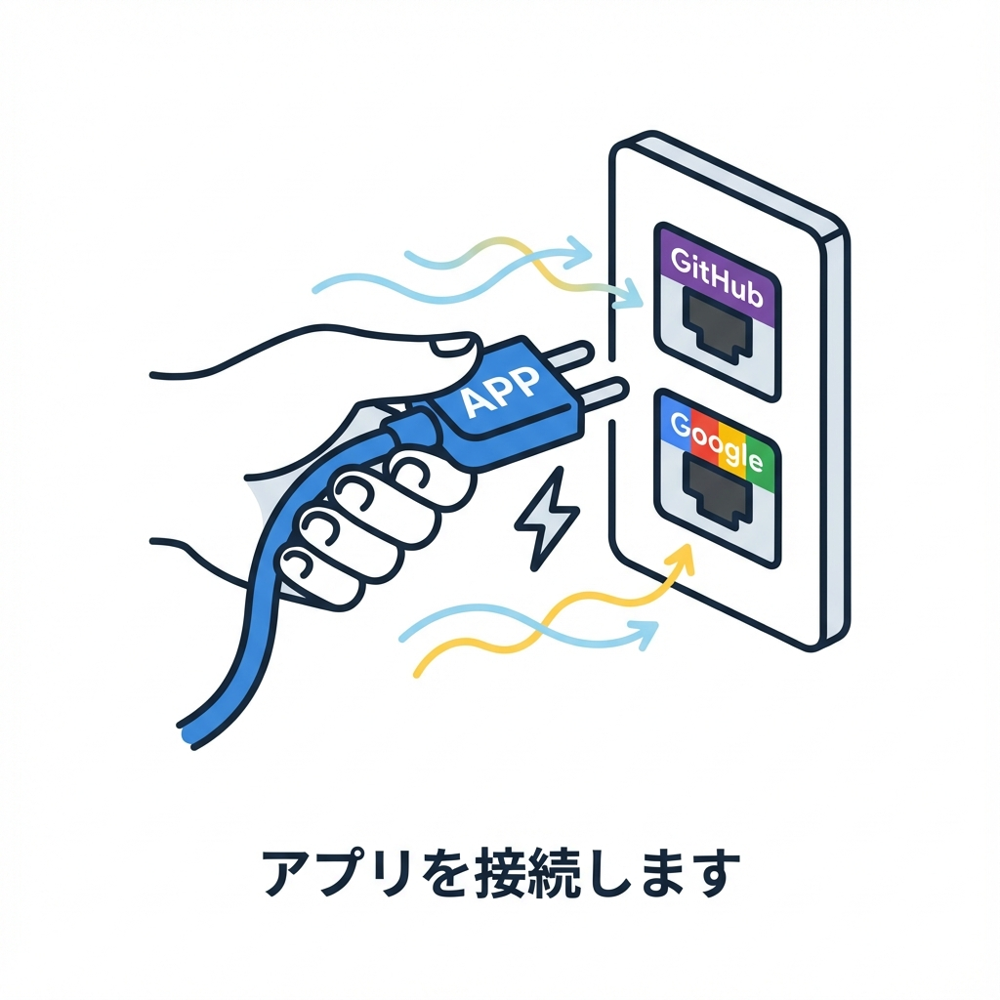
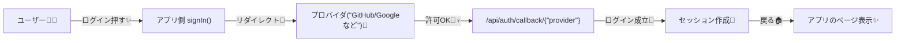

# 第177章：Auth.js系の導入イメージ（プロバイダ）🧩

この章は「まず全体像をつかむ回」だよ〜☺️🌸
Auth.js（Next.js だと `next-auth` パッケージ）でいちばん最初に決めるのが **「どのプロバイダでログインさせる？」** ってところ！🧠💡

---

## 1) 「プロバイダ」ってなに？🧃🌈

**プロバイダ（Provider）＝ログイン方法の種類**だよ🙌✨
たとえば…

* GitHubでログイン🐙
* Googleでログイン🔎
* メールのマジックリンクでログイン📩
* ID/パスワード（Credentials）でログイン🔐

Auth.js は、この「ログインの入口」を **providers 配列**に並べていくイメージ！🧩
（Next.js 向けの導入パターンとして `auth.ts` を作るのが推奨されてるよ）([authjs.dev][1])

---

## 2) ログインの流れ（OAuthプロバイダの雰囲気）🐙➡️🏠



GitHub/Google みたいな **OAuth系**だと、ざっくりこう！👇



ポイントはここ！💡

* プロバイダ側で「このアプリにログインしていい？」って確認が出る🙆‍♀️
* OKすると、**callback URL**（コールバックURL）に戻ってくる🏃‍♀️💨
* Next.js だと GitHub の callback は基本こんな形になるよ👇
  `https://example.com/api/auth/callback/github` ([authjs.dev][2])

---

## 3) Next.js（App Router）での“置き場所”イメージ📁✨

Auth.js（Next.js）では、まずこの2点セットを作るのが基本形！🧱

* `auth.ts`：設定本体（providers もここ）([authjs.dev][1])
* `app/api/auth/[...nextauth]/route.ts`：Auth.js にAPIを渡す“窓口”([authjs.dev][1])

例：こんな感じの構成になるよ〜👇

```txt
my-app/
  auth.ts
  app/
    api/
      auth/
        [...nextauth]/
          route.ts
```

---

## 4) 最小コードで「GitHubプロバイダ」を入れる🐙✨（導入イメージ）

### 4-1) インストール📦

Auth.js公式のインストール例（Next.js）はこんな感じ（現時点で `@beta` が案内されてる）([authjs.dev][1])

```bash
npm install next-auth@beta
```

### 4-2) `AUTH_SECRET` を作る🔐✨

Auth.js は **`AUTH_SECRET` が必須**で、CLIで作れるよ！([authjs.dev][1])

```bash
npx auth secret
```

（実行すると Next.js では `.env.local` に入る流れが一般的だよ📝）([authjs.dev][1])

### 4-3) `.env.local` を用意（GitHub用）🧪

GitHubプロバイダは環境変数がこの名前で案内されてるよ👇 ([authjs.dev][2])

```env
AUTH_SECRET="（npx auth secret で生成されたやつ）"
AUTH_GITHUB_ID="（GitHub OAuth App の Client ID）"
AUTH_GITHUB_SECRET="（GitHub OAuth App の Client Secret）"
```

※ v5系は **`AUTH_` プレフィックス推奨**で、`AUTH_GITHUB_ID` / `AUTH_GITHUB_SECRET` の形だと自動検出されるよ〜🙌 ([authjs.dev][3])

### 4-4) `auth.ts`（プロバイダを配列に入れる）🧩

「providers に GitHub を1個入れる」だけで、導入の形ができるよ！🐙✨ ([authjs.dev][1])

```ts
// auth.ts
import NextAuth from "next-auth"
import GitHub from "next-auth/providers/github"

export const { handlers, auth, signIn, signOut } = NextAuth({
  providers: [GitHub],
})
```

### 4-5) Route Handler（Auth.jsにAPIを渡す）🚪✨

ここが「/api/auth 以下を Auth.js に任せる窓口」だよ！([authjs.dev][1])

```ts
// app/api/auth/[...nextauth]/route.ts
import { handlers } from "@/auth"

export const { GET, POST } = handlers
```

---

## 5) GitHub側で設定する「Callback URL」ってどれ？🔁🐙

GitHubのOAuth設定で聞かれる **Callback URL** は、Next.jsだと基本これ👇 ([authjs.dev][2])

* ローカル：`http://localhost:3000/api/auth/callback/github`
* 本番：`https://あなたのドメイン/api/auth/callback/github`

ここがズレると、ログイン時にエラーになりやすいよ〜！🥺💦

---

## 6) 今日のまとめ（“プロバイダ回”のゴール）🎯✨

* **プロバイダ＝ログイン方法の種類**だよ🧩
* Next.js（App Router）では

  * `auth.ts` に providers を並べる🧠([authjs.dev][1])
  * `app/api/auth/[...nextauth]/route.ts` で GET/POST を渡す🚪([authjs.dev][1])
* OAuth系（GitHub等）は **Callback URL** が超だいじ🔁([authjs.dev][2])

これで「認証をアプリに生やすための土台イメージ」完成〜！🎉🥳✨

[1]: https://authjs.dev/getting-started/installation "Auth.js | Installation"
[2]: https://authjs.dev/getting-started/providers/github?utm_source=chatgpt.com "GitHub Provider"
[3]: https://authjs.dev/getting-started/migrating-to-v5?utm_source=chatgpt.com "Migrating to v5"
