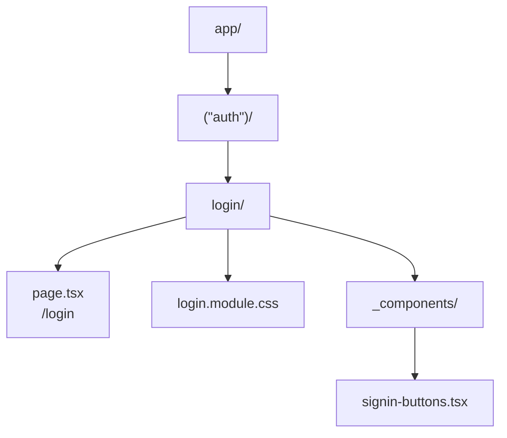
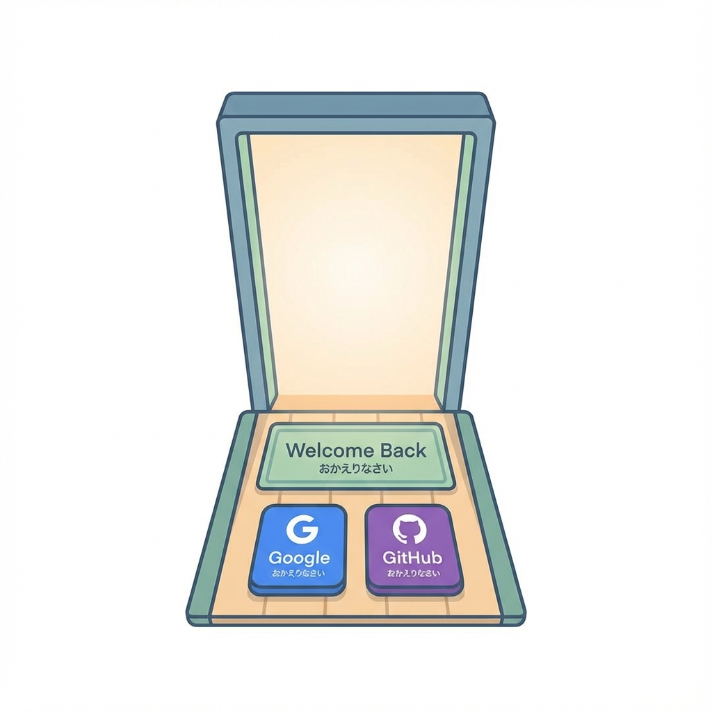
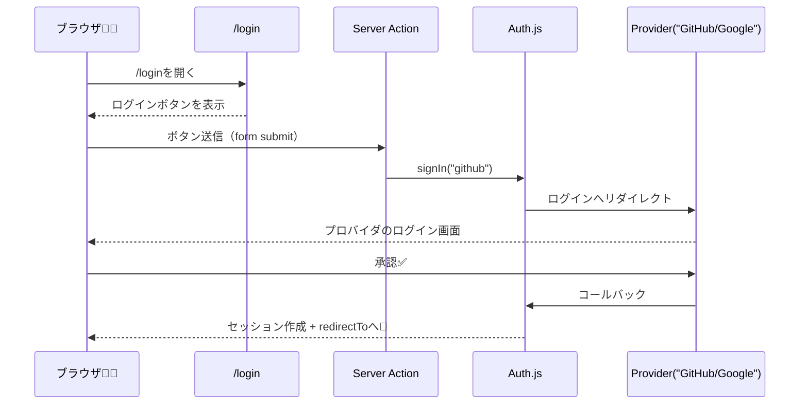

# 第178章：ログインページを作る📄

この章では、**`/login`（ログインページ）**を作って、ユーザーが迷わずログインできる入口を用意するよ〜😊🌸
Auth.js（NextAuth v5系）では、**「ログイン専用ページ」を自分で用意してOK**だよ 🙆‍♀️ ([Auth.js][1])

---

## 今日のゴール🎯✨

* `/login` にアクセスしたら、かわいいログイン画面が出る😍
* ボタンを押したら Auth.js の `signIn()` が動いてログインが始まる🚪➡️🔑 ([Auth.js][2])
* ログイン後は `/dashboard` などに移動できる（`redirectTo`）🔁✨ ([Auth.js][3])

---

## まずはフォルダ構成（Route Groupで整理）📦🧭

ログイン系は `(auth)` にまとめるとスッキリするよ〜！
`(auth)` は **URLに出ない整理用フォルダ**だから安心😊 ([Next.js][4])



---

## Step 1：ログインページを作る 🛠️📄

### ① `app/(auth)/login/page.tsx`

```tsx
import type { Metadata } from "next";
import Link from "next/link";
import styles from "./login.module.css";
import { SignInButtons } from "./_components/signin-buttons";

export const metadata: Metadata = {
  title: "ログイン",
};

export default function LoginPage() {
  return (
    <main className={styles.main}>
      <section className={styles.card}>
        <h1 className={styles.title}>ログイン🔑</h1>
        <p className={styles.subtitle}>続けるにはログインしてね😊✨</p>

        <SignInButtons />

        <p className={styles.back}>
          <Link href="/">← トップへ戻る</Link>
        </p>
      </section>
    </main>
  );
}
```

---

## Step 2：ログインボタン（Auth.jsの `signIn()`）を置く 🔘✨

Auth.js公式のおすすめは、**Server Action（`<form action={...}>`）**で `signIn()` を呼ぶ方法だよ〜！
これだと **`"use client"` なしでも動かせてラク**🥰 ([Auth.js][2])

### ② `app/(auth)/login/_components/signin-buttons.tsx`

```tsx
import { signIn } from "@/auth";

const REDIRECT_TO = "/dashboard";

export function SignInButtons() {
  return (
    <div style={{ display: "grid", gap: 12 }}>
      <form
        action={async () => {
          "use server";
          await signIn("github", { redirectTo: REDIRECT_TO });
        }}
      >
        <button type="submit" style={buttonStyle}>
          GitHubでログイン🐙✨
        </button>
      </form>

      <form
        action={async () => {
          "use server";
          await signIn("google", { redirectTo: REDIRECT_TO });
        }}
      >
        <button type="submit" style={buttonStyle}>
          Googleでログイン🔎✨
        </button>
      </form>
    </div>
  );
}

const buttonStyle: React.CSSProperties = {
  padding: "12px 14px",
  borderRadius: 12,
  border: "1px solid #ddd",
  background: "white",
  cursor: "pointer",
  fontSize: 16,
};
```

> `signIn("github")` / `signIn("google")` の **"github" や "google" は Provider ID**だよ！
> 前の章で設定した provider と一致してる必要があるよ〜🧩✨

---

## Step 3：見た目を整える（CSS Modules）💅🌸

### ③ `app/(auth)/login/login.module.css`

```css
.main {
  min-height: 100vh;
  display: grid;
  place-items: center;
  padding: 24px;
  background: #fafafa;
}

.card {
  width: min(420px, 100%);
  background: #ffffff;
  border: 1px solid #eee;
  border-radius: 16px;
  padding: 20px;
}

.title {
  font-size: 28px;
  margin: 0 0 6px;
}

.subtitle {
  margin: 0 0 16px;
  color: #555;
}

.back {
  margin-top: 16px;
  font-size: 14px;
}
```

---

## Step 4：「ログインが必要な場所から来た人」を `/login` に誘導する🧭🔐

Auth.js（NextAuth系）は、**カスタムログインページ**を使いたい時に `pages.signIn` を指定できるよ！
指定すると、デフォルトのサインインページじゃなくて **`/login` に来てくれる**🙌 ([Next.js][5])

例（どこかの設定ファイルに入れるイメージ）：

```ts
pages: {
  signIn: "/login",
}
```

---

## ログインの流れ（超ざっくり図解）📨➡️🔑➡️🎉





---

## 動作チェック✅✨

1. `npm run dev` で起動🚀
2. ブラウザで `http://localhost:3000/login` を開く🌸
3. ボタン押す → provider の画面に飛べたらOK🙆‍♀️✨

---

## よくあるつまずきポイント🪤💦

* **プロバイダIDが違う**：`signIn("github")` の `"github"` が設定と一致してないと失敗しがち🥲
* **`redirectTo` は相対パスが基本**：`/dashboard` みたいに書くのが安心だよ🧭 ([Auth.js][3])
* **環境変数（AUTH_SECRET）未設定**だと動かないことがあるよ🔐
  Auth.js は `AUTH_SECRET` を用意するのを前提にしてるよ〜（`npx auth secret` も案内されてる）([Auth.js][6])

---

## ミニ課題🎓✨（5分）

* ログインページのタイトルを
  **「おかえりなさい😊」** に変えてみよ〜🌸
* ボタンの文言を「つづける✨」みたいに可愛くしてみよ〜🥰

---

次の章（第179章）では、**「ログイン状態を読む」**＝「ログインしてない人を弾く🛡️」に進むよ！🔐✨

[1]: https://authjs.dev/guides/pages/signin?utm_source=chatgpt.com "Custom Sign-in Page"
[2]: https://authjs.dev/getting-started/session-management/login "Auth.js | Login"
[3]: https://authjs.dev/reference/nextjs?utm_source=chatgpt.com "Auth.js | Nextjs"
[4]: https://nextjs.org/docs/app/api-reference/file-conventions/route-groups?utm_source=chatgpt.com "File-system conventions: Route Groups"
[5]: https://nextjs.org/learn/dashboard-app/adding-authentication "App Router: Adding Authentication | Next.js"
[6]: https://authjs.dev/getting-started/installation "Auth.js | Installation"
