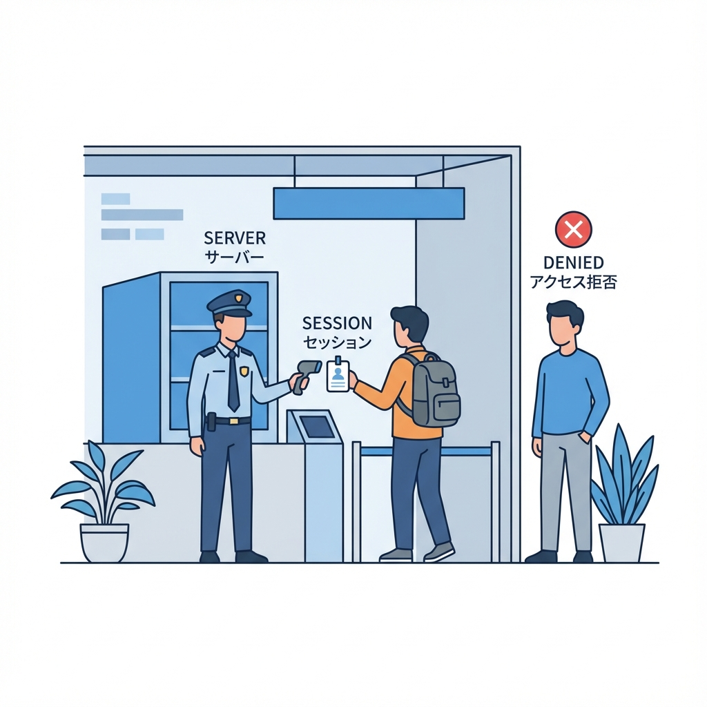
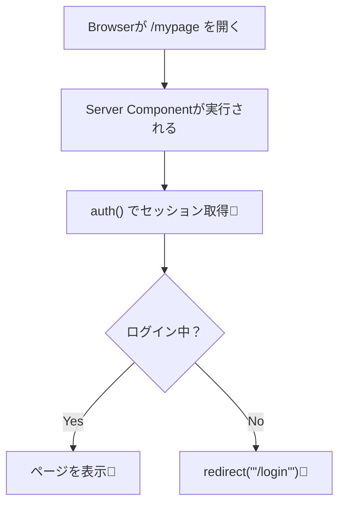

# 第179章：ログイン状態を読む（Serverで守る）🛡️

この章のゴールはこれだよ〜！🎯
**「ログインしてる人だけ見れるページ」を、“サーバー側”でちゃんと守れるようになる**こと💪
（※クライアント側で表示を隠すだけだと、守れてないことがあるの…！😖）

---

## 1) まず大事：ログイン状態は「Serverで判断」が基本🧊🛡️

ブラウザからページが開かれるとき、サーバーは **Cookie（セッションの手がかり🍪）** を見て「この人ログインしてる？」を判断できるよ✅
そしてログインしてなければ **そこで止める（リダイレクトする）** のが強い！🚧➡️🚪
Next.js は Server Component から `redirect()` が使えるから、ここでガードできるよ〜！([Next.js][1])

---

## 2) 全体の流れを図でつかもう👀🧠（Mermaid）





「**ページを返す前に**チェックしてる」のがポイントだよ〜！✨

---

## 3) Serverでセッションを読む：`auth()` を使う🍪📖

Auth.js（NextAuth v5系）では **`auth()`** でサーバー側からセッションを取りにいくのが基本ルートだよ🧡
（v5移行でも `auth()` が中心になってるよ〜）([authjs.dev][2])

> ✅ 前の章までで、だいたい `auth.ts`（または `src/auth.ts`）を作ってる想定だよ！

---

## 4) 実践：ページを“サーバーで”保護する🛡️✨

### ✅ パターンA：1ページだけ守る（いちばん直感的）🌸

例：`app/mypage/page.tsx`

```tsx
import { auth } from "@/auth";
import { redirect } from "next/navigation";

export default async function MyPage() {
  const session = await auth();

  // ログインしてなければログイン画面へ🚪
  if (!session?.user) {
    redirect("/login");
  }

  return (
    <main style={{ padding: 24 }}>
      <h1>マイページ 🏠✨</h1>
      <p>ようこそ！🎉</p>

      <ul>
        <li>name：{session.user.name ?? "（未設定）"}</li>
        <li>email：{session.user.email ?? "（未設定）"}</li>
      </ul>
    </main>
  );
}
```

ここで使ってる `redirect()` は Server Component で使えるよ〜！([Next.js][1])
この書き方だと、**未ログインの人は最初から中身を受け取れない**ので安心度高い🛡️✨

---

### ✅ パターンB：まとめて守る（Protected Layout）📦🛡️

「/mypage も /settings も全部ログイン必須にしたい！」みたいなときは、**ルートグループ＋layout** が超便利💡

例：こんな構成にするよ👇

* `app/(protected)/layout.tsx`
* `app/(protected)/mypage/page.tsx`
* `app/(protected)/settings/page.tsx`

`app/(protected)/layout.tsx`

```tsx
import { auth } from "@/auth";
import { redirect } from "next/navigation";

export default async function ProtectedLayout({
  children,
}: {
  children: React.ReactNode;
}) {
  const session = await auth();

  if (!session?.user) {
    redirect("/login");
  }

  return <>{children}</>;
}
```

これで `(protected)` の中に入れたページ全部が、まとめてガードされるよ〜！🛡️✨
（URLは `(protected)` が付かないのも嬉しい📦）

---

## 5) ついでに：API（Route Handler）も守れるよ🚪🧪

ページだけ守っても、**API が開いてたら抜け道**になることがあるよね😇
Auth.js 側でも「セッションが無ければ 401 返す」みたいな守り方が紹介されてるよ([authjs.dev][3])

例：`app/api/private/route.ts`

```ts
import { auth } from "@/auth";

export async function GET() {
  const session = await auth();

  if (!session?.user) {
    return Response.json({ error: "Unauthenticated" }, { status: 401 });
  }

  return Response.json({ message: "OK ✅", user: session.user });
}
```

---

## 6) よくあるハマりどころ集🌀（先に潰そ〜！🧯）

* **「Clientで隠せばOK」になっちゃう**
  → それだと、ネットワーク的には取れちゃう可能性があるよ😖
  **守りはServer**が基本🛡️

* **`auth()` は Server 用**
  → Client Component で呼ぶ前提じゃないよ〜！（役割分担だね🎭）

* **`session?.user` を見るのがシンプル**
  → `session` が `null` のこともあるから、`?.` を使って安全にね🧷

---

## 7) ミニ練習（10〜20分）🏋️‍♀️✨

### 🎯お題：ログイン必須エリアを作ろう🏠🔐

1. `(protected)` ルートグループを作る📦
2. `layout.tsx` で `auth()` → 未ログインなら `/login` へ🚪
3. `mypage/page.tsx` と `settings/page.tsx` を作って、何か表示してみる🎨

できたらこうなるよ👇

* ログインしてない：**どのページ開いても `/login` に飛ぶ**🚀
* ログインしてる：**普通に見れる**🎉

---

この章はここまで！🎀
次の章（第180章）では、同じ「保護」を **Middleware と組み合わせて**さらに強くする考え方に進めるよ〜🧤✨

[1]: https://nextjs.org/docs/app/guides/redirecting?utm_source=chatgpt.com "Guides: Redirecting"
[2]: https://authjs.dev/getting-started/migrating-to-v5?utm_source=chatgpt.com "Migrating to v5"
[3]: https://authjs.dev/getting-started/session-management/protecting?utm_source=chatgpt.com "Protecting Resources"
