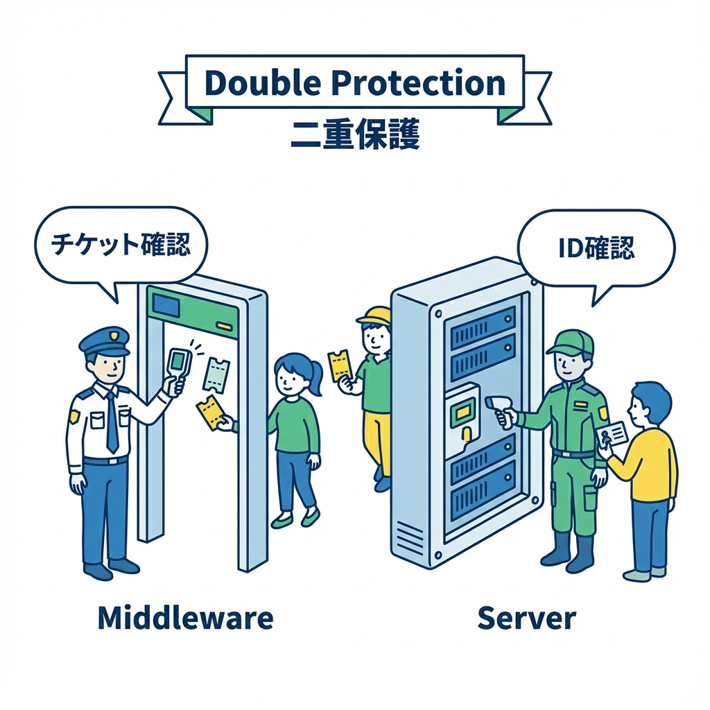
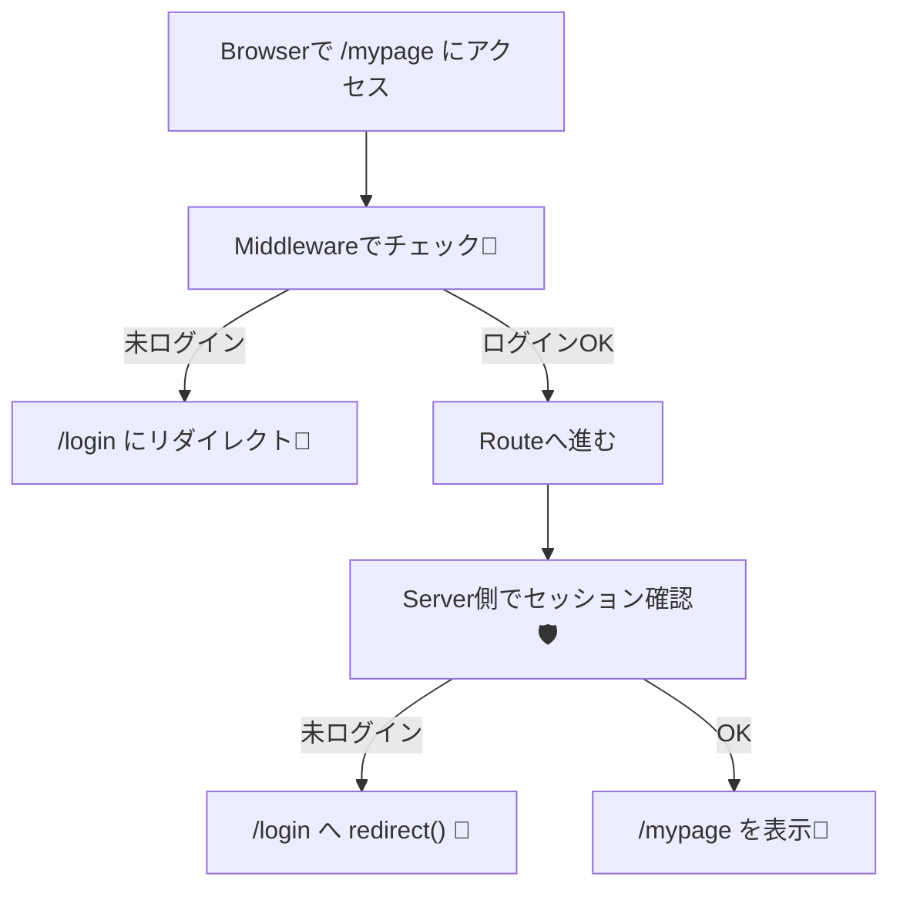

# 第180章：保護ルート（Middleware/Server両方で考える）🧤

この章は「ログインしてる人だけ見れるページ（保護ルート）」を、**2段階でしっかり守る**やり方を作っていくよ〜！😊💪
ポイントは **Middleware（入口の門番）** と **Server（最終防衛線）** をセットで使うこと！🧤🛡️

---

## 🎯 この章のゴール

* ✅ 未ログインで `/mypage` に行くと **`/login` にリダイレクト**できる
* ✅ “画面側で隠す”じゃなく、**サーバー側で守れる**ようになる
* ✅ Middleware と Server の **役割分担**がわかる

---

## 🧠 なぜ「2段階ガード」なの？（超ざっくり）🧸

### 🧤 Middleware（入口の門番）

* ルートが描画される前に走るよ！🚪✨
* 未ログインなら **早めに弾ける**（無駄な描画をさせない）
* ただし、Edgeで動くことが多くて **重い処理は苦手**😵‍💫（DB直叩きとかは避けがち）
  Middlewareはルート描画より前に実行されるよ〜。([Next.js][1])

### 🛡️ Server（最終防衛線）

* Server Component / layout / Route Handler 側で、**最終的に「絶対守る」**💪
* ここでなら **DBチェックや権限チェック**もやりやすい（設計次第）✨
  Server Components 等で `redirect()` が使えるよ。([Next.js][2])

---

## 🗺️ 図解：保護ルートの流れ（イメージ）🧤➡️🛡️





---

## 🧩 まずは例：`/mypage` を保護しよう🏠🔒

ここでは想定として、プロジェクト直下に `auth.ts` があって、`auth()` が使える状態…という前提で進めるね（前の章で作ってある想定）😊✨
Auth.js（NextAuth v5系）では、保護は「セッションが無ければアクション（redirect等）」が基本だよ。([Auth.js][3])

### ✅ 作りたいフォルダ構成（例）📁✨

* `app/(auth)/login/page.tsx`（ログインページ）
* `app/(protected)/mypage/page.tsx`（保護したいページ）
* `app/(protected)/layout.tsx`（ここでServerガード）
* `middleware.ts`（ここで入口ガード）

---

## ① Middlewareで「入口ガード」🧤🚪

プロジェクト直下に `middleware.ts` を作るよ〜！

```ts
// middleware.ts
import { NextResponse } from "next/server"
import { auth } from "@/auth"

// auth() で middleware を wrap すると req.auth が使えるパターンが多いよ（Auth.js v5系）✨
export default auth((req) => {
  const isLoggedIn = !!req.auth
  const isMyPage = req.nextUrl.pathname.startsWith("/mypage")

  if (isMyPage && !isLoggedIn) {
    const loginUrl = new URL("/login", req.nextUrl.origin)

    // ログイン後に戻ってこれるようにする（よくあるやつ）✨
    loginUrl.searchParams.set("callbackUrl", req.nextUrl.pathname)

    return NextResponse.redirect(loginUrl)
  }

  return NextResponse.next()
})

// /mypage 配下だけに middleware を当てる（最小が安全！）🧤
export const config = {
  matcher: ["/mypage/:path*"],
}
```

### 📝 メモ（大事）🧠✨

* `matcher` は **適用範囲を狭く**するのが基本だよ〜！😆
  いきなり全部にかけると、`/login` まで巻き込んで **無限リダイレクト地獄**になりがち😇🔥
* Auth.js v5系では `export { auth as middleware } from "@/auth"` みたいに書けるケースもあるよ（まずは上の「自前で分岐」版が分かりやすい！）([Zenn][4])

---

## ② Serverで「最終防衛線」🛡️🧊

次に、`app/(protected)/layout.tsx` を作って、**このグループ配下は全部ログイン必須**にするよ〜！✨

```tsx
// app/(protected)/layout.tsx
import type { ReactNode } from "react"
import { redirect } from "next/navigation"
import { auth } from "@/auth"

export default async function ProtectedLayout({
  children,
}: {
  children: ReactNode
}) {
  const session = await auth()

  // session が無い = 未ログイン
  if (!session?.user) {
    redirect("/login")
  }

  return <>{children}</>
}
```

### 💡 ここが気持ちいいポイント🥳

* `/mypage` だけじゃなく、将来 `/mypage/settings` とか増えても
  **(protected)配下に置くだけで勝手に守られる**🎉✨

---

## 🧯 よくあるハマり（先に潰す）💥😵‍💫

### ❶ 無限リダイレクトする😇

* `matcher` が広すぎて `/login` まで守っちゃうのが原因あるある！
  → まずは **`/mypage/:path*` みたいに限定**しよう🧤✨

### ❷ Middlewareで重いことをやろうとする🐘

* Middlewareは「入口で軽く判定」が得意！
* ガッツリ権限チェック（DB参照など）は **Server側（layout/page/route handler）** へ寄せるのが安全✨
  Middlewareはルート描画前に走る“前処理”だよ。([Next.js][1])

---

## 🧪 ミニ練習（5分）⏱️🐣

### ✅ お題：未ログインなら `/mypage` は入れないようにする🔒

1. `/mypage` を作る（とりあえず文字だけでOK）
2. `middleware.ts` を置く
3. `app/(protected)/layout.tsx` を置く
4. ブラウザで `http://localhost:3000/mypage` にアクセス
5. ✅ `/login` に飛べたら成功🎉✨

### ✅ できたら追加チャレンジ🌟

* `callbackUrl` を付けたので、ログイン後に戻れる導線を作ってみよ〜！🔁💖
  （ログインページ側で `callbackUrl` を読んで、成功後にそこへ戻す感じだよ😊）

---

## ✅ まとめチェックリスト🧾✨

* [ ] Middleware は **入口ガード（早めに弾く）** 🧤
* [ ] Server（layout等）は **最終防衛線（絶対守る）** 🛡️
* [ ] `matcher` は **狭く始める**（無限リダイレクト回避）🧠
* [ ] “UIで隠す”じゃなく **サーバーで守る** 🔒✨

---

これで「保護ルート」はかなり安全に作れるようになったよ〜！😊🎉🧤

[1]: https://nextjs.org/docs/15/pages/api-reference/file-conventions/middleware?utm_source=chatgpt.com "File-system conventions: Middleware"
[2]: https://nextjs.org/docs/app/guides/redirecting?utm_source=chatgpt.com "Guides: Redirecting"
[3]: https://authjs.dev/getting-started/session-management/protecting?utm_source=chatgpt.com "Protecting Resources"
[4]: https://zenn.dev/nbstsh/scraps/ef555a5ae79ec3?utm_source=chatgpt.com "Next.js App Router & Auth.js (next-auth v5) に入門する"
