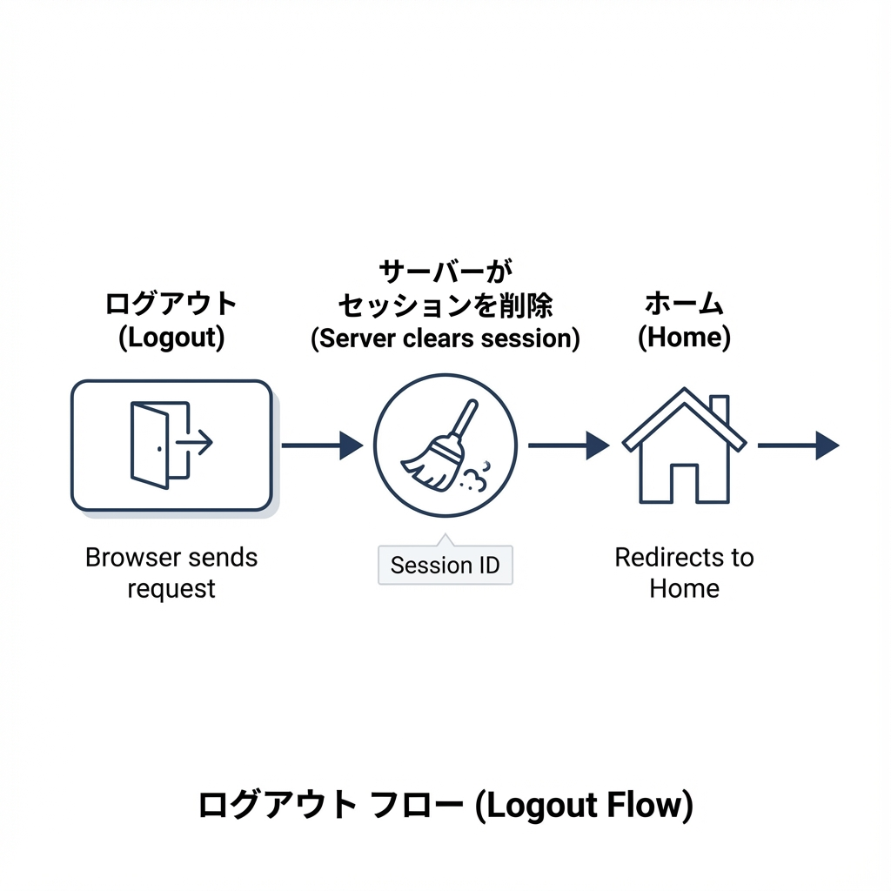
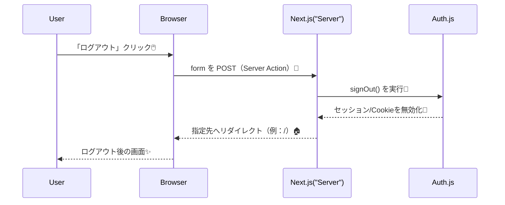

# 第181章：ログアウトを作る🚪

この章では、「ログアウト」ボタンを押したら **セッションを消して**、**指定ページへ移動（リダイレクト）**できるようにするよ〜！🙌💕

---

## ゴール🎯

* ✅ ログアウトボタンを作る🚪
* ✅ 押したらサインアウト（セッション破棄）される🧹
* ✅ ログアウト後にトップ（例：/）へ戻す🏠

---

## ログアウトって何してるの？🤔

ざっくり言うと…

* **ログイン状態を表す情報（Cookie/セッション）を無効化**して🧯
* **「もうログインしてないよ」状態に戻す**🌙

Auth.js（NextAuth v5系）だと、サインアウトは **signOut()** を呼ぶだけでOKな設計になってるよ🧸✨（セッション方式によって、DBのセッション削除 or Cookie無効化などが行われるよ）([Zenn][1])

---

## 図解：ログアウトの流れ🧠➡️🚪





---

## いちばんシンプルな実装（おすすめ）💡

Next.js（App Router）なら、**Server Action + form** がスッキリでおすすめだよ〜！🧡
Auth.js公式でも「form action で signOut」例が載ってる✨([Auth.js][2])

### 1) ログアウトボタンコンポーネントを作る🧩

ファイルを作成👇
**components/auth/SignOutButton.tsx**

```tsx
// components/auth/SignOutButton.tsx
import { signOut } from "@/auth";

export function SignOutButton() {
  return (
    <form
      action={async () => {
        "use server";
        await signOut({ redirectTo: "/" }); // 好きな行き先に変えてOK🏠
      }}
    >
      <button type="submit">ログアウト🚪</button>
    </form>
  );
}
```

ポイント💖

* **"use server"** があるので、この中はサーバーで動くよ☁️
* **redirectTo** を指定すると、ログアウト後の移動先を変えられるよ🏃‍♀️💨([nextjs.im][3])

---

### 2) ヘッダーやナビに置く（例）🧷

たとえば **app/layout.tsx** やヘッダーコンポーネント（Server Component）から呼ぶ感じ✨

```tsx
// 例: app/layout.tsx（またはヘッダーのServer Component）
import Link from "next/link";
import { auth } from "@/auth";
import { SignOutButton } from "@/components/auth/SignOutButton";

export default async function RootLayout({
  children,
}: {
  children: React.ReactNode;
}) {
  const session = await auth();

  return (
    <html lang="ja">
      <body>
        <header style={{ display: "flex", gap: 12, padding: 12 }}>
          <Link href="/">Home🏠</Link>

          {session?.user ? (
            <SignOutButton />
          ) : (
            <Link href="/login">ログイン🔑</Link>
          )}
        </header>

        {children}
      </body>
    </html>
  );
}
```

「ログインしてる時だけログアウトボタン出す」っていう自然なUIになるよ😊✨
（auth() を Server Component で呼ぶのも Auth.js の基本パターンだよ）([Auth.js][4])

---

## 動作チェック✅

1. 開発サーバー起動🏃‍♀️
2. ログイン状態にする🔑
3. 「ログアウト🚪」押す
4. トップ（/）に戻って、ログアウト状態になってたら成功🎉✨

---

## よくあるハマり💥（ここだけ注意！）

* **SignOutButton.tsx に "use client" を付けない！**🙅‍♀️
  Server Action（form action）はサーバー側の仕組みだから、混ぜると事故りやすいよ〜🧯([Zenn][5])
* ボタンは **type="submit"** にする🖱️
* ログアウト後の移動先を変えたいなら **redirectTo** を使う🏠([nextjs.im][3])

---

## おまけ：クライアント側でログアウトする方法（知識として）📌

「ボタン押したら signOut()」のクライアント版もあるよ〜（ただしバンドル増えがち）🎮
公式ページでも例がある✨([Auth.js][2])

```tsx
"use client";
import { signOut } from "next-auth/react";

export function SignOutButtonClient() {
  return <button onClick={() => signOut()}>ログアウト🚪</button>;
}
```

---

## ミニ練習🌸

* ✅ redirectTo を **/login** に変えてみよう🔁
* ✅ ボタン文言を「またね👋」にしてみよう😊

以上で「ログアウトを作る🚪」は完成だよ〜！🎉💖

[1]: https://zenn.dev/ph3nac/articles/next-auth-credential "Auth.js(NextAuth.js v5)とNext.jsで認証機能を実装する(Credentials Provider)"
[2]: https://authjs.dev/getting-started/session-management/login "Auth.js | Login"
[3]: https://ja.nextjs.im/learn/dashboard-app/adding-authentication "App Router: 認証機能の追加 | Next.js 日本語"
[4]: https://authjs.dev/reference/nextjs "Auth.js | Nextjs"
[5]: https://zenn.dev/divsawa/articles/20251206_nextjs-authjs "〖Next.js〗Auth.js v5でGoogleログインを実装する手順"
