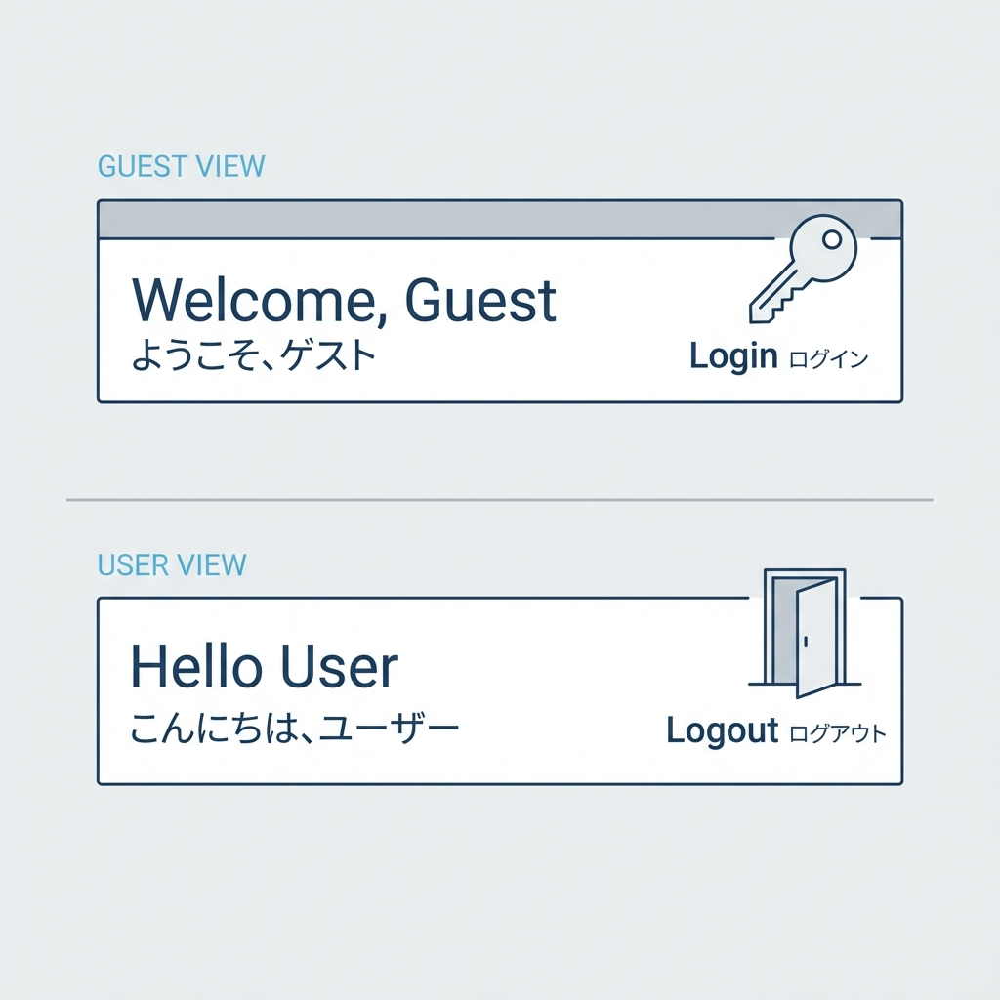
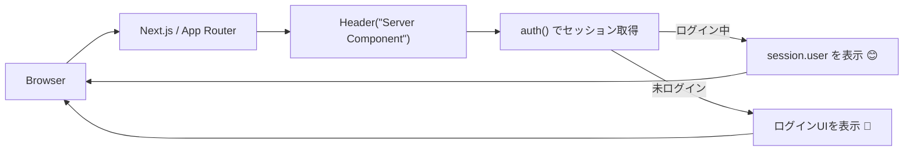

# 第182章：ユーザー情報を表示する（ヘッダーに名前）😊

今日は「ログインしてたら、ヘッダーに名前を出す」やつを作るよ〜！🎀✨
これができると一気に“アプリっぽさ”が出る😆👏

---

## この章で作るもの 🧩✨

* 画面上部のヘッダーに…

  * ✅ ログイン中：`こんにちは、◯◯さん😊` ＋ サインアウトボタン🚪
  * ✅ 未ログイン：`ログイン`ボタン🔑

---

## ざっくり仕組み（先にイメージ掴も！）🧠🌈



Auth.js（NextAuth v5系）では、**Server Componentで `auth()` を呼ぶ**のが王道だよ🍵
ログイン済みなら `session.user` が入ってくる感じ！



Auth.jsの「セッション取得」は `auth()` を使う例が公式に載ってるよ〜！ ([Auth.js][1])

---

## 1) ヘッダー用コンポーネントを作る 🧱✨

### 📁 `components/Header.tsx`（Server Component）

* `auth()` を呼んでセッションを取る
* `session?.user` があれば名前表示、なければログインボタン表示

```tsx
import Link from "next/link"
import styles from "./Header.module.css"
import { auth } from "@/auth"
import { SignInButton } from "./auth/SignInButton"
import { SignOutButton } from "./auth/SignOutButton"

export default async function Header() {
  const session = await auth()
  const user = session?.user

  // 表示名は「name → email → 固定文」の順でフォールバックするよ😊
  const displayName = user?.name ?? user?.email ?? "ゲスト"

  return (
    <header className={styles.header}>
      <div className={styles.inner}>
        <Link className={styles.logo} href="/">
          MyApp ✨
        </Link>

        <nav className={styles.nav}>
          <Link className={styles.link} href="/dashboard">
            Dashboard 🧭
          </Link>
          <Link className={styles.link} href="/mypage">
            MyPage 🏠
          </Link>
        </nav>

        <div className={styles.right}>
          {user ? (
            <>
              <span className={styles.greeting}>
                こんにちは、{displayName}さん 😊
              </span>
              <SignOutButton />
            </>
          ) : (
            <SignInButton />
          )}
        </div>
      </div>
    </header>
  )
}
```

> `auth()` を Server Component で呼ぶのは、公式でも「よくある使い方」って説明されてるよ📌 ([Auth.js][1])

---

## 2) ログイン/ログアウトボタンを作る 🔘✨（Server Actions版）

ここは**Client ComponentにしなくてもOK**🙆‍♀️
`<form action={...}>` でサーバー側の `signIn()` / `signOut()` を呼べるよ〜！
（公式にこの形の例が載ってる✨） ([Auth.js][2])

### 📁 `components/auth/SignInButton.tsx`

```tsx
import styles from "./authButtons.module.css"
import { signIn } from "@/auth"

export function SignInButton() {
  return (
    <form
      action={async () => {
        "use server"
        await signIn()
      }}
    >
      <button className={styles.primary} type="submit">
        ログイン 🔑
      </button>
    </form>
  )
}
```

### 📁 `components/auth/SignOutButton.tsx`

```tsx
import styles from "./authButtons.module.css"
import { signOut } from "@/auth"

export function SignOutButton() {
  return (
    <form
      action={async () => {
        "use server"
        await signOut()
      }}
    >
      <button className={styles.ghost} type="submit">
        ログアウト 🚪
      </button>
    </form>
  )
}
```

---

## 3) CSSをちょい整える 💅✨

### 📁 `components/Header.module.css`

```css
.header {
  position: sticky;
  top: 0;
  background: white;
  border-bottom: 1px solid #eee;
}

.inner {
  height: 56px;
  display: flex;
  align-items: center;
  gap: 16px;
  padding: 0 16px;
}

.logo {
  font-weight: 700;
  text-decoration: none;
  color: #111;
}

.nav {
  display: flex;
  gap: 12px;
}

.link {
  text-decoration: none;
  color: #444;
}

.right {
  margin-left: auto;
  display: flex;
  align-items: center;
  gap: 12px;
}

.greeting {
  color: #222;
  font-size: 14px;
}
```

### 📁 `components/auth/authButtons.module.css`

```css
.primary {
  border: 0;
  padding: 8px 12px;
  border-radius: 10px;
  cursor: pointer;
}

.ghost {
  border: 1px solid #ddd;
  background: white;
  padding: 8px 12px;
  border-radius: 10px;
  cursor: pointer;
}
```

---

## 4) `layout.tsx` にヘッダーを差し込む 🧩✨

### 📁 `app/layout.tsx`

すでにレイアウトがあるはずなので、`<Header />` だけ追加してね😊

```tsx
import type { Metadata } from "next"
import Header from "@/components/Header"
import "./globals.css"

export const metadata: Metadata = {
  title: "MyApp",
}

export default function RootLayout({
  children,
}: {
  children: React.ReactNode
}) {
  return (
    <html lang="ja">
      <body>
        <Header />
        {children}
      </body>
    </html>
  )
}
```

---

## 動作チェック ✅✨

1. 開発サーバー起動 💻

   ```powershell
   npm run dev
   ```

2. 未ログインのとき
   → ヘッダー右側に「ログイン 🔑」が出る😊

3. ログイン後
   → `こんにちは、◯◯さん 😊` と「ログアウト 🚪」が出る🎉

---

## つまずきポイント（あるある）🪤😵‍💫

### ① 名前が `undefined` っぽい

プロバイダや設定によって `user.name` が空のことあるよ〜！
この章のコードは `name → email → ゲスト` で逃げてるから安心😊🧡

### ② 「レイアウトで認証チェック」は注意ね⚠️

Next.jsは**レイアウトが画面遷移で毎回再評価されない**ケースがあるよ（Partial Renderingの話）
なので「認可（入れる/入れない）」みたいな超重要チェックは、より末端（leaf）側に寄せるのが推奨されてるよ〜📌 ([Next.js][3])
でも今回は「ヘッダーに名前を出す」なので、まずはこの形でOK👌😊

---

## ミニ課題 🎯✨（5分でできる！）

* `こんにちは、{displayName}さん 😊` の前に「🌸」とか好きな絵文字を足す
* 未ログイン時のボタン文言を「ログインしてね🥺」にしてみる

---

ここまでできたら、ヘッダーが一気に“アプリ顔”になるよ〜！😆🎀

[1]: https://authjs.dev/getting-started/session-management/get-session "Auth.js | Get Session"
[2]: https://authjs.dev/getting-started/session-management/login "Auth.js | Login"
[3]: https://nextjs.org/docs/app/guides/authentication "Guides: Authentication | Next.js"
