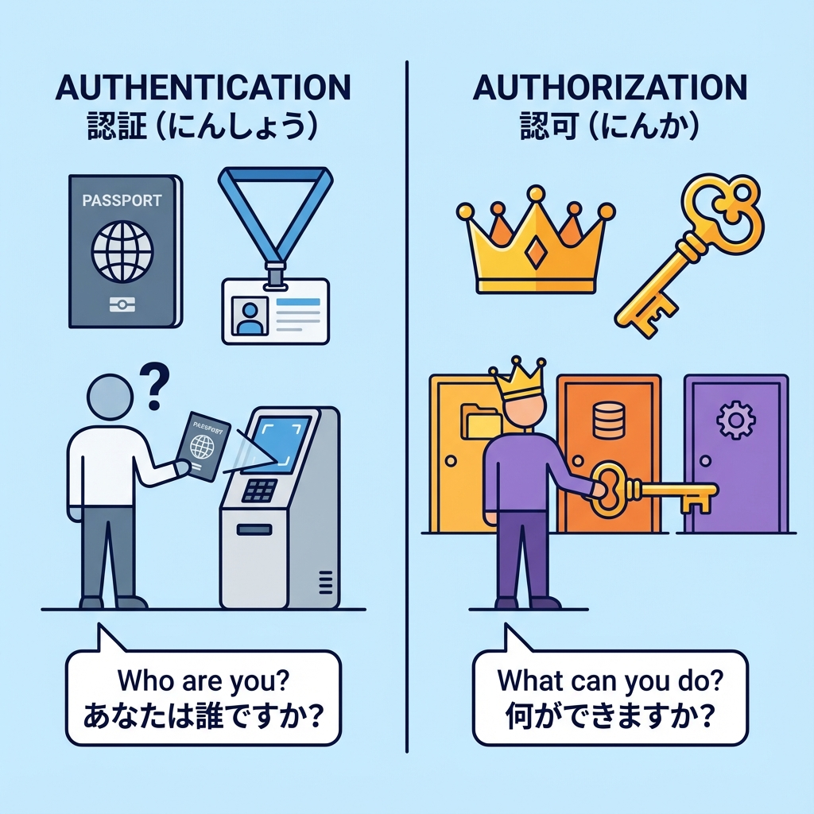
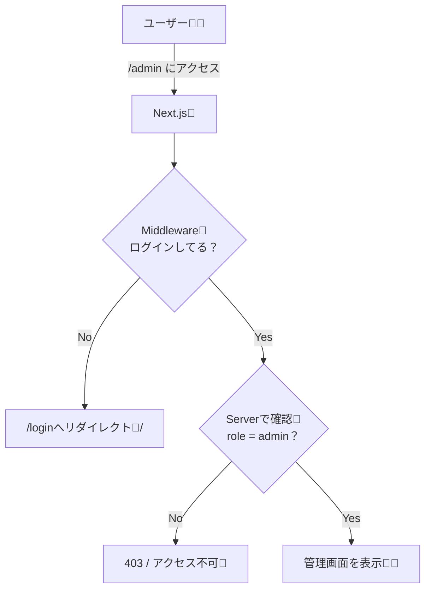

# 第183章：権限（admin等）の考え方👑

この章では「ログインできるか？」（認証）とは別に、**「何をしていい人か？」（認可＝権限）**をどう考えて実装するかを、Next.js（App Router）目線でまとめるよ〜😊🧠✨
**結論：権限チェックは“サーバーが本体”**です🔥（画面で隠すのは補助だよ〜🪄）

---

## 1) まず用語をスッキリ整理🧹✨



* **認証（Authentication）**：あなたは誰？（ログインできた？）🔑
* **認可（Authorization）**：あなたは何していい？（admin？一般？）👑

> ✅ ログインできても、全員が管理画面に入れたらダメだよね🙅‍♀️💦
> それを止めるのが「権限」！

---

## 2) 権限の設計パターン（初心者はこれでOK）🧩✨

### A. いちばん簡単：ロール（役割）方式 = RBAC 🎭

* 例：`user` / `admin` / `editor`
* “役割”でできることを決める

### B. もう一歩：パーミッション（許可）方式 🎫

* 例：`post:read`, `post:write`, `user:ban` みたいに細かい許可を並べる
* 大きいサービス向け（最初は重いかも💦）

この教材ではまず **RBAC（role方式）** がいちばん安全＆分かりやすいよ😊👍

---

## 3) どこで権限チェックするの？（超大事）🚨

権限チェックは「どこでやるか」が命！🫀✨

✅ **守る優先順位（強い順）**

1. **Server（Route Handler / Server Actions / Server Component）** ← 本丸🏯🔥
2. **Middleware（入口で止める）** ← 門番🧤
3. **Client（ボタンを隠す等）** ← 見た目担当🎀（でも信用しない！）

---

## 4) 図で理解：/admin に入るまでの流れ🧭✨



---

## 5) 実装の考え方（王道）👑🧱

### ゴール🎯

* DBに `role` を持たせる（例：`user` or `admin`）🗃️
* ログインしたら **session（またはJWT）に role を載せる**📦
* **サーバー側**で `role === "admin"` を毎回チェック✅

---

## 6) 例：Roleを型で固定する（ミス防止）🧷✨

```ts
// src/lib/auth/roles.ts
export type Role = "user" | "admin";
```

---

## 7) 例：sessionに role を載せる（Auth.js/NextAuth系のイメージ）📦✨

※ ここは「雰囲気をつかむ」用だよ😊（細部は使う認証ライブラリで少し変わるよ〜）

```ts
// src/auth.ts (例)
// ✅ session.user.role を使えるようにしておくイメージ

import type { Role } from "@/lib/auth/roles";

export const authConfig = {
  callbacks: {
    // JWTにroleを保存（JWT方式の場合の例）
    async jwt({ token, user }: any) {
      if (user) {
        token.role = (user.role ?? "user") as Role;
      }
      return token;
    },

    // sessionにroleを載せる
    async session({ session, token }: any) {
      session.user.role = (token.role ?? "user") as Role;
      return session;
    },
  },
};
```

> ✅ ポイント：**「roleがsessionにある」状態**を作ると、毎回DBへ問い合わせなくて済むことが多いよ⚡
> （ただし“role変更が即反映されない”問題もあるので、運用では注意🫶）

---

## 8) 例：Server Component で管理画面を守る🛡️👑

**`/admin` は admin だけ入れる**例だよ✨
（Server Component なので、ここでチェックすると強い💪）

```tsx
// app/admin/page.tsx
import { redirect } from "next/navigation";

async function getSession(): Promise<{ user?: { role?: string } }> {
  // ここは実際は auth() / getServerSession() などに置き換えてね😊
  return { user: { role: "user" } };
}

export default async function AdminPage() {
  const session = await getSession();

  if (!session.user) {
    redirect("/login");
  }

  if (session.user.role !== "admin") {
    redirect("/403"); // 403ページに飛ばすのがやさしい🫶
  }

  return (
    <main>
      <h1>管理画面👑</h1>
      <p>ここは admin だけが見られるよ〜✨</p>
    </main>
  );
}
```

---

## 9) 例：Server Actions / API 側でも必ず守る（超重要）🚨

「画面を守ったからOK！」じゃなくて、
**“データを変える処理（削除/更新）”こそサーバーで権限チェック必須**だよ🔥

```ts
// app/admin/actions.ts
"use server";

export async function deleteAllUsersAction() {
  const session = { user: { role: "user" } }; // 例：本物は auth() 等で取る

  if (!session.user || session.user.role !== "admin") {
    throw new Error("権限がありません🚫");
  }

  // ✅ ここに本当の削除処理
  // await db.user.deleteMany()
  return { ok: true };
}
```

> ✅ 「ボタンを隠したのに、URL直叩きやAPI直叩きで実行される」
> これが一番よくある事故😇💥
> **だからサーバーで止める！**

---

## 10) “権限の表”を作ると迷子にならない🗺️✨

アプリが大きくなると頭の中だけで管理はムリになりがち💦
なので最小でもこういう表があるとラクだよ😊

| 画面/操作            | user | admin |
| ---------------- | ---: | ----: |
| 自分のプロフィールを見る     |    ✅ |     ✅ |
| TODOを追加/編集（自分の分） |    ✅ |     ✅ |
| 全ユーザー一覧を見る       |    ❌ |     ✅ |
| ユーザーをBAN/削除      |    ❌ |     ✅ |

---

## 11) よくある落とし穴まとめ（ここだけ覚えて🥺）⚠️

* **UIで隠すだけ**は権限じゃない（飾り）🎀
* **サーバーで必ずチェック**（Actions / API / Page）🏯
* roleの値は **クライアントから送らせない**（改ざんされるよ😇）
* 「adminじゃない人」に **“存在する/しない”の情報を出しすぎない**（セキュリティ的にね🫶）

---

## 12) ミニ演習（10〜20分）🏃‍♀️💨✨

1. `role: "user" | "admin"` をユーザーに持たせる（DBでもOK）🗃️
2. session に `role` を載せる📦
3. `app/admin/page.tsx` を作って **admin だけ表示**👑
4. `deleteAllTodosAction()` を作って、**admin 以外は必ずエラー**🧯
5. ついでに Client 側は「adminだけボタン表示」にしてUXもUP🎀✨（でもサーバーガードは必須！）

---

## まとめ🎀✨

* 権限 = 「何していい？」のルール👑
* 初心者は **role（RBAC）** がいちばん分かりやすい😊
* **守る場所はサーバーが本体**（UIは補助）🏯🔥
* 管理画面だけじゃなく、**データ更新処理こそ権限チェック必須**🚨

次の章で「マイページ」を作る時も、この考え方がそのまま効いてくるよ〜🏠✨
