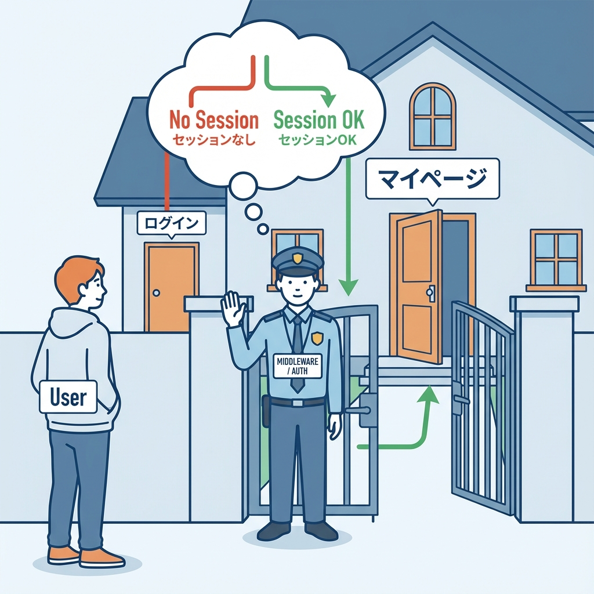
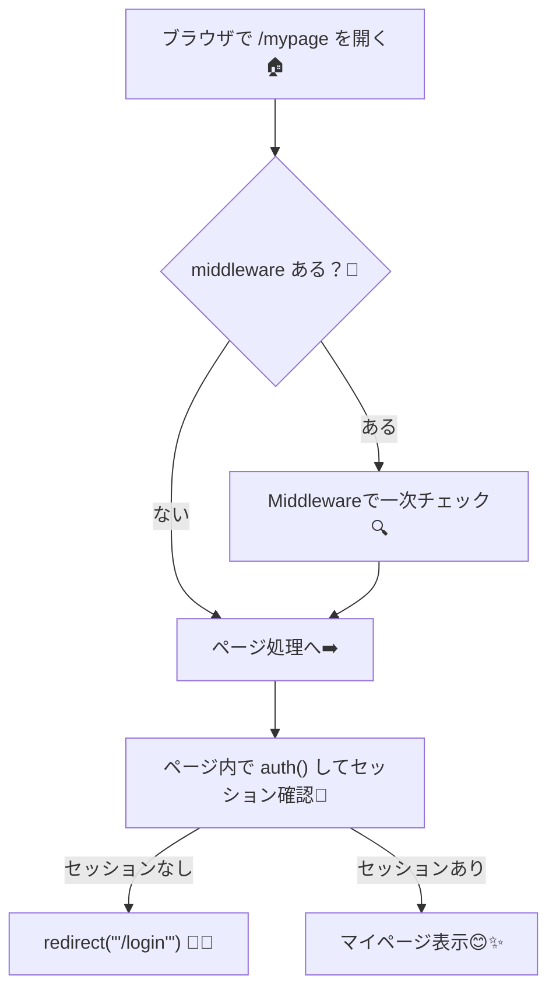

# 第184章：練習：ログイン必須の“マイページ”を作る🏠

今回は **`/mypage`（マイページ）を「ログインしてる人だけ見れる」** ようにします😊🔐
未ログインなら **`/login` に自動で飛ばす** ようにするよ〜！🚪💨

---

## 今日作るもの🎯✨

* `/mypage` を作る🏠
* **未ログイン**なら `redirect("/login")` 🚦
* **ログイン中**なら、ユーザー情報（名前・メール）を表示😊
* ついでに **ログアウトボタン**も置く🚪✨（サーバー側で安全に）

---

## ざっくり流れ図🧠🗺️（Mermaid）





※ Middleware は便利だけど、**それだけに頼らず**「ページ側でもチェック」するのが大事だよ〜🛡️✨ ([Auth.js][1])

---

## フォルダ構成📁✨

最低限これだけ作るよ👇

* `app/mypage/page.tsx`
* `app/mypage/page.module.css`（見た目ちょい整える用🎀）

---

## Step 1：`/mypage` ページを作る🏠✨

### `app/mypage/page.tsx`

ポイントはここ👇

* `auth()` でセッション取得🧾（Auth.js v5 の考え方だよ） ([Auth.js][2])
* なければ `redirect("/login")` 🚪💨
* あればユーザー情報表示😊
* ログアウトは `signOut()` を **Server Action** で呼ぶ（安全＆ラク）🚪✨ ([Auth.js][3])

```tsx
import { redirect } from "next/navigation"
import styles from "./page.module.css"

// ここはあなたのプロジェクトの auth.ts の置き場所に合わせてね🙏
// よくある例: ルート直下の auth.ts を使ってるなら "@/auth" が多いよ
import { auth, signOut } from "@/auth"

export default async function MyPage() {
  const session = await auth()

  // ✅ ログインしてなければログインページへ
  if (!session?.user) {
    redirect("/login")
  }

  const name = session.user.name ?? "（名前未設定）"
  const email = session.user.email ?? "（メール未設定）"

  return (
    <main className={styles.main}>
      <h1 className={styles.title}>マイページ🏠✨</h1>

      <section className={styles.card}>
        <p className={styles.hello}>こんにちは、{name} さん😊🌸</p>

        <dl className={styles.dl}>
          <dt>メール</dt>
          <dd>{email}</dd>
        </dl>

        <form
          action={async () => {
            "use server"
            // ✅ ログアウト後、どこへ戻すか（例：トップへ）
            await signOut({ redirectTo: "/" })
          }}
        >
          <button className={styles.button} type="submit">
            ログアウトする🚪💨
          </button>
        </form>
      </section>
    </main>
  )
}
```

---

## Step 2：ちょい可愛くするCSS🎀✨

### `app/mypage/page.module.css`

```css
.main {
  padding: 24px;
  max-width: 720px;
  margin: 0 auto;
}

.title {
  font-size: 28px;
  margin: 0 0 16px;
}

.card {
  border: 1px solid #ddd;
  border-radius: 16px;
  padding: 16px;
}

.hello {
  margin: 0 0 12px;
  font-size: 18px;
}

.dl {
  display: grid;
  grid-template-columns: 120px 1fr;
  gap: 8px 12px;
  margin: 0 0 16px;
}

.button {
  padding: 10px 14px;
  border-radius: 12px;
  border: 1px solid #999;
  background: white;
  cursor: pointer;
}
```

---

## Step 3：動作チェック✅🧪

1. 開発サーバー起動💻✨

   ```bash
   npm run dev
   ```

2. **未ログイン**で `http://localhost:3000/mypage` を開く
   → `http://localhost:3000/login` に飛べたらOK🚪💨

3. ログインしてからもう一度 `/mypage`
   → 名前やメールが出たらOK😊✨

4. ログアウトボタン押す
   → `/` に戻ればOK🏁✨（`redirectTo: "/"` の設定どおり） ([Auth.js][3])

---

## おまけ：Middlewareでも入口ガードしたい人へ🧤✨（任意）

「`/mypage` に入る前に、まず門番で止めたい！」って時は middleware もアリ😊
Auth.js 公式は `middleware.ts` で `auth` を使う方法を載せてるよ〜 ([Auth.js][1])

### `middleware.ts`（プロジェクト直下）

```ts
export { auth as middleware } from "@/auth"

export const config = {
  matcher: ["/mypage/:path*"],
}
```

ただしさっき言った通り、**middlewareだけに頼らず**、ページ側でも `auth()` チェックは残しておくのが安全だよ🛡️✨ ([Auth.js][1])

---

## よくあるつまずき🐣💦

* **`Module not found: Can't resolve '@/auth'`**
  → `auth.ts` の場所に合わせて import を直してね🙏
  例：ルート直下なら `@/auth`、`src/auth.ts` なら設定次第で変わるよ〜！

* **`/mypage` が表示されるのに user が空っぽ**
  → そのログイン方式だと `name` や `email` が無いこともあるよ〜！
  だから今回は `?? "（未設定）"` で保険かけてる😊🧸

---

これで **「ログイン必須のマイページ🏠🔐」** 完成だよ〜！🎉😊

[1]: https://authjs.dev/getting-started/session-management/protecting "Auth.js | Protecting"
[2]: https://authjs.dev/getting-started/migrating-to-v5 "Migrating to v5"
[3]: https://authjs.dev/reference/nextjs?utm_source=chatgpt.com "Auth.js | Nextjs"
