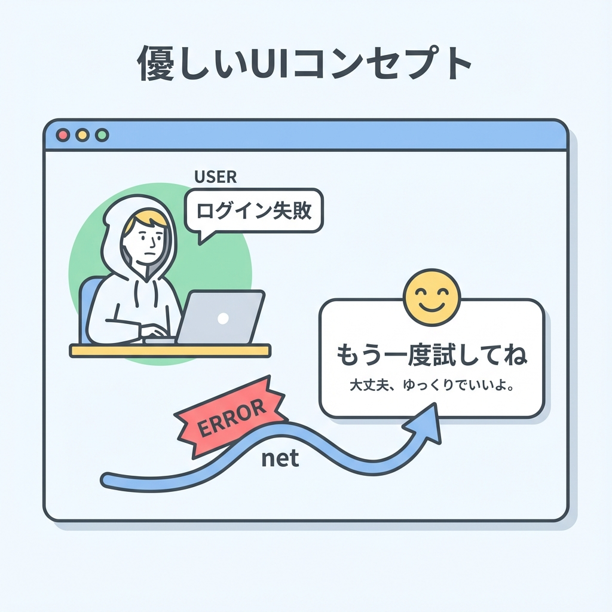
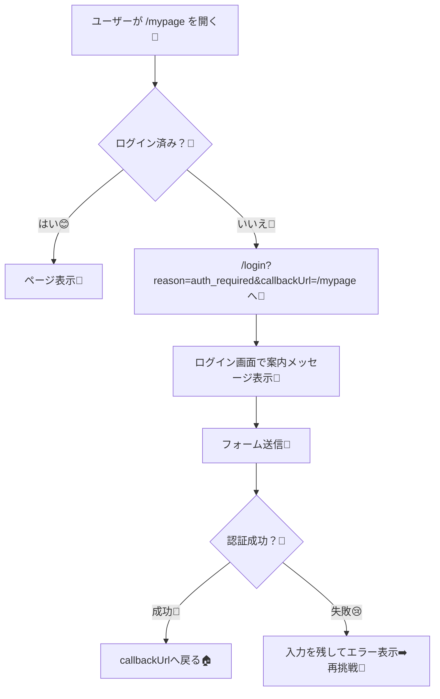

# 第186章：認証エラーの体験を良くする（案内）🫶

ログインまわりって、ちょっとでもつまずくと「え、なにが起きたの？😵‍💫」ってなりがちだよね💦
この章では **“失敗しても迷子にさせない案内”** を作って、体験をやさしくするよ〜😊🌸

---

## この章でやること🎯💡

* ログインが必要な時に、**ちゃんと理由を伝える** 🗣️✨
* ログイン失敗時に、**やさしく・安全に**メッセージを出す🫶🔐
* 「戻りたいページ」に **ちゃんと戻れる** ようにする🏠🔁
* Auth.js の **エラーページ** を自分で用意する（できると安心）🧯✨ ([Auth.js][1])

---

## まずは全体の流れを図でつかも〜🗺️✨






---

## “案内が上手い”認証UIの3原則🫶✨

### ① 何が必要かを言う（責めない）🥹🫶

* ❌「権限がありません」だけ
* ✅「このページを見るにはログインが必要だよ😊」

### ② 次の行動を1〜2個だけ出す🚶‍♀️➡️

* 「もう一回ログイン」🔁
* 「トップへ戻る」🏠
* （必要なら）「問い合わせ」📮

### ③ 詳細を出しすぎない（安全）🔐

特に ID/パスワードの間違いは、細かく言いすぎないのが基本だよ〜（安全のため）🫶
Auth.js も「ユーザー名が違う/パスワードが違う」みたいなヒントは出しすぎないのを推奨してるよ🙂‍↕️🔒 ([Auth.js][2])

---

## 1) ログイン必須ページで「案内つきリダイレクト」をする🔁🫶

例：`/mypage` を開いたけど未ログインなら、ログイン画面へ送って理由も渡す💌

```tsx
// app/(protected)/mypage/page.tsx
import { auth } from "@/auth"
import { redirect } from "next/navigation"

export default async function MyPage() {
  const session = await auth()

  if (!session) {
    redirect(
      `/login?reason=auth_required&callbackUrl=${encodeURIComponent("/mypage")}`
    )
  }

  return (
    <main>
      <h1>マイページ🏠</h1>
      <p>ようこそ〜😊✨</p>
    </main>
  )
}
```

※ `redirect()` は内部で `NEXT_REDIRECT` を投げて処理を止める仕組みだよ（だから「途中で止まってOK」な動き）🧠✨ ([Next.js][3])

---

## 2) ログインページで「理由（reason）」と「エラー（error/code）」を案内に変える🫶💬

### ✅ メッセージ変換テーブルを作ろう（小さくて強い💪）

```ts
// app/(auth)/login/messages.ts
type Params = {
  reason?: string
  error?: string
  code?: string
}

export function getLoginMessage({ reason, error, code }: Params): string | null {
  // ① 未ログインで飛ばされた時
  if (reason === "auth_required") {
    return "このページを見るにはログインが必要だよ😊🔑"
  }
  if (reason === "session_expired") {
    return "ログインの有効期限が切れたみたい🥺 もう一回ログインしよう🔁"
  }

  // ② Auth.js のエラー（例：Credentials）
  // Credentials Provider の authorize で失敗すると、
  // error=CredentialsSignin&code=credentials が付くことがあるよ🧩
  if (error === "CredentialsSignin") {
    return "メールアドレスかパスワードが違うかも…🥺 もう一回ためしてみてね🔁"
  }
  if (error === "AccessDenied") {
    return "このアカウントでは入れない設定みたい🙇‍♀️ 管理者に確認してね👑"
  }

  // code は URL に出るので、細かい内容を出しすぎないのが安心🔐
  if (code === "credentials") {
    return "入力情報を確認してね😊（うまくいかない時は再入力してみよう）"
  }

  return null
}
```

Credentials の失敗時に `error=CredentialsSignin&code=credentials` が付く挙動は Auth.js の説明にあるよ🧩 ([Auth.js][4])

---

## 3) `useActionState` で「ログイン失敗をその場で表示」する😢➡️💪

Auth.js の `signIn()` は、失敗すると `AuthError` を投げるよ（だから try/catch で “認証だけ” を丁寧に拾える）🧯✨ ([Auth.js][4])
さらに、`signIn()` は `redirectTo` オプションで「成功後の戻り先」を指定できるよ🏠🔁 ([Auth.js][4])

### Server Action（ログイン処理）🧑‍🍳🔥

```ts
// app/(auth)/login/actions.ts
"use server"

import { AuthError } from "next-auth"
import { signIn } from "@/auth"

type State = { message?: string }

export async function loginAction(_prev: State, formData: FormData): Promise<State> {
  const callbackUrl = (formData.get("callbackUrl") as string) || "/"

  try {
    await signIn("credentials", formData, { redirectTo: callbackUrl })
    return {} // 基本ここには来ない（成功するとリダイレクトすることが多い）
  } catch (error) {
    // 認証系だけ、やさしく案内に変換🫶
    if (error instanceof AuthError) {
      if (error.type === "CredentialsSignin") {
        return { message: "メールアドレスかパスワードが違うかも…🥺 もう一回ためしてみてね🔁" }
      }
      if (error.type === "AccessDenied") {
        return { message: "アクセスできない設定みたい🙇‍♀️ 管理者に確認してね👑" }
      }
      return { message: "ログインでエラーが起きちゃった🥺 もう一度ためしてみてね🔁" }
    }

    // それ以外（想定外）は握りつぶさない🙅‍♀️
    throw error
  }
}
```

`AuthError` が `type` を持つことは、Auth.js のエラー定義に書かれてるよ🧩 ([Auth.js][2])
（そして `signIn()` の例でも `AuthError` を catch する形が載ってるよ） ([Auth.js][4])

### Client Component（フォームUI）🧸✨

```tsx
// app/(auth)/login/LoginForm.tsx
"use client"

import { useActionState } from "react"
import { useFormStatus } from "react-dom"
import { loginAction } from "./actions"

function SubmitButton() {
  const { pending } = useFormStatus()
  return (
    <button type="submit" disabled={pending}>
      {pending ? "ログイン中…⏳" : "ログイン🔑"}
    </button>
  )
}

export default function LoginForm({ callbackUrl }: { callbackUrl: string }) {
  const [state, action] = useActionState(loginAction, {})

  return (
    <form action={action}>
      <input type="hidden" name="callbackUrl" value={callbackUrl} />

      <label>
        メール📧
        <input name="email" type="email" required />
      </label>

      <label>
        パスワード🔒
        <input name="password" type="password" required />
      </label>

      {state.message && (
        <p role="alert" style={{ marginTop: 8 }}>
          {state.message}
        </p>
      )}

      <div style={{ marginTop: 12 }}>
        <SubmitButton />
      </div>
    </form>
  )
}
```

---

## 4) ログインページ本体（reason/error を表示＋フォームに callbackUrl を渡す）🫶🏠

```tsx
// app/(auth)/login/page.tsx
import LoginForm from "./LoginForm"
import { getLoginMessage } from "./messages"

type SearchParams = {
  reason?: string
  error?: string
  code?: string
  callbackUrl?: string
}

export default function LoginPage({ searchParams }: { searchParams: SearchParams }) {
  const message = getLoginMessage(searchParams)
  const callbackUrl = searchParams.callbackUrl ?? "/"

  return (
    <main>
      <h1>ログイン🔑✨</h1>

      {message && (
        <p role="alert" style={{ marginTop: 8 }}>
          {message}
        </p>
      )}

      <div style={{ marginTop: 16 }}>
        <LoginForm callbackUrl={callbackUrl} />
      </div>

      <p style={{ marginTop: 16 }}>
        <a href="/">トップへ戻る🏠</a>
      </p>
    </main>
  )
}
```

---

## 5) “Auth.js のエラーページ”も自分のページにして安心感UP🧯✨

Auth.js は、認証フロー中の問題が起きた時に **カスタムのエラーページ**（例：`/error`）へ飛ばす設定ができるよ〜📄✨ ([Auth.js][1])
しかも `error=Configuration` みたいな感じで **クエリにエラー種別が乗る** ようになってるよ🧩 ([Auth.js][1])

### `auth.ts`（設定イメージ）⚙️

```ts
// auth.ts（必要な部分だけイメージ）
import NextAuth from "next-auth"

export const { auth, signIn, signOut, handlers } = NextAuth({
  // ...providersなど...
  pages: {
    signIn: "/login",
    error: "/error",
  },
})
```

サインインページを自作する設定（`pages.signIn`）も公式ガイドにあるよ🧩 ([Auth.js][5])

### `app/error/page.tsx`（超やさしい版）🧸

```tsx
// app/error/page.tsx
"use client"

import { useSearchParams } from "next/navigation"

export default function AuthErrorPage() {
  const sp = useSearchParams()
  const error = sp.get("error")

  const message =
    error === "Configuration"
      ? "サーバー設定に問題があるみたい🥺（管理者に連絡してね📮）"
      : error === "AccessDenied"
      ? "アクセスできない設定みたい🙇‍♀️（権限を確認してね👑）"
      : error === "Verification"
      ? "確認リンクの期限が切れたかも🥺 もう一回試してみてね🔁"
      : "認証でエラーが起きちゃった🥺 もう一度試してね🔁"

  return (
    <main>
      <h1>認証エラー🧯</h1>
      <p style={{ marginTop: 8 }}>{message}</p>
      <p style={{ marginTop: 16 }}>
        <a href="/login">ログインへ戻る🔑</a>
      </p>
    </main>
  )
}
```

---

## 仕上げチェックリスト✅✨

* [ ] ログイン必須で飛ばす時、`reason=auth_required` を付けた？🔁
* [ ] 元のページに戻るため `callbackUrl` を付けた？🏠
* [ ] ログイン画面で「何をすればいいか」が一言でわかる？🫶
* [ ] 失敗時の文言が “責めない” 文章になってる？🥹
* [ ] 失敗理由を出しすぎてない？（安全）🔐 ([Auth.js][2])
* [ ] `/error` ページがあって、詰んだ時も戻れる？🧯 ([Auth.js][1])

---

## ミニ演習🧪✨（今日のゴール🎀）

1. `/mypage` に未ログインで入ったら
   ✅「このページを見るにはログインが必要だよ😊🔑」が出るようにする
2. パスワードを間違えたら
   ✅ その場で「もう一回ためしてみてね🔁」が出るようにする
3. ログイン成功後に
   ✅ `/mypage` に戻ってこれたら勝ち🏆🎉

---

必要なら次の章（復習）に向けて、`reason=session_expired` を「ログアウト時」や「セッション切れ検知」でも付けるパターンも一緒に整えられるよ〜😊🌸

[1]: https://authjs.dev/guides/pages/error "Auth.js | Error"
[2]: https://authjs.dev/reference/core/errors "Auth.js | Errors"
[3]: https://nextjs.org/docs/app/api-reference/functions/redirect?utm_source=chatgpt.com "Functions: redirect"
[4]: https://authjs.dev/reference/nextjs "Auth.js | Nextjs"
[5]: https://authjs.dev/guides/pages/signin "Auth.js | Signin"
