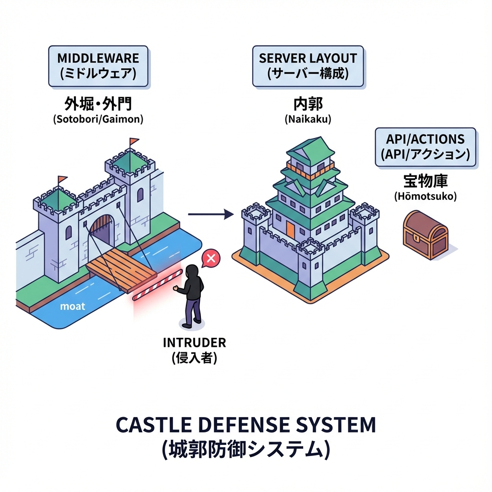
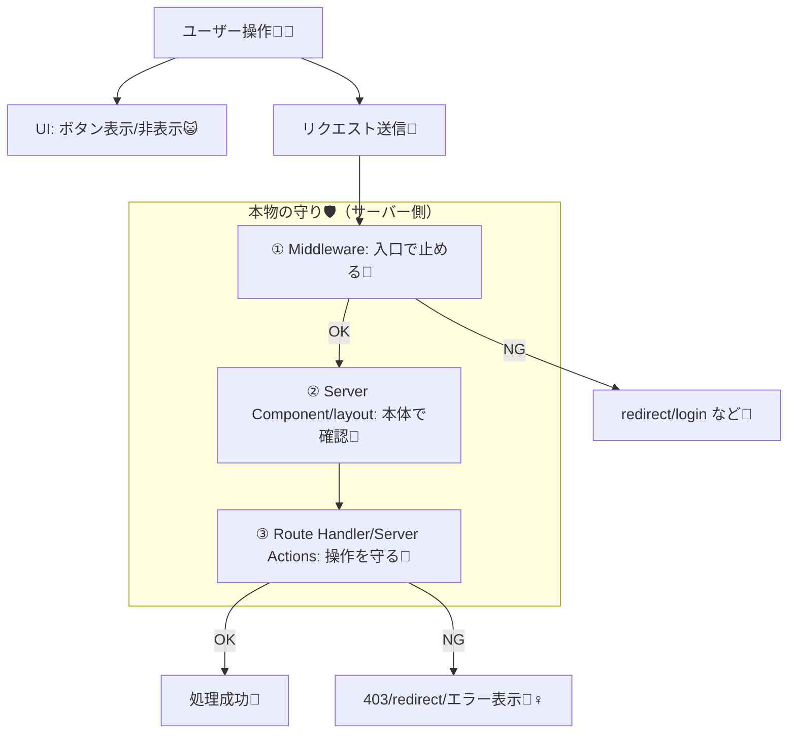

# 第187章：復習：認証は“UI”より“ガード”が本体🧱

認証って、ログイン画面を「作ること」よりも、**「入っちゃダメな人を絶対に通さない仕組み（ガード）」を作ること**が本体だよ〜！😺✨
ボタンを隠す・ページを見えなくする…だけだと、簡単に突破されちゃうの🥲💥

---

## 1) “UIだけ認証”が危ない理由😱🚨

たとえば…

* ✅ 画面では「編集ボタン」が非表示になってる
* ❌ でも、APIやServer Actionが**誰でも叩ける**ままだと…
  → URL直打ち or DevToolsでリクエスト作って **編集できちゃう**😇💣

つまり…
**UIは“親切”のため**で、
**安全は“サーバー側ガード”で守る**のが大前提だよ！🛡️✨

---

## 2) ガードは「3段構え」で考えるのがラク😎🧱🧱🧱



* **① 入口ガード：Middleware**（ルートに入る前の門番）🧤
* **② 中身ガード：Server Component / layout**（ページ本体で最終確認）🧊
* **③ 操作ガード：Route Handler / Server Actions**（更新・削除など“操作”の守り）🚪

図で見るとこんな感じ👇💡



---

## 3) それぞれの役割（ここがテストに出る😆📌）

### ① Middleware：まず“入場”を止める🧤🚦

* **向いてる**：`/dashboard` とか「ログイン必須ゾーン」への入場制限🏰
* **気持ち**：未ログインなら**ページ描画すらさせず**ログインへ送る📮

---

### ② Server Component / layout：ページ側で“最終確認”🧊✅

Middlewareがあっても、**ページ側でも確認しておく**と安心感MAX🥹🛡️
（設定ミス・例外ルート・直アクセス…ぜんぶあり得るので💦）

* **向いてる**：ページ表示条件（例：ログイン必須、権限必須）👑

---

### ③ Route Handler / Server Actions：いちばん大事な“操作”の守り🚪💥

本当に危ないのはここ！😱
「更新」「削除」「投稿」みたいな操作は、**UIで隠してても関係なく叩かれる**前提で守るよ🧱✨

* **向いてる**：CRUD全部（特に Update/Delete）✏️🗑️
* **やること**：サーバーでセッション確認 → 権限確認 → ダメなら拒否🙅‍♀️

---

## 4) ミニ実装テンプレ（“守りの型”）🧩✨

> ※Auth.js（NextAuth系）の書き方はプロジェクト構成で少し変わるけど、**考え方はこれ**でOKだよ〜！😺

### A) Middlewareで「/dashboard配下」をログイン必須にする🧤

```ts
// middleware.ts（例）
import { NextResponse } from "next/server";
// 例：Auth.js側で用意した「セッション取得関数」を使う想定
import { auth } from "@/auth";

export default auth((req) => {
  const isLoggedIn = !!req.auth;

  if (!isLoggedIn) {
    const url = req.nextUrl.clone();
    url.pathname = "/login";
    url.searchParams.set("from", req.nextUrl.pathname);
    return NextResponse.redirect(url);
  }

  return NextResponse.next();
});

export const config = {
  matcher: ["/dashboard/:path*"],
};
```

---

### B) layoutで“ページ本体の最終確認”🧊

```tsx
// app/dashboard/layout.tsx（例）
import { redirect } from "next/navigation";
import { auth } from "@/auth";

export default async function DashboardLayout({
  children,
}: {
  children: React.ReactNode;
}) {
  const session = await auth();

  if (!session) {
    redirect("/login");
  }

  return (
    <div>
      <h1>Dashboard</h1>
      {children}
    </div>
  );
}
```

---

### C) Server Actions / Route Handlerで“操作を守る”🚪🛡️

「ボタン押せたか」じゃなくて、**サーバーが許可したか**だけが正義！😼✨

```ts
// app/api/todos/[id]/route.ts（例）
import { NextResponse } from "next/server";
import { auth } from "@/auth";

export async function DELETE(
  _req: Request,
  { params }: { params: Promise<{ id: string }> }
) {
  const { id } = await params;
  const session = await auth();
  if (!session) {
    return NextResponse.json({ error: "Unauthorized" }, { status: 401 });
  }

  // ここで「そのTODOがこのユーザーの物か？」みたいな所有者チェックも必須👏
  // if (!isOwner(session.user.id, params.id)) return 403

  // delete...
  return NextResponse.json({ ok: true });
}
```

---

## 5) よくある落とし穴チェック✅🕳️

* ❌ 「ボタン非表示にしたから安全」→ **安全じゃない**😇
* ❌ 「ページでセッション見たからOK」→ **操作も必ず守る**🚪
* ❌ 「ログインしてるかだけ見た」→ **“権限（admin等）”も別で見る**👑
* ✅ 「入口 + 本体 + 操作」3点セットで安心🧱🧱🧱✨

---

## 6) ミニ演習（15分）⏳🌸

次の3つを“全部”できたら勝ち〜！🎮🎉

1. `/dashboard` に未ログインで入ったら `/login` に飛ばす🧤🚦
2. `/dashboard` の `layout.tsx` でも未ログインを `redirect()` する🧊
3. `/api/todos/[id]` の `DELETE` を未ログインなら `401` にする🚪🛡️

できたら、最後に自分にご褒美スイーツ🍰でOKです😆💕

---

## まとめ🍀✨

* 認証の本体は **UIじゃなく“ガード”** 🧱🔑
* ガードは **入口（Middleware）→本体（Server）→操作（API/Actions）** の順で固める💪
* 特に大事なのは **“操作の守り”**（更新・削除は絶対サーバーで止める）🚪🛡️

次の章からは、ここまでの守りを土台にして「認証付きTODO」を完成形に寄せていくよ〜！😺🔥
