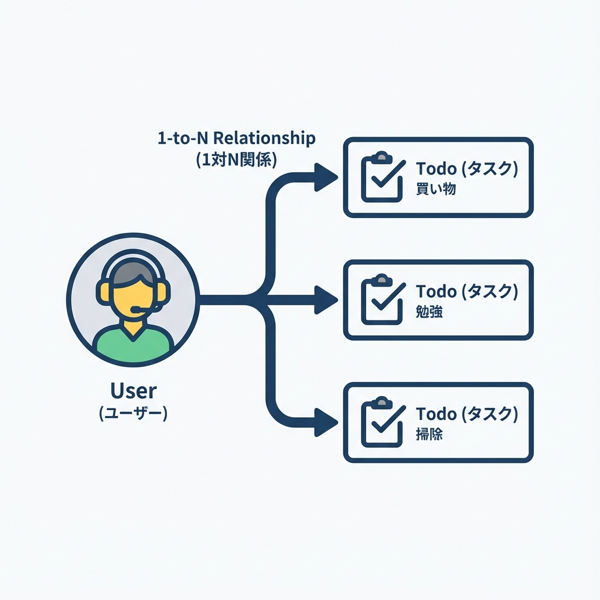
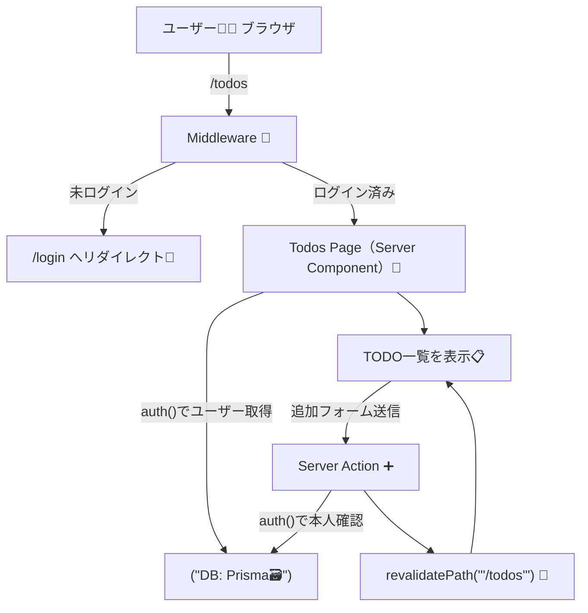
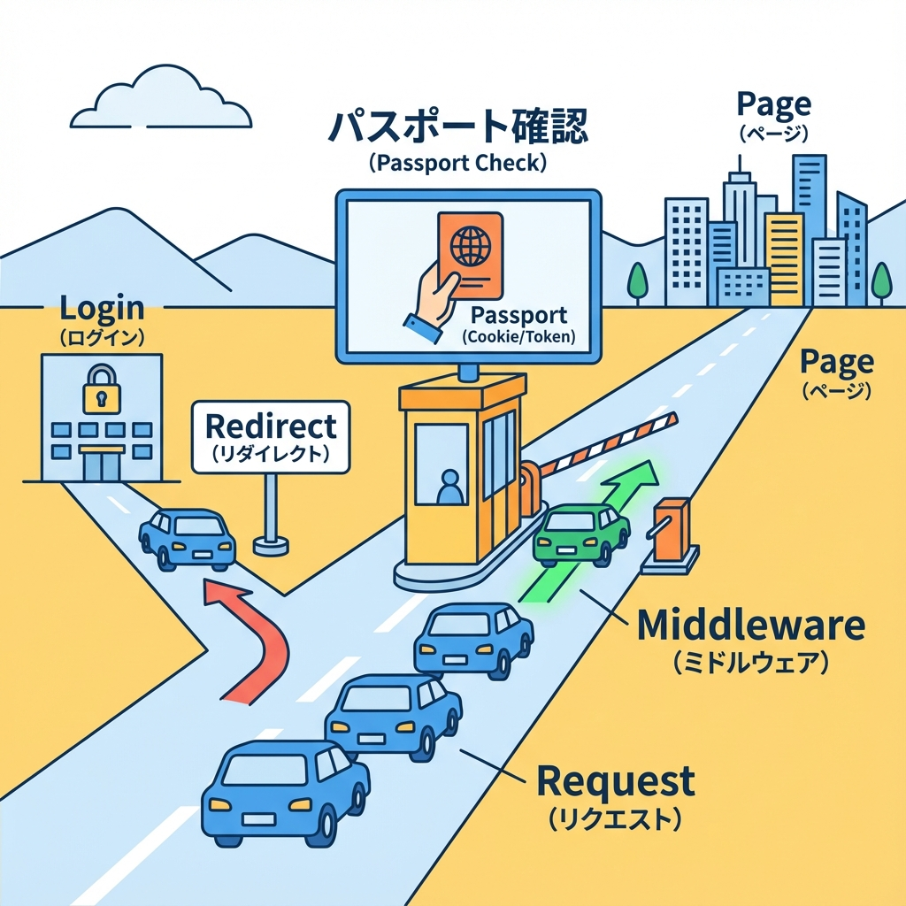

# 第188章：ミニ課題：認証付きTODOの土台完成🔐

この章は「**ログインしてる人だけが、自分のTODOを見れて、追加できる**」ところまで仕上げるミニ課題だよ〜！🎀✨
（“土台完成”なので、見た目はシンプルでOK👍）

---

## 🎯 この章のゴール（できたら合格💮）

* `/todos` は **未ログインだと /login に飛ばされる** 🚪💨
* ログイン中は **自分のTODOだけ** 見える👀📋
* TODOを **追加できる** ➕✨（Server ActionsでOK！）
* DBには `Todo.userId` が入って、**誰のTODOか** が分かる🗃️🔗

---

## 🧠 全体の流れ（まずは地図🗺️）





`auth()` をどこでも使えるのが v5 系の強みだよ〜！✨ ([Auth.js][1])

---

## ✅ 手順1：Todoを「ユーザーにひもづけ」しよう🔗🗃️

`prisma/schema.prisma` の `Todo` に `userId` を追加して、`User` と関連を作るよ💡
（すでにあるなら確認だけでOK👌）

```prisma
model User {
  id    String @id @default(cuid())
  email String @unique
  name  String?

  todos Todo[]
}

model Todo {
  id        String   @id @default(cuid())
  title     String
  done      Boolean  @default(false)
  createdAt DateTime @default(now())

  userId    String
  user      User     @relation(fields: [userId], references: [id], onDelete: Cascade)

  @@index([userId])
}
```

マイグレーションも実行〜！🛠️✨

```bash
npx prisma migrate dev -n add_todo_user
```

---

## ✅ 手順2：session に `user.id` を入れて、TODOで使えるようにする🪪✨

Auth.js はデフォだと session に `name/email/image` だけ出すことが多いから、**TODOの紐付け用に userId を足す**よ🎯
公式も「user id を session に追加」は定番って言ってるやつ！ ([Auth.js][2])

`auth.ts` の `callbacks` に追加👇（すでにあるなら追記でOK）

```ts
// auth.ts（例：すでにある設定に callbacks を足す）
import NextAuth from "next-auth"

export const { handlers, signIn, signOut, auth } = NextAuth({
  providers: [
    // 既存のプロバイダ設定（そのままでOK）
  ],
  callbacks: {
    jwt({ token, user }) {
      if (user) token.id = user.id
      return token
    },
    session({ session, token }) {
      if (session.user && token.id) {
        session.user.id = token.id as string
      }
      return session
    },
  },
})
```

TypeScript が怒る場合は型も足してあげよ〜🧷✨

```ts
// types/next-auth.d.ts
import { DefaultSession } from "next-auth"

declare module "next-auth" {
  interface Session {
    user: {
      id: string
    } & DefaultSession["user"]
  }
}

declare module "next-auth/jwt" {
  interface JWT {
    id?: string
  }
}
```

---

## ✅ 手順3：/todos を「未ログインなら弾く」🔐🚪

### 3-1) Middlewareで守る（おすすめ💪）




Auth.js の `auth` は Middleware でも使えるよ〜！ ([Auth.js][1])

```ts
// middleware.ts
import { auth } from "@/auth"
import { NextResponse } from "next/server"

export default auth((req) => {
  const isTodos = req.nextUrl.pathname.startsWith("/todos")
  const isLoggedIn = !!req.auth

  if (isTodos && !isLoggedIn) {
    const url = new URL("/login", req.nextUrl)
    url.searchParams.set("from", req.nextUrl.pathname)
    return NextResponse.redirect(url)
  }

  return NextResponse.next()
})

export const config = {
  matcher: ["/todos/:path*"],
}
```

> ちなみに Auth.js は `auth.ts` を作って `handlers/auth/signIn/signOut` を export → `/app/api/auth/[...nextauth]/route.ts` で GET/POST を export するのが基本形だよ〜🧩（もうできてる前提でOK） ([Auth.js][3])

---

## ✅ 手順4：認証付きTODOページを作る📋✨

### 4-1) Prisma クライアント（なければ）

```ts
// src/lib/prisma.ts（パスは好みでOK）
import { PrismaClient } from "@prisma/client"

const globalForPrisma = globalThis as unknown as { prisma?: PrismaClient }

export const prisma = globalForPrisma.prisma ?? new PrismaClient()

if (process.env.NODE_ENV !== "production") globalForPrisma.prisma = prisma
```

### 4-2) Server Actions（追加だけでもOK！➕）

```ts
// app/todos/actions.ts
"use server"

import { auth } from "@/auth"
import { prisma } from "@/lib/prisma"
import { revalidatePath } from "next/cache"

export async function addTodo(formData: FormData) {
  const session = await auth()
  const userId = session?.user?.id
  if (!userId) throw new Error("Unauthenticated")

  const title = String(formData.get("title") ?? "").trim()
  if (!title) return

  await prisma.todo.create({
    data: { title, userId },
  })

  revalidatePath("/todos")
}

export async function toggleTodo(formData: FormData) {
  const session = await auth()
  const userId = session?.user?.id
  if (!userId) throw new Error("Unauthenticated")

  const id = String(formData.get("id") ?? "")
  const done = String(formData.get("done") ?? "") === "true"

  // ★ ここが超大事：自分のTODOだけ更新できるようにする🔐
  const todo = await prisma.todo.findFirst({ where: { id, userId } })
  if (!todo) throw new Error("Not found")

  await prisma.todo.update({
    where: { id },
    data: { done },
  })

  revalidatePath("/todos")
}
```

### 4-3) /todos ページ（自分のTODOだけ表示👀）

```tsx
// app/todos/page.tsx
import { auth } from "@/auth"
import { prisma } from "@/lib/prisma"
import { redirect } from "next/navigation"
import { addTodo, toggleTodo } from "./actions"

export default async function TodosPage() {
  const session = await auth()
  const userId = session?.user?.id
  if (!userId) redirect("/login")

  const todos = await prisma.todo.findMany({
    where: { userId },
    orderBy: { createdAt: "desc" },
  })

  return (
    <main style={{ maxWidth: 560, margin: "40px auto", padding: 16 }}>
      <h1>マイTODO 📝✨</h1>

      <form action={addTodo} style={{ display: "flex", gap: 8, marginTop: 12 }}>
        <input
          name="title"
          placeholder="TODOを入力…"
          style={{ flex: 1, padding: 10 }}
        />
        <button type="submit" style={{ padding: "10px 14px" }}>
          追加➕
        </button>
      </form>

      <ul style={{ marginTop: 16, padding: 0, listStyle: "none" }}>
        {todos.map((t) => (
          <li
            key={t.id}
            style={{
              display: "flex",
              alignItems: "center",
              gap: 10,
              padding: "10px 0",
              borderBottom: "1px solid #ddd",
            }}
          >
            <form action={toggleTodo}>
              <input type="hidden" name="id" value={t.id} />
              <input type="hidden" name="done" value={String(!t.done)} />
              <button type="submit" style={{ width: 40 }}>
                {t.done ? "✅" : "⬜"}
              </button>
            </form>

            <span style={{ textDecoration: t.done ? "line-through" : "none" }}>
              {t.title}
            </span>
          </li>
        ))}
      </ul>

      <p style={{ marginTop: 16, opacity: 0.7 }}>
        ログイン中：{session.user?.email ?? "（不明）"} 💌
      </p>
    </main>
  )
}
```

---

## 🧪 動作チェック（これ通れば完成🎉）

1. 未ログインで `/todos` に行く → `/login` に飛ぶ🚪💨
2. ログインする → `/todos` で一覧が見える👀
3. TODOを追加 → すぐ反映される➕🔄
4. トグル（✅/⬜） → 自分のTODOだけ更新できる🔐

---

## 🌟 仕上げのひとこと（この章の“勝ち筋”🏆）

認証付きで一番大事なのはこれ👇

* **「表示」も「更新」も、必ず userId で絞る**（UIじゃなくサーバー側で！）🔒✨
* `auth()` を入口にして、**毎回ログイン中か確認**する😼🛡️ ([Auth.js][4])

ここまでできたら、もう「認証付きアプリ」感ぜんぜん出てるよ〜！🎀🎉

[1]: https://authjs.dev/reference/nextjs "Auth.js | Nextjs"
[2]: https://authjs.dev/guides/extending-the-session "Auth.js | Extending The Session"
[3]: https://authjs.dev/getting-started/installation "Auth.js | Installation"
[4]: https://authjs.dev/getting-started/session-management/protecting "Auth.js | Protecting"
