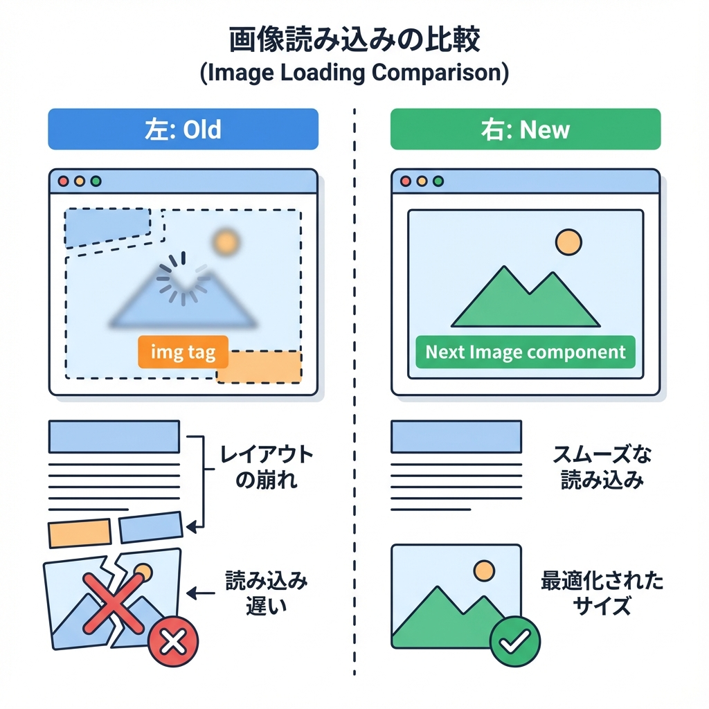
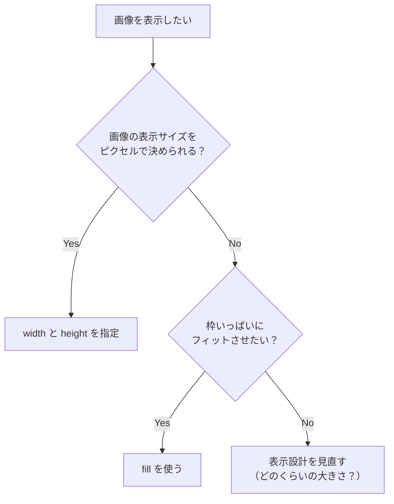

# 第189章：`next/image` の考え方（速くて綺麗）📸

この章では **Next.js の `<Image />`（`next/image`）** を使って、画像を「速く・きれいに・レイアウト崩れ少なく」表示する基本をつかむよ〜🥰🫶
（ふつうの `` との違いがわかると、一気にラクになるやつ！✨）

---

## 1) `` と `<Image>` のざっくり違い🆚

* ``：そのまま表示するだけ（自由だけど、重くなりやすい💦）
* `<Image>`：**いい感じに最適化してくれる**（サイズ・遅延読み込み・レイアウト安定など）📈✨ ([Next.js][1])




---

## 2) 何が「うれしい」の？（メリット）🎁✨

`next/image` の `<Image>` は、だいたい次を助けてくれるよ👇

* **端末に合うサイズ**で配信してくれる（ムダにデカい画像を送らない）📱💻 ([Next.js][1])
* 画像読み込み中の**ガタッ（レイアウトシフト）**を減らす🧱✨ ([Next.js][1])
* **画面に入ったら読み込む（遅延読み込み）**が基本で速い🚀 ([Next.js][1])
* リモート画像も、必要に応じて最適化できる🌍✨ ([Next.js][1])

---

## 3) まず最重要ルール：`width/height` か `fill` どっちか！🧠🧷

基本はこのどっちかを守るだけでOKだよ〜🙆‍♀️✨

* ✅ **`width` と `height` を指定する**
* ✅ もしくは **`fill` を使う**（サイズ不明・枠にフィットさせたい時）
* ✅ **静的インポート**なら `width/height` 省略できることもあるよ（Nextが画像情報を持てる） ([Next.js 16 日本語ドキュメント][2])

---

## 図解：`width/height` と `fill` の選び方🗺️



---

## 4) ハンズオン①：`public/` の画像を `<Image>` で出す📂🖼️

### 手順🧸

1. プロジェクトの `public/` に画像を置く
   例：`public/hero.jpg`
2. `app/page.tsx` に `<Image>` を書く

```tsx
import Image from 'next/image';

export default function Page() {
  return (
    <main style={{ padding: 24 }}>
      <h1>Imageテスト📸</h1>

      <Image
        src="/hero.jpg"
        alt="ヒーロー画像"
        width={900}
        height={500}
      />
    </main>
  );
}
```

ポイント💡

* `alt` はだいたい必須だと思ってOK（アクセシビリティ的にも◎）🫶
* `width/height` は「表示サイズ」じゃなくて、**比率と領域確保**に使われるイメージだよ〜🧱 ([Next.js 16 日本語ドキュメント][2])

---

## 5) ハンズオン②：枠にフィットさせたいなら `fill` 🧱✨

カードの枠とか、バナー枠とか、「ここにピッタリ入れたい！」時あるよね😊
そんなときは `fill` が便利！

```tsx
import Image from 'next/image';

export default function Page() {
  return (
    <main style={{ padding: 24 }}>
      <h1>fillテスト🧩</h1>

      <div
        style={{
          position: 'relative',
          width: 360,
          height: 240,
          borderRadius: 16,
          overflow: 'hidden',
        }}
      >
        <Image
          src="/hero.jpg"
          alt="枠にフィット"
          fill
          style={{ objectFit: 'cover' }}
          sizes="360px"
        />
      </div>
    </main>
  );
}
```

ここ大事〜！💥

* `fill` を使う親要素は、だいたい `position: relative` が必要🧷
* `objectFit: 'cover'` は「はみ出してもいいから綺麗に埋める」感じ🌸
* `sizes` を書くと「どの幅で表示されるか」をNextが推測しやすくなるよ（画像選びが上手になる）📏✨

---

## 6) 外部URL画像を使うときの注意（設定が必要）🌍⚙️

外の画像URLをそのまま `src="https://..."` で使うと、**許可設定が必要**なことが多いよ〜（安全のため）🛡️
`next.config.js` の `images.remotePatterns` で許可するのが定番！ ([Next.js][3])

```js
// next.config.js
/** @type {import('next').NextConfig} */
const nextConfig = {
  images: {
    remotePatterns: [
      {
        protocol: 'https',
        hostname: 'images.example.com',
        pathname: '/**',
      },
    ],
  },
};

module.exports = nextConfig;
```

---

## 7) 「この画像は最優先で読みたい！」なら `priority` 🚀⭐

トップの大きい画像（いわゆるヒーロー画像）みたいに、**最初に見える画像**は `priority` を付けると体験が良くなりやすいよ✨

```tsx
<Image
  src="/hero.jpg"
  alt="最初に見える画像"
  width={900}
  height={500}
  priority
/>
```

※使いすぎ注意！「本当に最初に必要なやつ」だけでOK😊🫶

---

## 8) ちょい運用の話：本番は `sharp` がオススメ🧰✨

自分でサーバー運用（`next start`）する場合、画像最適化のために **`sharp` を入れるのが推奨**されてるよ〜📦✨ ([Next.js][4])

```bash
npm i sharp
```

---

## 9) よくあるハマり集（先に潰す）🪤😵‍💫

* ❌ `width` だけ指定（`height` なし） → レイアウトが不安定になりやすい
* ❌ `fill` なのに親が `position: relative` じゃない → うまく表示されない
* ❌ 外部画像の `hostname` 許可してない → エラーになりがち ([Next.js][3])
* 🔐 外部画像が認証必須（ヘッダーが必要） → デフォルト最適化がヘッダー転送しないことがあるので注意（必要なら `unoptimized` を検討） ([Next.js][5])

---

## 10) ミニ練習🎯✨

1. `public/` に好きな画像を1枚置いて、`width/height` 指定で表示📸
2. 同じ画像を `fill` でも表示して、`objectFit: 'cover'` と `contain` を切り替えて見た目を比較👀✨
3. いちばん上の画像だけ `priority` を付けて体感を比べる⭐

---

## まとめ🎀

* Next.jsの画像は基本 **`<Image />`** を使うと強い📸✨ ([Next.js][1])
* **`width/height` or `fill`** のどっちかは守る🧱 ([Next.js 16 日本語ドキュメント][2])
* 外部画像は `remotePatterns` で許可する🛡️ ([Next.js][3])
* 本番運用なら `sharp` も視野📦✨ ([Next.js][4])

次の章（190章）で「サイズ指定とレイアウト崩れ対策」をもっと深掘りできる感じだよ〜🫶✨

[1]: https://nextjs.org/docs/app/getting-started/images?utm_source=chatgpt.com "Getting Started: Image Optimization"
[2]: https://nextjsjp.org/docs/app/api-reference/components/image?utm_source=chatgpt.com "Image コンポーネント - Next.js 16 日本語ドキュメント"
[3]: https://nextjs.org/docs/messages/next-image-unconfigured-host?utm_source=chatgpt.com "`next/image` Un-configured Host"
[4]: https://nextjs.org/docs/messages/sharp-missing-in-production?utm_source=chatgpt.com "Sharp Missing In Production"
[5]: https://nextjs.org/docs/app/api-reference/components/image?utm_source=chatgpt.com "Image Component"
