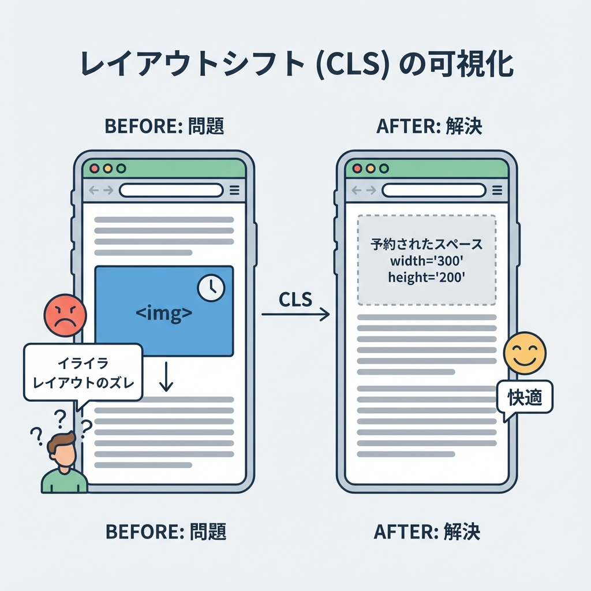
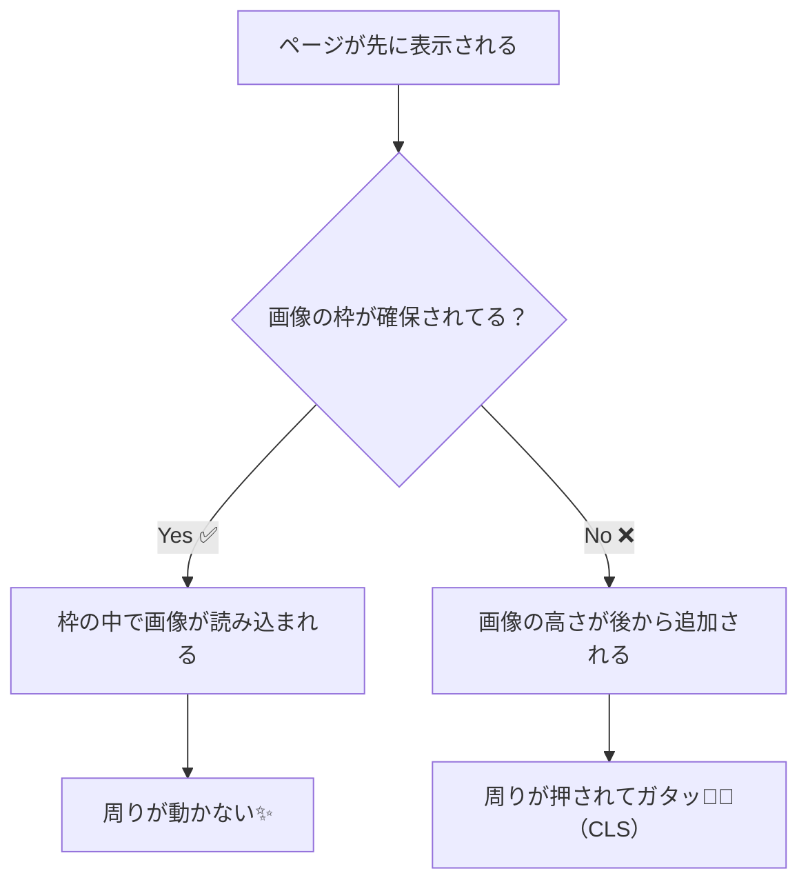

# 第190章：画像のサイズ指定とレイアウト崩れ対策🧱

画像が読み込まれる瞬間に、テキストやボタンが「ガタッ😵‍💫」って動くやつ…あれを止めます✨
ポイントは超シンプルで、

* **画像の“場所（枠）”を先に確保しておく**📦
* Next.js の `<Image />` では **`width/height` か `fill` を必ず使う**✅

これだけで、見た目も体験も一気にプロっぽくなります💅✨
（Web指標の CLS 対策にも直結だよ〜）([web.dev][1])

---

## 1) レイアウトが崩れる理由（超ざっくり）🧠



画像は「あとから」読み込まれることが多いです📶
もし最初に高さが決まってないと、読み込み完了時に画像のぶんだけ下が押されて **画面がズレます**😵‍💫（= CLS）

### 図解（イメージ）🪄



---

## 2) Next.js流：崩れないための2択✌️

### ✅ A. `width` と `height` で“比率”を先に確保する（基本）

`width/height` は「表示サイズ」じゃなくて、**元画像のサイズ（intrinsic）**として扱われ、ブラウザが **正しい縦横比の枠を先に確保**できます🧠✨([Next.js][2])

* ✅ サムネ・記事画像・プロフィール画像などに強い
* ✅ その上で CSS で「表示サイズ」は自由に変えられる

### ✅ B. `fill` + 親要素で“枠”を作る（カード/ヒーローに強い）

`fill` は「親要素いっぱいに広げる」モードです🧩
その代わり、**親側でサイズ（高さ or aspect-ratio）を決めないと破綻**します⚠️([Next.js][2])

さらに `fill` でレスポンシブにするなら、**`sizes` はほぼ必須**です✅
ないと「画面いっぱい（100vw）だと思われて」デカい画像を取りがちになります💦([Next.js][2])

---

## 3) まずは実践！“崩れないカード一覧”を作る📚✨

### 準備🧺

`public/images/` を作って、適当な画像を3枚入れてね👇（例）

* `public/images/cafe.jpg`
* `public/images/sea.jpg`
* `public/images/city.jpg`

---

## 4) パターンA：`width/height` + `style` でレスポンシブ（おすすめ）📌

`app/ch190/page.tsx` を作成👇

```tsx
import Image from "next/image";

const cards = [
  { src: "/images/cafe.jpg", title: "カフェ☕", desc: "写真が先に枠を確保してくれるよ✨" },
  { src: "/images/sea.jpg", title: "海🌊", desc: "読み込み中でもガタつきにくい！" },
  { src: "/images/city.jpg", title: "街🌆", desc: "一覧表示が気持ちいい〜😆" },
];

export default function Page() {
  return (
    <main style={{ maxWidth: 920, margin: "0 auto", padding: 24 }}>
      <h1 style={{ fontSize: 28, margin: "0 0 12px" }}>第190章：画像でレイアウト崩れ防止🧱🖼️</h1>
      <p style={{ margin: "0 0 20px" }}>
        <code>width/height</code> で比率を確保して、表示サイズはCSSでコントロールするよ〜✨
      </p>

      <section
        style={{
          display: "grid",
          gap: 16,
          gridTemplateColumns: "repeat(auto-fit, minmax(240px, 1fr))",
        }}
      >
        {cards.map((c) => (
          <article
            key={c.src}
            style={{
              border: "1px solid #e5e5e5",
              borderRadius: 16,
              overflow: "hidden",
              background: "white",
            }}
          >
            <Image
              src={c.src}
              alt={c.title}
              width={1200}
              height={800}
              sizes="(max-width: 600px) 100vw, (max-width: 1000px) 50vw, 33vw"
              style={{ width: "100%", height: "auto" }}
            />
            <div style={{ padding: 14 }}>
              <h2 style={{ margin: 0, fontSize: 18 }}>{c.title}</h2>
              <p style={{ margin: "8px 0 0", lineHeight: 1.6 }}>{c.desc}</p>
            </div>
          </article>
        ))}
      </section>
    </main>
  );
}
```

### ここが“崩れない核心”💡

* `width={1200} height={800}` → **縦横比(3:2)の枠を先に確保**してくれる🧠([Next.js][2])
* `style={{ width: "100%", height: "auto" }}` → **表示はカード幅に合わせて伸縮**（でも比率は保持）([Next.js][2])
* `sizes="..."` → **画面幅に応じて適切なサイズを取りに行く**（地味に超大事）([Next.js][2])

---

## 5) パターンB：`fill` + “枠（aspect-ratio）”で揃える🎴✨

「サムネを全部同じ高さに揃えたい😍」ならこっちが強い！

### `app/ch190/fill/page.tsx`

```tsx
import Image from "next/image";
import styles from "./page.module.css";

const cards = [
  { src: "/images/cafe.jpg", title: "カフェ☕" },
  { src: "/images/sea.jpg", title: "海🌊" },
  { src: "/images/city.jpg", title: "街🌆" },
];

export default function Page() {
  return (
    <main className={styles.main}>
      <h1 className={styles.h1}>fillで“キレイに整列”🧱✨</h1>

      <section className={styles.grid}>
        {cards.map((c) => (
          <article key={c.src} className={styles.card}>
            <div className={styles.thumb}>
              <Image
                src={c.src}
                alt={c.title}
                fill
                sizes="(max-width: 600px) 100vw, (max-width: 1000px) 50vw, 33vw"
                style={{ objectFit: "cover" }}
              />
            </div>
            <div className={styles.body}>
              <h2 className={styles.h2}>{c.title}</h2>
              <p className={styles.p}>枠は固定、画像は中でトリミング✨</p>
            </div>
          </article>
        ))}
      </section>
    </main>
  );
}
```

### `app/ch190/fill/page.module.css`

```css
.main {
  max-width: 920px;
  margin: 0 auto;
  padding: 24px;
}

.h1 {
  font-size: 28px;
  margin: 0 0 16px;
}

.grid {
  display: grid;
  gap: 16px;
  grid-template-columns: repeat(auto-fit, minmax(240px, 1fr));
}

.card {
  border: 1px solid #e5e5e5;
  border-radius: 16px;
  overflow: hidden;
  background: white;
}

.thumb {
  position: relative;
  width: 100%;
  aspect-ratio: 16 / 9; /* ここが“枠予約”の超重要ポイント✨ */
}

.body {
  padding: 14px;
}

.h2 {
  margin: 0;
  font-size: 18px;
}

.p {
  margin: 8px 0 0;
  line-height: 1.6;
}
```

### 重要メモ📝

* `fill` のときは **親要素にサイズ（ここでは aspect-ratio）を必ず用意**する！([Next.js][2])
* `sizes` は **`fill` のとき特に大事**（ないと無駄に大きい画像を落としがち）([Next.js][2])

---

## 6) よくある“ズッコケ”集😇（ここだけ押さえよ！）

* ❌ `fill` なのに親が `position: relative` じゃない
* ❌ 親に高さ/`aspect-ratio` がなくて、画像の枠が 0 になりがち
* ❌ `sizes` を省略して、毎回デカい画像をダウンロード💦([Next.js][2])
* ❌ リモート画像で `width/height` を渡さない（Next は比率計算できない）([Next.js][2])

---

## 7) ちょい上級：体感速度を上げたい時の小ワザ🪄

### 🫧 ぼかしプレースホルダー（読み込み中の“寂しさ”を消す）

`placeholder="blur"` を使うと、読み込み中にふんわり表示できるよ〜✨
（静的 import 画像なら `blurDataURL` が自動で付くこともあるよ）([Next.js][2])

### 🚀 ヒーロー画像は先に読みたい（でも2025は注意！）

最新ドキュメントでは、**Next.js 16 から `priority` は非推奨**で、代わりに `preload` などが推奨になってるよ📌([Next.js][2])
（ヒーロー画像＝LCPになりやすいので、必要なときだけ使おうね👑）

---

## 8) ミニチェック✅（3問だけ！）

1. 画像でレイアウトが崩れる主原因は？
   → **画像の枠が先に確保されてないから**😵‍💫([web.dev][1])

2. `fill` のとき、親要素で必ず用意したいものは？
   → **サイズ（高さ or aspect-ratio） + `position: relative`**📦([Next.js][2])

3. `fill` + レスポンシブのとき `sizes` が大事なのはなぜ？
   → **ブラウザが適切な画像サイズを選べるようにするため**（省略すると 100vw 前提になりがち）([Next.js][2])

---

ここまでできたら、第190章はクリア🎉🖼️✨
次に「この画像を記事OGPにも使いたい！」みたいになってきたら、SEO周りも一気に楽しくなるよ〜😆

[1]: https://web.dev/articles/optimize-cls?utm_source=chatgpt.com "Optimize Cumulative Layout Shift | Articles"
[2]: https://nextjs.org/docs/app/api-reference/components/image "Components: Image Component | Next.js"
