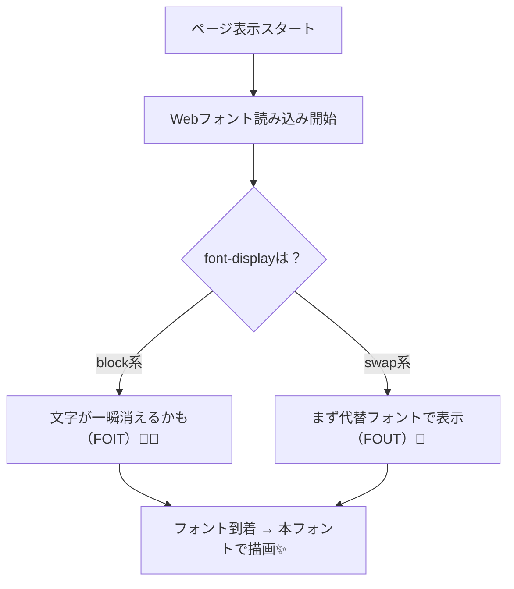

# 第192章：フォント最適化の考え方（読み込み体験）🔤

## 今日のゴール🎯

* Webフォントが「遅い・ガタつく」原因をざっくり理解する😊
* Next.js の **`next/font`** で、**速く・きれいに**フォントを読み込めるようになる🌈
* ついでに「ちらつき（FOIT/FOUT）」も怖くなくなる💪✨

---

## なんでフォントって“体験”に効くの？😵‍💫🌀

Webフォントは、読み込みが遅いと…

* 文字が一瞬 **消える**（FOIT）😶‍🌫️
* 先に別フォントで出て **あとで切り替わってちらつく**（FOUT）👀💦
* 文字幅が変わって **レイアウトがガタッ**（CLSっぽいやつ）📐😫

つまり「文章が主役の画面」ほど、フォントの読み込みは体験に直撃するよ〜📚✨

---

## Next.js が用意してくれてる解決策：`next/font`🪄

Next.js の **`next/font`** はフォントを自動で最適化してくれて、さらに **外部へのフォント取得リクエストを減らして**パフォーマンスとプライバシーも良くしてくれるよ🫶✨ ([Next.js][1])

しかも…

* **Google Fonts を自動でセルフホスト**（同じドメインから配信）できる💡 ([Next.js][1])
* **レイアウトシフトを抑える**設計になってる📦✨ ([Next.js][1])

---

## 図解：読み込み方で“見え方”が変わるよ⏳👀




※ `font-display` は、フォントが未読込の間に「どう表示するか」を決める仕組みだよ📌 ([MDNウェブドキュメント][2])
（`swap` だと “すぐ表示して、あとで差し替え” の方向になりやすい💡） ([MDNウェブドキュメント][2])

---

## 実装①：Google Fonts を `next/font/google` で入れる（いちばん定番）🎀

**やる場所：`app/layout.tsx`（Root Layout）**
ここに入れるとアプリ全体に効くよ〜🏠✨ ([Next.js][1])

```tsx
// app/layout.tsx
import type { Metadata } from "next";
import { Geist, Geist_Mono } from "next/font/google";
import "./globals.css";

const geistSans = Geist({
  subsets: ["latin"],
  display: "swap",
  variable: "--font-sans",
});

const geistMono = Geist_Mono({
  subsets: ["latin"],
  display: "swap",
  variable: "--font-mono",
});

export const metadata: Metadata = {
  title: "Font Demo",
};

export default function RootLayout({
  children,
}: {
  children: React.ReactNode;
}) {
  return (
    <html lang="ja" className={`${geistSans.variable} ${geistMono.variable}`}>
      <body>{children}</body>
    </html>
  );
}
```

### ✅ポイント（超大事）🌟

* `subsets` は指定してね！（プリロード関連のエラー回避にもなるよ） ([Next.js][3])
* `display: "swap"` は「まず表示を出す」寄りで体験が良くなりやすい💡（考え方としてね） ([MDNウェブドキュメント][2])
* `variable` を使うと、CSSで扱いやすくて便利🎨 ([Next.js][3])

---

## 実装②：CSS側で “ちゃんと適用” する（variable を使った場合）🧵✨

`variable` は「CSS変数を生やす」だけなので、**font-family を当てる**のも忘れずにね😉
（Next.jsのドキュメントでもこのパターンが紹介されてるよ） ([Next.js][3])

```css
/* app/globals.css */
html {
  font-family: var(--font-sans);
}

code,
pre {
  font-family: var(--font-mono);
}
```

---

## 実装③：ローカルフォント（配布フォント）を使うとき🏡📁

「学校の課題で指定フォント使いたい！」とか「商用フォント入れたい！」のときはこれ👍

### 例：`app/fonts/MyFont.woff2` を置いた場合

```tsx
// app/layout.tsx
import localFont from "next/font/local";
import "./globals.css";

const myFont = localFont({
  src: "./fonts/MyFont.woff2",
  display: "swap",
  variable: "--font-sans",
});

export default function RootLayout({
  children,
}: {
  children: React.ReactNode;
}) {
  return (
    <html lang="ja" className={myFont.variable}>
      <body>{children}</body>
    </html>
  );
}
```

`next/font/local` の `src` は「呼び出してるファイルからの相対パス」で指定するよ📌 ([Next.js][3])

---

## 体験がよくなる “4つのコツ” 💖✨

1. **フォントは増やしすぎない**（基本は 1〜2個）🧸
2. **ウェイト（太さ）を必要最小限にする**（400/700だけ、とか）✂️
3. **`subsets` を入れる**（Google Fonts は自動でサブセット化されて軽くなる考え方）🪶 ([Next.js][3])
4. **`display` を意識する**（`swap / optional` など、表示戦略の違いがある）🧠 ([MDNウェブドキュメント][2])

---

## よくあるハマり😇➡️😵 & 直し方🧯

### ①「subsets 指定してなくて怒られた！」💥

こういう系のエラーね👇
**対処：`subsets: ["latin"]` みたいに入れる**
（もしくは **どうしても無理なら `preload: false`**） ([Next.js][4])

### ②「Google Fonts の取得に失敗した…」🌧️

ネットワークや環境で失敗することもあるから、そういう時は

* フォントをダウンロードして **`next/font/local`** に切り替える
  が強いよ💪（安定する✨）

---

## ミニ練習（5分）⏱️🧡

1. `next/font/google` でフォントを1個入れる🔤
2. `display: "swap"` を付けてみる🔁
3. スマホ回線っぽい速度（ChromeのNetworkをSlowに）で見て、**文字が消える/ちらつく**が減るか観察👀✨

---

## まとめ🎁

* フォントは「見た目」だけじゃなくて **読み込み体験そのもの**に効く📌
* Next.js は `next/font` で **自動最適化 + セルフホスト**ができる🪄 ([Next.js][1])
* `subsets` と `display` を意識できると、もう一段プロっぽい仕上がりになるよ〜🥳💖

[1]: https://nextjs.org/docs/app/getting-started/fonts "Getting Started: Font Optimization | Next.js"
[2]: https://developer.mozilla.org/en-US/docs/Web/CSS/Reference/At-rules/%40font-face/font-display "font-display - CSS | MDN"
[3]: https://nextjs.org/docs/pages/api-reference/components/font "Components: Font | Next.js"
[4]: https://nextjs.org/docs/messages/google-fonts-missing-subsets "Missing specified subset for a `next/font/google` font | Next.js"
