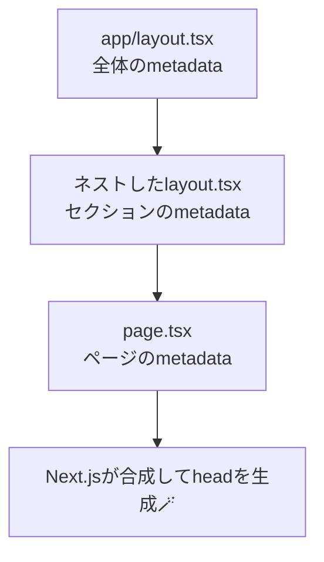
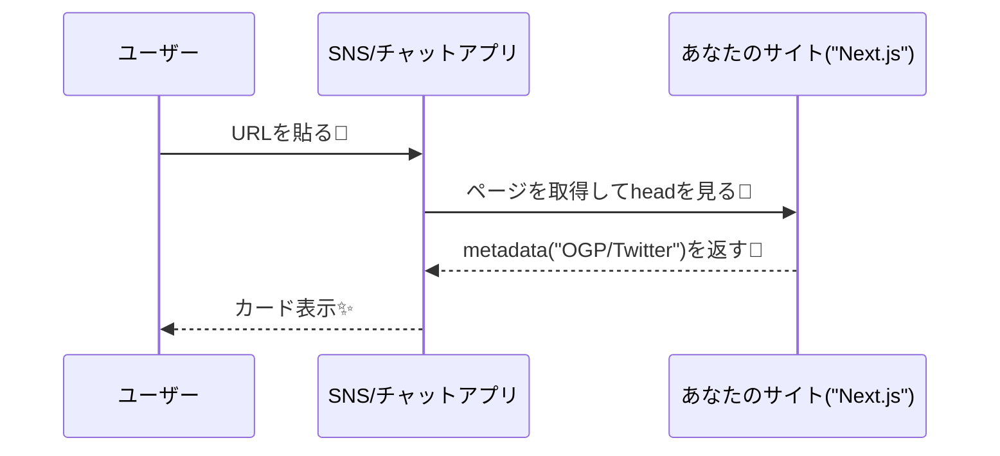

# 第193章：`metadata` を本気で整える（OGP含む）🧡

この章のゴールはこれ👇
**「検索結果に出る説明」**と**「SNSでURL貼った時のカード（OGP）」**を、Next.js流にキレイに揃えることだよ〜！📣💕

---

## 1) `metadata` って何をしてくれるの？🧠🪄


Next.js（App Router）では、`layout.tsx` / `page.tsx` で **`metadata` を export**すると、Next.js が `<head>` のタグを自動生成してくれるよ🧺✨（手で `<meta ...>` をゴリゴリ書かなくてOK！） ([Next.js][1])

しかも大事ポイント👇

* `metadata`（と `generateMetadata`）は **Server Components でだけ使える**（つまり基本 `layout.tsx` と `page.tsx` に書けばOK） ([Next.js][1])

---

## 2) まずは「全ページ共通の土台」を `app/layout.tsx` に置く🏠✨

やりたいのはこの2段構え👇

* **共通（サイト全体）**：タイトルの型、説明、OGPの基本、アイコンなど
* **ページごと**：タイトルや説明を上書き（次章で動的もやるけど、今回は静的に✨）

### ✅ “絶対に最初に入れたい” のが `metadataBase` 🌍

OGP画像や canonical URL は「絶対URL」が必要なことが多いんだけど、`metadataBase` を設定すると **`/og.png` みたいな相対パスで書ける**ようになるよ🫶
（逆に、`metadataBase` なしで相対パスを書くとビルドエラーになることがあるよ⚠️） ([Next.js][2])

---

### 例：`app/layout.tsx`（コピペOK）🧩💖

```tsx
import type { Metadata } from "next";

export const metadata: Metadata = {
  // ✅ ここ超大事：相対URLを「本番URL」に変換するための土台
  metadataBase: new URL("https://example.com"),

  // ✅ タイトルの型（ページ側で title: "About" とか書くとハマる）
  title: {
    default: "はじめてのNextサイト",
    template: "%s | はじめてのNextサイト",
  },

  // ✅ 検索結果の説明（ページごとに上書きもできる）
  description: "Next.jsで作った、やさしいデモサイトです✨",

  // ✅ OGP（SNSカードの基本セット）
  openGraph: {
    type: "website",
    siteName: "はじめてのNextサイト",
    title: "はじめてのNextサイト",
    description: "Next.jsで作った、やさしいデモサイトです✨",
    url: "/", // metadataBaseがあるのでOK（https://example.com/ になる）
    images: [
      {
        url: "/og.png", // metadataBaseがあるのでOK（絶対URLに解決される）
        width: 1200,
        height: 630,
        alt: "はじめてのNextサイトのOGP画像",
      },
    ],
    locale: "ja_JP",
  },

  // ✅ X（旧Twitter）カード
  twitter: {
    card: "summary_large_image",
    title: "はじめてのNextサイト",
    description: "Next.jsで作った、やさしいデモサイトです✨",
    images: ["/og.png"],
  },

  // ✅ 正規URL（重複ページ扱いを避けたい時に大事）
  alternates: {
    canonical: "./", // metadataBase基準で「今のルート」を正規にしやすい
  },

  // ✅ 検索エンジン向けの基本（必要なら調整）
  robots: {
    index: true,
    follow: true,
    googleBot: {
      index: true,
      follow: true,
      "max-image-preview": "large",
      "max-snippet": -1,
      "max-video-preview": -1,
    },
  },

  // ✅ アイコン（あとで file-based に寄せてもOK）
  icons: {
    icon: "/icon.png",
    apple: "/apple-icon.png",
  },
};

export default function RootLayout({
  children,
}: {
  children: React.ReactNode;
}) {
  return (
    <html lang="ja">
      <body>{children}</body>
    </html>
  );
}
```

この書き方の根拠（どのフィールドがあるか）は公式の `metadata` / `openGraph` / `twitter` / `alternates` / `robots` / `icons` の仕様に沿ってるよ📚✨ ([Next.js][2])

---

## 3) ページごとに「タイトルだけ上書き」してみよう✍️🌸

例えば `app/about/page.tsx` でタイトルを変えるだけでも、かなり “それっぽい” 😆✨

```tsx
import type { Metadata } from "next";

export const metadata: Metadata = {
  title: "About",
  description: "このサイトについてのページです🌷",
};

export default function AboutPage() {
  return <main>Aboutページだよ〜😊</main>;
}
```

### ✅ `title.absolute` って何？

親（layout）の `template` を **無視して**完全固定のタイトルにしたいときに使えるよ！
（例：`About | サイト名` じゃなくて `About` だけにしたい、みたいな時） ([Next.js][2])

---

## 4) OGP画像は「設定で書く」より「ファイルで置く」が楽なこと多い🖼️📦

Next.js には **ファイル名ルールでOGP画像を自動設定**できる仕組みがあるよ✨
たとえば👇みたいに置くだけ！

* `app/opengraph-image.png`
* `app/twitter-image.png`

置いた瞬間、Next.js が `<meta property="og:image" ...>` とかを自動で出してくれる🪄 ([Next.js][3])

さらに！
`opengraph-image.alt.txt` を同じ場所に置くと、alt も入るよ🫶 ([Next.js][3])

---

## 5) しくみを図でつかむ🗺️✨（Mermaid）

### ① どこに書いた metadata が効くの？（合成イメージ）🧩



### ② OGPカードが表示される流れ📣



---

## 6) 動作チェック方法（めっちゃ大事）🔍✅

### ブラウザでまず確認👀

* DevToolsで `<head>` を見て

  * `og:title` / `og:description` / `og:image`
  * `twitter:card` / `twitter:image`
    が出てればOK✨

### SNS側のキャッシュもあるよ〜🧊

* Facebook / Messenger 系：**Sharing Debugger** で取り直しできるよ ([Facebook Developers][4])
* X（旧Twitter）系：**Card Validator（cards-dev.x.com）** で「Preview card」相当の再取得が効くことがあるよ（プレビュー表示の仕様は時期で変わりがち） ([アオウル株式会社][5])

---

## 7) よくあるミス集（先に潰す💣→💖）

* **OGP画像が相対パスのまま**で、SNSが読めない
  → `metadataBase` を `app/layout.tsx` に置く！ ([Next.js][2])

* **`title` が毎ページバラバラでブランド感ゼロ**
  → ルートで `template: "%s | サイト名"` を固定！ ([Next.js][2])

* **OGP画像をコードで管理しようとして面倒になる**
  → `opengraph-image.png` / `twitter-image.png` 置く方式も検討！ ([Next.js][3])

---

## 8) ミニ練習（5分）🎯🫶

1. `public/og.png` を用意（1200×630 推奨）🖼️
2. `app/layout.tsx` に `metadataBase` と `openGraph` / `twitter` を入れる✨
3. `app/about/page.tsx` に `metadata` を追加して、タイトルと説明を上書き🌸
4. DevTools の `<head>` で `og:` と `twitter:` を確認👀✅

---

ここまでできたら、**「サイト全体のSEO/OGPの土台」完成**だよ〜！🎉💕
次の章（第194章）で、記事ページみたいに「ページ内容に合わせてOGPを動的に変える」やつに進むと、いっきに強くなる🔥📰

[1]: https://nextjs.org/docs/app/getting-started/metadata-and-og-images "Getting Started: Metadata and OG images | Next.js"
[2]: https://nextjs.org/docs/app/api-reference/functions/generate-metadata "Functions: generateMetadata | Next.js"
[3]: https://nextjs.org/docs/app/api-reference/file-conventions/metadata/opengraph-image "Metadata Files: opengraph-image and twitter-image | Next.js"
[4]: https://developers.facebook.com/tools/debug/?utm_source=chatgpt.com "Sharing Debugger - Meta for Developers - Facebook"
[5]: https://www.corp.aoulu.jp/twitter%E3%82%AB%E3%83%BC%E3%83%89%E3%81%AE%E7%94%BB%E5%83%8F%E3%82%AD%E3%83%A3%E3%83%83%E3%82%B7%E3%83%A5%E3%82%92%E3%82%AF%E3%83%AA%E3%82%A2%E3%81%99%E3%82%8B%E6%96%B9%E6%B3%95/?utm_source=chatgpt.com "Twitterカードの画像キャッシュをクリアする方法"
