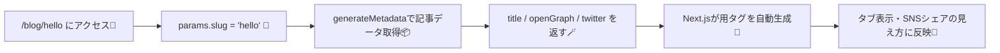

# 第194章：動的メタデータ（記事タイトルをOGPに）📰

この記事ページ（例：`/blog/hello`）みたいに、**URLの内容に合わせて**「タブのタイトル」や「OGP（SNSでシェアしたときのタイトル・説明・画像）」を変えたいときは、**`generateMetadata`** を使うよ〜☺️💡
`generateMetadata` は、ルートパラメータや外部データに応じて **動的にメタデータを返せる**仕組みだよ✨ ([Next.js][1])

---

## 1) まずイメージ図 🧠🗺️




---

## 2) 例：ミニブログで「記事タイトルをOGPにする」構成 🧁✨

作るもの👇

* `app/layout.tsx`：サイト共通の土台（`metadataBase` も置く）🔧
* `app/blog/_data/posts.ts`：ダミー記事データ📚
* `app/blog/[slug]/page.tsx`：記事ページ本体＋`generateMetadata` 📰

---

## 3) 下準備：ダミー記事データを用意する 📚💕

**`app/blog/_data/posts.ts`** を作って、記事を2つだけ置くよ👇

```ts
// app/blog/_data/posts.ts
export type Post = {
  slug: string
  title: string
  description: string
  ogImagePath: string // 例: "/og/hello.jpg"
}

const posts: Record<string, Post> = {
  hello: {
    slug: 'hello',
    title: 'はじめてのNext.jsブログ🎀',
    description: 'App Routerで記事ページを作って、OGPも整えるよ〜✨',
    ogImagePath: '/og/hello.jpg',
  },
  sushi: {
    slug: 'sushi',
    title: 'お寿司とTypeScript🍣',
    description: '型があると安心！お寿司はもっと安心！(？)😋',
    ogImagePath: '/og/sushi.jpg',
  },
}

export async function getPost(slug: string): Promise<Post | null> {
  return posts[slug] ?? null
}
```

📌 画像は `public/og/hello.jpg` と `public/og/sushi.jpg` を置いてね（適当な画像でOK）🖼️✨
（パスは `/og/hello.jpg` みたいに参照できるよ〜）

---

## 4) 共通設定：`metadataBase` を入れておく（大事！）🌍✨

OGPの `og:image` などは「絶対URL」が必要になる場面があるんだけど、`metadataBase` があると **相対パスからいい感じに組み立て**てくれるよ🪄
**`app/layout.tsx`** に置くのがおすすめ！ ([Next.js][1])

```ts
// app/layout.tsx
import type { Metadata } from 'next'

export const metadata: Metadata = {
  // 開発中はこれでOK！（本番は本番URLに変えてね）
  metadataBase: new URL('http://localhost:3000'),
  title: {
    default: 'Mini Blog',
    template: '%s | Mini Blog',
  },
  description: 'Next.jsで作るミニブログ🐣',
}

export default function RootLayout({ children }: { children: React.ReactNode }) {
  return (
    <html lang="ja">
      <body>{children}</body>
    </html>
  )
}
```

---

## 5) 本題：`generateMetadata` で記事ごとにOGPを変える 📰💖

**`app/blog/[slug]/page.tsx`** を作るよ👇
ポイントはこれ！

* `params` は **Promise** だから `await params` するよ🧩 ([Next.js][1])
* `generateMetadata` は **`Metadata` を返す**（`openGraph` / `twitter` もここで）📣 ([Next.js][1])
* 記事がなければ `notFound()` で404へ🚪✨（`generateMetadata` でも `notFound()` が使えるよ）([Next.js][1])

```ts
// app/blog/[slug]/page.tsx
import type { Metadata, ResolvingMetadata } from 'next'
import { notFound } from 'next/navigation'
import { getPost } from '../_data/posts'

type Props = {
  params: Promise<{ slug: string }>
}

export async function generateMetadata(
  { params }: Props,
  parent: ResolvingMetadata
): Promise<Metadata> {
  const { slug } = await params
  const post = await getPost(slug)

  if (!post) {
    return {
      title: '記事が見つかりません😢',
      description: '指定された記事は存在しないみたい…',
    }
  }

  // 親のopenGraph.imagesがあるなら、ちょっとだけ引き継げる（任意）✨
  const previousImages = (await parent).openGraph?.images || []

  return {
    title: post.title,
    description: post.description,

    openGraph: {
      title: post.title,
      description: post.description,
      type: 'article',
      images: [post.ogImagePath, ...previousImages],
    },

    twitter: {
      card: 'summary_large_image',
      title: post.title,
      description: post.description,
      images: [post.ogImagePath],
    },
  }
}

export default async function Page({ params }: Props) {
  const { slug } = await params
  const post = await getPost(slug)

  if (!post) notFound()

  return (
    <main style={{ padding: 24 }}>
      <h1>{post.title}</h1>
      <p>{post.description}</p>

      <p style={{ marginTop: 16 }}>
        URLの <code>[slug]</code> によって、タブのタイトルやOGPが変わるよ〜📣✨
      </p>
    </main>
  )
}
```

✅ これで、

* `http://localhost:3000/blog/hello` → タイトル「はじめてのNext.jsブログ🎀」
* `http://localhost:3000/blog/sushi` → タイトル「お寿司とTypeScript🍣」
  みたいに **ページごとにメタデータが変わる**よ〜！🎉

---

## 6) 動作チェック方法（かんたん）🔍✨

### A. ブラウザのタブタイトルを見る 👀

ページを開いた瞬間に、タブの文字が記事タイトルになってたら成功🎀

### B. DevToolsで `<head>` を見る 🧰

Chromeなら `F12` → Elements → `<head>` を見て、
`og:title` / `og:description` / `og:image` っぽいのが増えてたらOKだよ🙆‍♀️✨
（Next.jsがメタデータから `<head>` を自動生成してくれる仕組み！）([Next.js][1])

---

## 7) よくある注意（ここだけ押さえれば安心）🧯✨

* **同じファイルで `metadata` と `generateMetadata` は両方exportできない**よ⚠️ ([Next.js][1])
* `generateMetadata` は **Server Componentsでのみ**使えるよ（App Routerのページは基本OK）🧊 ([Next.js][1])
* `fetch` を `generateMetadata` の中でしても、同じデータは自動で共有（メモ化）されやすいよ🍱✨ ([Next.js][1])
* ページが動的なとき、メタデータは **UIと別に後から注入（ストリーミング）**される場合があるよ🌊
  ただしクローラ系（SNS/検索）向けには挙動が変わることがあるので、公開時はシェア確認もしよ〜📣 ([Next.js][2])
* **ファイルベースのメタデータ（例：`opengraph-image.*`）の方が優先**されることがあるよ🗂️ ([Next.js][1])

---

## 8) ミニ練習（5分）🧩💪

1. `posts.ts` に記事を1個増やす（slugも）➕📝
2. `public/og/xxx.jpg` も置く🖼️
3. `/blog/xxx` を開いて、タブタイトルが変わるのを確認🎉

できたら完全勝利〜🏆✨

[1]: https://nextjs.org/docs/app/api-reference/functions/generate-metadata "Functions: generateMetadata | Next.js"
[2]: https://nextjs.org/docs/app/getting-started/metadata-and-og-images?utm_source=chatgpt.com "Getting Started: Metadata and OG images"
