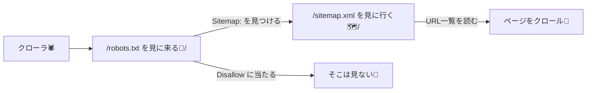
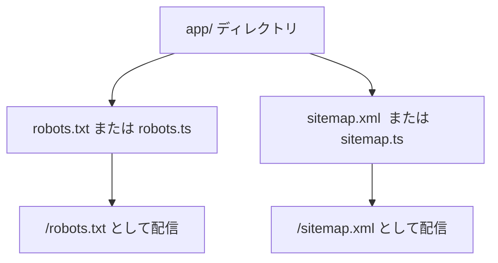

# 第195章：sitemap/robots の考え方🤖

## 今日はなにをする章？🎯✨

この章では、**検索エンジン（クローラ🕷️）に対して「どこを見ていい？」「どのURLがある？」を伝える2つの入口**を作るよ〜！

* **robots.txt**：クローラへの「案内板」📌（入っていい場所 / ダメな場所）
* **sitemap.xml**：サイト内URLの「目次」📚（ページ一覧）

Next.js（App Router）だと、`app/` 直下に **特別なファイル**を置くだけでOKなのが楽ちん💖
（`robots.txt`/`robots.ts` と `sitemap.xml`/`sitemap.ts` が使えるよ） ([Next.js][1])

---

## 図でイメージ🧠✨（クローラの動き）




---

## 1) robots.txt ってなに？🤖🧤

robots.txt は「クローラさん、ここはOKだよ〜 / ここは見ないでね〜」って伝えるテキスト📄
Next.jsでは `app/robots.txt` を置けば静的に、`app/robots.ts` ならコードで生成できるよ！ ([Next.js][1])

### ✅ まずは超シンプル（静的ファイル）

`app/robots.txt` を作って、こう書く👇（例）

```txt
User-Agent: *
Allow: /
Disallow: /private/

Sitemap: https://example.com/sitemap.xml
```

この形式（`User-Agent`/`Allow`/`Disallow`/`Sitemap`）が基本だよ〜🫶 ([Next.js][1])

### ✅ 便利なのは「コード生成」（おすすめ✨）

`app/robots.ts` で返り値を書けば、Next.jsが robots.txt を組み立ててくれるよ！ ([Next.js][1])

```ts
// app/robots.ts
import type { MetadataRoute } from "next";

export default function robots(): MetadataRoute.Robots {
  const siteUrl = process.env.NEXT_PUBLIC_SITE_URL ?? "http://localhost:3000";

  return {
    rules: {
      userAgent: "*",
      allow: "/",
      disallow: ["/private/", "/admin/"],
    },
    sitemap: `${siteUrl}/sitemap.xml`,
  };
}
```

📌 メモ：`robots.ts` は「特別なRoute Handler」で、**基本はキャッシュされる**よ（動的API等を使うと挙動が変わる） ([Next.js][1])

---

## 2) sitemap.xml ってなに？🗺️📚

sitemap.xml は、検索エンジンに「うちのサイトはこのURLたちだよ〜！」って渡す**URLリスト**✨
Next.jsでは `sitemap.(xml|js|ts)` が特別扱いで、`app/` 直下に置くと `/sitemap.xml` で配信されるよ！ ([Next.js][2])

### ✅ 静的に作る（小規模サイト向き）

`app/sitemap.xml` を置けばOK！ ([Next.js][2])

### ✅ コードで作る（記事が増えるサイト向き✨）

`app/sitemap.ts` を作って、**URL配列を返す**だけでOK！ ([Next.js][2])

```ts
// app/sitemap.ts
import type { MetadataRoute } from "next";

export default function sitemap(): MetadataRoute.Sitemap {
  const siteUrl = process.env.NEXT_PUBLIC_SITE_URL ?? "http://localhost:3000";
  const now = new Date();

  return [
    {
      url: siteUrl,
      lastModified: now,
      changeFrequency: "weekly",
      priority: 1,
    },
    {
      url: `${siteUrl}/about`,
      lastModified: now,
      changeFrequency: "monthly",
      priority: 0.7,
    },
    {
      url: `${siteUrl}/blog`,
      lastModified: now,
      changeFrequency: "weekly",
      priority: 0.8,
    },
  ];
}
```

📌 ポイント

* sitemap は **URLが「絶対URL（https://〜）」** になってるのが基本！（公式例もそうなってるよ） ([Next.js][2])
* `sitemap.ts` も「特別なRoute Handler」で、**基本はキャッシュされる**よ ([Next.js][2])

---

## 3) Next.jsでの「置き場所」まとめ🗂️✨



---

## 4) 動作チェック（WindowsでOK）🪟✅

開発サーバー起動して…

```bash
npm run dev
```

ブラウザでここを開いて確認してね👇😊

* `http://localhost:3000/robots.txt`
* `http://localhost:3000/sitemap.xml`

ちゃんと表示できたら勝ち〜🎉🎉🎉

---

## 5) よくあるミス集（ここだけ見ればOK）😵‍💫➡️😆

* `sitemap.ts` の `url` を **`/about` みたいな相対URLにしちゃう** → **絶対URLにする**（`https://.../about`） ([Next.js][2])
* robots.txt に書いた `Disallow` は **「セキュリティ」じゃない**🔐
  見せたくないページは、ログインや権限でちゃんと守るのが本筋だよ〜🫶
* `Sitemap:` のURLが本番と違う（`localhost` のまま）→ `.env` で `NEXT_PUBLIC_SITE_URL` を本番URLにするのおすすめ🌈

---

## ミニ練習✍️🌸（5分）

1. `app/robots.ts` を作って、`/private/` を `disallow` に入れる
2. `app/sitemap.ts` を作って、トップと `/about` の2つだけ返す
3. `/robots.txt` と `/sitemap.xml` を開いて、表示されるか確認👀✨

できたら、SEOの「入口づくり」ひとつクリアだよ〜！🫶🤖✨

[1]: https://nextjs.org/docs/app/api-reference/file-conventions/metadata/robots "Metadata Files: robots.txt | Next.js"
[2]: https://nextjs.org/docs/app/api-reference/file-conventions/metadata/sitemap "Metadata Files: sitemap.xml | Next.js"
