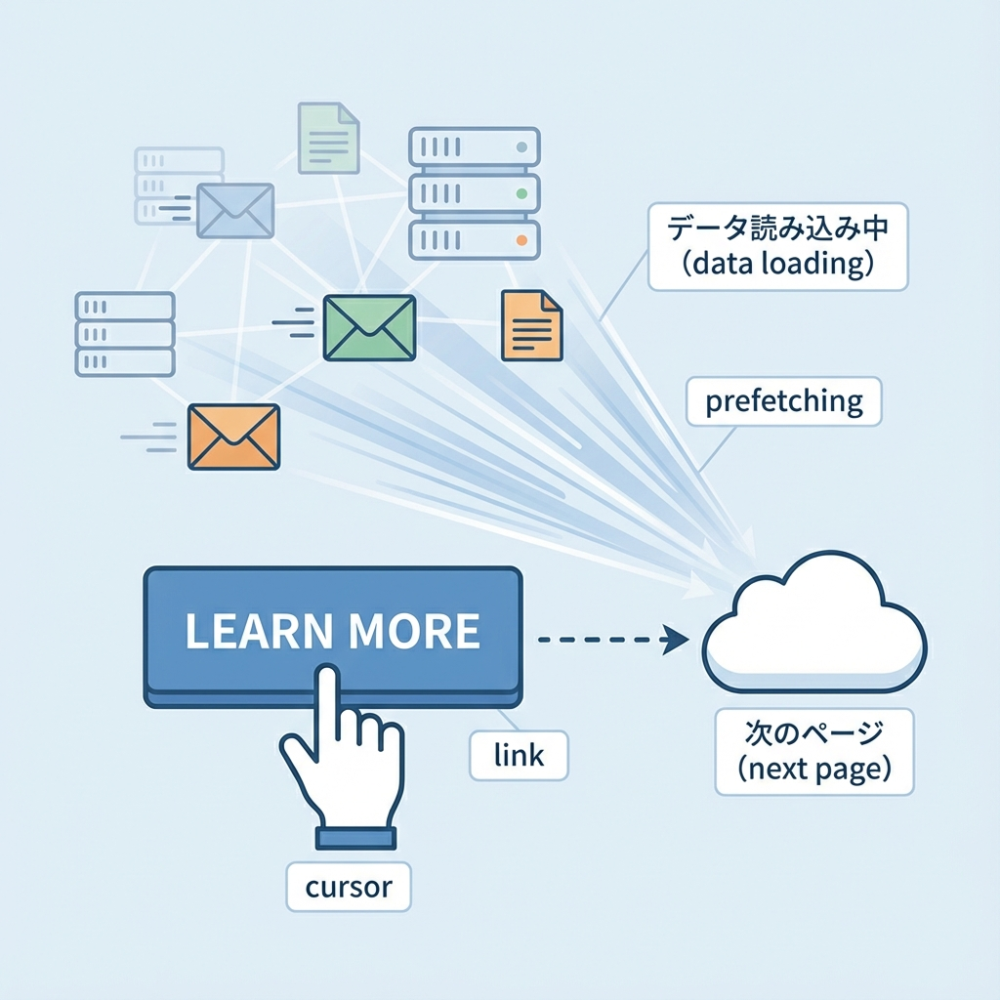
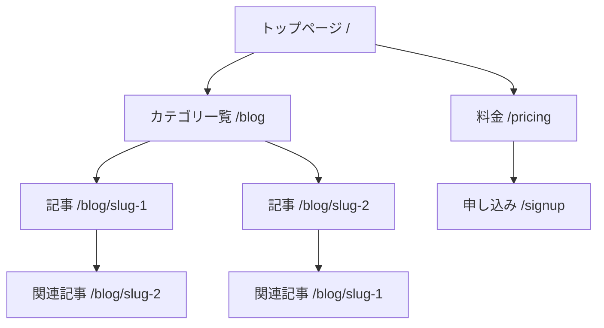

# 第196章：`Link`設計でクローラに優しくする🕷️

## 今日のゴール🎯

* 検索エンジンのクローラ（Googleなど）が、サイト内のページをちゃんと見つけられる「リンクの置き方」を身につけるよ〜😊🧭
* Next.js（App Router）で「クローラにもユーザーにも優しいリンク」を作れるようになるよ💖

---

## まず結論🧠✨「クローラが安心して辿れるリンク」って？

クローラは基本的に **HTMLの a 要素（アンカー）で、href が入ってるリンク**を頼りにページを見つけるよ🕵️‍♀️🔎
逆に、ボタンやdivをクリックして移動する“だけ”の仕組み（onClickで移動）だと、リンクとして拾われにくいことがあるの🥲💦 ([Google for Developers][1])

---

## Next.jsだとどうするの？🤔➡️こう！✨



Next.jsの **Link コンポーネント**は、HTMLの **a 要素を拡張**して、ページ遷移をスムーズにしてくれる存在だよ🚀
つまり、Linkを使うと「ちゃんとリンク（a href）として成立しつつ、アプリっぽく速い遷移」もできる感じ💃✨ ([Next.js][2])

しかも Next.js は、Linkでつながってるページを状況によって先読み（prefetch）してくれるので、体感が速くなりやすいよ⚡（※本番で効きやすい） ([Next.js][3])

---

## 図解🗺️✨「リンク設計＝道を作る」だよ🚶‍♀️➡️🏠➡️📰



* 「トップ → カテゴリ → 記事」みたいに、クローラが迷子にならない道があると強いよ🧭✨
* “大事なページほど、どこかからリンクされてる”状態を作るのがコツだよ😊📌

---

## ここが超大事チェックリスト✅🕷️

### 1) リンクは「a href」になる形で置く🔗

* Googleは基本、href付きのa要素を確実に辿れるよ（相対パスでもOK）🧩 ([Google for Developers][1])
* Next.jsなら、内部リンクは基本 Link を使うのが自然だよ〜🌸 ([Next.js][2])

### 2) リンク文言（アンカーテキスト）をちゃんと書く✍️💖

* 「こちら」「詳しく」だけだと、クローラも人も“どこ行くの？”ってなるよ🥺
* 例：

  * ❌「詳しくはこちら」
  * ✅「料金プランを見る」
  * ✅「React Server Componentsの記事を読む」
    アンカーテキストは、リンク先の内容が想像できる文章が良いよ📚✨ ([Google for Developers][1])

### 3) 画像リンクなら「alt」が命🖼️🫶

* 画像をリンクにする時、Googleは画像のaltをリンク文言みたいに扱うことがあるよ🧡 ([Google for Developers][1])
* だから alt を空にしないのが大事〜！

### 4) “クリックで遷移”だけにしない🙅‍♀️🖱️

* onClickでrouter.pushするボタンだけ置くと、リンクとして拾われにくいことがあるよ💦 ([Google for Developers][1])
* ちゃんと Link（＝a href）も用意しておくのが安心✨

---

## 実装例（良い例）😊💮

### 共通ナビに Link を置く（クローラにも道ができる）🧭

```tsx
// app/(site)/layout.tsx 例
import Link from "next/link";

export default function SiteLayout({ children }: { children: React.ReactNode }) {
  return (
    <div>
      <header>
        <nav>
          <Link href="/blog">ブログ</Link>{" | "}
          <Link href="/pricing">料金プラン</Link>{" | "}
          <Link href="/signup">無料で登録</Link>
        </nav>
      </header>

      <main>{children}</main>
    </div>
  );
}
```

* 共通ナビに主要ページへのリンクがあると、発見されやすい＆ユーザーも迷子にならないよ🥰🗺️

---

## 実装例（避けたい例）🥲💦

```tsx
"use client";

import { useRouter } from "next/navigation";

export function BadNav() {
  const router = useRouter();

  return (
    <button onClick={() => router.push("/pricing")}>
      料金プランへ
    </button>
  );
}
```

* これ、ユーザー的には動くけど…「href付きリンク」じゃないから、クローラには優しくない可能性があるよ😢 ([Google for Developers][1])
* どうしてもボタンUIにしたいなら、見た目をCSSでボタンっぽくした Link にするのがおすすめ💅✨

---

## ちょいテク🍬：リンクが多すぎる場所は prefetch を調整してもOK

サイドバーみたいにリンクが大量だと、先読みが多くなりすぎることがあるよ〜😵‍💫
そんな時は Link の prefetch を切る選択肢もあるよ🧯 ([Next.js][2])

```tsx
import Link from "next/link";

export function Sidebar() {
  return (
    <aside>
      <Link href="/docs/a" prefetch={false}>ドキュメントA</Link>
      <Link href="/docs/b" prefetch={false}>ドキュメントB</Link>
    </aside>
  );
}
```

---

## 動作チェック（かんたん）🔍✨

1. ブラウザでページを開く🌐
2. 右クリック → 「ページのソースを表示」🔎
3. a href="/pricing" みたいな形で出てればOK！🎉
   （クローラはこういう“リンクの形”が大好物だよ🕷️🍴）

---

## ミニ課題🎒✨（5〜10分）

あなたのアプリで、次の3つをやってみてね😊💖

1. ヘッダーに「ブログ」「料金」「登録」みたいな主要リンクを Link で置く🧭
2. 記事一覧ページを作って、各記事へ「記事タイトル」をリンク文言にして Link を置く📰
3. 画像をリンクにするなら alt を「無料で登録する」みたいに意味ある文章にする🖼️✨

---

## まとめ🎀

* クローラに優しいリンク＝だいたい **a href があるリンク**だよ🕷️🔗 ([Google for Developers][1])
* Next.jsは Link が a を拡張してくれるから、内部リンクは Link を基本にすると安心＆速い💨 ([Next.js][2])
* リンク文言（アンカーテキスト）と画像のaltは、地味だけどめちゃ効くよ〜💖 ([Google for Developers][1])

[1]: https://developers.google.com/search/docs/crawling-indexing/links-crawlable "SEO Link Best Practices for Google | Google Search Central  |  Documentation  |  Google for Developers"
[2]: https://nextjs.org/docs/app/api-reference/components/link "Components: Link Component | Next.js"
[3]: https://nextjs.org/docs/app/getting-started/linking-and-navigating "Getting Started: Linking and Navigating | Next.js"
