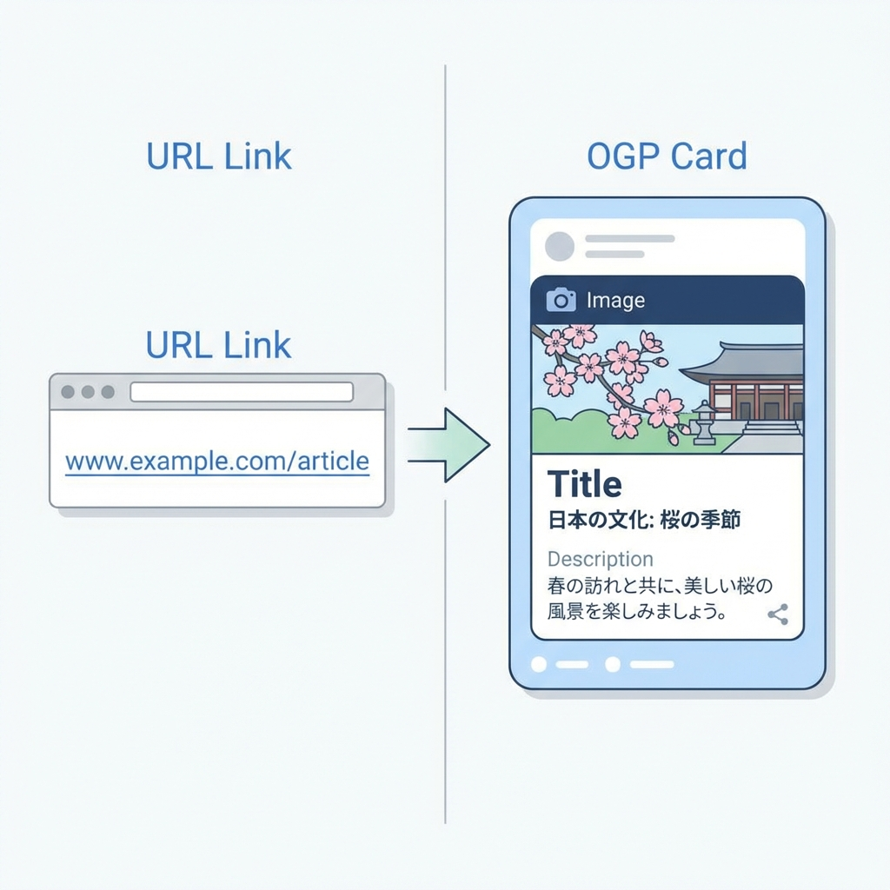
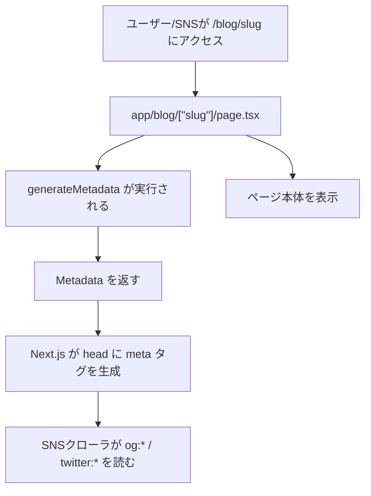

# 第197章：練習：ブログ記事のOGPを整える✨

SNSに記事URLを貼ったときに「タイトル・説明・画像（アイキャッチ）」がキレイに出るようにする練習だよ〜！😊💖
Next.js（App Router）だと **`generateMetadata()`** を使うのが王道です✨

---

## 1) OGPってなに？🤔🌸

OGP（Open Graph Protocol）は、SNS（X / LINE / Facebook など）がリンクをカード表示するときに読む **meta情報** のことだよ📇✨

ちゃんと整えると…👇

* 記事タイトルがいい感じに出る📝✨
* 説明文が出る🧁
* アイキャッチ画像が出る🖼️🎀
* クリックされやすくなる（たぶん！）😆📈

---

## 2) まずはイメージ図（何が起きるの？）🧠💡





---

## 3) 今日のゴール🏁✨

**ブログ記事ページ（`/blog/[slug]`）ごとに**👇を出し分けるよ🎉

* `og:title`（記事タイトル）📝
* `og:description`（説明）🧁
* `og:image`（アイキャッチ）🖼️
* `twitter:card` など（X用）🐦✨

---

## 4) 実装ステップ（コピペでOK）✂️🧸

### Step A：ダミー記事データを用意する📚✨

`src/lib/posts.ts`（または `lib/posts.ts`）を作ってね💡

```ts
// src/lib/posts.ts
export type Post = {
  slug: string;
  title: string;
  description: string;
  ogImagePath: string; // public 配下のパス（例: "/og/hello.png"）
};

const posts: Post[] = [
  {
    slug: "hello",
    title: "はじめてのNext.jsブログ🎀",
    description: "OGPを整えて、SNSカードをかわいく表示しよう✨",
    ogImagePath: "/og/hello.png",
  },
  {
    slug: "rsc",
    title: "Server Componentsってなに？🧊",
    description: "ざっくり理解して、怖さを消そう〜！😆",
    ogImagePath: "/og/rsc.png",
  },
];

export function getPost(slug: string): Post | undefined {
  return posts.find((p) => p.slug === slug);
}
```

---

### Step B：OGP画像を `public/og/` に置く🖼️📁

`public/og/hello.png` と `public/og/rsc.png` を置いてね！
（中身は仮画像でOKだよ〜😊✨）

おすすめサイズは **1200×630**（よくあるOGPの比率）📐✨

---

### Step C：`metadataBase` を設定する（超大事）⚠️🌍

OGP画像URLは **絶対URL** が強いよ（SNSが取りに行ける形）🏃‍♀️💨
なので `app/layout.tsx` に `metadataBase` を入れておくと安定するよ✨

```ts
// app/layout.tsx
import type { Metadata } from "next";

export const metadata: Metadata = {
  // 本番では自分のドメインにしてね！例: https://example.com
  // 環境変数にしておくとラクだよ💡
  metadataBase: new URL(process.env.NEXT_PUBLIC_SITE_URL ?? "http://localhost:3000"),
};

export default function RootLayout({ children }: { children: React.ReactNode }) {
  return (
    <html lang="ja">
      <body>{children}</body>
    </html>
  );
}
```

ついでに `.env.local` もあると便利💖（任意）

```txt
NEXT_PUBLIC_SITE_URL=http://localhost:3000
```

---

### Step D：記事ページで `generateMetadata()` を書く🪄🧠

`app/blog/[slug]/page.tsx` を作成（または編集）するよ📄✨

```ts
// app/blog/[slug]/page.tsx
import type { Metadata } from "next";
import { notFound } from "next/navigation";
import { getPost } from "@/lib/posts";

type Props = {
  params: Promise<{ slug: string }>;
};

// ★ここが本題：記事ごとにメタデータを出し分ける✨
export async function generateMetadata({ params }: Props): Promise<Metadata> {
  const { slug } = await params;
  const post = getPost(slug);
  if (!post) return {};

  // metadataBase が layout.tsx にある前提なら、URL は相対でもOK寄りだけど
  // 画像は絶対URLで考えると安心😊✨
  const url = `/blog/${post.slug}`;

  return {
    title: post.title,
    description: post.description,

    openGraph: {
      title: post.title,
      description: post.description,
      type: "article",
      url,
      images: [
        {
          url: post.ogImagePath,
          width: 1200,
          height: 630,
          alt: post.title,
        },
      ],
    },

    twitter: {
      card: "summary_large_image",
      title: post.title,
      description: post.description,
      images: [post.ogImagePath],
    },
  };
}

export default function BlogPostPage({ params }: Props) {
  const post = getPost(params.slug);
  if (!post) notFound();

  return (
    <main style={{ padding: 24 }}>
      <h1>{post.title}</h1>
      <p>{post.description}</p>
      <p>slug: {post.slug}</p>
    </main>
  );
}
```

---

## 5) 動作チェック✅👀

### ローカルで起動💻✨（PowerShell）

```bash
npm run dev
```

### 確認ポイント（超カンタン）🔎💖

1. `http://localhost:3000/blog/hello` を開く
2. ブラウザで「ページのソースを表示」して、`og:title` とかが入ってるか見る👀✨
3. `hello` と `rsc` で **タイトル/画像が切り替わってる** なら成功🎉🎉🎉

---

## 6) よくあるハマり（先に潰す）🪤😵‍💫

* **OGP画像が出ない**
  → `public/og/...` のファイル名ミス多いよ！😆
  → 画像パスは `"/og/hello.png"` みたいに先頭スラッシュが安心✨

* **SNSでプレビューが変わらない**
  → SNS側がキャッシュしてることあるよ〜📦💤
  → 本番URLで確認したり、SNSの「キャッシュ更新ツール」を使うと直ることが多いよ🔁✨
  （ローカルhostはSNSから見えないので、基本プレビュー検証は本番/公開URLが強いよ🌍）

* **`metadataBase` がないと、画像URLが変になることがある**
  → これが一番多い！`layout.tsx` に入れておこ〜😊✨

---

## 7) ミニ課題（できたら強い💪💕）

✅ `posts` を1件増やして、OGP画像も追加してみてね🖼️✨
✅ その記事URLを開いて、`og:title` がちゃんと新タイトルになってるか確認👀🎀

---

ここまでできたら、**「ブログ記事ごとにOGPを整える」** はバッチリだよ〜！😆🎉✨
