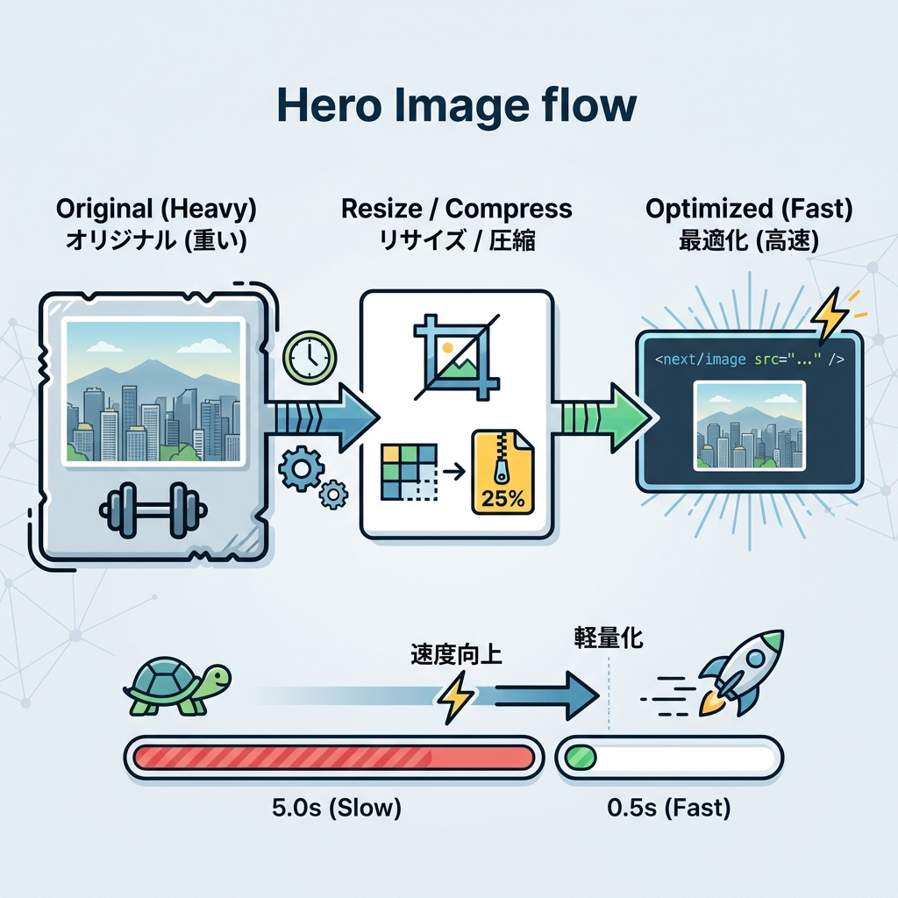
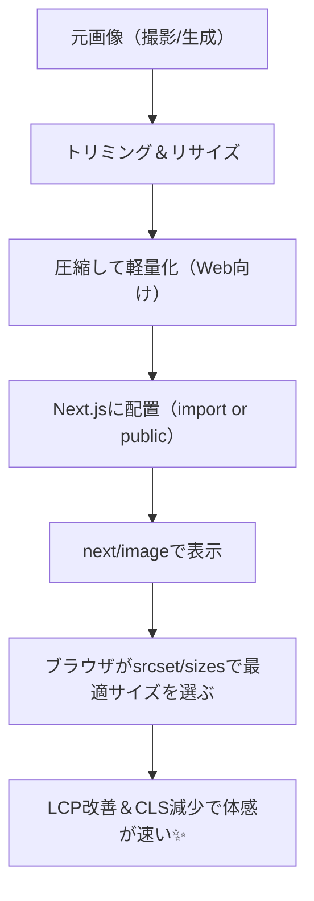

# 第198章：練習：アイキャッチ画像を最適化する🖼️

この章は「ブログ記事の先頭にあるアイキャッチ（ヒーロー画像）」を、**速く・崩れず・キレイ**にする練習だよ〜😊✨  
完成したら、ページの体感速度がグッと上がることが多い！🚀

---

## 🎯 この章のゴール（できたら勝ち！）🏁

- アイキャッチを `next/image` で表示できる📸
- **レイアウトがガクッと動かない（CLS対策）**ができる🧱
- **スマホ/PCで無駄にデカい画像を取らない**ように `sizes` を付けられる📱💻
- アイキャッチがページの主役なら `priority` で先読みできる⚡

> Next.js の `<Image>` は、適切なサイズ配信・モダン形式（WebPなど）・レイアウト安定などを助けてくれるよ〜💡  
> （公式ドキュメント）:contentReference[oaicite:0]{index=0}

---

## 🧠 まずは全体像（画像が速くなる流れ）✨





---

## ✅ ステップ0：アイキャッチ画像の「正解の形」を作る🧁

アイキャッチはだいたい「横長」が多いよね📷✨  
おすすめはこのへん👇（迷ったらコレでOK！）

- 📐 **比率**：16:9（例：1600×900）か 1200×630（OGPっぽい比率）
- 📦 **ファイルサイズ目標**：まずは **200KB前後**を目標に（写真なら特に！）
- 🧼 **やりすぎ注意**：極端に圧縮すると文字や輪郭がモヤる😵‍💫

> Next.js 側でも最適化はしてくれるけど、元が8MBとかだと「加工コスト」も上がりがちなので、元画像も軽くしておくと安定だよ🙆‍♀️

---

## ✅ ステップ1：画像の置き場所を決める（おすすめは2択）🗂️

### A案：**静的import**（いちばん楽＆きれい✨）
- `placeholder="blur"` が使いやすい（自動でぼかしプレースホルダが入りやすい）🫧  
- `width/height` も自動で取れることが多い📏

> 静的importだと `width/height` や `blurDataURL` が自動で入る例が公式にあるよ:contentReference[oaicite:1]{index=1}

### B案：`public/` 配下（単純で分かりやすい）
- `src="/images/cover.jpg"` みたいに書ける🧁
- ただし `placeholder="blur"` は自分で用意する必要が出やすい（なくてもOK！）

今回は練習なので、**A案（静的import）**でいくね😊✨

---

## ✅ ステップ2：アイキャッチ用コンポーネントを作る🧩🖼️

### 📁 例のフォルダ構成
- `app/components/Eyecatch.tsx`
- `app/assets/eyecatch.jpg`（ここに置く想定）

### 1) `app/components/Eyecatch.tsx` を作成✍️

````tsx
import Image, { type StaticImageData } from "next/image";

type Props = {
  src: StaticImageData;
  alt: string;
  priority?: boolean;
};

export function Eyecatch({ src, alt, priority = false }: Props) {
  return (
    <figure
      style={{
        position: "relative",
        width: "100%",
        aspectRatio: "16 / 9",
        overflow: "hidden",
        borderRadius: 16,
        margin: 0,
      }}
    >
      <Image
        src={src}
        alt={alt}
        fill
        placeholder="blur"
        priority={priority}
        sizes="(max-width: 768px) 100vw, 900px"
        style={{ objectFit: "cover" }}
      />
    </figure>
  );
}
`````

ここが超大事ポイントだよ〜！🔑✨

* `fill`：親要素いっぱいに広げる🧃（親が `position: relative` 必須）([Next.js][1])
* `aspectRatio: "16 / 9"`：**高さが確保される** → 画像読み込みでガクッと動きにくい🧱
* `sizes`：これがあると**端末に合わせて適切なサイズを取りやすい**📱💻（無いと 100vw 想定でデカめを取りがち）([Next.js][1])
* `priority`：アイキャッチが **LCP主役**なら `true` にする⚡（使いすぎ注意！）([Next.js][1])

---

## ✅ ステップ3：記事ページで使う📰✨

例として `app/posts/sample/page.tsx` みたいなページで使うね！

```tsx
import cover from "@/app/assets/eyecatch.jpg";
import { Eyecatch } from "@/app/components/Eyecatch";

export default function Page() {
  return (
    <main style={{ maxWidth: 900, margin: "24px auto", padding: "0 16px" }}>
      <Eyecatch src={cover} alt="サンプル記事のアイキャッチ" priority />

      <h1 style={{ marginTop: 20 }}>サンプル記事🌸</h1>
      <p>ここに本文が入るよ〜😊</p>
    </main>
  );
}
```

---

## ✅ ステップ4：最適化できてるか確認する👀🔍（かんたん）

開発サーバー起動👇

```bash
npm run dev
```

そしてブラウザでページを開いて…

### 🔎 かんたんチェック3点セット

1. 🧱 **スクロールしてもレイアウトが跳ねない？**（CLSっぽい動きがない）
2. 📱 スマホ幅にした時、**画像が必要以上に重くない？**
3. 🧰 DevTools → Network で画像を見ると、`/_next/image?...` みたいな最適化配信っぽい挙動が見えることが多いよ（環境による）✨

---

## 🔥 追加ミッション（ちょい発展）🎮✨

### ミッションA：`sizes` を自分のレイアウトに合わせて調整💅

今はこうしてる👇

* スマホ：`100vw`（画面幅いっぱい）
* PC：`900px` まで

もしPCで「左右に余白がもっと広い」なら、`900px` を `720px` にしてみてね😊
**小さくできるほど軽くなる**ことが多いよ⚡

> `sizes` は `fill` やレスポンシブCSSのとき特に重要だよ([Next.js][1])

---

### ミッションB：外部URL画像を使う場合の設定（やる人だけ）🌍🧩

もし `src="https://...."` を使うなら、許可リストが必要だよ〜🛡️
`next.config.ts` に `remotePatterns` を追加する感じ！

```ts
import type { NextConfig } from "next";

const config: NextConfig = {
  images: {
    remotePatterns: [
      {
        protocol: "https",
        hostname: "example.com",
        port: "",
        pathname: "/images/**",
        search: "",
      },
    ],
  },
};

export default config;
```

> 公式の案内：リモート画像は `remotePatterns` を設定して安全に使う([Next.js][2])

---

## 🧯 よくある失敗あるある（先に潰す！）💣

* ❌ `fill` なのに親要素が `position: relative` じゃない → 画像が変な場所に出る
* ❌ `sizes` を付けない → スマホでも大きい画像を取りがちで重くなる([Next.js][1])
* ❌ `priority` をあちこちに付ける → 先読みが増えて逆に混むことがある😵‍💫
* ❌ そもそも元画像がデカすぎ（数MB）→ まずリサイズ＆圧縮しよ🧼

---

## ✅ この章のクリア条件🎉

* アイキャッチが `next/image` で表示できた🖼️✨
* 画像読み込みでレイアウトがガクッと動きにくい🧱
* `sizes` を付けて「スマホは軽く、PCはキレイ」を狙えた📱💻⚡
* 主役画像だけ `priority` にできた（必要なときだけ！）⚡

ここまでできたら第198章クリアだよ〜！🙌🌸

```
::contentReference[oaicite:8]{index=8}
```

[1]: https://nextjs.org/docs/app/api-reference/components/image "Components: Image Component | Next.js"
[2]: https://nextjs.org/docs/app/getting-started/images "Getting Started: Image Optimization | Next.js"
