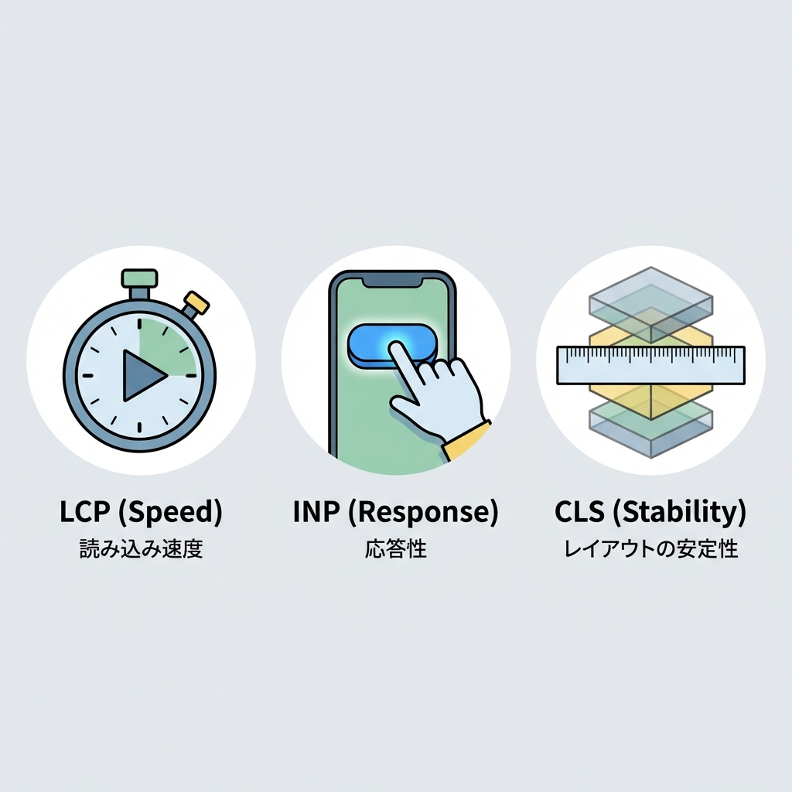
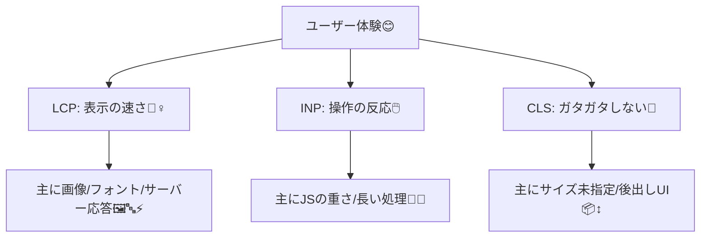
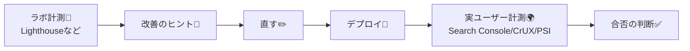

# 第199章：Core Web Vitals ざっくり（気にしすぎない）🫶

この章のゴールは「Core Web Vitals（CWV）って結局なに？」「どこまで気にすればいい？」を、ふわっと掴むことだよ〜😊✨
結論：**“ユーザーが困ってないなら、神経質になりすぎなくてOK”** だよ🙆‍♀️🌸

---

## 1) Core Web Vitals ってなに？🍀



Core Web Vitals は、Webの体験をざっくり3つで見る指標だよ📏✨（今は **LCP / INP / CLS** の3つ） ([Google for Developers][1])



---

## 2) 目標ライン（“Good”）だけ覚えよっか✅✨

まずは「良い」ラインだけ暗記でOK〜！😆🧠
（CWVは **75パーセンタイル** で判定するよ、ってのもふんわり覚えておくと◎） ([Google for Developers][1])

* **LCP（表示の速さ）**：**2.5秒以内** がGood 🏃‍♀️💨
* **INP（操作の反応）**：**200ms未満** がGood 🖱️✨
* **CLS（レイアウトの安定）**：**0.1未満** がGood 📐✨ ([Google for Developers][2])

ついでに「これはヤバい…」のラインも一応👇

* LCP：**4秒超** はPoor
* INP：**500ms超** はPoor
* CLS：**0.25超** はPoor ([web.dev][3])

---

## 3) 「気にしすぎない」ってどういうこと？🫶🌙

CWVって、**テストの点数で満点を目指すゲーム**じゃなくて、
**“ユーザーがストレス感じてない？”の健康診断**みたいなものだよ〜🏥💕

だからおすすめの温度感はこれ👇

* Lighthouse が 100 点じゃなくても大丈夫🙆‍♀️（目安の1つ！）
* まずは **Poor（赤）だけ潰せば勝ち** 🔥➡️✅
* 体感で「遅っ…😫」とか「押せない😡」が消えたら、もう十分えらい👏✨
* CWV は **実ユーザーデータ**（フィールド）も大事。ラボ結果とズレるのは普通だよ〜🌍 ([Google for Developers][1])

---

## 4) どこで見ればいいの？（3つだけ）👀✨



### ✅ (1) Chrome DevTools → Lighthouse 🧪

開発中に「どこが重い？」の当たりをつけるのに便利✨

### ✅ (2) PageSpeed Insights（PSI）📊

**フィールド（実ユーザー）** と **ラボ** を一緒に見やすい！
CWV の扱い（INP/LCP/CLS、75パーセンタイル判定）もここが分かりやすいよ🫶 ([Google for Developers][1])

### ✅ (3) Search Console の Core Web Vitals レポート🔎

サイト運用してるならここが本丸💪（実ユーザー基準でグルーピングしてくれる） ([Google ヘルプ][4])

---

## 5) Next.jsで“ゆるく効く”改善ポイント🧰✨

ここは「よくある原因」と「最初の一手」だけに絞るね😊🌸

### 🏃‍♀️ LCP（表示が遅い）

ありがち原因：

* でかい画像（特にヒーロー画像）🖼️💦
* フォント読み込みで待つ🔤⌛
* 体感的に「最初の見どころ」が遅い

最初の一手：

* **ファーストビューの画像を軽く**（サイズ・圧縮・適切な形式）
* **表示に必要な要素を先に出す**（不要なClient境界を増やさない）
* 「主役」が画像なら `next/image` を素直に使う（前章までの知識でOK）📸✨

### 🖱️ INP（押しても反応が遅い）

ありがち原因：

* クリック時に重い処理が走る（長いJS）🐘
* 1画面ぜんぶClientになっててJSが太い💦

最初の一手：

* **Client Component を必要最小限に**（Next.jsは基本ServerでOK）
* ボタン押したときの処理を軽く（重い計算は避ける/分割する）✂️

※INPがCWVになって、FIDから置き換わったよ（2024/3/12）📅 ([web.dev][5])

### 📐 CLS（ガタガタ動く）

ありがち原因：

* 画像のサイズ未指定（表示後にズレる）📦↕️
* 後からバナー/広告/フォントが入って押し下げる

最初の一手：

* **画像・埋め込み要素は“場所取り”**する（幅/高さ or 枠を先に確保）
* ローディングUIも「高さ」を確保してガタつきを防ぐ⏳🧱

---

## 6) おまけ：Next.jsでCWVをログに出してみる（超ミニ）📝✨

「今どんな値が出てるの？」を知りたい時は、Next.js の `useReportWebVitals` が使えるよ🙌
（App RouterでもOK） ([Next.js][6])

### 手順（App Router）

1. `app/_components/WebVitals.tsx` を作る
2. `app/layout.tsx` で読み込む

#### `app/_components/WebVitals.tsx`

```tsx
'use client'

import { useReportWebVitals } from 'next/web-vitals'
import type { NextWebVitalsMetric } from 'next/app'

export function WebVitals() {
  useReportWebVitals((metric: NextWebVitalsMetric) => {
    // 開発中はconsoleでOK👌 本番は分析基盤に送ることが多いよ📮
    console.log('[WebVitals]', metric.name, metric.value)
  })

  return null
}
```

#### `app/layout.tsx`

```tsx
import { WebVitals } from './_components/WebVitals'

export default function RootLayout({ children }: { children: React.ReactNode }) {
  return (
    <html lang="ja">
      <body>
        <WebVitals />
        {children}
      </body>
    </html>
  )
}
```

> ポイント：このコンポーネントだけをClientにして、**Client境界を小さく保つ**のがコツだよ〜🧊✨ ([Next.js][6])

---

## ミニ練習（5分）⏱️✨

1. Lighthouse を1回回す🧪
2. **CLSが高い**なら「画像/ローディングの場所取り」を疑う📦
3. **INPが悪い**なら「Client範囲が広すぎない？」を疑う🖱️
4. “赤→黄” になったら今日は勝ち🏆🎉

---

この章はここまでだよ〜😊✨
次の章（第200章）は「画像が重い時の“まずこれ”チェックリスト✅」だから、**LCPが気になる人は超つながる**よ🖼️💨

[1]: https://developers.google.com/speed/docs/insights/v5/about "About PageSpeed Insights  |  Google for Developers"
[2]: https://developers.google.com/search/docs/appearance/core-web-vitals "Understanding Core Web Vitals and Google search results | Google Search Central  |  Documentation  |  Google for Developers"
[3]: https://web.dev/articles/defining-core-web-vitals-thresholds "How the Core Web Vitals metrics thresholds were defined  |  Articles  |  web.dev"
[4]: https://support.google.com/webmasters/answer/9205520?hl=en&utm_source=chatgpt.com "Core Web Vitals report - Search Console Help"
[5]: https://web.dev/blog/inp-cwv-march-12 "Interaction to Next Paint becomes a Core Web Vital on March 12  |  Blog  |  web.dev"
[6]: https://nextjs.org/docs/app/api-reference/functions/use-report-web-vitals "Functions: useReportWebVitals | Next.js"
