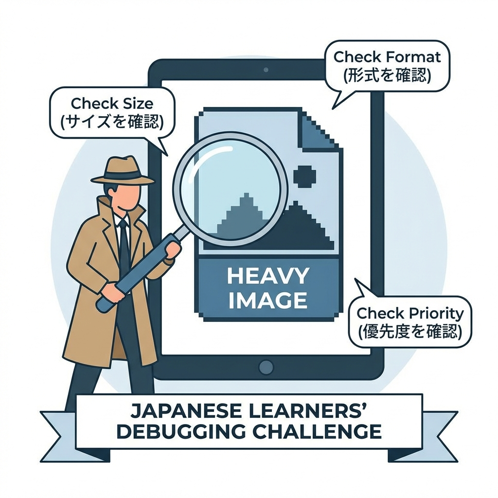
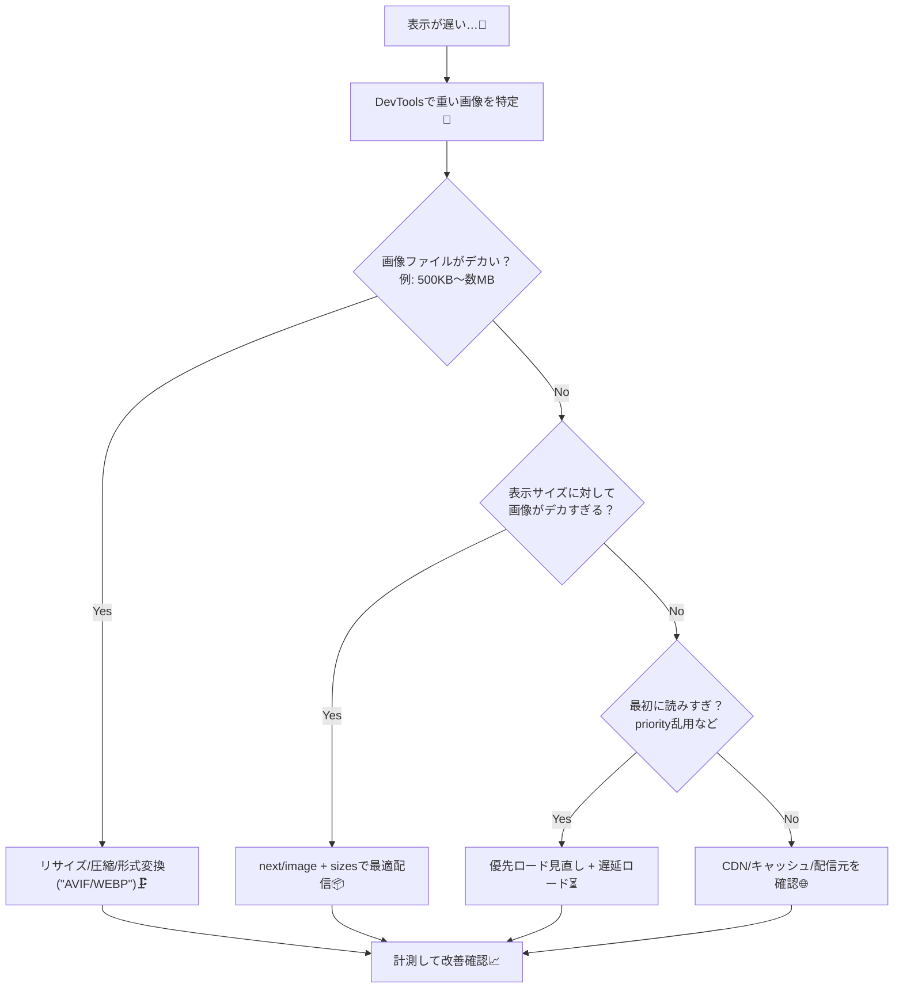

# 第200章：画像が重い時の“まずこれ”チェックリスト✅

「ページ表示が遅い…🥲」って時、**原因が“画像”**なこと多いよ〜！
この章は、迷わず順番に潰せる **“最短チェックリスト”** を用意するね✅💕

---

## まずは全体の流れ（診断フロー）🧭🔍





---

## ✅ “まずこれ”チェックリスト（上から順にやるだけ！）📌✨

### 1) どの画像が重いか、まず特定する🔎👀

**Chrome DevTools**でOKだよ！

* `F12` → **Network** タブ📡
* フィルタで **Img** を押す🖼️
* **Size / Time** が大きいものが犯人👮‍♀️💥

目安（ざっくり）👇

* 一覧のサムネ：**〜50〜150KB**くらいが気持ちいい✨
* 記事のメイン画像：**〜150〜300KB**くらいを目標
* 1MB超えは、だいたい改善余地アリ🫣

---

### 2) 画像の「縦横サイズ」がデカすぎない？📐😵

**表示が 400px 幅なのに、画像が 4000px** みたいなの、あるある😂

* まずは画像の実サイズを縮める（リサイズ）✂️
* 「必要な大きさ + ちょい余裕」くらいでOK🙆‍♀️

---

### 3) 形式は AVIF / WebP にできる？🧁➡️🧊

* **AVIF**：だいたい最強に軽い🏆（ただし作成に時間かかることも）
* **WebP**：互換性もよくて使いやすい💖
* **PNG**：透過が必要な時だけ！（重くなりやすい）🫠
* **JPEG**：写真ならまだまだ現役📸

---

### 4) 圧縮（Quality）を下げても見た目いける？🗜️😌

写真系は **quality をちょい下げるだけで激変**するよ！

* まず **80 → 70 → 60** くらいで試す🎚️
* 見た目がほぼ変わらないのに容量だけ減ること多い✨

---

### 5) Next.js なら `next/image` を正しく使う📸⚡

「画像が重い」問題は **next/image** でかなり勝てるよ〜！💪💕

ポイントはこの3つ👇

* `width` / `height` をちゃんと指定（レイアウト崩れ防止）🧱
* `sizes` を書いて、スマホにデカ画像を送らない📱
* `priority` はヒーロー画像1枚くらいに絞る（乱用NG）🚫

例（ヒーロー画像）👇

```tsx
import Image from "next/image";

export default function Hero() {
  return (
    <div>
      <Image
        src="/hero.jpg"
        alt="ヒーロー画像"
        width={1200}
        height={630}
        priority
        sizes="(max-width: 768px) 100vw, 1200px"
        quality={70}
      />
    </div>
  );
}
```

---

### 6) “最初に読みすぎ”をやめる（特に一覧）🧺🫨

一覧ページで画像がズラ〜って並ぶと、最初が重くなりがち🥲

* **上の方だけ先に見せたい** → それ以外は遅延ロード⏳
* `priority` を一覧でいっぱい付けるのは絶対やめよ😂🚫
* 可能なら「最初は小さめサムネ」→「詳細で大きい画像」作戦が強い✨

---

### 7) “背景画像”でデカ画像を読み込んでない？🖼️🕵️‍♀️

CSS の `background-image` は、最適化が効きにくいことがあるよ〜💦

* できれば **重要な画像は next/image に寄せる**📦
* 背景で使うなら、サイズ・圧縮・形式を厳しめに💪

---

### 8) 外部画像（CMSとか）なら配信元もチェック🌐🧃

外部ドメインからの画像が遅いと、どう頑張っても遅いことある🥲
その場合は👇を疑う！

* 配信元が遅い（地理的に遠い / サーバー弱い）🗺️
* キャッシュが効いてない🧊
* 毎回オリジナルサイズを直リンクしてる😵

---

### 9) 最後に「改善したか」必ず計測📈✅

やりっぱなしはもったいない〜！🥺

* DevTools の Network で **Before/After のサイズ比較**
* Lighthouse で **パフォーマンスざっくり確認** 🚦✨
* 体感（スクロール・表示の速さ）もチェック🫶

---

## よくある“地雷パターン”集💣😂

* 画像が **スマホにまでフルHD/4Kで配られてる**📱💥
* 一覧で `priority` いっぱい🚫
* PNG を写真に使ってる（容量お化け）👻
* OGP画像をやたら高画質・高解像度で作ってる📰🫠
* 「とりあえず元画像そのまま置いた」🙈

---

## ミニ練習🎯✨（10分でできる！）

1. 一番遅いページを開く🧭
2. Network → Img で **一番重い画像を1つ特定**🔎
3. その画像を

   * 形式を WebP/AVIF にする（できたら）🧊
   * サイズを表示に合わせて縮める✂️
   * `next/image` の `sizes` を入れる📦
4. Before/After で **KB と表示速度**を比べる📈💕

---

## まとめ🧁✅

画像が重い時は、まずこの順番でOKだよ〜！✨

1. 犯人特定🔎 → 2) サイズ📐 → 3) 形式🧊 → 4) 圧縮🗜️ → 5) next/image最適化📦 → 6) 読みすぎ防止⏳ → 7) 計測📈

次の章でまた別の視点（SEO全体）に戻っていこうね〜！🫶😊
