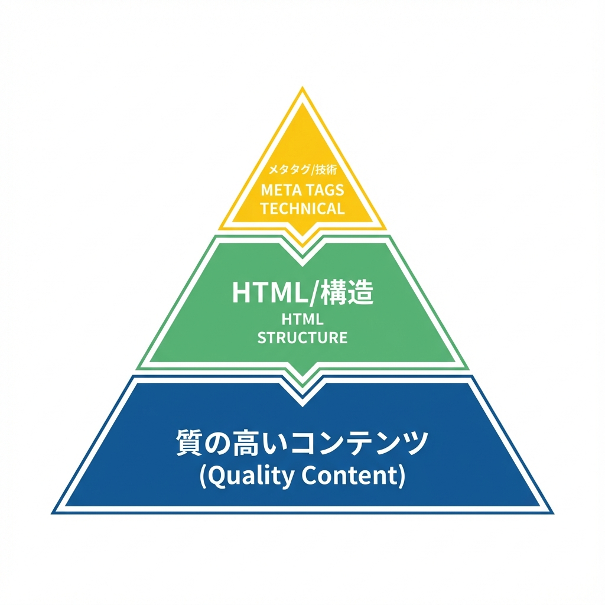
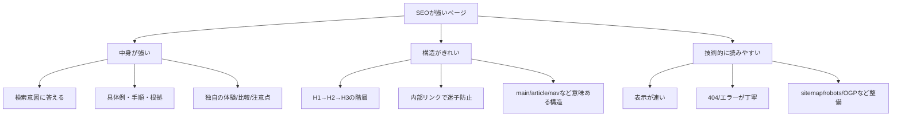

# 第201章：復習：SEOは“設定より中身（構造）”が強い📚

この章はまとめ回だよ〜😊💡
結論から言うと、**SEOは「メタタグを足せば勝ち！」じゃなくて**、
**ページの“中身”と“構造”がちゃんとしてる方が強い**です💪🌸

---

## 1) SEOって結局なにを見られてるの？👀🔎



ざっくり3つに分けると理解しやすいよ〜✨

* **① 中身（コンテンツ）**：検索した人の疑問に答えてる？🤔➡️😊
* **② 構造（読みやすさ・意味）**：見出しやリンクが整理されてる？🧱🔗
* **③ 技術（クロール・表示体験）**：読める？速い？壊れてない？⚡🧯

Next.jsで「設定」を頑張るのは③の一部（＋ちょっと②）で、
**一番効くのは①と②**って覚えておくと迷子になりにくいよ🫶💕

---

## 2) “設定だけ”で勝てない理由🥲🧩

検索する人って、だいたいこう思ってるのね👇

* 「これ知りたい！」📌
* 「できれば早く答えがほしい！」⏱️
* 「根拠とか手順もあると安心！」🧠✨

だから、たとえ `metadata` や OGP を完璧にしても、
**ページ本文がスカスカ**だと「うーん…」ってなりやすいの🥺💦

---

## 3) “構造”が強いページの特徴🧱✨（ここ超大事！）

### ✅ 見出しが正しく階層になってる（H1→H2→H3）🏷️

* いきなりH3から始まらない🙅‍♀️
* H2が「章」、H3が「節」みたいに整理されてる📚

### ✅ 1ページ1テーマ（話が散らからない）🎯

* 「何についてのページか」が一瞬でわかる✨

### ✅ 内部リンクが親切（次に読む道がある）🧭🔗

* 関連記事へのリンク、カテゴリへの導線など🚪

### ✅ セマンティックなタグで意味が伝わる🧁

* `main` / `article` / `nav` / `header` / `footer` など💡

---

## 4) SEOの全体像を図でつかむよ〜📈✨（Mermaid）



---

## 5) Next.jsで「構造」を強くする“実務チェック”✅🛠️

### ✅ (A) ページの骨組みテンプレ（意識するだけで強くなる）🦴✨

「ブログ記事ページ」なら、こんな感じが王道だよ〜📄💕

```tsx
export default function PostPage() {
  return (
    <main>
      <article>
        <header>
          <h1>記事タイトル</h1>
          <p>更新日：2025-xx-xx</p>
        </header>

        <nav aria-label="目次">
          <ol>
            <li><a href="#sec-1">結論</a></li>
            <li><a href="#sec-2">手順</a></li>
            <li><a href="#sec-3">注意点</a></li>
          </ol>
        </nav>

        <section id="sec-1">
          <h2>結論</h2>
          <p>まず答えを書く✨</p>
        </section>

        <section id="sec-2">
          <h2>手順</h2>
          <h3>手順1</h3>
          <p>…</p>
        </section>

        <section id="sec-3">
          <h2>注意点</h2>
          <ul>
            <li>よくある落とし穴A</li>
          </ul>
        </section>

        <footer>
          <p>関連記事：◯◯</p>
        </footer>
      </article>
    </main>
  );
}
```

ポイントはこれ👇😊

* **`main`の中に`article`**（このページの主役は記事だよ〜って伝える）📝✨
* **見出し階層**（検索エンジンにも人にも読みやすい）👀
* **目次（nav）**（長文でめちゃくちゃ効く）📚🔗

---

## 6) ありがちなSEOの負けパターン集🥺🧨

* **タイトルだけ立派で本文が薄い**😇
* **見出しが全部H2で、内容がどこにあるか分からない**🌀
* **内部リンクがなくて、1ページ読んだら終わり**🚪💨
* **“キーワード詰め込み”で読みにくい**（逆効果になりがち）🧃💦
* **404が不親切で離脱される**😭（`not-found.tsx` 大事！）

---

## 7) ミニ演習：SEOを“構造から”強くしよう💪🌸（10〜15分）

あなたのブログ風ページ（または練習用ページ）で、次をやってみてね😊✨

### 🎯 お題

「記事ページ」を想定して、**構造を整える**🧱

### ✅ やることチェックリスト

* [ ] H1は1個だけ（記事タイトル）🏷️
* [ ] H2を3〜5個（章タイトル）📚
* [ ] その下にH3で小見出し（手順や注意点）🧩
* [ ] `main` / `article` / `header` / `footer` を入れる🧁
* [ ] 関連記事リンクを2つ以上置く🔗💞
* [ ] 404ページ（not-found）に「戻る導線」を入れる🚪🧭

できたら、**検索する人が迷わない**ページになってるはずだよ〜🥰✨

---

## 8) この章のまとめ🎀

* SEOは「設定の勝負」より **“中身と構造の勝負”** 📚🔥
* Next.jsの `metadata` や OGP はもちろん大事だけど、
  **本文が読みやすく整理されてるページがいちばん強い**🧱✨
* **見出し階層・セマンティック構造・内部リンク**を味方にしよう😊🔗💕

次の章（ミニ課題）に行くと、ここまでのSEOまわりが一気に「作品」になるよ〜！📰🏁✨
