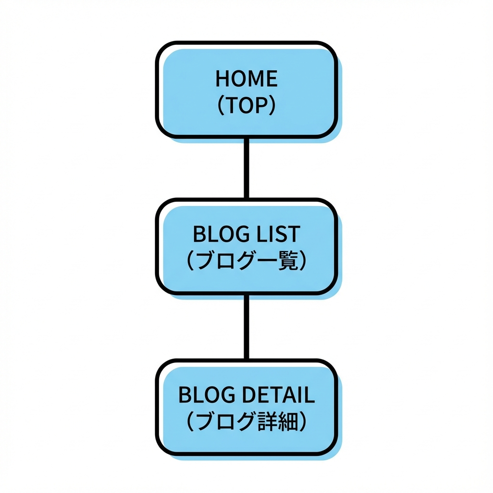
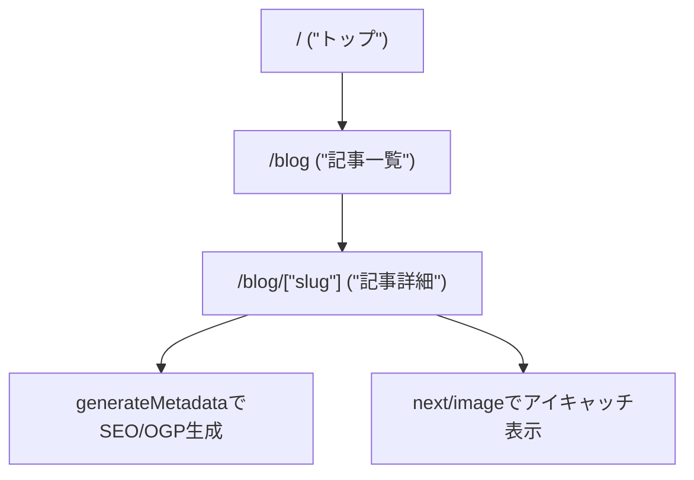

# 第202章：ミニ課題：ブログ風ページを完成させる📰🏁

この章では **「ブログっぽい見た目＆SEOっぽい設定」** をぜんぶ合体させて、**/blog（一覧）→ /blog/[slug]（記事詳細）** を完成させます☺️🧡
（データはDBじゃなくて、まずは **配列（ダミー記事）** でOKだよ〜！）✨

---

## ゴール🎯✨

* `/blog` に **記事一覧** が出る📚
* `/blog/hello-nextjs` みたいなURLで **記事詳細** が見れる📝
* 詳細ページに **OGP込みのmetadata** を付ける🔎🧡
* 画像は `next/image` で **最適化** 📸
* フォントは `next/font` で **読み込み体験よくする** 🔤✨
* 見た目はCSS Modulesで **「それっぽく」** 仕上げる💅🌸

---

## ざっくり完成図（ルーティングの流れ）🗺️✨





---

## 1) ダミー記事データを作ろう📦📝

まずは記事データを1か所にまとめます✨
`src/` がある構成でも無い構成でもOKなので、ここでは **`lib/`** を使います！

### ✅ 作るファイル

* `lib/posts.ts`

```ts
// lib/posts.ts
export type Post = {
  slug: string;
  title: string;
  excerpt: string;
  date: string; // "2025-12-26" みたいなISO文字列でOK
  tags: string[];
  coverImage: {
    src: string; // public配下のパス（例: "/images/blog/cover-1.jpg"）
    alt: string;
    width: number;
    height: number;
  };
  content: string; // 今回は簡易でテキスト（Markdown化は後でOK）
};

export const posts: Post[] = [
  {
    slug: "hello-nextjs",
    title: "はじめてのNext.jsブログできた！🎉",
    excerpt: "App Routerでブログっぽいページを作ってみるよ〜✨",
    date: "2025-12-26",
    tags: ["Next.js", "App Router", "SEO"],
    coverImage: {
      src: "/images/blog/cover-1.jpg",
      alt: "ノートPCとコーヒーのイメージ",
      width: 1600,
      height: 900,
    },
    content:
      "これはダミー記事本文だよ〜！\n\n段落を分けたり、見出しを増やしたりして、ブログっぽくしていこう✨",
  },
  {
    slug: "ogp-is-love",
    title: "OGPは愛💖（SNSでキレイに出したい）",
    excerpt: "metadataを整えると、シェアした時の見た目が良くなるよ✨",
    date: "2025-12-20",
    tags: ["OGP", "metadata"],
    coverImage: {
      src: "/images/blog/cover-2.jpg",
      alt: "スマホでSNSを見ているイメージ",
      width: 1600,
      height: 900,
    },
    content:
      "OGPはSNSのサムネやタイトルを決める大事なやつ！\n\n今回はgenerateMetadataで付けちゃうよ〜📌",
  },
];

export function getPostBySlug(slug: string) {
  return posts.find((p) => p.slug === slug) ?? null;
}
```

---

## 2) 画像を `public/` に置こう🖼️📁

`next/image` は `public/` 配下の画像が扱いやすいです✨

### ✅ フォルダ例

* `public/images/blog/cover-1.jpg`
* `public/images/blog/cover-2.jpg`

> 画像は手元の適当な写真でもOKだよ〜☺️（サイズはざっくり 1600×900 くらいが扱いやすい📸）

---

## 3) フォントを入れて「ブログ感」を上げる🔤✨

`app/layout.tsx` に `next/font/google` を足して、全体の文字を整えます🌸
（すでに入ってたら “確認だけ” でOK！）

```tsx
// app/layout.tsx
import type { Metadata } from "next";
import { Noto_Sans_JP } from "next/font/google";
import "./globals.css";

const noto = Noto_Sans_JP({
  subsets: ["latin"],
  weight: ["400", "700"],
  display: "swap",
});

export const metadata: Metadata = {
  title: "Mini Blog",
  description: "Next.jsで作るミニブログ📰✨",
};

export default function RootLayout({
  children,
}: {
  children: React.ReactNode;
}) {
  return (
    <html lang="ja">
      <body className={noto.className}>{children}</body>
    </html>
  );
}
```

---

## 4) `/blog`（一覧ページ）を作ろう📚✨

### ✅ 作るファイル

* `app/blog/page.tsx`
* `app/blog/blog.module.css`

#### `app/blog/page.tsx`

```tsx
import Link from "next/link";
import Image from "next/image";
import { posts } from "@/lib/posts";
import styles from "./blog.module.css";

export default function BlogListPage() {
  return (
    <main className={styles.page}>
      <header className={styles.header}>
        <h1 className={styles.title}>Mini Blog 📰✨</h1>
        <p className={styles.subtitle}>Next.jsで“ブログっぽい”を完成させよう☺️</p>
      </header>

      <section className={styles.grid}>
        {posts.map((post) => (
          <article key={post.slug} className={styles.card}>
            <Link href={`/blog/${post.slug}`} className={styles.cardLink}>
              <div className={styles.thumb}>
                <Image
                  src={post.coverImage.src}
                  alt={post.coverImage.alt}
                  width={post.coverImage.width}
                  height={post.coverImage.height}
                  sizes="(max-width: 768px) 100vw, 420px"
                  className={styles.thumbImg}
                  priority={false}
                />
              </div>

              <div className={styles.cardBody}>
                <p className={styles.date}>
                  {new Intl.DateTimeFormat("ja-JP").format(new Date(post.date))}
                </p>
                <h2 className={styles.cardTitle}>{post.title}</h2>
                <p className={styles.excerpt}>{post.excerpt}</p>

                <div className={styles.tags}>
                  {post.tags.map((t) => (
                    <span key={t} className={styles.tag}>
                      #{t}
                    </span>
                  ))}
                </div>
              </div>
            </Link>
          </article>
        ))}
      </section>
    </main>
  );
}
```

#### `app/blog/blog.module.css`

```css
.page {
  max-width: 980px;
  margin: 0 auto;
  padding: 24px 16px 60px;
}

.header {
  margin-bottom: 18px;
}

.title {
  font-size: 32px;
  margin: 0 0 6px;
}

.subtitle {
  margin: 0;
  opacity: 0.8;
}

.grid {
  display: grid;
  gap: 16px;
  grid-template-columns: repeat(2, minmax(0, 1fr));
}

@media (max-width: 820px) {
  .grid {
    grid-template-columns: 1fr;
  }
}

.card {
  border: 1px solid rgba(0, 0, 0, 0.08);
  border-radius: 16px;
  overflow: hidden;
  background: white;
}

.cardLink {
  display: block;
  color: inherit;
  text-decoration: none;
}

.thumb {
  position: relative;
}

.thumbImg {
  width: 100%;
  height: auto;
  display: block;
}

.cardBody {
  padding: 14px 14px 16px;
}

.date {
  margin: 0 0 6px;
  font-size: 12px;
  opacity: 0.7;
}

.cardTitle {
  margin: 0 0 8px;
  font-size: 18px;
}

.excerpt {
  margin: 0 0 10px;
  opacity: 0.85;
}

.tags {
  display: flex;
  flex-wrap: wrap;
  gap: 6px;
}

.tag {
  font-size: 12px;
  padding: 4px 8px;
  border-radius: 999px;
  background: rgba(0, 0, 0, 0.06);
}
```

---

## 5) `/blog/[slug]`（記事詳細）を完成させよう📝✨（OGPも！）


### ✅ 作るファイル

* `app/blog/[slug]/page.tsx`
* `app/blog/[slug]/post.module.css`

#### `app/blog/[slug]/page.tsx`

```tsx
import Image from "next/image";
import { notFound } from "next/navigation";
import type { Metadata } from "next";
import { getPostBySlug } from "@/lib/posts";
import styles from "./post.module.css";

type Props = {
  params: Promise<{ slug: string }>;
};

export async function generateMetadata({ params }: Props): Promise<Metadata> {
  const { slug } = await params;
  const post = getPostBySlug(slug);
  if (!post) return { title: "Not Found" };

  const title = `${post.title} | Mini Blog`;
  const description = post.excerpt;
  const ogImage = post.coverImage.src;

  return {
    title,
    description,
    openGraph: {
      title,
      description,
      type: "article",
      images: [{ url: ogImage }],
    },
    twitter: {
      card: "summary_large_image",
      title,
      description,
      images: [ogImage],
    },
  };
}

export default async function BlogPostPage({ params }: Props) {
  const { slug } = await params;
  const post = getPostBySlug(slug);
  if (!post) notFound();

  return (
    <main className={styles.page}>
      <article className={styles.article}>
        <header className={styles.header}>
          <p className={styles.date}>
            {new Intl.DateTimeFormat("ja-JP").format(new Date(post.date))}
          </p>
          <h1 className={styles.title}>{post.title}</h1>

          <div className={styles.tags}>
            {post.tags.map((t) => (
              <span key={t} className={styles.tag}>
                #{t}
              </span>
            ))}
          </div>
        </header>

        <div className={styles.hero}>
          <Image
            src={post.coverImage.src}
            alt={post.coverImage.alt}
            width={post.coverImage.width}
            height={post.coverImage.height}
            sizes="(max-width: 980px) 100vw, 980px"
            className={styles.heroImg}
            priority
          />
        </div>

        <section className={styles.content}>
          {post.content.split("\n\n").map((para, i) => (
            <p key={i} className={styles.p}>
              {para}
            </p>
          ))}
        </section>
      </article>
    </main>
  );
}
```

#### `app/blog/[slug]/post.module.css`

```css
.page {
  max-width: 980px;
  margin: 0 auto;
  padding: 24px 16px 60px;
}

.article {
  display: grid;
  gap: 16px;
}

.header {
  display: grid;
  gap: 10px;
}

.date {
  margin: 0;
  font-size: 12px;
  opacity: 0.7;
}

.title {
  margin: 0;
  font-size: 30px;
  line-height: 1.25;
}

.tags {
  display: flex;
  flex-wrap: wrap;
  gap: 6px;
}

.tag {
  font-size: 12px;
  padding: 4px 8px;
  border-radius: 999px;
  background: rgba(0, 0, 0, 0.06);
}

.hero {
  border-radius: 18px;
  overflow: hidden;
  border: 1px solid rgba(0, 0, 0, 0.08);
}

.heroImg {
  width: 100%;
  height: auto;
  display: block;
}

.content {
  display: grid;
  gap: 12px;
}

.p {
  margin: 0;
  line-height: 1.9;
  opacity: 0.92;
}
```

---

## 6) 動作確認しよう✅🎮

1. ターミナルで起動

   ```bash
   npm run dev
   ```
2. ブラウザで見る

   * `http://localhost:3000/blog`（一覧）📚
   * 記事カードをクリック → 詳細へ📝✨
3. OGP確認（超ざっくり）

   * 開発中はSNSプレビューが完全には見れないこともあるけど、`generateMetadata` があるのを確認できたらOK💖
   * 本番（Vercel等）に上げると確認しやすいよ〜🌍✨

---

## 仕上げチェックリスト🧾✨（ここまでできたらクリア！）

* [ ] `/blog` が表示される📚
* [ ] カードを押すと `/blog/[slug]` に遷移する🔗
* [ ] 詳細ページの **タイトル/本文/タグ/日付/画像** が出る📝📸
* [ ] `generateMetadata` で **title/description/OGP/twitter** が入ってる🔎💖
* [ ] `next/image` で `width/height` 指定してる🧱（レイアウト崩れ防止！）
* [ ] `next/font` が当たってて読みやすい🔤✨

---

## 今日の“できた！”ポイント🎉🫶

* **一覧 → 詳細** のブログ導線ができた🗺️✨
* `next/image` で **速くてキレイ** な表示になった📸⚡
* `generateMetadata` で **SEO/OGPの土台** を付けた🔎🧡
* CSS Modulesで **ブログっぽい見た目** にできた💅🌸

以上で「第202章」完成〜っ！🏁📰✨
