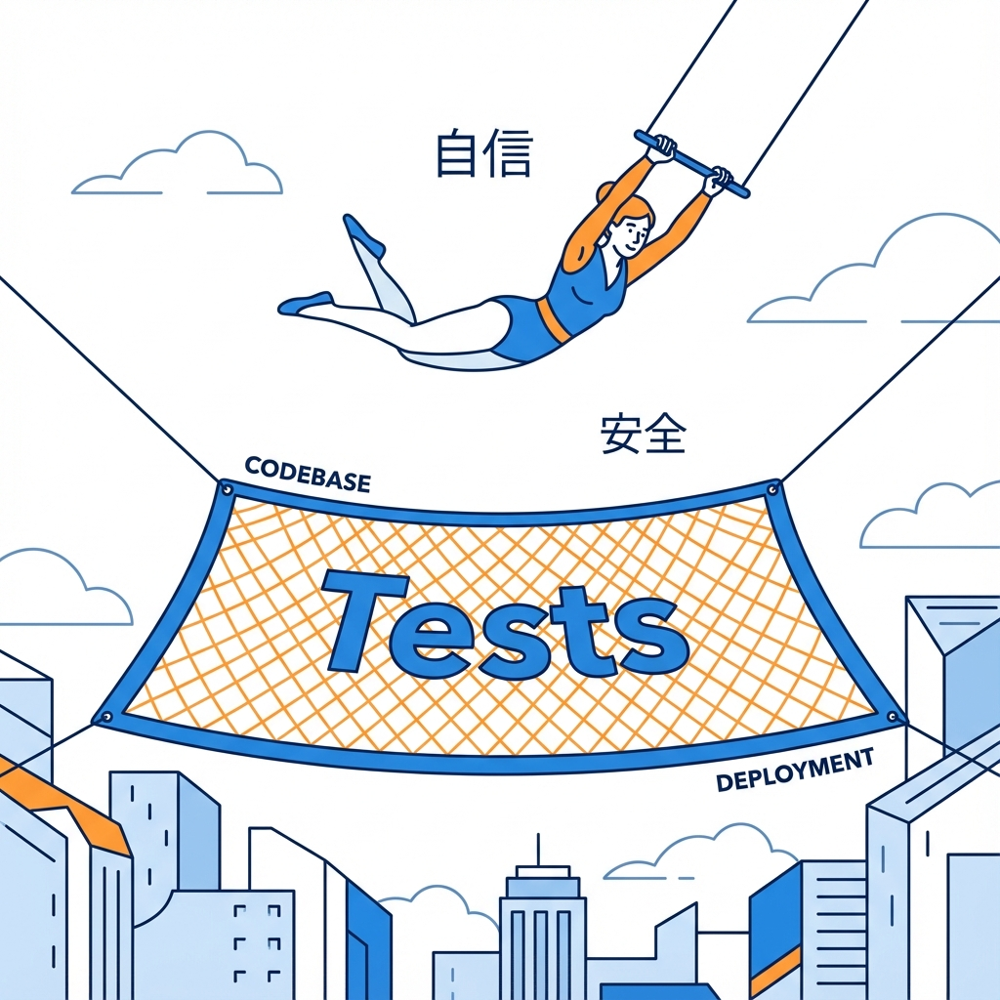
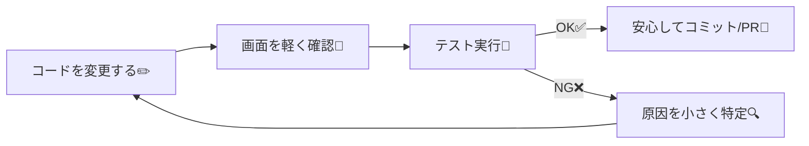

# 第203章：テストは未来の自分の味方🫶

この章は、「テストって結局なにが嬉しいの？」をふわっと→しっかり実感できる回だよ〜😊💡
（まだ1行もテストを書かなくてOK！まず“味方感”をつかも〜🫶）

---

## この章のゴール🎯

* テストが「めんどい」じゃなくて「守ってくれる」理由がわかる🛡️✨
* Next.js開発で、テストが効く瞬間をイメージできる👀
* “最初に守る場所”を自分で決められるようになる✅

---

## テストって、ひと言でいうと？🧠💬

**「変更しても壊れてないことを、機械に確認してもらう仕組み」**だよ🤖✅

人間の目チェックって、どうしてもこうなる👇

* 今日は眠い🥱
* 直したところ以外も壊れてた😭
* そもそも確認し忘れた😇

テストはそこを **無感情にコツコツ** やってくれる相棒〜🫶✨

---

## テストが“未来の自分”を助ける3つの理由⏳🫶

### ① リファクタが怖くなくなる😳➡️😎

コード整理したいのに、
「壊したらどうしよ…」で手が止まるやつ！あるある😭

テストがあると👇

* 変更前後で大事な動きが保たれてるか自動で確認✅
* “安心して片付け”できる🧹✨

---

### ② バグの発見が早くなる🚨➡️🔍

バグって、放置すると雪だるま式にでかくなる⛄💥
テストがあると、**小さいうちに転んでくれる**（大事）🫶

* 「今のコミットで壊れた」ってすぐわかる
* 直す場所が小さくて済む💡

---

### ③ 仕様の“メモ”になる📝✨

テストって、実は **「この機能はこう動くべき」** の文章みたいなもの📚
未来の自分が見たときに、

* 「このボタン押したら増えるのが正解なんだな」
* 「空欄ならエラー表示するんだな」

って、**仕様が読み取れる**ようになるよ😊

---

## Next.jsでテストが効きやすい“ありがち瞬間”⚡🧩

Next.js（App Router）だと、こんな変更がよく起きるよね👇

* UIの表示条件をちょっと変えた（if増えた）🧠
* フォームの挙動を直した（送信・エラー表示）📨🧯
* データ取得の流れを整理した（Server/Clientの分担変更）🍵🎮
* コンポーネント分割した（props増えた）🧩
* ルーティング周りを触った（リンクや遷移）🛣️

こういうとき、**「壊れてない？」を毎回ぜんぶ手確認はムリ**だから、テストが効くよ〜🫶✨

---

## 図解：テストがいると開発がラクになる流れ🧪🔁

（このループが回り始めると、開発が一気に気持ちよくなるよ😆）

---

## “最初に守るべき場所”はここだけでOK✅🫶

テストって、最初から全部は無理ゲー😇
だから **「壊れたら困るところ」だけ** からで大丈夫！

おすすめの最初の守りポイントはこれ👇

* **ユーザーが毎回触るところ**（トップ・一覧・追加ボタン）👆
* **お金/個人情報/ログイン周り**（あれば最優先）🔐
* **バグったことがある場所**（再発しやすい）🔥

---

## ミニワーク（3分）📝✨：あなたのアプリで守りたいものを決めよう

以下を3つ、箇条書きでOK😊🌸

1. 壊れたら困る動き（例：TODOが追加される）➕
2. よく触るUI（例：検索入力）🔎
3. バグりそうな条件分岐（例：未ログイン時の表示）🚪

そして、それぞれに **テスト名っぽい文章** を付けてみよ〜💡
例：

* 「追加ボタンを押すとTODOが1件増える」
* 「空欄で送信するとエラーメッセージが出る」

この“文章”が、そのままテストになっていくよ🫶🧪

---

## この章のまとめ🎁✨

* テストは「未来の自分を救う保険」🫶
* 目的は完璧じゃなくて、**安心して変更できる状態**を作ること😊
* 最初は **壊れたら困るところだけ** 守ればOK✅

次の章から、テストの種類とか道具の話に入っていくよ〜🧪🔧✨
