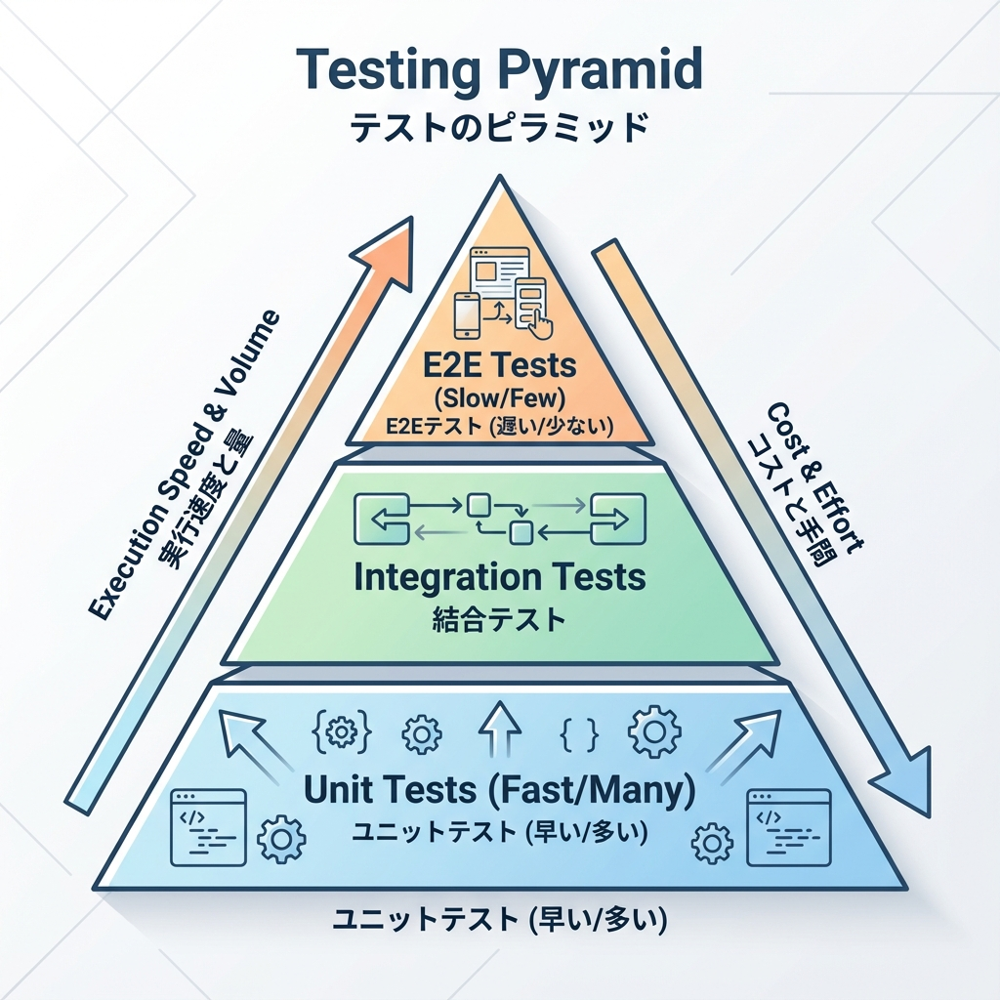
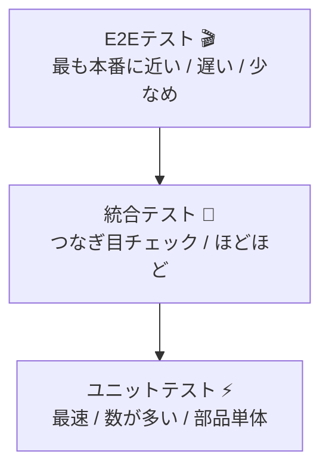

# 第204章：ユニット/統合/E2E の違い🧠

## 今日のゴール🎯

「テストって3種類あるらしい…😵‍💫」を卒業して、
✅ **今の状況ならどれを書くべきか** がすぐ判断できるようになります✊✨

---

## まずは一言で！3つのテスト🏷️

### ✅ ユニットテスト（Unit）⚡

**“部品ひとつ”を単体でチェック**するテストだよ〜🔧
例：関数、計算ロジック、文字変換、バリデーションなど🧼

* 速い💨
* 壊れにくい🧱
* 原因が特定しやすい🔎

---

### ✅ 統合テスト（Integration）🧩

**“部品どうしをつなげた状態”でチェック**するテストだよ〜🧷
例：Reactコンポーネント + 入力 + ボタン操作 + 表示結果 みたいに、ちょっと広め👀✨

* ユニットよりは遅い⏳
* でも「実際に近い」安心感が増える🫶
* “つなぎ目”のバグを拾いやすい🧠

---

### ✅ E2Eテスト（End-to-End）🎬

**“ユーザーの操作を最初から最後まで”**再現するテストだよ〜🖱️📱
例：ログイン→一覧→追加→保存→表示確認、みたいな流れ全部🌊

* いちばん安心感ある💯
* でも遅い🐢
* 壊れやすい（UI変更で落ちやすい）🫠

---

## ざっくり比較表📊✨

| 種類   | 何を守る？🛡️   | 速さ💨 | 壊れやすさ🫧 | 例          |
| ---- | ---------- | ---: | ------: | ---------- |
| ユニット | ロジックの正しさ   |   最速 |       低 | 関数の戻り値     |
| 統合   | 画面や部品のつながり |    中 |       中 | 入力→クリック→表示 |
| E2E  | ユーザー体験の流れ  |   遅め |       高 | ログイン→購入→完了 |

---

## 図解：テストの“積み重ね”イメージ🧱🧪

（下ほどたくさん書きがち、上ほど少数精鋭になりがちだよ〜👑）

---

## Next.jsでの具体例（イメージ）🧁✨

### ユニットテスト向き⚡

* `formatDate(date)` が期待通りの文字列になる📅
* `validateTodo(title)` が空文字を弾く🚫
* `calcTotal(price, tax)` が正しい合計になる🧮

👉 **「UIもDBも関係ない」**ところが得意💪✨

---

### 統合テスト向き🧩

* Todo入力欄に文字を入れる → 追加ボタン押す → リストに表示される📋➕
* エラー時にエラーメッセージが出る🧯
* ローディング中にボタンがdisabledになる⏳🔒

👉 **コンポーネントの見た目＋操作＋結果**まで確認できるのが強い😆

---

### E2Eテスト向き🎬

* ブラウザでアプリを開く → ログイン → Todo追加 → ページ遷移 → 追加が残ってる✅
* 「本番の使われ方」を1本通して守る🛡️✨

👉 **“一番大事なユーザー動線”だけ**をE2Eにするのがコツだよ〜🎯

---

## よくある勘違いあるある😵‍💫➡️😎

### ❌ E2EだけやればOK？

→ ううん、**遅い＆壊れやすい**から、全部E2Eはしんどい〜🫠💦
**ユニット/統合で細かい安心**を作って、E2Eは要所だけがラク💡

### ❌ モックは悪？

→ 悪じゃないよ〜🎭✨
ただ、**モックしすぎると“現実とズレたテスト”**になりやすいから、目的に合わせてほどほどが正義🧘‍♀️

---

## 迷ったときの選び方（超実用）🧭✨

* 「この関数の計算、絶対壊したくない」→ **ユニット**⚡
* 「この画面、操作したらちゃんと変わってほしい」→ **統合**🧩
* 「この流れ、サービスとして命」→ **E2E**🎬

---

## まとめ🎀

* **ユニット**：部品を速く守る⚡
* **統合**：つなぎ目を守る🧩
* **E2E**：ユーザー体験の重要ルートを守る🎬

次の章から、具体的に「じゃあどう書くの？」へ入っていくよ〜😆🧪✨
