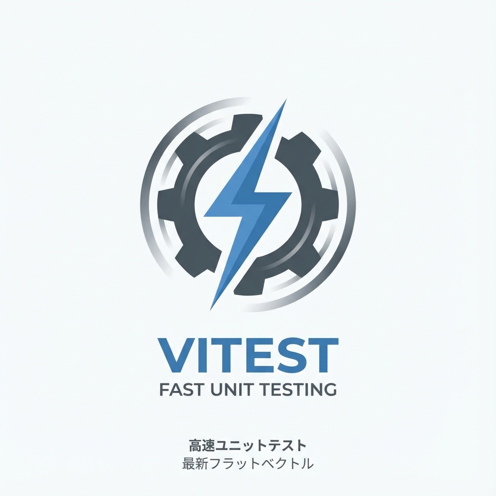
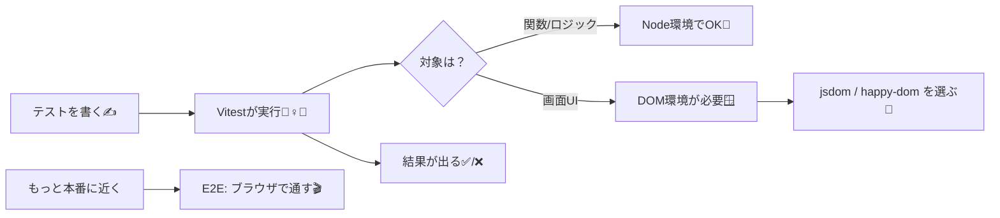

# 第205章：Vitestの立ち位置（速い）⚡

## この章のゴール🎯✨

* **Vitestが「何担当の道具」なのか**をハッキリさせる🧠💡
* なんで**速い⚡**のか、ざっくり理由がわかる🚀
* Next.jsでテストを組むときに「Vitestはここ！」って置けるようになる🧩

---

## まず結論：Vitestは「テストを走らせる人」🏃‍♀️💨



Vitestは、ざっくり言うと **テストランナー**（テストを実行して結果をまとめる係）だよ〜🧪✨
しかも **Viteパワーで速い**のが売り⚡

* ✅ `test()` / `describe()` でテストを並べる
* ✅ `expect()` で「こうなるはず！」をチェックする
* ✅ `vi.fn()` とかでモックもできる🎭
* ✅ 監視して、変更したところだけ賢く回す👀⚡

Vitest自体が「テストの土台」を持ってて、Jestっぽい書き心地なのも嬉しいポイント🫶 ([Vitest][1])

---

## 「立ち位置」を地図で見るとこう🗺️✨（図解）

「テスト」って、実は役割が分かれてるんだよね🙂

* **Vitest**：テストを実行する（司会者🎤）
* **Testing Library（例：React Testing Library）**：画面を“ユーザー目線”で触る道具🖱️👀
* **E2Eツール（例：Playwright）**：本物のブラウザで最終チェック🌐🎬



---

## なんでVitestは速いの？⚡🚀

速さの理由は、ざっくりこれ👇

### ① Viteの仕組みを使ってる⚡

Vitestは **Vite powered** で、モジュールの扱いが軽快なのが強みだよ〜🛼✨ ([Vitest][1])

### ② 変更したところに関連するテストだけ回しがち👀⚡

ファイルを直したら、関係あるテストだけを探して実行しようとする（ViteのHMRっぽい感覚）🧠✨ ([Vitest][2])

### ③ 並列で走らせて速くする（Worker threads）🧵⚡

Vitestはパフォーマンス重視で、できるだけ並列に走らせる設計があるよ💨 ([Vitest][3])

---

## 「Next.jsでのVitest」ここが大事ポイント📌✨

Next.js公式にも **Vitestのガイド**があって、Next.jsで普通に採用候補になるよ🧪🌸 ([Next.js][4])

ただし⚠️ 重要な注意もあるよ：

* **`async` なServer Componentは、現時点でVitestがサポートしてない**（だからE2E推奨、という案内）
  → 「テストしにくい部分はE2Eに回す」って割り切りが大事🫶 ([Next.js][5])

---

## “DOMが必要なテスト”では環境を選ぶ🪟🧩

UIテスト（ボタンとかフォームとか）をやるなら、Nodeだけだと `document` が無いから、DOM環境が必要になるよ〜🙂

Vitestではよくこの2つを選ぶよ👇

* **jsdom**：定番。互換性が高め👌
* **happy-dom**：軽くて速めな選択肢になりがち⚡（ただし差はある）

Vitestは `jsdom` / `happy-dom` を「テスト環境」として選べるよ、って公式にも書いてあるよ🧸 ([Vitest][6])

---

## “使いどころ”の目安🎯🧠

Vitestが気持ちよくハマるのは、こんな場面👇✨

* ✅ **関数・ロジック**（計算、整形、バリデーション）🧠
* ✅ **コンポーネントのふるまい**（表示される/押せる/増える）🖱️
* ✅ **軽い統合テスト**（複数部品の組み合わせ）🧩
* ✅ **CIで高速に回して安心を買う**🚦💰

逆に、**ブラウザそのものの挙動**（本物のクリック、遷移、認証フローなど）まで確実に見たいなら、E2Eを混ぜるのが自然だよ🎬✨

---

## 覚え方（超シンプル）🧠💡

* **Vitest = テスト実行のエンジン⚙️⚡**
* **Testing Library = 画面を触る指👆👀**
* **E2E = 本番っぽい通しリハーサル🎬🌐**

---

## ちょい触り：よく使うコマンド感覚（雰囲気）⌨️✨

Vitestは **watchがデフォで動きやすい**のが特徴だよ〜👀⚡
（CIでは `run` が向いてるよ、って公式にもまとまってる） ([Vitest][2])

```bash
# 開発中（監視してサクサク回すイメージ）
npx vitest

# CI用（1回で終了する）
npx vitest run
```

---

## まとめ🎀✨

* Vitestは **「テストを走らせる担当」**で、Viteの仕組みを活かして速い⚡ ([Vitest][1])
* **Jestに近い書き心地**で移行もしやすい系🧪✨ ([Vitest][3])
* Next.jsでも公式ガイドがあるけど、**`async` Server Componentsは注意**（E2E推奨の案内あり）⚠️ ([Next.js][5])
* UIテストは **jsdom / happy-dom** みたいなDOM環境を選んで進む🪟🧩 ([Vitest][6])

次は「じゃあ実際に画面をどうテストするの？」ってところに繋がっていくよ〜🫶✨

[1]: https://vitest.dev/guide/?utm_source=chatgpt.com "Getting Started | Guide"
[2]: https://vitest.dev/guide/features?utm_source=chatgpt.com "Features | Guide"
[3]: https://vitest.dev/guide/why?utm_source=chatgpt.com "Why Vitest | Guide"
[4]: https://nextjs.org/docs/app/guides/testing?utm_source=chatgpt.com "Guides: Testing"
[5]: https://nextjs.org/docs/app/guides/testing/vitest?utm_source=chatgpt.com "Testing: Vitest"
[6]: https://vitest.dev/guide/environment?utm_source=chatgpt.com "Test Environment | Guide"
