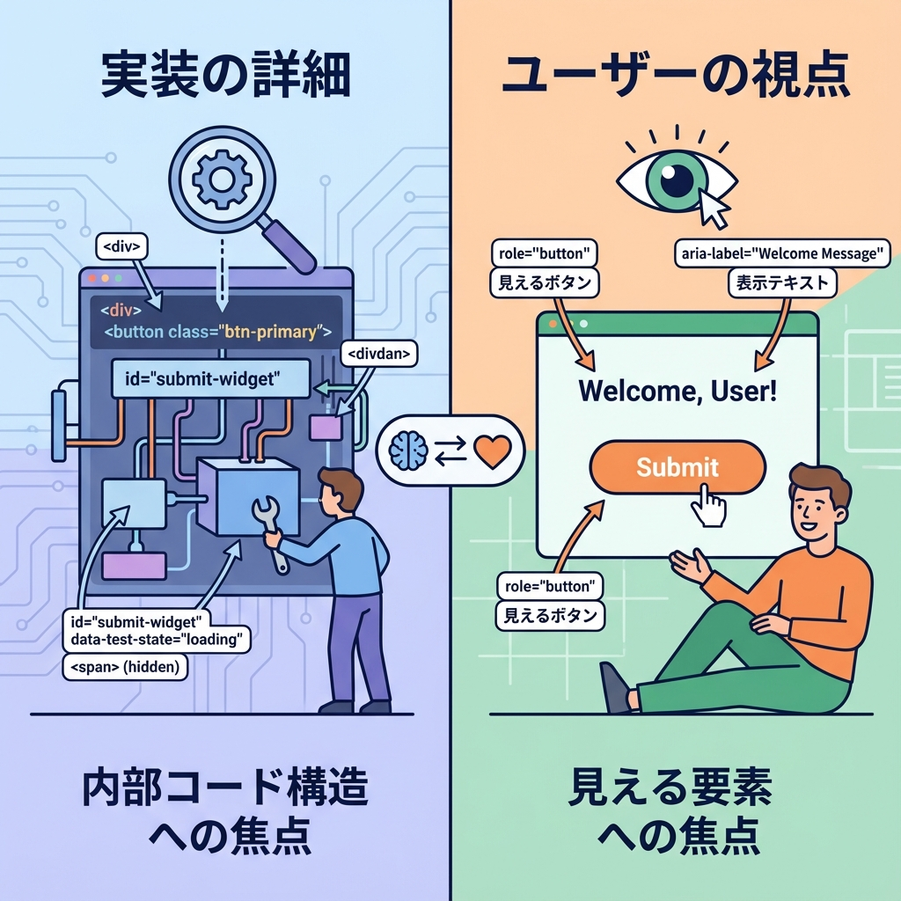
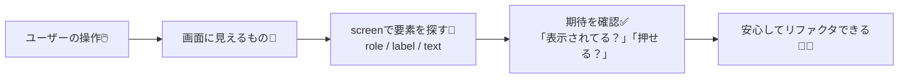
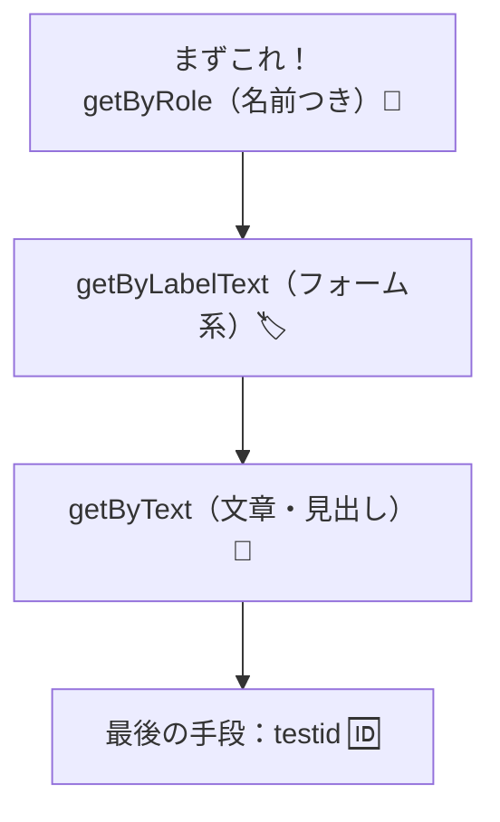

# 第206章：React Testing Libraryの考え方（画面目線）👀

この章は「React Testing Library（RTL）」の**考え方（思想）**をつかむ回だよ〜！🧸💖
まだAPIを暗記しなくてOK🙆‍♀️ まずは “どういう気持ちでテストを書くのか” を身につけよう🌷

---

## 1) React Testing Libraryって、結局なに？🧪

RTLはひとことで言うと…

**「ユーザーが見て・触る画面」を中心にテストする道具**だよ👀🖱️✨

なので、テストで大事にするのは👇

* ✅ **見えるテキスト**
* ✅ **ボタンや入力欄などの役割（role）**
* ✅ **ラベル（label）や説明（aria-label）**
* ✅ **ユーザーの操作（クリック・入力）**

逆に、できるだけ避けたいのは👇

* ❌ stateの中身を直接見る
* ❌ 特定のclass名やDOM構造に依存する
* ❌ 「この関数が呼ばれたか」みたいな内部実装チェック（必要な時だけ）

> 目的は「実装の正しさ」よりも、**体験が壊れてないか**を守ること🛡️✨

---

## 2) “画面目線”のイメージ図 👀➡️✅



RTLの世界観はこう👇



「ユーザー→画面→確認」って順番が超たいせつだよ〜🌸

---

## 3) RTLの合言葉：Implementation Details を避ける🧼

RTLの強みは、テストが **リファクタに強くなる**こと💪✨

たとえば👇みたいな変更って、よくあるよね？

* CSSクラス名を変えた
* divをsectionに変えた
* コンポーネントを分割した

こういうのは、ユーザー体験が同じなら **テストは落ちてほしくない**🥺💦
だからRTLでは、ユーザーが触れる“意味”で要素を探すよ✨

---

## 4) 要素の探し方は「優先順位」があるよ🔎🏆

RTLでは「人間が自然に見つける方法」に寄せるのがオススメ🙌

### 優先イメージ（ざっくり）🎯



* 👑 **getByRole**：ボタン・リンク・見出し…みたいな「役割」で探せる（強い）
* 🏷️ **getByLabelText**：フォームは「ラベル」で探すと自然
* 📝 **getByText**：文章が主役のUIなら便利
* 🆔 **data-testid**：どうしても無理な時の保険（頼りすぎ注意⚠️）

---

## 5) “良いテスト”の型：AAA（Arrange / Act / Assert）📦🖱️✅

テストって、ごちゃつきやすいから型を決めるとラクだよ〜✨

* **Arrange（準備）**：画面を用意する（renderとか）
* **Act（行動）**：クリック・入力など操作する
* **Assert（確認）**：期待どおりか確認する

まだ `render` や `screen` の細かい使い方は次の章でやるけど、**考え方は今ここでOK**👌😊

---

## 6) ミニ例：悪い例🙅‍♀️ vs いい例🙆‍♀️（雰囲気だけつかもう✨）

### ❌ 実装に寄りすぎ（壊れやすい）

```tsx
// class名やDOM構造に依存しがち（リファクタで落ちやすい…）
expect(container.querySelector(".btn-primary")).toBeTruthy();
```

### ✅ 画面目線（壊れにくい）

```tsx
// 「ボタンとして存在して、名前が"送信"」を確認する（ユーザー目線）
expect(screen.getByRole("button", { name: "送信" })).toBeInTheDocument();
```

この差、めちゃ大きいよ〜！🥹✨
**見た目の中身が変わっても、体験が同じならテストが守ってくれる**感じ🌷

---

## 7) Next.js（App Router）だと、どこをRTLでテストする？🧭

基本は👇のイメージでOKだよ🙆‍♀️✨

* ✅ **操作がある部品（ボタン、フォーム、モーダルなど）**をテストしやすい
* ✅ “ページ全体”より、**UI部品を小さく切って**テストするとラク
* 🧊 Server Component は「操作するDOM」ってより「生成された結果」側なので、まずは **動きのあるUI（Client側）**を中心に考えるとスムーズだよ🌸

---

## 8) よくあるつまずきポイント（先に予防）🩹

### 「要素が見つからない！」😵‍💫

だいたい原因はこれ👇

* ボタンに表示名がない（アイコンだけ等）
  → `aria-label` を付けると見つけやすくなるよ🏷️✨
* labelとinputがちゃんと紐づいてない
  → `label` の `htmlFor` と `input` の `id` を合わせると最強💪

**テストしやすいUI＝アクセシブルなUI**になりやすいのがRTLの良いところだよ😊💖

---

## 9) まとめ（この章のゴール）🎯✨

* RTLは **画面目線（ユーザー目線）**でテストする📺👀
* **実装詳細に依存しない**ほど、リファクタに強くなる🧼
* 要素はできるだけ **role / label / text** で探す🔎
* テストは **AAA（準備→操作→確認）** で整えるとキレイ📦🖱️✅

---

次の章（第207章）で、いよいよ `render` と `screen` を使って「基本の書き方」を手で覚えていくよ〜！🧪✨
