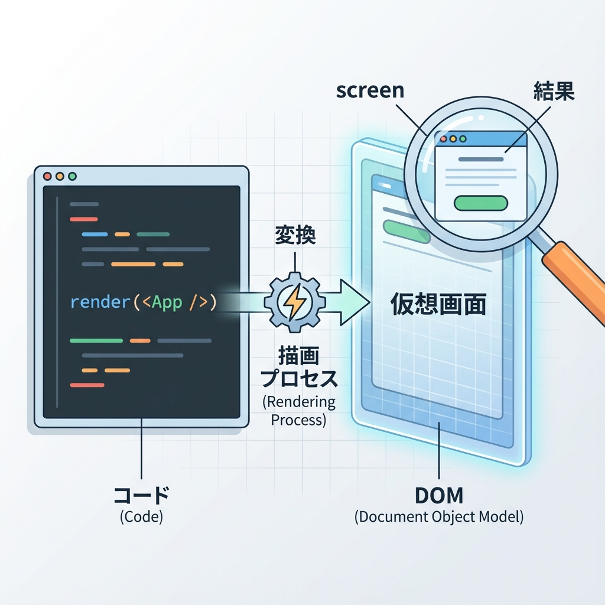
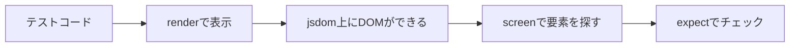

# 第207章：`render` と `screen` の基本🧩

この章は、「テストって何を書けばいいの？」の最初の一歩だよ〜！😊🌸
ポイントはこの2つだけ👇

* `render()` 👉 コンポーネントを“テスト用の画面”に表示する📺
* `screen` 👉 その“画面”から要素を探す虫メガネ🔎✨

---

## まずは全体イメージをつかも〜🧠🌈（図解）






---

## `render()`ってなに？📺✨

`render(<Component />)` を呼ぶと、コンポーネントが **テスト用のDOM（仮のブラウザ）** に表示されるよ〜！
しかも基本は、自動で `document.body` 配下に入れてくれるんだ（便利！）🫶✨ ([Testing Library][1])

---

## `screen`ってなに？🔎✨

`screen` は「いま表示されてる画面（DOM）」から要素を探すための道具だよ😊
`render()` の戻り値にも `getBy...` はあるけど、`screen` を使うと「画面目線」で読めてテストがスッキリしやすい〜！🧼✨ ([Kent C. Dodds][2])

---

## 実例：表示されてるかをテストしてみる🧁💕

### ① テスト対象コンポーネント（例）

`components/ProfileCard.tsx`（例）👇

```tsx
"use client";

type Props = {
  name: string;
};

export function ProfileCard({ name }: Props) {
  return (
    <section aria-label="profile">
      <h2>プロフィール</h2>
      <p>{name} さん、ようこそ！</p>
      <button type="button">フォロー</button>
    </section>
  );
}
```

---

### ② テストを書く（`render` と `screen` を使う）

`components/ProfileCard.test.tsx`（例）👇

```tsx
import { render, screen } from "@testing-library/react";
import { describe, it, expect } from "vitest";
import { ProfileCard } from "./ProfileCard";

describe("ProfileCard", () => {
  it("見出し・本文・ボタンが表示される", () => {
    render(<ProfileCard name="さくら" />);

    // 見出し（role=heading）を探す🌸
    expect(
      screen.getByRole("heading", { name: "プロフィール" })
    ).toBeInTheDocument();

    // 文を探す📝
    expect(
      screen.getByText("さくら さん、ようこそ！")
    ).toBeInTheDocument();

    // ボタン（role=button）を探す🖱️
    expect(
      screen.getByRole("button", { name: "フォロー" })
    ).toBeInTheDocument();
  });
});
```

※ `toBeInTheDocument()` を使うには、どこか（setupファイルなど）で `@testing-library/jest-dom/vitest` を読み込む形が一般的だよ〜🧩 ([Testing Library][3])

---

## `screen.getBy...` の「get / query / find」ざっくり🧠✨

ここ、めっちゃ大事〜！😆

* `getBy...`：**無かったら即エラー**（基本これ）💥
* `queryBy...`：**無かったら `null`**（「無いこと」を確認したい時）🌙
* `findBy...`：**非同期で待つ**（あとで出てくる要素向き）⏳

この違いは公式でも説明されてるよ📘✨ ([Testing Library][4])

---

## 要素の探し方のおすすめ順🧭💡

基本は **ユーザーが見つける方法** に寄せると強いよ〜！🫶

* いちばん推し：`getByRole(...)`（ボタン・見出しなど）👑 ([Testing Library][5])
* 次に：`getByLabelText(...)`（フォーム系）🏷️
* その次：`getByText(...)`（文章）📝
* 最終手段：`getByTestId(...)`（どうしても無理な時だけ）🆘

---

## 困ったらこれ！`screen.debug()` 🧯✨

「え、何が表示されてるの？😵‍💫」ってなったら👇

```ts
screen.debug();
```

今のDOMがログに出てくるから、めっちゃ助かるよ〜！📸✨

---

## ちいさな練習🎯💕

さっきのテストに、これを1行追加してみてね👇

* `screen.getByRole("region", { name: "profile" })` が取れるか確認してみる✨
  （`<section aria-label="profile">` だから “region” 扱いになるよ〜😊）

---

ここまでできたら、第207章クリア！🎉✨
`render` で表示して、`screen` で探して、`expect` で確認する！この型が基本だよ〜🫶💖

[1]: https://testing-library.com/docs/react-testing-library/api/?utm_source=chatgpt.com "API"
[2]: https://kentcdodds.com/blog/common-mistakes-with-react-testing-library?utm_source=chatgpt.com "Common mistakes with React Testing Library"
[3]: https://testing-library.com/docs/svelte-testing-library/setup/?utm_source=chatgpt.com "Setup"
[4]: https://testing-library.com/docs/queries/about/?utm_source=chatgpt.com "About Queries"
[5]: https://testing-library.com/docs/queries/byrole/?utm_source=chatgpt.com "ByRole"
