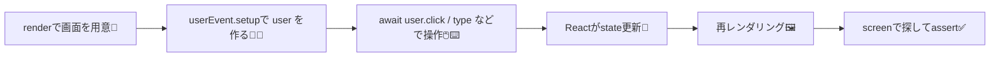

# 第208章：`user-event` で操作を再現🖱️

この章では、テストの中で「人がほんとに操作した感じ」を再現するための **`@testing-library/user-event`** を使えるようになろう〜！😊💕

---

## 1) `user-event` ってなに？なんで使うの？🤔💡


React Testing Library には `fireEvent` もあるけど、`user-event` はもっと **ユーザーの操作に近い形** を再現してくれるよ〜✨
たとえばクリックって、実際は `mousedown` → `focus` → `mouseup` → `click` …みたいに色々起きるんだけど、`user-event` はそういう「一連の流れ」をいい感じにやってくれるイメージ！🖱️🌸 ([Testing Library][1])

---

## 2) セットアップ（基本の型）🧩✨

### インストール（入ってなければ）📦

```bash
npm i -D @testing-library/user-event
```

### 使い方の“いちばん大事な型”🧠✨

`userEvent.setup()` で **操作する人（user）** を作って、その `user` で操作するよ〜！
同じ `user` を使うと「どのキーが押されてるか」みたいな状態も共有されて、より人間っぽく連続操作できるよ🙆‍♀️✨ ([Testing Library][2])

```ts
import userEvent from '@testing-library/user-event'

const user = userEvent.setup()
await user.click(...)
await user.type(...)
```

---

## 3) 図でイメージ：テストの流れ🧭🧪



ポイントはこれ！👇
**`user-event` の操作は `await` を付けることが多い**（＝待つのが大事）だよ〜⏳💕

---

## 4) まずは `click`：ボタンを押す🖱️✨

例として、ボタンを押すと表示が切り替わるコンポーネントをテストしてみるね😊

### コンポーネント例：`ToggleMessage.tsx`

```tsx
'use client'

import { useState } from 'react'

export function ToggleMessage() {
  const [open, setOpen] = useState(false)

  return (
    <div>
      <button onClick={() => setOpen((v) => !v)}>
        {open ? 'とじる' : 'ひらく'}
      </button>

      {open ? <p>やったー！表示されたよ🎉</p> : null}
    </div>
  )
}
```

### テスト例：`ToggleMessage.test.tsx`

```tsx
import { render, screen } from '@testing-library/react'
import userEvent from '@testing-library/user-event'
import { ToggleMessage } from './ToggleMessage'

test('ボタンをクリックするとメッセージが表示される', async () => {
  render(<ToggleMessage />)
  const user = userEvent.setup()

  // 最初は表示されてない
  expect(screen.queryByText('やったー！表示されたよ🎉')).toBeNull()

  // クリック！
  await user.click(screen.getByRole('button', { name: 'ひらく' }))

  // 表示された！
  expect(screen.getByText('やったー！表示されたよ🎉')).toBeInTheDocument()
})
```

`getByRole('button', { name: ... })` を使うと、**人間が見て押すボタン**をそのまま探せて気持ちいいよ〜😊✨

---

## 5) `type`：入力する⌨️🩷（超よく使う！）

`user.type()` は入力の体験がかなりリアル寄りになるよ〜✨
（入力中に起きるイベントもそれっぽく発火するイメージ）

### コンポーネント例：`NameForm.tsx`

```tsx
'use client'

import { useState } from 'react'

export function NameForm() {
  const [name, setName] = useState('')

  return (
    <div>
      <label htmlFor="name">名前</label>
      <input
        id="name"
        value={name}
        onChange={(e) => setName(e.target.value)}
      />
      <p>こんにちは、{name || '（未入力）'}さん🌷</p>
    </div>
  )
}
```

### テスト例：`NameForm.test.tsx`

```tsx
import { render, screen } from '@testing-library/react'
import userEvent from '@testing-library/user-event'
import { NameForm } from './NameForm'

test('入力するとあいさつが更新される', async () => {
  render(<NameForm />)
  const user = userEvent.setup()

  const input = screen.getByLabelText('名前')

  await user.type(input, 'さくら')
  expect(screen.getByText('こんにちは、さくらさん🌷')).toBeInTheDocument()
})
```

### 便利：消してから入れ直す🧽✨

```ts
await user.clear(input)
await user.type(input, 'りん')
```

---

## 6) `keyboard`：Enter / Escape みたいなキー操作🎹✨

「Enter押したら送信」とか「Escで閉じる」みたいなのに便利！
`keyboard` は “キーを押す” を表現する感じだよ〜⌨️✨ ([Testing Library][3])

例：

```ts
await user.keyboard('{Enter}')
await user.keyboard('{Escape}')
```

---

## 7) `tab`：フォーカス移動も再現できる🧭💕

フォームのテストでめっちゃ便利！
`Tab` で次の入力欄へ移動する、みたいな「キーボード派の人の動き」もできるよ〜😊✨

```ts
await user.tab()
expect(screen.getByLabelText('名前')).toHaveFocus()
```

（`tab()` みたいな便利APIは “ショートカット” として用意されてるよ〜！） ([Testing Library][4])

---

## 8) よくあるハマりポイント🧯😵‍💫（ここ大事！）

### ✅ ハマり1：`await` 付け忘れ

`user-event` の操作は **`await` を付ける前提**で考えるのが安全！
付けないと、更新より先に `expect` が走って不安定になりがち🥺💦

### ✅ ハマり2：`userEvent.click(...)` を直で使い続ける

昔の書き方で `userEvent.click(...)` を直接呼ぶ例も見るけど、今は基本 **`const user = userEvent.setup()`** の型が安心だよ〜！ ([Testing Library][2])

### ✅ ハマり3：複雑な操作は「連続操作のつながり」を意識

`setup()` で作った同じ `user` を使い続けると、より自然な流れになるよ✨（キー押しっぱなし等の状態共有） ([Testing Library][2])

---

## 9) ちいさな確認ミッション🎒✨（5分）

次のどれか1つだけでOK〜😊🩷

1. 入力フォームを作って、`type` で入力 → 画面の文字が変わるのをテスト✅⌨️
2. ボタンで表示/非表示が切り替わるUIを作って、`click` で確認✅🖱️
3. `tab()` でフォーカスが移動するのをテスト✅🧭

---

ここまでできたら、もう「操作を再現する」準備はばっちりだよ〜！🎉😊

[1]: https://testing-library.com/docs/user-event/intro/?utm_source=chatgpt.com "Introduction"
[2]: https://testing-library.com/docs/user-event/setup/?utm_source=chatgpt.com "Setup"
[3]: https://testing-library.com/docs/user-event/v13?utm_source=chatgpt.com "user-event v13"
[4]: https://testing-library.com/docs/user-event/convenience/?utm_source=chatgpt.com "Convenience APIs"
