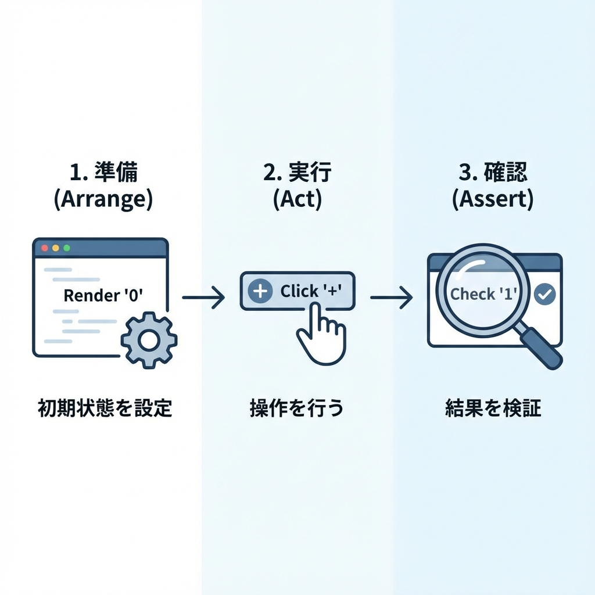
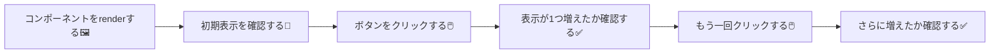

# 第209章：練習：ボタン押したら増えるテスト➕

今日は「**ボタンをクリックしたら数字が増える**」っていう、いちばん王道のUIテストをやってみるよ〜！😆🫶
（この章のゴールは“書けた＆動いた”の達成感です🎉）

---

## 今日のゴール 🎯💖

* ✅ `Counter` コンポーネントを作る🧮
* ✅ テストで「クリックしたら 0→1→2」になるのを確認する🖱️➕
* ✅ **UIを触るテストの基本形**を体に染み込ませる💪✨

---

## テストの流れ（図解）🗺️✨





---

## ① Counterコンポーネントを作る 🧮🌸

好きな場所に `Counter.tsx` を作ってね（例：`src/components/Counter.tsx`）📁✨
※ボタンを押すので **`"use client"` が必要**だよ〜！🎮

```tsx
"use client";

import { useState } from "react";

export function Counter() {
  const [count, setCount] = useState(0);

  return (
    <div>
      <p>
        いまの数：<span aria-label="count">{count}</span>
      </p>

      <button type="button" onClick={() => setCount((c) => c + 1)}>
        増やす
      </button>
    </div>
  );
}
```

ポイント💡

* `aria-label="count"` を付けると、テストで **「countって名前の表示」**として取りやすいよ😊🫶
* ボタンは `type="button"` を付けておくと、フォームの中でも事故りにくい👍✨

---

## ② テストを書く 🧪🖊️✨

例えば `src/components/__tests__/Counter.test.tsx` を作ってね📁🧸
（`__tests__` は好み！同じフォルダに `Counter.test.tsx` でもOKだよ〜🙆‍♀️）

```tsx
import { render, screen } from "@testing-library/react";
import userEvent from "@testing-library/user-event";
import { describe, it, expect } from "vitest";
import { Counter } from "../Counter";

describe("Counter", () => {
  it("ボタンを押すと数が増える", async () => {
    const user = userEvent.setup();

    render(<Counter />);

    const count = screen.getByLabelText("count");
    const button = screen.getByRole("button", { name: "増やす" });

    expect(count.textContent).toBe("0");

    await user.click(button);
    expect(count.textContent).toBe("1");

    await user.click(button);
    expect(count.textContent).toBe("2");
  });
});
```

ここが超大事ポイント💖

* `userEvent` は **await 付き**でクリックするのが基本だよ〜！🖱️⏳
* `screen.getByRole("button", { name: "増やす" })` は、実際のユーザーが「ボタンを探す」感覚に近いのでおすすめ😊✨

---

## ③ テストを実行する ▶️🧪🚀

プロジェクトによってコマンドは違うけど、だいたいこのへん👇✨

```bash
npm run test
```

スクリプトが無い場合は👇

```bash
npx vitest
```

---

## ④ つまずきやすい所（出たらここ見て🥺🧯）

### 🧊 `document is not defined` が出た！

→ テスト環境が `jsdom` になってない可能性が高いよ〜！

`vitest.config.ts`（なければ作成）にこういう設定を入れてね👇

```ts
import { defineConfig } from "vitest/config";

export default defineConfig({
  test: {
    environment: "jsdom",
  },
});
```

### 🌀 `TestingLibraryElementError: Unable to find...` が出た！

→ だいたいこのどれか！🥹

* `aria-label="count"` のスペル違い
* ボタンの文字が `増やす` じゃなくなってる
* import のパスが違う（`../Counter` が合ってるか確認）🔍

---

## ⑤ ミニチャレンジ（余裕があったら）🌟😆

1. **「減らす」ボタン**も追加して、テストも足してみよ➖🧪
2. クリック1回で **+5** するボタンを追加してみよ➕➕➕➕➕✨
3. 初期値を props で受け取れるようにして、テストで初期値チェックしてみよ🎁

---

できたらもう、UIテストの基本形はバッチリだよ〜！🎉🫶✨
