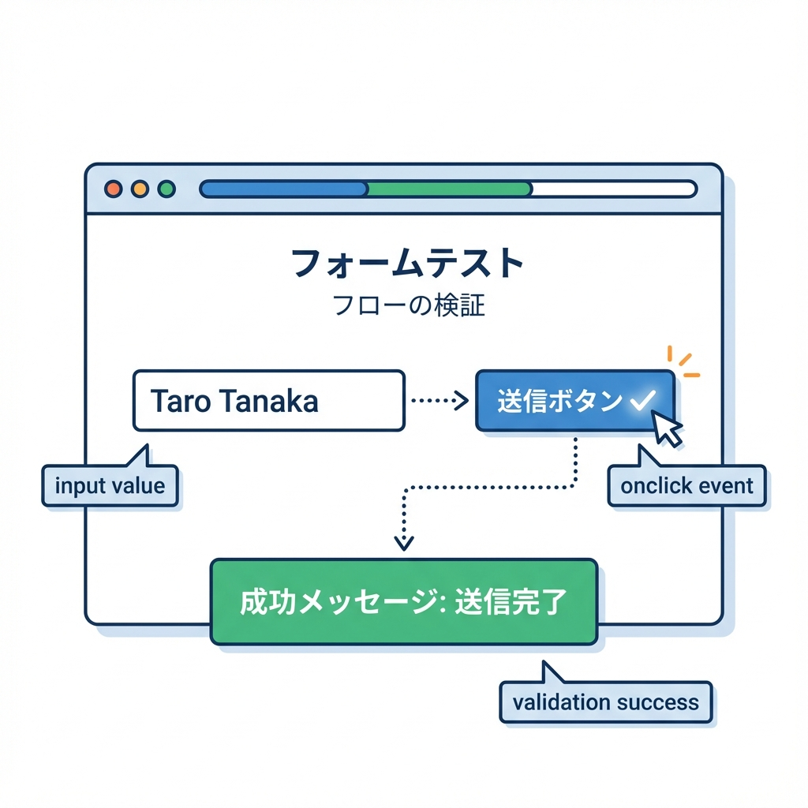
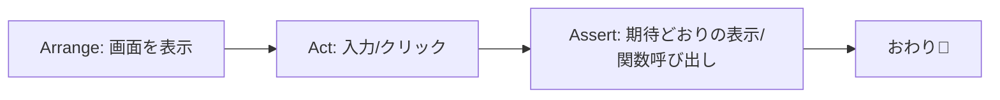

# 第210章：練習：フォーム送信のテスト📨

今回は「お問い合わせフォーム」みたいな **入力→送信** を、Vitest + React Testing Library でテストします😊💛
ポイントはこれ👇

* ユーザー操作（入力・クリック）を **user-event** で再現する🖱️⌨️
* **送信できた / できない** を画面（DOM）で確認する👀✅
* 送信処理は本物の通信じゃなくて **モック（偽物）関数** でOK🎭

※ Next.js公式のVitestガイドもあるので、土台はそれに乗っかります🧱✨ ([Next.js][1])

---

## 1) ざっくり流れ（図解）🗺️





---

## 2) テスト環境を入れる（まだなら）🧰💿

Next.js公式ガイドの「Manual Setup」相当です👇 ([Next.js][1])

```bash
npm install -D vitest @vitejs/plugin-react jsdom @testing-library/react @testing-library/dom vite-tsconfig-paths
npm install -D @testing-library/jest-dom
npm install -D @testing-library/user-event
```

---

## 3) `vitest.config.ts` を作る⚙️✨

プロジェクト直下に `vitest.config.ts` を作ってね🧡
（Vitest は `.ts` の設定ファイルもOKです🫶） ([vitest.dev][2])

```ts
import { defineConfig } from "vitest/config";
import react from "@vitejs/plugin-react";
import tsconfigPaths from "vite-tsconfig-paths";

export default defineConfig({
  plugins: [tsconfigPaths(), react()],
  test: {
    environment: "jsdom",
    setupFiles: ["./tests/setup.ts"],
  },
});
```

---

## 4) `tests/setup.ts` を作る（便利な matchers をON）🧪✨

`toBeInTheDocument()` とか `toBeDisabled()` とかが使えて気持ちいいやつです😆💕

```ts
import "@testing-library/jest-dom/vitest";
```

この `@testing-library/jest-dom/vitest` の読み込み方が定番だよ〜、って話はこちらの説明が分かりやすいです📝 ([markus.oberlehner.net][3])

---

## 5) 例：テスト対象のフォームを作る📮💌

`src/components/ContactForm.tsx`（または `components/ContactForm.tsx`）に作る想定でいきます✨

```tsx
"use client";

import React, { useState } from "react";

type FormData = {
  email: string;
  message: string;
};

type Props = {
  onSubmit: (data: FormData) => Promise<void>;
};

export function ContactForm({ onSubmit }: Props) {
  const [email, setEmail] = useState("");
  const [message, setMessage] = useState("");
  const [status, setStatus] = useState<"idle" | "sending" | "sent">("idle");
  const [error, setError] = useState<string | null>(null);

  async function handleSubmit(e: React.FormEvent) {
    e.preventDefault();
    setError(null);

    if (!email.trim()) {
      setError("メールは必須です🥺");
      return;
    }

    setStatus("sending");
    await onSubmit({ email, message });
    setStatus("sent");
  }

  return (
    <form onSubmit={handleSubmit} aria-label="contact-form">
      <div>
        <label>
          メール
          <input
            type="email"
            value={email}
            onChange={(e) => setEmail(e.target.value)}
            placeholder="test@example.com"
          />
        </label>
      </div>

      <div>
        <label>
          メッセージ
          <textarea
            value={message}
            onChange={(e) => setMessage(e.target.value)}
            placeholder="こんにちは！"
          />
        </label>
      </div>

      <button type="submit" disabled={status === "sending"}>
        {status === "sending" ? "送信中..." : "送信"}
      </button>

      {error && <p role="alert">{error}</p>}
      {status === "sent" && <p role="status">送信しました！🎉</p>}
    </form>
  );
}
```

---

## 6) いよいよテストを書く🧪💖（フォーム送信の再現）

`__tests__/ContactForm.test.tsx` を作ります📄✨
（`__tests__` という置き方は Next.js 公式でも例に出てます👌） ([Next.js][1])

```tsx
import { describe, it, expect, vi } from "vitest";
import { render, screen } from "@testing-library/react";
import userEvent from "@testing-library/user-event";
import { ContactForm } from "@/components/ContactForm";

describe("ContactForm", () => {
  it("入力して送信すると onSubmit が呼ばれて、送信完了が表示される📨", async () => {
    const user = userEvent.setup();

    const onSubmit = vi.fn(async () => {
      // ここで本物の通信はしない（テストなのでOK！）
    });

    render(<ContactForm onSubmit={onSubmit} />);

    await user.type(screen.getByLabelText("メール"), "test@example.com");
    await user.type(screen.getByLabelText("メッセージ"), "こんにちは！");

    await user.click(screen.getByRole("button", { name: "送信" }));

    expect(onSubmit).toHaveBeenCalledTimes(1);
    expect(onSubmit).toHaveBeenCalledWith({
      email: "test@example.com",
      message: "こんにちは！",
    });

    expect(await screen.findByRole("status")).toHaveTextContent("送信しました");
  });

  it("メールが空だとエラーが出て送信されない😵", async () => {
    const user = userEvent.setup();
    const onSubmit = vi.fn(async () => {});

    render(<ContactForm onSubmit={onSubmit} />);

    await user.type(screen.getByLabelText("メッセージ"), "本文だけ書いた");

    await user.click(screen.getByRole("button", { name: "送信" }));

    expect(onSubmit).not.toHaveBeenCalled();
    expect(screen.getByRole("alert")).toHaveTextContent("メールは必須");
  });

  it("送信中はボタンが無効になる⏳", async () => {
    const user = userEvent.setup();

    let resolveSubmit!: () => void;
    const onSubmit = vi.fn(
      () =>
        new Promise<void>((resolve) => {
          resolveSubmit = resolve;
        })
    );

    render(<ContactForm onSubmit={onSubmit} />);

    await user.type(screen.getByLabelText("メール"), "test@example.com");

    const button = screen.getByRole("button", { name: "送信" });
    await user.click(button);

    // 送信が終わるまで disabled のはず
    expect(button).toBeDisabled();

    // 送信完了させる🎬
    resolveSubmit();

    expect(await screen.findByRole("status")).toBeInTheDocument();
  });
});
```

---

## 7) 実行する▶️✨

`package.json` の scripts に（なければ）追加👇
Next.js公式でも `test: "vitest"` を案内してます🧡 ([Next.js][1])

```json
{
  "scripts": {
    "test": "vitest"
  }
}
```

実行コマンド👇

```bash
npm run test
```

Vitestは基本ウォッチで動きます（ファイル保存すると勝手に回るやつ）👀⚡ ([Next.js][1])

---

## 8) よくあるハマりポイント集🪤🥺

* **`document is not defined` が出る**
  → `vitest.config.ts` の `environment: "jsdom"` が抜けてる可能性大❗（Next公式の設定にも入ってるよ） ([Next.js][1])

* **`toBeInTheDocument` が使えない**
  → `tests/setup.ts` の `import "@testing-library/jest-dom/vitest"` と、`setupFiles` が効いてるかチェック✅ ([markus.oberlehner.net][3])

* **`@/components/...` が解決できない**
  → `vite-tsconfig-paths` を入れて、`plugins: [tsconfigPaths(), ...]` が入ってるか確認🧭 ([Next.js][1])

---

## 9) ミニ課題（やってみよ）💪💕

* ✅ 「メッセージが空でも送れる」仕様をやめて、メッセージ必須にしてテストも追加する📝
* ✅ 送信中のボタン表示が `送信中...` になってるかもテストする⏳
* ✅ エラー文言をもう少し優しくして（例：`入力を確認してね🫶`）、テストも追従させる🌸

---

ここまでできたら、**フォーム送信テストの基本パターンは完全に勝ち**です🏆🎉

[1]: https://nextjs.org/docs/app/guides/testing/vitest "Testing: Vitest | Next.js"
[2]: https://vitest.dev/guide/?utm_source=chatgpt.com "Getting Started | Guide"
[3]: https://markus.oberlehner.net/blog/using-testing-library-jest-dom-with-vitest "Using Testing Library jest-dom with Vitest - Markus Oberlehner"
