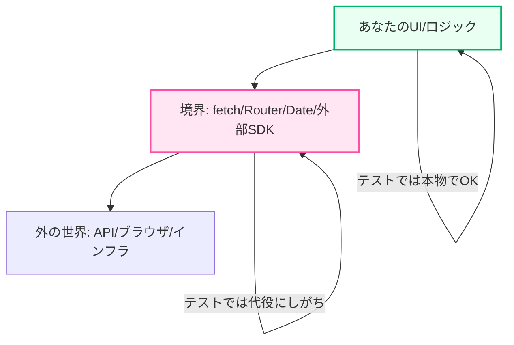
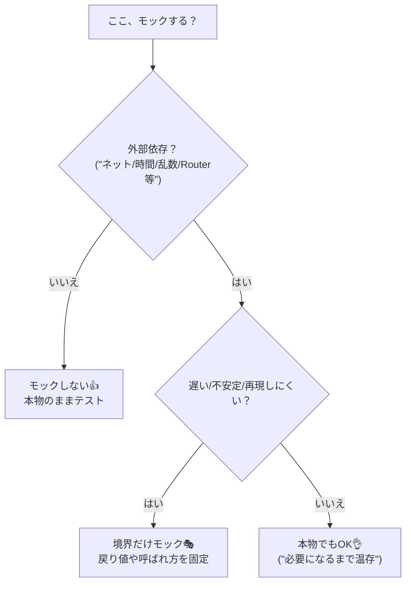

# 第211章：モックの考え方（やりすぎ注意）🎭

## 今日のゴール 🎯✨

* **モック（mock）って何のため？**をスッキリ理解する😊
* **「どこをモックして、どこは本物のまま？」**の判断ができるようになる🧠
* Vitestでよく使う **`vi.fn` / `vi.spyOn` / `vi.mock` / `vi.stubGlobal`** を“必要な分だけ”使えるようになる🪄 ([vitest.dev][1])

---

## 1) モックってなに？🎭（超ざっくり）


モックは、テスト中だけ登場する **「代役（スタント）」** だよ〜！🎬✨
本物に頼ると、テストがこうなりがち👇

* ネットワークが遅い/落ちる→テストが不安定😵‍💫
* 時刻や乱数で結果が変わる→再現できない😭
* ルーターや外部SDKが重い→テストが遅い🐢

だから **“外部のもの”だけ代役にして**、テストを安定させるのが目的だよ💪🎭

---

## 2) 似てる子たち：Mock / Stub / Spy 👯‍♀️✨

ざっくり使い分けるとこんな感じ！

* **Stub（スタブ）**：戻り値だけ決める係📦（「これ返してね」）
* **Mock（モック）**：呼ばれ方もチェックしたい係📞（「何回呼んだ？引数は？」）
* **Spy（スパイ）**：本物を見張る係🕵️（「本物は動かしつつ、呼び出しログだけ取る」）

Vitestだと、だいたいこの3つでOK👇

* `vi.fn()`：モック関数を作る🎭 ([vitest.dev][2])
* `vi.spyOn(obj, "method")`：スパイする🕵️ ([vitest.dev][2])

---

## 3) どこをモックする？「境界だけ」がおすすめ🚧✨

コツはシンプルで、**アプリの“境界”だけモック**するのが安定しやすいよ🎯
（境界＝ネットワーク、時間、ブラウザAPI、Nextのルーター、外部SDKなど）

図でいうとここ👇



---

## 4) やりすぎ注意ポイント⚠️🧊（モックしすぎると起きる事故）

モックを増やしすぎると、テストがこうなりがち👇

* **実装の細部に依存**して、ちょっとリファクタでテスト崩壊💥
* 「画面として正しいか」より「呼び出しの順番が同じか」みたいなテストになる🌀
* 本番では壊れてるのにテストだけ通る…😇

Testing Library系の考え方は、ざっくり **“ユーザー視点でテストしよう”** なので、**内部実装を当てにしすぎるモック**は増やしすぎ注意だよ〜！🫶 ([Kent C. Dodds][3])

---

## 5) 判断フローチャート🧭✨（迷ったらこれ）



---

## 6) Vitestでの定番モック3点セット🧰✨

### 6-1) `vi.fn()`：モック関数（呼ばれたか確認したい）📞🎭

```ts
import { vi, expect, test } from "vitest";

test("モック関数が呼ばれる", () => {
  const onClick = vi.fn();

  onClick("hello");

  expect(onClick).toHaveBeenCalledTimes(1);
  expect(onClick).toHaveBeenCalledWith("hello");
});
```

`vi.fn` は「呼び出し回数・引数」チェックに強いよ💪 ([vitest.dev][2])

---

### 6-2) `vi.spyOn()`：本物を動かしつつ記録🕵️✨

「ログが出たか」みたいなのに便利〜！

```ts
import { vi, expect, test } from "vitest";

test("console.error を監視する", () => {
  const spy = vi.spyOn(console, "error").mockImplementation(() => {});

  console.error("oops");

  expect(spy).toHaveBeenCalledWith("oops");

  spy.mockRestore(); // 後片付け🧹
});
```

※スパイは **後片付け** 大事だよ🧹✨（忘れると他のテストに影響しがち）

---

### 6-3) `vi.mock()`：モジュールごと差し替え（Nextのhook等）🧩🎭

Next.js（App Router）で超よくあるのが `next/navigation` のhooksだよね🚀
テストだと「Routerがマウントされてないよ」系のエラーが出やすくて、**ここをモック**するのが定番！🛣️ ([GitHub][4])

例：ボタン押したら `router.push("/mypage")` するコンポーネントをテスト✨

**コンポーネント**（例：`app/components/GoMyPageButton.tsx`）

```tsx
"use client";

import { useRouter } from "next/navigation";

export function GoMyPageButton() {
  const router = useRouter();

  return (
    <button onClick={() => router.push("/mypage")}>
      マイページへ
    </button>
  );
}
```

**テスト**（例：`GoMyPageButton.test.tsx`）

```tsx
import { render, screen } from "@testing-library/react";
import userEvent from "@testing-library/user-event";
import { vi, expect, test } from "vitest";
import { GoMyPageButton } from "./GoMyPageButton";

const pushMock = vi.fn();

vi.mock("next/navigation", () => ({
  useRouter: () => ({ push: pushMock }),
}));

test("クリックで /mypage に遷移する", async () => {
  const user = userEvent.setup();

  render(<GoMyPageButton />);
  await user.click(screen.getByRole("button", { name: "マイページへ" }));

  expect(pushMock).toHaveBeenCalledWith("/mypage");
});
```

ポイント🎯

* ルーター本体を再現しようとしない🙅‍♀️
* **このテストで必要な最小限（`push`だけ）** を差し替える🎭✨

---

## 7) fetchをモックする：2つの考え方🌊🧪

### A) “手でfetchを差し替える”（小さく済むならOK）🧤

Vitestには `vi.stubGlobal` があるよ🪄（ただし自動リセットに注意！） ([vitest.dev][5])

```ts
import { vi, afterEach } from "vitest";

afterEach(() => {
  vi.unstubAllGlobals(); // 後片付け🧹（または config で unstubGlobals）
});

vi.stubGlobal("fetch", vi.fn(async () => {
  return {
    ok: true,
    json: async () => ({ name: "Hanako" }),
  } as any;
}));
```

---

### B) “MSWでAPIを自然にモック”（おすすめされがち）🛰️✨

Testing Libraryの例では、`fetch` を直接スタブするより **MSW（Mock Service Worker）** みたいに「通信っぽく」モックするのが推されることがあるよ📮 ([テスティングライブラリ][6])
（この章では“考え方”だけでOK！次の章や課題で導入でも🙆‍♀️）

---

## 8) Next.js（App Router）だと、ここ注意⚠️🧊

* **`async` な Server Component** は、ユニットテスト（Vitest）で扱いづらいケースがあるよ〜。そういうのは **E2E寄り**で見る判断もアリ🎬 ([Next.js][7])
* だからこそ、ユニットテストでは

  * **Client ComponentのUIと操作**
  * **境界（Router/fetch等）を最小モック**
    が気持ちよくまとまりやすいよ😊✨

---

## 9) まとめ：モックは「必要な分だけ」🎭🫶

覚える合言葉はこれ〜！💞

* ✅ **外部（境界）だけモック**しがち
* ✅ **戻り値固定＋呼ばれ方確認**が主な用途
* ⚠️ **実装の細部を再現しようとしない**（テストが壊れやすくなる） ([Kent C. Dodds][3])

---

## ミニ練習（3分）⏱️🐣

1. `GoMyPageButton` をコピーして、`"/settings"` に飛ぶボタンを作ってみてね⚙️✨
2. テストでは `pushMock` が `"/settings"` で呼ばれたか確認してみよう🎯🎭
3. 余裕があったら、ボタン文言を変えてもテストが壊れにくい書き方（`getByRole`）を意識してみてね👀💡

---

[1]: https://vitest.dev/api/vi?utm_source=chatgpt.com "Vitest"
[2]: https://vitest.dev/api/mock?utm_source=chatgpt.com "Mocks"
[3]: https://kentcdodds.com/blog/common-mistakes-with-react-testing-library?utm_source=chatgpt.com "Common mistakes with React Testing Library"
[4]: https://github.com/vercel/next.js/discussions/48937?utm_source=chatgpt.com "How to mock useRouter from next/navigation? #48937"
[5]: https://vitest.dev/guide/mocking?utm_source=chatgpt.com "Mocking | Guide"
[6]: https://testing-library.com/docs/react-testing-library/example-intro/?utm_source=chatgpt.com "Example"
[7]: https://nextjs.org/docs/app/guides/testing/vitest?utm_source=chatgpt.com "Testing: Vitest"
